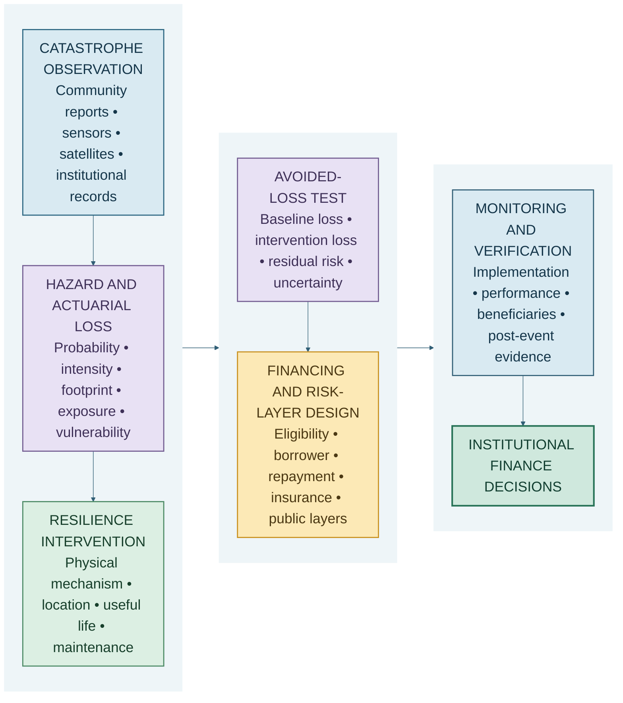

# From Catastrophe Intelligence to Investable Resilience

## How SCRI embeds sustainable finance and resilience finance in Kenya

**By Nevil Maloba**

*Part I of a two-part series on financing, scaling and commercialising Spatial Catastrophe Risk Intelligence in Kenya*

On a wet morning in Budalangi, a rising river can be several different events at once.

For a household, it is a decision about whether to move children, livestock, documents and food before the road disappears. For a farmer, it is the possible loss of a season's income. For a county engineer, it is a question of which culvert, bridge or health facility will fail first. For an insurer, it is an emerging concentration of claims. For a bank, it is a threat to borrowers' cash flows and collateral. For the National Treasury, it may become an emergency-liquidity requirement. For an investor considering a drainage, irrigation or transport project, it is evidence about whether the asset can continue delivering services under stress.

The rain and river are shared. The consequences, balance sheets and decision rights are not.

This is the starting point for Spatial Catastrophe Risk Intelligence, or SCRI. SCRI is conceived as a continuous, Kenya-first, multi-hazard risk operating system. It brings together community observations, earth observation, weather and environmental sensors, institutional records, artificial intelligence and actuarial modelling. Its purpose is to convert a changing physical event into credible estimates of exposure, loss, action and financial need.

That purpose places sustainable finance and resilience finance at the centre of the product. They are not reporting labels added after the modelling has finished. They shape what SCRI observes, which losses it estimates, how it evaluates an intervention, what evidence a financier requires and how performance is monitored through time.

This article explains that connection. It also makes a crucial commercial distinction: avoided loss is a real economic benefit, but it becomes financeable only when somebody can identify who benefits, who pays, which cash flow services the capital and how the result will be independently verified.

## One risk event, three financial questions

Sustainable finance, resilience finance and disaster-risk finance overlap, but they answer different questions.

**Sustainable finance** asks whether the allocation of capital supports defined environmental and social objectives while managing the risks that could undermine the investment. In Kenya, the Central Bank of Kenya's Green Finance Taxonomy provides a framework for evaluating and classifying economic activities against climate objectives. Its initial scope addresses climate-change mitigation and adaptation. The accompanying Climate Risk Disclosure Framework is intended to improve the quality and comparability of climate-related information in the banking sector and draws on international disclosure standards [1]. The Capital Markets Authority also maintains policy guidance for green bonds [2].

**Resilience finance** asks how capital can help households, enterprises, infrastructure, public services and ecosystems anticipate, absorb, adapt to and recover from shocks. Its central concern is the change in performance under stress. Does a drainage project reduce the depth or duration of urban flooding? Does restored vegetation reduce erosion and landslide susceptibility? Does a strengthened distribution line maintain power during heat and storms? Does a drought intervention preserve livestock condition, household income and debt-service capacity?

**Disaster-risk finance** asks how the remaining loss will be funded when it occurs. The financial toolkit may include budget reserves, contingency funds, contingent credit, insurance, reinsurance, parametric covers, social protection and capital-market risk transfer. Kenya's Disaster Risk Financing Strategy 2026–2030 explicitly places risk reduction, risk retention and risk transfer within a multi-hazard approach and seeks stronger fiscal resilience at national and county levels [3].

SCRI connects these questions without merging them into one score. It can estimate the physical risk that sustainable-finance classification and disclosure need. It can model the avoided and residual losses that resilience investment needs. It can also quantify the retained and transferred loss layers that disaster-risk finance needs.

That connection can be expressed as a product chain:

Each arrow represents work that a production system must perform. A flood map does not automatically become a green bond. An insurance loss curve does not establish adaptation additionality. A project labelled resilient does not prove that it changes loss. SCRI's commercial opportunity lies in building the traceable analytical bridge between those stages.

## The five executable capabilities

### 1. A catastrophe-observation capability

Finance begins with a credible account of place and change. SCRI therefore needs a governed observation layer that can answer: what was seen, where, when, by whom or by which sensor, under what conditions, and with what reliability?

For flood, the evidence may include rainfall, river gauges, radar-derived water extent, terrain, drainage condition, road cameras and geotagged community photographs. For drought, it may include rainfall deficits, soil moisture, vegetation indices, borehole status, livestock body condition, crop-stage reports and market signals. Fire requires observations of fuel condition, ignition, smoke, heat, perimeter and response. Locust intelligence requires lifecycle stage, swarm density, direction, wind and crop exposure. Landslide observation combines rainfall, slope saturation, terrain, ground movement and access disruption. Severe storm and extreme heat add wind, hail, temperature, humidity, persistence and infrastructure or health effects.

Artificial intelligence helps structure these observations. Computer vision can detect people, livestock, vehicles, smoke, flame, damaged structures and blocked routes. Segmentation can delineate water, burned areas, crop stress and landslide scars. Tracking can follow movement across video. Language models can classify multilingual reports. Time-series models can identify anomalies in gauges and environmental variables.

The output is not merely a label such as “flooded.” It is a time-stamped, georeferenced and provenance-bearing observation. That makes it usable in an actuarial model and auditable in an investment process.

This observation capability supports sustainable finance in three ways. First, it improves physical climate-risk assessment at asset and portfolio level. Second, it provides continuing evidence rather than a one-off appraisal. Third, it can reveal distributional effects: which communities receive protection, which remain exposed and whether benefits reach the people named in the financing proposition.

### 2. A hazard and actuarial-loss capability

Raw observations become financially relevant when they update a model of the catastrophe state. SCRI must estimate the probability, intensity, footprint, duration and evolution of a hazard, then combine that state with exposure and vulnerability.

Let Hₜ represent the uncertain hazard state at time t, Eᵢ the value or quantity of exposure i, and Vᵢ its vulnerability characteristics. A simplified event-loss model is:

**Lₜ = ∑ᵢ₌₁ⁿ Eᵢ × Dᵢ(Hₜ, Vᵢ, Rₜ). (1)**

Here, Dᵢ is a damage ratio or impact function and Rₜ represents preparedness and response. In practice, every important term is uncertain. SCRI therefore produces a loss distribution rather than one confident-looking number.

The distribution can be viewed from several institutional perspectives:

- Gross physical and economic loss describes the full effect on exposed people and assets.
- Insured loss applies policy terms, limits, deductibles and exclusions.
- Uninsured loss describes the protection gap borne by households, businesses and communities.
- Fiscal loss describes public response, reconstruction and revenue effects.
- Credit and investment effects require their own models of cash-flow interruption, probability of default, loss given default, downtime and asset value.

This separation matters for finance. An insurer may need an occurrence exceedance curve and probable maximum loss. A bank may need portfolio concentrations and revenue stress. A county may need the probability that emergency-liquidity requirements exceed its contingency resources. A development financier may need the expected loss of a road or water system with and without an adaptation project.

The same physical evidence can support all these views, but the contractual and accounting translations remain institution-specific.

### 3. An intervention and counterfactual capability

The strongest form of catastrophe intelligence does more than estimate loss. It asks whether a feasible intervention can change the loss-generating process.

Suppose a is a proposed resilience intervention: a drainage upgrade, wetland restoration, firebreak, reinforced bridge, drought-water system, crop-protection programme or heat-resilient energy investment. Let Lₜ(0) be loss at time t under the baseline and Lₜ(a) loss under the intervention. Expected avoided loss is:

**E[ΔLₜ(a)] = E[Lₜ(0) − Lₜ(a)]. (2)**

Equation (2) is simple. Establishing its terms is not. The baseline must describe what is likely without the project. The intervention model must explain the physical mechanism by which loss changes. Both must reflect maintenance, adoption, behavioural response, climate scenarios and uncertainty. If the intervention protects one location while shifting water or risk to another, the system must account for that redistribution.

SCRI can make this counterfactual assessment operational by linking:

1. the baseline hazard and exposure state;
2. the engineering, ecological or social intervention mechanism;
3. the altered intensity, vulnerability or response function;
4. the resulting avoided-loss distribution;
5. the residual loss that still requires financial protection; and
6. observations that test whether the intervention was built and performed as intended.

That sequence turns the phrase “resilience project” into a testable proposition.

Avoided loss also has time value. A project with initial capital cost C₀, annual operating and maintenance costs Oₜ, additional service or social benefits Bₜ, and expected avoided loss ΔLₜ has an illustrative economic net present value:

**NPV(a) = −C₀ + ∑ₜ₌₁ᵀ [E[ΔLₜ(a)] + E[Bₜ(a)] − E[Oₜ(a)]] / (1 + r)ᵗ. (3)**

Equation (3) supports economic appraisal. It does not, by itself, create a repayment stream. Some avoided losses accrue to households; some to insurers; some to government; some to businesses; some appear as improved continuity rather than cash receipts. A financier therefore needs the next capability.

### 4. A taxonomy, financing and risk-layer capability

Once the intervention and its benefits are defined, SCRI can support classification and financing design.

The taxonomy question is: does the activity make a substantial contribution to adaptation or another recognised objective, and is that claim supported by a credible assessment? The financing question is: which instrument fits the project's cost, benefits, cash flows, risk and beneficiaries? The risk-layer question is: after the intervention, which residual losses are retained, financed contingently or transferred?

For a realised loss L, an insurance layer attaching at a and exhausting at b can be represented as:

**Xₐ,ᵦ(L) = min{(L − a)⁺, b − a}. (4)**

Equation (4) illustrates why resilience investment and risk transfer complement one another. The intervention aims to reduce the entire loss distribution or selected parts of it. Retention can fund frequent manageable losses. Contingent credit can provide liquidity for larger events. Insurance and reinsurance can transfer less frequent, more severe layers. The World Bank's disaster-risk-finance framework similarly emphasises that no single instrument addresses every risk layer [4].

SCRI can supply the analytics for several structures:

- **Resilience or adaptation loans.** The financed asset or enterprise generates repayment, while SCRI measures physical risk, expected continuity benefits and performance covenants.
- **Green use-of-proceeds bonds.** Proceeds are allocated to eligible projects; SCRI supports physical-risk appraisal, adaptation logic, asset-level monitoring and impact evidence. CMA guidance provides the Kenyan capital-market context for green bonds [2].
- **Sustainability-linked loans or bonds.** Financing terms are linked to specified performance targets. SCRI can support target definition and measurement where catastrophe resilience is material, provided the indicators are ambitious, verifiable and connected to the issuer's operations.
- **Parametric insurance.** Payouts are linked to an independently defined parameter such as rainfall, river level or vegetation condition. SCRI can assess basis risk, monitor the trigger and compare payout with observed local loss.
- **Indemnity insurance and reinsurance.** Portfolio exposure, accumulation, event-loss nowcasting and claims evidence improve underwriting, claims readiness and risk-transfer design.
- **Contingent credit and public-risk layers.** Governments obtain pre-arranged liquidity when agreed conditions are met. Kenya has prior experience with catastrophe-contingent financing, including a World Bank Catastrophe Deferred Drawdown Option [5].
- **Results-based and blended finance.** Public or concessional capital can absorb risk, pay for verified performance or crowd in commercial investors. SCRI supplies baseline, additionality, beneficiary and outcome evidence.
- **Anticipatory-action facilities.** Forecasts and agreed decision protocols can release resources before peak impact, when early action can still preserve assets and livelihoods.
- **Grants.** Some resilience benefits are public goods with diffuse beneficiaries and no direct repayment stream. A grant may therefore be the financially honest instrument, especially where affordability and equity are central.

This is where product discipline matters. SCRI should recommend a finance structure only after tracing the benefit and cash-flow logic. The phrase “bankable resilience” should mean more than a positive avoided-loss estimate.

### 5. A monitoring, reporting and verification capability

Sustainable and resilience finance require evidence over the life of an investment. SCRI can provide a continuous monitoring, reporting and verification, or MRV, layer that links project design to observed performance.

Before financing, the platform can establish the baseline, exposure register, hazard scenarios, expected loss, proposed intervention effect and beneficiary profile. During construction, it can track location, progress, deviations and commissioning evidence. During operation, it can monitor maintenance indicators, environmental conditions and service continuity. After an event, it can compare modelled and observed hazard, damage, downtime and recovery.

Independent verification remains essential. The product's role is to preserve the chain of evidence and make verification efficient. It should retain source lineage, model versions, exposure snapshots, assumptions, corrections and uncertainty. A qualified engineer, actuary, auditor, verifier, regulator or public authority can then challenge the record from the perspective appropriate to the decision.

The IFC's climate-risk and adaptation work similarly emphasises physical-risk assessment, resilience measures, residual risk and the avoidance of maladaptation as elements of credible adaptation practice [6], [7]. SCRI localises that logic into a continuous Kenyan evidence system.

## Four linked ledgers: the commercial heart of SCRI

The five capabilities become easier to operate when SCRI maintains four linked but separate ledgers.

### The risk ledger

The risk ledger records what can be lost and how that loss is distributed. It contains exposure snapshots, hazard scenarios, annual average loss, tail loss, uninsured loss, fiscal exposure, uncertainty and model provenance.

Its purpose is to answer: what is the baseline problem, for whom, at what horizon and with what confidence?

### The intervention ledger

The intervention ledger records what is being changed. It includes location, cost, physical or social mechanism, implementation schedule, useful life, maintenance, responsible party, expected avoided loss, residual risk and potential negative spillovers.

Its purpose is to answer: how is the project expected to alter the risk, and what must remain true for that benefit to persist?

### The finance ledger

The finance ledger records how capital reaches the intervention and returns to its providers. It identifies the borrower or issuer, source and use of funds, repayment source, tenor, pricing, security, guarantees, insurance, risk allocation, covenants and waterfall.

Its purpose is to answer: who provides the money, who bears each risk and what cash flow supports repayment?

### The evidence ledger

The evidence ledger records whether the promised work occurred and what followed. It contains implementation milestones, monitoring observations, model outputs, beneficiary evidence, event records, performance tests, independent reviews and corrective actions.

Its purpose is to answer: what can be demonstrated, by whom, using which version of the evidence?

The four ledgers prevent a common analytical shortcut. A lower modelled loss in the intervention ledger does not become revenue in the finance ledger. It becomes one component of an investment proposition. The cash-flow mechanism might be user charges from reliable water, public availability payments for a resilient road, energy revenue protected by grid investment, insurance-premium savings agreed in advance, productivity gains, budgetary savings, concessional support or a combination.

This is a more demanding structure than a sustainability dashboard. It is also far more valuable. It allows SCRI to participate in project origination, due diligence, financial structuring, continuing monitoring and post-event learning.

## What SCRI delivers to each financial user

The shared evidence spine should produce interfaces fitted to real institutional questions.

For an **insurer or reinsurer**, SCRI can provide event footprints, exposure accumulation, loss distributions, claims ranges, emerging protection gaps and the effect of a resilience intervention on expected and tail loss. The Insurance Regulatory Authority has issued a circular on principles of sustainable insurance, reinforcing the relevance of environmental, social and governance considerations to the sector [8]. SCRI can turn those considerations into location- and event-specific evidence.

For a **bank**, SCRI can support physical-risk screening at origination, portfolio concentration, scenario analysis, collateral and cash-flow stress, client adaptation plans and climate-risk disclosures. The model should preserve the difference between physical loss and credit loss: probability of default and loss given default remain bank-specific credit-model outputs.

For an **investor or infrastructure owner**, SCRI can estimate downtime, service continuity, resilience capital expenditure, residual risk and maintenance performance. This allows a project committee to compare an apparent lower-cost design with one that is more reliable across its full life.

For a **county or national government**, SCRI can estimate fiscal exposure, affected people and services, emergency-liquidity requirements and the exhaustion of financing layers. It can also help prioritise public investment by comparing where each shilling of resilience expenditure is expected to produce the greatest public value. Kenya's Climate Change Act provides for mechanisms including the Climate Change Fund and defines adaptation and resilience within the national legal framework [9].

For a **development-finance institution or climate-finance sponsor**, SCRI can provide a consistent record of climate rationale, additionality, beneficiaries, expected avoided loss, residual risk and MRV. This can reduce the cost of preparing and supervising smaller projects that might otherwise struggle to produce institutional-grade evidence.

For a **community or policyholder**, the interface must be practical: the warning, expected effect, available action, relevant support, coverage and claims pathway. The community should not need to interpret a loss exceedance curve to benefit from the same intelligence.

## The value of action

The value of SCRI ultimately depends on whether better information changes decisions.

There is value in estimating a loss more accurately. An insurer can reserve earlier. A county can allocate response teams. A lender can understand concentration. A financier can price uncertainty more intelligently.

There is greater value when the information changes the loss itself. A validated flood forecast can move livestock and stock. Early drought information can guide water, feed and livelihood support before animals lose condition. A confirmed fire perimeter can improve suppression and evacuation. Locust observations can direct control resources while the swarm is still containable. Road and bridge intelligence can keep emergency services away from failing routes.

This broader quantity is the expected value of action. If d is a decision in the feasible decision set D, U(d, ω) is social or financial utility under event outcome ω, and Y is the new information, the expected value of sample information can be expressed as:

**EVSI = E[max(d ∈ D) E{U(d, ω) ∣ Y}] − max(d ∈ D) E{U(d, ω)}.  (5)**

The outer expectation is taken over the possible observations of Y. The first term is therefore the expected utility of choosing the best feasible decision after observing Y; the second is the expected utility of the best decision available before observing Y.

The practical meaning is straightforward: information has financial value when it allows a better decision than would have been made without it.

SCRI should therefore measure more than model accuracy. It should track lead time, action taken, response cost, claims-cycle improvement, service continuity, avoided loss, people reached and distribution of benefit. The purpose of the model is not simply to know the catastrophe. It is to expand the set of useful actions available before, during and after it.

## A Kenyan pathway from disclosure to deployment

Kenya now has important pieces of the enabling environment: a banking-sector green taxonomy and climate-disclosure framework, capital-markets guidance for green bonds, sustainable-insurance principles, a Climate Change Act and a multi-hazard Disaster Risk Financing Strategy [1]–[3], [8], [9].

SCRI can become the operational evidence layer that links those frameworks to places, assets, portfolios and events.

The first step is a paid, bounded product in which the value can be measured. Flood accumulation and claims readiness is a strong candidate because it connects real-time observation, loss nowcasting and an established insurance workflow. A parallel resilience-finance use case could assess a drainage, transport or water intervention through the four ledgers.

The second step is to operate in shadow mode alongside institutional decisions. SCRI would generate estimates and recommendations while insurers, counties, engineers and financiers follow their existing authority. This creates a record for calibration, user value, false alarms, missed events and operational feasibility.

The third step is to connect the evidence to finance: portfolio analytics, project appraisal, MRV, risk-layer design and carefully governed product partnerships. Each extension should have a named user, a defined decision, an accountable owner and a measurable outcome.

The result is more than a climate-risk report. It is a continuing relationship between environmental evidence and capital allocation.

## Conclusion: finance follows the evidence chain

Sustainable finance is embedded in SCRI because the platform can assess physical climate risk, classify adaptation logic, analyse beneficiaries, support disclosure and monitor environmental and social performance. Resilience finance is embedded because SCRI can estimate baseline loss, model intervention effects, quantify avoided and residual loss, connect benefits to financing structures and verify performance through time. Disaster-risk finance is embedded because the platform can show which residual losses should be retained, financed contingently or transferred.

The unifying idea is traceability.

A credible resilience investment should be traceable from a Kenyan place and a lived risk, through observations and a hazard model, into exposure and actuarial loss, through a proposed intervention and counterfactual, into a financing structure, and finally into observed performance and independent verification.

That evidence chain makes SCRI useful before financing, during investment appraisal, throughout the life of an asset and after the next event. It also provides the foundation for the next question: how can this capability become a nationwide, commercially sustainable platform while preserving local hazard science, public value and appropriate institutional authority?

Part II answers that question.

## References

[1] Central Bank of Kenya, “Issuance of the Kenya Green Finance Taxonomy and Climate Risk Disclosure Framework for the Banking Sector,” Press Release, Apr. 4, 2025. [Online]. Available: https://www.centralbank.go.ke/uploads/press_releases/1726446167_Press%20Release%20-%20Issuance%20of%20the%20Kenya%20Green%20Finance%20Taxonomy%20and%20Climate%20Risk%20Disclosure%20Framework%20for%20the%20Banking%20Sector.pdf. [Accessed: Aug. 29, 2026].

[2] Capital Markets Authority, Kenya, “Regulatory Framework: Policy Guidance Notes,” including Policy Guidance Note on Green Bonds. [Online]. Available: https://www.cma.or.ke/tbuilder-layout-part/regulatory-framework-policy-guidance-note/. [Accessed: Aug. 29, 2026].

[3] National Treasury and Economic Planning, Republic of Kenya, *Kenya Disaster Risk Financing Strategy 2026–2030*. Nairobi, Kenya, 2026. [Online]. Available: https://www.treasury.go.ke/sites/default/files/Latest%20updates/Kenya%20Disaster%20Risk%20Financing%20Strategy%202026%20-2030.pdf. [Accessed: Aug. 29, 2026].

[4] World Bank, “Disaster Risk Finance and Insurance.” [Online]. Available: https://www.worldbank.org/ext/en/topic/financial-sector/disaster-risk-finance-and-insurance. [Accessed: Aug. 29, 2026].

[5] World Bank, “Faster Access to Better Financing for Emergency Response and Resilience in Kenya,” Aug. 20, 2020. [Online]. Available: https://www.worldbank.org/en/brief/2020/08/20/faster-access-to-better-financing-for-emergency-response-resilience-kenya. [Accessed: Aug. 29, 2026].

[6] International Finance Corporation, “Climate Risk and Adaptation.” [Online]. Available: https://www.ifc.org/en/what-we-do/sector-expertise/climate-business/setting-standards/climate-risk-and-adaptation. [Accessed: Aug. 29, 2026].

[7] International Finance Corporation, *Climate-Related Financial Disclosures 2024*. Washington, DC, USA, 2024. [Online]. Available: https://www.ifc.org/content/dam/ifc/doc/2024/ifc-annual-report-2024-climate-related-financial-disclosures.pdf. [Accessed: Aug. 29, 2026].

[8] Insurance Regulatory Authority, Kenya, “Circular IC&RE/10/2024: Principles of Sustainable Insurance,” 2024. [Online]. Available: https://www.ira.go.ke/resource/circular-icre102024-principles-of-sustainable-insurance. [Accessed: Aug. 29, 2026].

[9] Republic of Kenya, *Climate Change Act*, No. 11 of 2016, rev. 2023. Kenya Law. [Online]. Available: https://new.kenyalaw.org/akn/ke/act/2016/11/eng%402023-09-15. [Accessed: Aug. 29, 2026].
