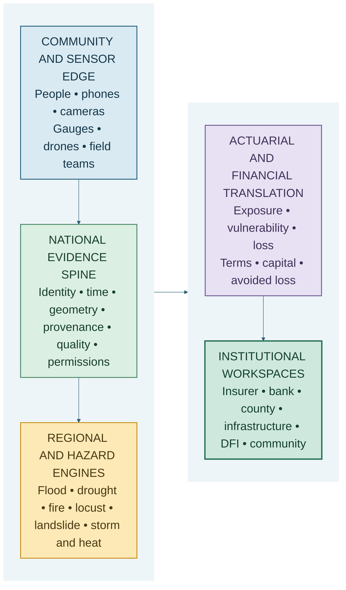

# Beyond SaaS

## Building and monetising a nationwide Spatial Catastrophe Risk Intelligence utility for Kenya

**By Nevil Maloba**

*Part II of a two-part series on financing, scaling and commercialising Spatial Catastrophe Risk Intelligence in Kenya*

Imagine four screens on the same morning.

The first follows river levels and settlement exposure along the Nzoia basin. The second shows a slowly deteriorating drought state across Turkana: vegetation, water points, livestock condition and market access. The third monitors Nairobi rainfall, drainage, roads, buildings and business interruption at neighbourhood scale. The fourth brings together fuel condition, weather, satellite heat signatures and ranger reports around a forest and agricultural landscape near Mount Kenya.

The screens share a national map, identity system, observation standards and actuarial language. Yet they cannot share one universal hazard model. Water moves through a river network differently from drought through a pastoral livelihood system. An urban drainage failure develops differently from a rangeland fire. Locusts move across ecological and administrative boundaries; landslides are intensely local; extreme heat can become a household health risk, an energy-system stress and a workplace productivity loss at the same time.

This is the architectural principle for scaling Spatial Catastrophe Risk Intelligence, or SCRI:

> One national evidence spine, regional and hazard-specific models, county and community observation networks, and private institutional workspaces.

That principle makes nationwide deployment possible without flattening Kenya's environmental and economic diversity. It also explains why SCRI is more than software as a service. The product can become a catastrophe-data network, national geospatial risk engine, actuarial modelling platform, managed event service, resilience-investment evidence system, application-programming interface and institutional knowledge system.

The commercial proposition is equally broad. Insurers can buy portfolio intelligence and claims nowcasting. Banks can buy physical-risk screening and disclosure evidence. Infrastructure owners can buy asset continuity and resilience planning. Counties can buy situation and fiscal-risk intelligence. Climate-finance sponsors can buy baseline, additionality, avoided-loss and monitoring evidence. Researchers and developers can licence governed datasets and model interfaces.

The public-benefit proposition should remain visible throughout: clear warnings, accessible community information and selected emergency services can be publicly financed or cross-subsidised by institutional analytics.

This article sets out how such a nationwide product could be built, regulated, monetised and defended.

## The national product is a network, not a large dashboard

A conventional software product begins with users entering data into an application. SCRI begins with the country continuously producing evidence.

Rain falls. Rivers rise. Vegetation changes. Roads become impassable. Livestock move. Households report water, smoke, crop damage and service failure. Satellites observe surfaces. Gauges measure environmental variables. Insurers receive first notifications of loss. County teams deploy. Engineers inspect assets. Markets reveal changes in access and scarcity.

These signals are heterogeneous. They arrive at different speeds and spatial resolutions. Some are authoritative measurements; some are human observations; some are model-derived features. Their absence can mean no hazard, no sensor, no connectivity or no reason for a contributor to report. Several posts can be independent corroboration—or copies of the same original image.

A nationwide platform must turn that complexity into a common evidence language. Every observation needs an event time, knowledge time, ingestion time, location, variable, unit, provenance, quality status, permitted use and version. Artificial-intelligence detections should retain the image or source lineage, model version and confidence that produced them. Corrections should preserve history.

Only then can the platform support a national operating picture that institutions trust.

The proposed architecture has five layers:

The layers are shared where common standards create value. They remain separate where physics, contracts, privacy or institutional authority require separation.

### A national evidence spine

The evidence spine provides common geospatial indexing, event identifiers, exposure identifiers, time controls, source provenance and access permissions. It makes observations interoperable across hazards and users.

Kenya already has important public capabilities upon which partnerships could be built. The Kenya Meteorological Department publishes county forecasts, severe-weather information and flood bulletins [1]. Its flood-bulletin service for the Nzoia system draws on rainfall and river data and predictive modelling [2]. The Water Resources Authority describes telemetry, information systems and hydrological monitoring that support flood and drought assessment [3]. The National Drought Management Authority operates drought early-warning and knowledge platforms [4], [5].

SCRI's opportunity is to connect admissible outputs from authoritative systems with earth observation, community evidence, exposure information and institution-specific data. It would preserve the authoritative source and permitted use of each observation. The product becomes more useful by making evidence interoperable, timely and financially interpretable.

### Regional and hazard engines

National standards should not imply national uniformity. Each hazard engine needs physical and statistical structures appropriate to its peril.

Flood models should represent river routing, terrain, drainage, water depth, velocity and duration. Drought models need rainfall deficits, soil moisture, vegetation, water access, livelihood sensitivity and slow state duration. Fire models need fuel, ignition, wind, spread and suppression. Locust models need biological lifecycle, swarm movement, wind, vegetation and control intervention. Landslide models need terrain, susceptibility, saturation and local thresholds. Storm and heat models need intensity, persistence, compound effects and infrastructure or human vulnerability.

Within each hazard, regional calibration matters. Nzoia flood propagation should not be treated as a scaled version of Nairobi surface-water flooding. Turkana drought vulnerability should reflect pastoral mobility, livestock, water and market systems. Heat effects in dense urban settlements differ from those in irrigated agricultural areas. Local data, claims, engineering characteristics, land use and community knowledge should update the shared architecture.

This model allows national expansion to improve the product without forcing every county into the same equation.

### Actuarial and financial translation

The actuarial layer converts a hazard state into distributions of physical, insured, uninsured, fiscal and economic loss. It applies exposure, vulnerability, policy terms, financial structures and uncertainty.

For institution j, the platform can express a general loss view as:

**Lⱼ,ₜ = Fⱼ(Hₜ, Eⱼ,ₜ, Vⱼ,ₜ, Rₜ, Cⱼ,ₜ). (1)**

Here, Hₜ is the hazard state, Eⱼ,ₜ exposure, Vⱼ,ₜ vulnerability, Rₜ response capacity and Cⱼ,ₜ the relevant contract, policy, financing or accounting conditions. The function Fⱼ differs by institution.

This is the source of SCRI's multi-sided commercial value. One governed catastrophe state can inform several paying users while each retains its own assets, contracts, confidential data and decision rules.

### Institutional workspaces

An insurer's workspace might show insured locations, accumulations, expected claims, policy terms and reinsurance. A bank's workspace might show obligor and collateral exposure, service interruption and scenario concentrations. A county workspace might show people, roads, health facilities, schools, water systems and emergency funding. An infrastructure owner might see asset condition, downtime, critical dependencies and resilience investment. A climate financier might see baseline risk, intervention progress, avoided loss, beneficiaries and verification.

These are separate products on a shared evidence foundation. The architecture can enforce permissions at the data, model, portfolio and output level. A county should not see an insurer's policyholder-level data merely because both use the same flood footprint. A commercial user should not turn community contributions into an unrelated surveillance dataset. Product trust depends on this clarity.

## SCRI's commercial form: seven businesses in one platform

SCRI can be understood as seven connected commercial capabilities.

### 1. A catastrophe-data network

The network ingests, validates, versions and distributes catastrophe observations. Customers pay for reliable access, history, latency, quality and interoperability—not simply for raw records.

The most valuable data assets will be difficult to reproduce: locally observed events, resolved duplication, verified geometry, normalised exposure, claims-linked damage, intervention history and source-reliability performance.

### 2. A national geospatial risk engine

The risk engine maintains event footprints, probabilistic hazard states, scenario layers and geospatial queries. It answers questions such as: which assets are currently exposed, which areas may be affected next, how uncertain is the estimate and how has the state changed since the last update?

### 3. An actuarial modelling platform

The actuarial platform connects hazard to frequency, severity, vulnerability, accumulation, annual loss, tail risk, policy terms, claims ranges and capital scenarios. It can support insurer and reinsurer models, public fiscal-risk views and adaptation economics while keeping those outputs distinct.

### 4. A continuous underwriting and portfolio-intelligence product

Continuous risk intelligence helps an insurer understand the portfolio between renewal dates. It supports accumulation management, claims readiness, survey prioritisation, resilience engagement and reinsurance analysis. Contract terms continue to be governed by the policy and applicable insurance rules.

### 5. A managed catastrophe-event service

During an event, customers need more than access to a dashboard. They may need an analyst-supported operating rhythm: scheduled event footprints, exposure-at-risk estimates, claims nowcasts, uncertainty notes, data-quality alerts and executive briefings.

This service can be priced through annual preparedness retainers plus event-activation fees. It also creates a feedback loop in which real operating use improves models and workflows.

### 6. Resilience-investment and MRV infrastructure

As Part I argued, SCRI can maintain linked risk, intervention, finance and evidence ledgers. Climate-finance sponsors, infrastructure owners, counties and lenders can use the product for baseline assessment, additionality, avoided-loss analysis, project monitoring and post-event verification.

### 7. An API, developer and knowledge ecosystem

APIs allow insurers, banks, logistics systems, emergency applications and research platforms to request hazard, exposure and loss intelligence inside their existing workflows. A governed knowledge layer can retain explanations, model cards, institutional procedures, historical events and lessons learned. This makes SCRI an institutional memory as well as a risk engine.

The strength of the business is the connection among these capabilities. Data improves models. Models improve products. Product use produces validated outcomes. Outcomes improve actuarial calibration and investment evidence. That network effect is more defensible than an attractive interface alone.

## Who pays, for what, and on which basis?

A sustainable nationwide product needs commercial units that customers can understand and procurement teams can contract.

| Customer | Commercial product | Illustrative pricing basis |
|---|---|---|
| Insurer | Portfolio intelligence, accumulation, claims nowcasting and reinsurance analytics | Annual platform licence plus portfolio or total-insured-value tier |
| Reinsurer | Market accumulation, event estimates and cedant evidence | Model licence, geography/peril module and event service |
| Bank or DFI | Physical-risk screening, portfolio monitoring and disclosure support | Portfolio subscription, asset tier or API usage |
| County or national agency | Situation intelligence, exposure and fiscal-risk analytics | Enterprise/public-procurement contract plus implementation support |
| Infrastructure owner | Asset monitoring, downtime and resilience planning | Per asset, network, corridor or capital project |
| Climate-finance sponsor | Baseline, additionality, avoided-loss analysis and MRV | Project appraisal fee plus continuing monitoring fee |
| Research or modelling institution | Governed datasets, sandbox and model interfaces | Data licence, compute tier or API subscription |
| Insurance or finance partner | Product design, model integration and operation | Implementation fee and licensed commercial agreement |

The platform can combine six revenue forms:

1. **Recurring platform licences** for user access, portfolio size, geography and hazard modules.
2. **Data and model licences** for validated event history, vulnerability functions, scenarios and interfaces.
3. **API consumption charges** based on queries, assets monitored, tiles, event feeds or compute-intensive model runs.
4. **Managed-service fees** for integration, event operations, model review and institutional reporting.
5. **Project appraisal and MRV fees** for resilience investments over their life.
6. **Commercial partnerships** for regulated insurance or financial products, structured through appropriately licensed institutions.

Pricing should reflect delivered value and service intensity. Charging merely for data volume can undervalue a small but consequential portfolio. A pricing model might combine a base licence, enabled modules and usage:

**ARRⱼ = Bⱼ + ∑ₕ Mⱼ,ₕ + Uⱼ + Sⱼ. (2)**

Here, ARRⱼ is annual recurring revenue from customer j, Bⱼ the base institutional licence, Mⱼ,ₕ the selected hazard or product modules, Uⱼ metered API or asset usage, and Sⱼ recurring managed services.

Event activations and project work can be contracted separately. This makes revenue more predictable while recognising that catastrophe operations create episodic demand.

The platform's unit economics should track data-acquisition cost, compute, imagery, support, validation, partner fees, county operations and customer-specific integration. Customer contribution margin can be represented as:

**CMⱼ = Revenueⱼ − DataCostⱼ − Computeⱼ − ServiceDeliveryⱼ − PartnerCostⱼ. (3)**

Early pilots may have negative contribution margins because integration and learning are substantial. The product becomes scalable as ingestion, models, interfaces and deployment patterns are reused across customers while local calibration remains focused.

## Public value and commercial value can reinforce one another

Catastrophe intelligence has characteristics of both infrastructure and enterprise software. A nationwide evidence layer benefits from broad participation. Community contributors and public agencies create observations that improve the shared operating picture. Insurers, banks and infrastructure owners can pay for portfolio-specific analytics built on that picture.

A practical model has three service classes:

- **Public or community service:** accessible hazard information, contribution pathways and emergency communication, financed through public contracts, development support or cross-subsidy.
- **Professional institutional service:** portfolio analytics, loss modelling, managed events, disclosure support and MRV, financed through recurring commercial contracts.
- **Regulated financial service:** insurance issuance, intermediation, investment advice, securities activity or payment flows, delivered by appropriately licensed partners or, later, separately licensed entities.

This structure is commercially attractive because public coverage improves the observation network, while institutional contracts fund reliability, validation and model development. It is socially credible because the communities generating vital evidence also receive useful information and participation channels.

The exchange should be governed explicitly. Contributors need clear purposes, permitted uses, retention rules, privacy choices, correction mechanisms and routes for benefit or compensation where appropriate. Nationwide scale is ultimately a trust project.

## A positive regulatory route: analytics first, partnerships next

SCRI can begin as an analytics and technology company. It can sell software, data, models, integration and advisory analytics directly within its competence. When a use case crosses into a regulated activity, the platform can connect to the institution that holds the required authority.

| Activity | Practical institutional route |
|---|---|
| Software, analytics, event services and model licences | SCRI contracts directly, with clear terms and professional accountability |
| Issuing or underwriting insurance | Licensed insurer or reinsurer |
| Insurance agency, broking, loss adjustment, risk surveying or related insurance services | Applicable IRA licence or licensed partnership |
| Regulated investment advice, fund management or securities arrangement | Applicable CMA licence or licensed partnership |
| Holding funds or providing payment services | Appropriately authorised bank or payment-service provider |
| Processing identifiable community, location, property or claims data | Data-controller/processor arrangements compliant with Kenyan data-protection law |
| Official public warning or emergency declaration | Responsible national or county public authority |

The Insurance Act gives the Insurance Regulatory Authority licensing and supervisory functions over insurers, reinsurers, intermediaries and specified insurance-service providers [6]. The Capital Markets Act and licensing regulations establish licensing requirements for investment advisers and other capital-market actors [7], [8]. Payment-service activities sit within Central Bank authorisation procedures [9]. The Data Protection Act and registration regulations establish responsibilities for controllers and processors handling personal data, including identifiable location information [10], [11].

The fastest route is therefore **analytics company first, licensed partnerships second, selective licensing or regulated subsidiaries later**.

This sequence lets SCRI learn where regulated capability is strategically valuable. It also keeps each decision with the institution that owns the contract and legal authority. The product can supply a claims estimate; a licensed insurer determines the claim. It can calculate a parametric trigger observation; the insurance contract and authorised parties determine payout. It can produce investment evidence; a licensed adviser or investment committee owns regulated advice and capital allocation. It can distribute an official warning; the relevant public authority owns the alert.

Clear institutional interfaces will accelerate commercial adoption because partners can see exactly what SCRI contributes.

## The defensible moat is Kenyan evidence and workflow integration

Software features can be copied. A durable SCRI business requires assets that compound with trusted use.

### Event and claims history

A normalised history of Kenyan catastrophe events, footprints, observations, claims, uninsured loss and service disruption can improve both hazard and vulnerability models. The value increases when event definitions, exposure snapshots and corrections remain consistent.

### Local vulnerability functions

Imported damage curves rarely represent every Kenyan building form, road, crop, livestock system or livelihood. Locally validated vulnerability functions—complete with uncertainty and limits—can become a major actuarial asset.

### A community and institutional observation network

Trusted reporters, county teams, rangers, agricultural extension workers, infrastructure operators and public agencies can create a resilient network that pure satellite or web-scraped products cannot reproduce. The moat comes from relationships, governance and demonstrated reliability, not ownership of people's observations in the abstract.

### Institutional agreements and integrations

Data-sharing permissions, claims-system connections, exposure pipelines, county operating procedures and partner contracts create switching costs because SCRI becomes part of real work.

### Model provenance and independent validation

A history of model versions, performance by hazard and region, calibration, challenger results and independent review can create institutional confidence. Trust accumulates when the platform explains both improvement and uncertainty.

### Resilience-performance evidence

Over time, SCRI can learn which interventions performed under real Kenyan events. This evidence is valuable to counties, insurers, lenders, engineers and climate financiers seeking to allocate capital toward approaches that work.

### Intellectual property and brand

The manuscript, software, model documentation, database design, training assets and brand should have clear ownership from the beginning. Kenya's Copyright Act provides the statutory framework for copyright, and the Kenya Copyright Board operates a National Rights Registry for voluntary registration and rights records [12], [13]. The Kenya Industrial Property Institute provides trademark search and registration processes for brand protection [14].

Copyright and trademark registration are parts of the protection strategy. Contracts should also cover employee and contractor assignment, confidentiality, data rights, open-source components, customer licences, publication boundaries and rights in derived models. The public intellectual thesis can be shared widely while proprietary code, calibrated parameters, customer data and product operating methods remain governed commercial assets.

## A four-year route to national scale

Nationwide implementation should be staged around evidence and repeatability rather than a promise to launch every hazard in every county at once.

### First six months: establish the product and proof environment

The first objective is a credible paid wedge.

SCRI should formalise the company and IP position, publish the product thesis, define contractual and privacy templates and select one measurable commercial product. Flood accumulation and claims readiness is a strong starting point because it links observation, exposure, actuarial loss and a paying insurance workflow.

The founding partnership could involve one insurer, one county or river-basin institution and one observation or data partner. The product should establish a manual baseline before advanced automation. That creates a transparent comparison for AI, data fusion and loss nowcasting.

Evidence of progress would include:

- a signed pilot or paid discovery engagement;
- a governed exposure and event schema;
- an operational data pipeline with provenance;
- a baseline event and loss workflow;
- agreed lead-time, calibration and claims-readiness metrics;
- privacy, security and regulatory-perimeter assessments; and
- named institutional decision owners.

### Months 6–18: prove contrasting hazards and workflows

Flood and drought provide a valuable contrast between rapid and slow onset. The platform can pilot one flood context and one drought or pastoral-livelihood context while operating in shadow mode alongside real institutional workflows.

Commercial revenue can come from integration, portfolio analysis, exposure improvement and managed pilot operations. The learning question is whether SCRI improves decisions, not only whether it produces impressive maps.

The evidence should include model calibration, warning or assessment lead time, exposure coverage, claims-cycle improvement, analyst time saved, false alarms, missed events, community reach and customer renewal intent.

### Months 18–30: become a multi-tenant platform

The product can then separate the shared evidence spine from private workspaces and offer repeatable onboarding to multiple insurers, reinsurers, banks, infrastructure owners and resilience projects.

Wildfire and locust can extend the platform's perception and propagation capabilities. API access, model licensing and an event-service catalogue can create recurring and event-driven revenue. Formal model inventories, service levels, business continuity and independent validation become essential at this stage.

### Months 30–48: connect counties through readiness, not geography alone

All 47 counties can enter a phased programme, but product depth should follow a readiness score. Criteria can include hazard relevance, authoritative data, community participation, exposure quality, institutional mandate, connectivity, paying use cases and validation feasibility.

National event and exposure identifiers would allow cross-county and cross-institution aggregation. Regional models would retain their calibration. Resilience-project registries could connect physical interventions with financing, beneficiaries and MRV. Disclosure mapping could translate risk evidence into institutional reporting.

### Beyond 48 months: mature the financial and regional ecosystem

Once the evidence base and partnerships are proven, SCRI can support regulated insurance and financing products through partners, establish industry model and data standards, and licence suitable modules in East African markets.

Regional expansion should transport the architecture, not assume Kenyan model parameters are universal. Each market needs its own institutions, hazards, exposure, vulnerability, law and community relationships.

## The nationwide operating model

The company will need more than software engineering.

A core product organisation should include hazard science, geospatial and data engineering, machine perception, actuarial modelling, insurance operations, finance, community engagement, security, legal and product management. County and hazard partnerships can add local expertise. Independent reviewers should challenge scientific, actuarial, privacy and social performance.

Four governance forums can keep growth coherent:

1. **Product and customer council:** prioritises paid problems, workflows and usability.
2. **Hazard and actuarial committee:** owns model standards, validation, uncertainty and promotion of challengers.
3. **Data and community governance forum:** oversees provenance, privacy, permitted use, accessibility, contributor rights and geographic data inequality.
4. **Institutional and regulatory committee:** maps decision authority, regulated edges, contracts, incident response and partner obligations.

The operating model should also plan for the conditions in which SCRI is most needed: power interruptions, cloud outages, damaged connectivity, stale gauges, unavailable imagery and overwhelmed field teams. Offline reporting, cached maps, alternative feeds, manual estimation and clear degraded-mode labels are product capabilities, not administrative afterthoughts.

National credibility will be earned event by event.

## What success looks like

The first measure of success is a product that customers renew because it improves a real workflow. The second is a national evidence asset that becomes more reliable as it expands. The third is public value: earlier action, clearer loss assessment, more targeted resilience investment and a narrower protection gap.

Commercial measures should include annual recurring revenue, gross and contribution margin, customer acquisition cost, renewal, expansion, API use and event-service utilisation. Technical measures should include calibration, spatial footprint accuracy, lead time, latency, data coverage and tail-loss performance. Operational measures should include claims-cycle time, analyst effort, service continuity and incident recovery. Social measures should include people reached, geographic representation, accessible channels, corrections resolved, interventions funded and distribution of avoided loss.

The value of a network can be represented conceptually as:

**V(SCRI) = V(data) + V(models) + V(workflow) + V(trust) + V(action). (4)**

where each term reinforces the others. More observations alone do not guarantee value. Their provenance improves models; model performance improves workflow; successful workflows build trust; trust enables action; action produces outcomes that enrich the evidence base.

That is the compounding mechanism behind a nationwide catastrophe-intelligence business.

## Conclusion: Kenya's continuous multi-hazard risk operating system

SCRI can be implemented nationwide and monetised because it serves a recurring problem shared by many institutions: Kenya's catastrophe evidence is fragmented across hazards, places, technologies and balance sheets, while decisions require a timely and financially coherent view.

The scalable answer is one national evidence spine, locally calibrated hazard engines, an actuarial translation layer, private institutional workspaces and public community interfaces. The commercial answer is a portfolio of recurring licences, data and model services, APIs, managed event operations, resilience-project assessment and licensed partnerships. The regulatory answer is analytics first, partnerships next, and selective licensing when customer value justifies it.

The defensible advantage will come from Kenyan event and claims history, vulnerability functions, community and institutional networks, data permissions, model provenance and integration into insurance, infrastructure, public-finance and investment workflows.

The positioning can therefore be stated clearly:

> **Spatial Catastrophe Risk Intelligence is Kenya's continuous multi-hazard risk operating system: it converts trusted environmental and community observations into actuarial loss intelligence, institutional action and investable resilience evidence.**

That proposition is more than SaaS. It is a national data network, a scientific and actuarial capability, a managed operational service and a financial-evidence infrastructure. Built in stages, tested against real decisions and grounded in local relationships, it can create both a durable commercial company and an important layer of Kenya's resilience economy.

## References

[1] Kenya Meteorological Department, “Weather Forecasting Services.” [Online]. Available: https://meteo.go.ke/Services/weather-forecasting/. [Accessed: Aug. 29, 2026].

[2] Kenya Meteorological Department, “Flood Bulletin.” [Online]. Available: https://meteo.go.ke/our-products/flood-bulletin/. [Accessed: Aug. 29, 2026].

[3] Water Resources Authority, Kenya, “Surface Water Assessment and Monitoring.” [Online]. Available: https://wra.go.ke/surface-water-assesment-monitoring/. [Accessed: Aug. 29, 2026].

[4] National Drought Management Authority, Kenya, “NDMA KnowledgeWeb.” [Online]. Available: https://knowledgeweb.ndma.go.ke/Public/Default.aspx. [Accessed: Aug. 29, 2026].

[5] National Drought Management Authority, Kenya, “Drought Early Warning System.” [Online]. Available: https://dews.ndma.go.ke/. [Accessed: Aug. 29, 2026].

[6] Republic of Kenya, *Insurance Act*, Cap. 487, rev. Dec. 11, 2023. Kenya Law. [Online]. Available: https://new.kenyalaw.org/akn/ke/act/1985/1/eng%402023-12-11. [Accessed: Aug. 29, 2026].

[7] Republic of Kenya, *Capital Markets Act*, Cap. 485A, rev. Dec. 11, 2023. Kenya Law. [Online]. Available: https://new.kenyalaw.org/akn/ke/act/1989/17/eng%402023-12-11. [Accessed: Aug. 29, 2026].

[8] Republic of Kenya, *Capital Markets (Licensing Requirements) (General) Regulations*, Legal Notice No. 125 of 2002, rev. Oct. 6, 2023. Kenya Law. [Online]. Available: https://new.kenyalaw.org/akn/ke/act/ln/2002/125/eng%402023-10-06. [Accessed: Aug. 29, 2026].

[9] Central Bank of Kenya, *Authorization Procedures for Payment Service Providers*, 2014. [Online]. Available: https://www.centralbank.go.ke/images/docs/NPS/Regulations%20and%20Guidelines/Authorisationprocedurespaymentserviceprovider2014.pdf. [Accessed: Aug. 29, 2026].

[10] Republic of Kenya, *Data Protection Act*, No. 24 of 2019, rev. Dec. 31, 2022. Kenya Law. [Online]. Available: https://new.kenyalaw.org/akn/ke/act/2019/24/eng%402022-12-31. [Accessed: Aug. 29, 2026].

[11] Republic of Kenya, *Data Protection (Registration of Data Controllers and Data Processors) Regulations*, Legal Notice No. 265 of 2021, rev. Dec. 31, 2022. Kenya Law. [Online]. Available: https://new.kenyalaw.org/akn/ke/act/ln/2021/265/eng%402022-12-31. [Accessed: Aug. 29, 2026].

[12] Republic of Kenya, *Copyright Act*, No. 12 of 2001, rev. Dec. 31, 2022. Kenya Law. [Online]. Available: https://new.kenyalaw.org/akn/ke/act/2001/12/eng%402022-12-31. [Accessed: Aug. 29, 2026].

[13] Kenya Copyright Board, “National Rights Registry.” [Online]. Available: https://nrr.copyright.go.ke/. [Accessed: Aug. 29, 2026].

[14] Kenya Industrial Property Institute, “Frequently Asked Questions,” trademark search and registration guidance. [Online]. Available: https://kipi.go.ke/faqs. [Accessed: Aug. 29, 2026].
