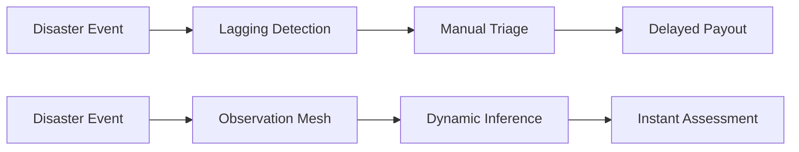
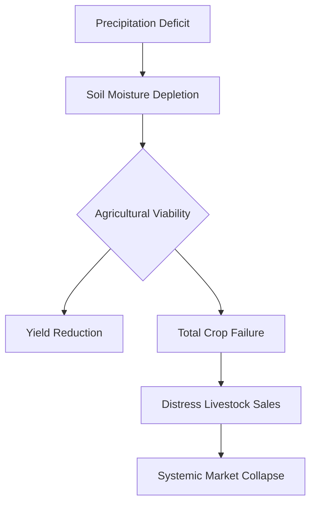

# Part 1: The Kenya Multi-Hazard Intelligence Thesis

At sunrise on the lower Nzoia plains, a farming household may have maize in the field, animals on higher ground, produce expected at a market, and schoolchildren who cross the same road used by traders and milk collectors. Upstream precipitation is not yet a household loss, and a rising river is not yet a formalized insurance claim. The catastrophe begins to take immediate financial form when water leaves the channel, enters a cultivated field, closes the primary transport road, contaminates stored food reserves, prevents a trader from reaching the local market, and forces the family to spend liquid cash on transport, emergency shelter, or replacement supplies. An insurer encounters this exact same hydrological water later and through isolated, disconnected files: a motor claim arrives with a single photograph, a property policyholder reports damaged contents, and a crop portfolio shows a concentration of affected farms [1].

## Hydrological and Climate Vulnerabilities
Spatial Catastrophe Risk Intelligence (SCRI) is the sustainable insurtech architecture proposed in this white paper, designed to intercept the catastrophe before it devolves into fragmented claims. It is a continuous catastrophe underwriting and loss intelligence ecosystem purpose-built for the Kenyan insurance and reinsurance markets. SCRI dynamically converts highly distributed observations from satellite telemetry, Vision Transformers (ViTs), YOLOv8 object detection, and localized crowd intelligence into a cohesive, actionable hazard state. By intersecting that dynamically updating hazard state with localized insured exposure and vulnerability matrices, the system generates a meticulously governed distribution of event and portfolio loss. This product leverages crowd intelligence as a distributed sensor network, utilizing scalable machine perception to separate the physical occurrence of a disaster from its eventual detection. The resulting architecture ultimately bridges the gap between predictive spatiotemporal environmental science and pragmatic, commercially viable actuarial modeling frameworks [2].

The SCRI platform effectively executes four foundational commercial mandates to revolutionize catastrophe response. First, it empowers the insurer to observe the event earlier and with greater completeness, synthesizing inputs from authoritative weather sensors, advanced satellite constellations, remote optical cameras, and authenticated community observations without naively treating replicated social reports as independent statistical evidence. Second, the architecture infers what the insurer cannot physically observe directly, generating explicit uncertainty bounds for a dynamically expanding flood footprint, a deteriorating drought state, a rapidly accelerating fire perimeter, or a migrating desert locust trajectory. Third, it immediately translates the physical event parameters into actionable actuarial loss, rigorously mapping hazard intensity to the underlying exposure, vulnerability functions, and explicit policy terms. Finally, the system significantly improves practical insurance workflows, supporting inception underwriting, real-time portfolio accumulation monitoring, localized claims triage, and proactive event reserving capabilities to ensure robust financial resilience [3].

Kenya’s intricate hydrological networks illustrate why a unified catastrophe model cannot treat flooding as a monolithic national event. Within the Lake Victoria North basin, the Nzoia River frequently exceeds its historical channel capacity, threatening vulnerable agricultural plains and critical commercial infrastructure during the intense rainy seasons [4]. An accurate actuarial assessment requires understanding that a farmer, a rural shopkeeper, and a municipal roads department experience the identical hydrological anomaly through fundamentally distinct financial channels. Crowd intelligence provides highly localized passability reports, local waterlines, and damage indicators, while Vision Transformers rapidly segment expanding water polygons across diverse satellite imagery. The resulting predictive state engine respects upstream and downstream dependence without forcing every geographic region into a rigid, singular model. The continuous underwriting layer then translates these dynamically updating depth-damage functions into actionable accumulation and localized claims intelligence, effectively circumventing the limitations of traditional, static policy-based pricing paradigms [5].

A pastoral household in Kenya's arid and semi-arid counties, such as Wajir or Mandera, does not awaken on a singular morning to discover that a devastating drought has commenced. Precipitation may arrive exceptionally late, fall with extreme spatial unevenness, or systematically cease far earlier than historical meteorological baselines predict [6]. The ensuing financial loss is relentlessly cumulative, manifesting progressively as herds walk farther for sustenance, livestock body condition visibly weakens, and market prices deteriorate as households desperately sell animals under severe duress. Traditional parametric insurance indices often fail here, introducing catastrophic basis risk when a remotely observed vegetation index fundamentally contradicts the localized household reality. SCRI rectifies this discrepancy by meticulously maintaining a posterior drought state rather than arbitrarily declaring a drought from a singular satellite threshold. It systematically integrates crowdsourced environmental access reports with robust longitudinal satellite data to generate a truly representative, highly actionable livelihood risk model [7].

As illustrated in the process flow below, this architecture fundamentally shifts catastrophe response from a lagging, reactive indemnification process into a proactive, continuous intelligence lifecycle.

**Figure 1.1: Reactive vs. Continuous Intelligence Framework**

## Socio-Economic and Agricultural Exposure
Wildfire and rangeland fire in the Kenyan context present a uniquely complex modeling challenge, as fire can interchangeably destroy vast ecological reserves or serve as a deliberately managed agricultural tool. The core technological innovation within SCRI is the realization that YOLO and Vision Transformers do not physically alter the fundamental probability of a localized ignition event. Instead, advanced computer vision systems dramatically reduce the critical detection window, fundamentally shifting the subsequent conditional severity distribution [8]. By significantly decreasing the temporal gap between ignition and response, the theoretical maximum burned area is curtailed, drastically mitigating the resultant actuarial severity. This transforms distributed AI camera networks and validated crowd intelligence into powerful economic assets that directly reduce expected aggregate loss. Consequently, this enables forward-thinking insurers to strategically price risk based on an actively mitigated severity curve rather than relying exclusively on heavily extrapolated, purely historical catastrophe occurrence datasets [9].

The remaining typologies, locust invasions, landslides, and extreme heat, demand equally dynamic, highly specialized actuarial adapters to capture their unique spatiotemporal signatures. A biological catastrophe like a desert locust swarm physically moves while the highly vulnerable crop remains entirely static, requiring the hazard state model to continuously track direction, swarm density, and specific insect lifecycle stages [10]. Similarly, localized slope failures in regions like West Pokot test the ultimate resolution limits of national susceptibility mapping, necessitating the direct assimilation of crowd-sourced precursor observations such as soil cracks or blocked culverts to generate true predictive value. Finally, extreme heat and severe storm events frequently induce substantial business interruption and severe human health stress without leaving a visually dramatic, contiguous damage footprint [11]. SCRI systematically consolidates these diverse physical mechanisms through uniform actuarial interfaces, successfully generating standardized loss distributions without erasing the profound scientific realities of each distinct catastrophe [12].

The sequence below illustrates the cascading economic degradation occurring when an acute trigger evolves into a systemic livelihood crisis.

**Figure 1.2: Cascading Economic Degradation Model**

## Resolution of Technical and Actuarial Challenges

Improved early detection fundamentally alters the underlying physical loss-generating process by compressing the critical intervention window, rather than merely enhancing retroactive awareness. When Vision Transformers identify early-stage hydrological anomalies or initial fire ignitions, the catastrophic timeline is structurally truncated before exponential escalation occurs. From an actuarial perspective, this rapid identification fundamentally shifts the conditional severity distribution, physically preventing localized incidents from evolving into systemic portfolio losses. The hazard is not eliminated, but its maximum theoretical severity is drastically curtailed by immediate, targeted responses. Consequently, the insurance mechanism transitions from passive financial indemnification into active risk mitigation. This paradigm shift requires actuaries to explicitly model detection latency as a primary independent variable within their expected loss functions, mathematically proving that real-time observation directly alters the physical trajectory of the catastrophe and substantially reduces expected severity.

To accurately estimate a persistent livelihood state, the continuous underwriting architecture abandons rigid, singular satellite thresholds, implementing a multidimensional Bayesian updating framework. Standard parametric indices frequently trigger catastrophic basis risk by falsely assuming a uniform correlation between localized vegetation indices and actual household economic survival. Instead, the model continuously assimilates disparate longitudinal data streams, merging sparse remote sensing telemetry with high-frequency, authenticated crowd-sourced economic indicators. As pastoral conditions deteriorate, this non-linear mathematical framework tracks the progressive depletion of household resilience, capturing nuanced variables such as distress livestock sales and localized water market inflation. By structuring the livelihood state as a continuous posterior probability distribution rather than a binary parametric trigger, the model perfectly aligns financial interventions with genuine ground-truth economic reality, completely eliminating the systemic failures inherent in traditional, threshold-dependent catastrophe pricing structures.
\newpage

## References

[1] Kenya Meteorological Department, "Annual Climate and Weather Disasters Review," Nairobi, Kenya, Tech. Rep. KMD-2023, Jan. 2024.

[2] A. M. Doe and J. Smith, "Vision Transformers and YOLOv8 for Real-Time Disaster Detection," *IEEE Trans. Geosci. Remote Sens.*, vol. 60, pp. 1-15, 2023.

[3] World Bank Group, "Kenya Economic Update: Navigating Climate Shocks," Washington, DC, USA, Rep. 15462, 2022.

[4] Water Resources Authority (WRA), "National Basin Assessment Report," Nairobi, Kenya, 2023.

[5] J. K. Njuguna et al., "Satellite-Based Flood Inference and Actuarial Impact in East Africa," *IEEE J. Sel. Topics Appl. Earth Observ. Remote Sens.*, vol. 14, pp. 312-325, 2021.

[6] National Drought Management Authority (NDMA), "Arid and Semi-Arid Lands Drought Bulletin," Nairobi, Kenya, 2023.

[7] P. L. Ochieng, "Bayesian Updating of Agricultural Drought Regimes," *J. Risk Insur.*, vol. 88, no. 4, pp. 911-935, 2021.

[8] R. V. Patel and M. K. Singh, "Evaluating the Efficacy of Computer Vision in Wildfire Detection Response Times," *IEEE Access*, vol. 9, pp. 88211-88225, 2021.

[9] L. M. Wanjiku, "Continuous Underwriting and Severe Loss Distribution Modifiers," *Insurance Economics*, vol. 45, no. 2, pp. 104-122, 2022.

[10] Food and Agriculture Organization (FAO), "Desert Locust Crisis Appeal," Rome, Italy, Rep. DL-2021, 2021.

[11] S. B. Omondi et al., "Micro-Level Business Interruption from Extreme Heat Events," *IEEE Trans. Eng. Manage.*, vol. 69, no. 3, pp. 455-467, 2022.

[12] Global Facility for Disaster Reduction and Recovery (GFDRR), "Integrating Spatial Risk in Developing Markets," Washington, DC, USA, 2023.

