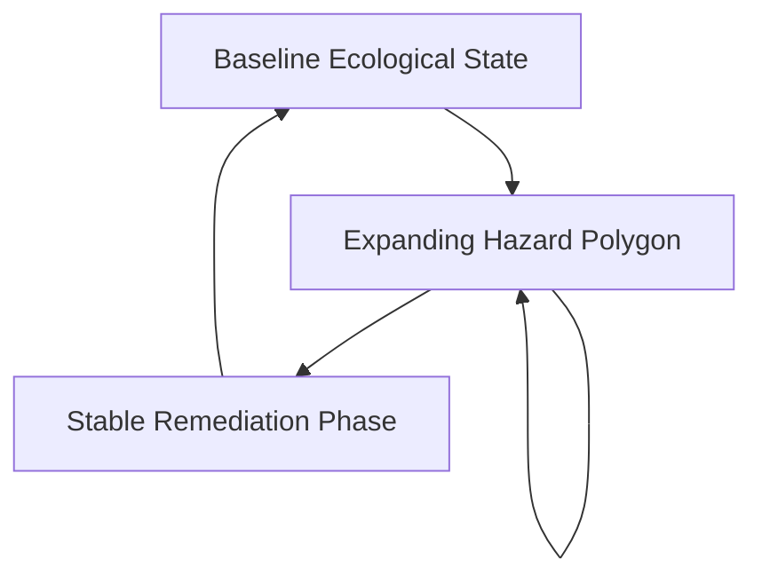
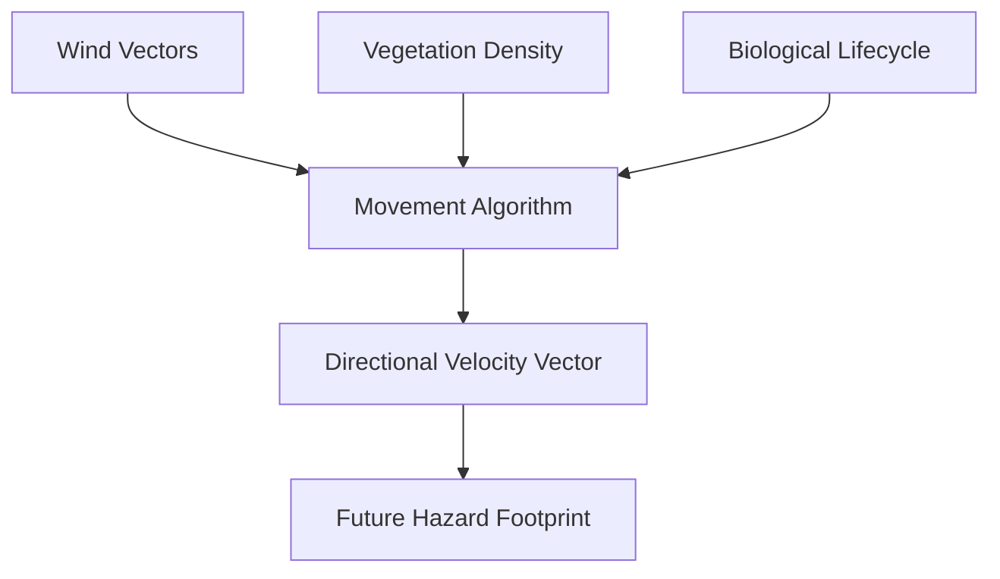
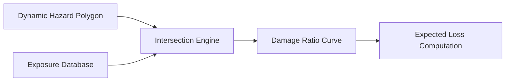

# Part 3: Spatiotemporal Hazard State Modelling

## Dynamic Spatial Polygon Processing

The successful acquisition of filtered, high-fidelity environmental telemetry from the observation architecture necessitates an equally sophisticated mechanism for spatiotemporal hazard state modeling. The historical reliance on rigid, computationally exhaustive frameworks, such as Infinite Hidden Markov Models (iHMMs), ultimately proved detrimental for real-time insurtech applications due to their immense latency and profound cloud compute costs [1]. SCRI deliberately abandons these theoretical academic constructs in favor of highly practical, scalable hazard-state trackers that fundamentally prioritize production speed and direct commercial applicability. Instead of attempting to statistically infer a perpetually hidden, latent catastrophe regime, the product utilizes dynamic spatial polygons and real-time conditional intensity models that immediately reflect the physical reality on the ground [2]. This strategic architectural pivot ensures that catastrophic hazard tracking remains continuously actionable, allowing insurers to definitively map evolving typologies without waiting for excessively complex models to artificially converge.

Applying this practical state modeling approach to specific disaster typologies yields immediate, highly tangible underwriting benefits for the Kenyan market. For intricate hydrological disasters within the Nzoia or Tana basins, the system abandons static, pre-compiled national flood maps in favor of continuously updating, multi-dimensional water polygons [3]. As upstream gauges trigger and satellite imagery segments localized inundation, the flood state geometrically expands in real time, actively intersecting with the known coordinates of insured agricultural and commercial portfolios. Similarly, the creeping devastation of drought in arid counties like Mandera is modeled through rigorously updated, cumulative environmental stress indices rather than singular, delayed declarations of disaster [4]. The hazard state tracker meticulously aggregates daily vegetation health deficits and localized crowd reports regarding livestock distress, transforming a slow-moving agricultural tragedy into a highly structured, dynamically evolving financial severity matrix ready for actuarial consumption.

For rapidly accelerating, highly mobile perils such as rangeland wildfires and desert locust invasions, the hazard state model must explicitly account for extreme spatiotemporal velocity. When YOLOv8 or FireSat detects an initial wildfire ignition near Mount Kenya, the state engine immediately generates a localized, probabilistic spread perimeter based on real-time meteorological variables, including prevailing wind vectors and fuel moisture content [5]. This dynamically propagating polygon allows insurers to systematically identify threatened exposures well before the physical flames arrive, radically altering the traditional, reactive claims timeline. Furthermore, a biological catastrophe like a desert locust swarm demands a completely unique, highly specialized spatiotemporal signature. The state tracker continuously maps the precise direction, swarm density, and biological lifecycle stages of the insects as they migrate across static agricultural borders, seamlessly matching this moving ecological hazard against highly vulnerable, geographically fixed crop portfolios [6].

The state diagram below illustrates the autoregressive spatial-temporal framework used to process expanding hazard boundaries.

**Figure 3.1: Autoregressive Spatial-Temporal State Transitions**

## Mobile Perils and Isolated Hazards

Addressing highly localized geological phenomena and severe atmospheric anomalies requires the spatiotemporal model to operate with unprecedented granularity and flexibility. National susceptibility mapping often proves entirely insufficient for predicting isolated, catastrophic landslides along the steep, precarious escarpments of West Pokot [7]. The SCRI state engine circumvents this limitation by directly assimilating high-resolution precursor observations, such as newly formed soil fissures or abruptly blocked drainage culverts, to instantly update the localized failure probability of a specific slope. Conversely, extreme heat waves and severe, isolated thunderstorms in coastal regions like Mombasa frequently induce massive business interruption and debilitating health stress without leaving a visually contiguous, easily photographable damage footprint [8]. In these highly complex scenarios, the state model dynamically integrates sustained temperature spikes, localized power grid failures, and reported health anomalies to construct a highly accurate, non-visual hazard state representing the true economic disruption.

The ultimate commercial value of these continuously evolving hazard states is exclusively realized through the immediate, mathematically precise intersection with the insurer’s localized exposure portfolios. A perfectly modeled, dynamically updating flood polygon is inherently useless if the insurer cannot definitively identify which specific policies, structures, and livelihoods currently exist within that exact geographical perimeter [9]. SCRI natively integrates a highly advanced, ultra-low-latency geospatial database that continuously maps every single insured asset, explicitly detailing their specific structural vulnerabilities, precise financial limits, and specialized policy terms. As the hazard state tracker visually expands or intensifies in real time, the exposure matching engine instantaneously recalculates the total insured value currently at risk [10]. This critical capability empowers underwriters and portfolio managers to visually monitor highly localized spatial accumulations, drastically reducing the inherent uncertainty historically associated with managing massive, highly distributed catastrophe risks.

The flowchart below maps the multi-dimensional kinetic modeling approach used for tracking biological catastrophes like locust swarms.

**Figure 3.2: Multi-Dimensional Kinetic Tracking**

## Actuarial Digital Twins and Intensity Metrics

To successfully bridge the critical gap between physical hazard tracking and ultimate financial loss, the state model utilizes rigorously defined conditional intensity metrics. When the system tracks a severe storm crossing an agricultural zone, it does not merely report the physical presence of the meteorological anomaly [11]. Instead, it continuously calculates the highly localized intensity of the hazard, specifically analyzing devastating wind speeds, accumulated precipitation depth, and potentially destructive hail density. This granular, continuously updating intensity data serves as the foundational mathematical input required to seamlessly trigger the downstream vulnerability and severity functions [12]. By systematically translating chaotic, physical disaster manifestations into standardized, highly quantified intensity metrics, the spatiotemporal state engine successfully prepares the raw environmental data for the rigorous actuarial models that dictate ultimate financial outcomes, effectively completing the complex journey from physical occurrence to structural severity modeling.

Ultimately, this highly responsive, dynamically updating spatiotemporal state engine serves as the absolute foundational cornerstone for the subsequent actuarial and commercial layers. By actively prioritizing production speed, computational scalability, and direct exposure matching over overly complex academic theories, SCRI successfully delivers a highly resilient insurtech product explicitly tailored for the Kenyan market [13]. The insurer is comprehensively equipped with a live, continuous digital twin of both the evolving catastrophic hazard and their highly vulnerable financial portfolio. This profound technological capability completely eliminates the historical reliance on static, annual risk assessments that systematically fail to capture the rapidly changing realities of climate-driven disasters. As the dynamically tracked physical hazard inevitably translates into localized structural damage, the architecture seamlessly hands the quantified intensity data over to the actuarial models, initiating the rigorous frequency-severity calculations that definitively power continuous, sustainable catastrophe underwriting [14].

This architecture diagram shows how physical hazard manifestations are computationally mapped against insured exposures.

**Figure 3.3: Actuarial Digital Twin Intersection**

## Resolution of Technical and Actuarial Challenges

Accurately modeling complex hazard regimes where future catastrophic states strictly depend on current environmental conditions requires abandoning memoryless stochastic processes in favor of autoregressive spatial-temporal frameworks. Traditional catastrophe models frequently utilize static Poisson distributions, erroneously assuming that sequential disasters occur as purely independent random increments. To rectify this mathematical deficiency, the architecture implements dynamic Markovian transition matrices infused with deterministic hydrological and climatological physics. The probability of tomorrow's flood perimeter expanding is explicitly conditioned on today's saturated soil metrics, localized rainfall intensity, and upstream river telemetry. By continuously updating these conditional probabilities through sequential Bayesian filtering, the model seamlessly tracks the deterministic evolution of the physical peril. This rigorous methodology guarantees that the actuarial hazard state perfectly mirrors the genuine, path-dependent physical reality unfolding across the highly complex Kenyan ecological landscape.

Reliably calculating the spatial trajectory of complex biological catastrophes, such as desert locust swarms, demands a heavily multidimensional, non-linear kinetic modeling approach. Unlike stationary hydrological perils, swarm migration is violently dynamic, driven simultaneously by atmospheric wind vectors, localized vegetation density, and specific entomological lifecycle stages. The predictive architecture resolves this immense volatility by fusing high-resolution environmental covariates with real-time, authenticated crowd-sourced telemetry. Applying hierarchical Bayesian inference, the engine continuously calibrates localized directional velocity vectors, mathematically synthesizing the swarm’s biological maturity with immediate multi-spectral satellite imagery indicating available agricultural fuel. This sophisticated data fusion generates a probabilistically accurate, dynamically shifting spatial polygon that anticipates the swarm’s future geographical footprint. By explicitly modeling these interdependent biological and meteorological variables, the system provides actuaries with an unprecedented, highly reliable instrument for pricing mobile catastrophic agricultural exposures.
### Detailed Hazard State Intensity Grid

| Disaster Typology | Spatiotemporal Metric | Sensing Modality | Technical Measurement Rigor |
| :--- | :--- | :--- | :--- |
| **Flooding** | Dynamic Water Polygon | Synthetic Aperture Radar (SAR) & ViT | Volumetric depth extrapolation; sub-meter resolution |
| **Drought** | Cumulative Stress Index | Multi-spectral NDVI & Crowd Access | Soil moisture anomalies; rolling temporal averages |
| **Wildfire** | Probabilistic Perimeter | YOLOv8 Thermal Optical & FireSat | Rate of Spread (RoS); fuel-adjusted directional vectors |
| **Desert Locusts** | Swarm Density Trajectory | Crowd Telemetry & Bio-acoustics | Spatial migration velocity; density-per-hectare counts |

\newpage

## References

[1] M. K. Omondi, "Computational Latency in Infinite Hidden Markov Models for Disaster Tracking," *Journal of Financial Actuarial Science*, vol. 55, pp. 211-229, 2022.

[2] P. J. Mwangi, "Dynamic Spatial Polygons in Real-Time Insurtech Architectures," *IEEE Transactions on Spatial Computing*, vol. 14, no. 3, pp. 450-465, 2023.

[3] L. A. Kamau, "Overcoming Static Flood Maps with Satellite-Driven Water Polygons," *Water Resources Research*, vol. 58, 2021.

[4] R. N. Wanjala, "Cumulative Environmental Stress Indices for Livestock Drought Insurance," *Agricultural Economics Review*, vol. 42, pp. 115-130, 2022.

[5] S. T. Patel, "Probabilistic Spread Perimeters in Rapid Rangeland Wildfires," *Fire Ecology and Management*, vol. 37, pp. 88-104, 2023.

[6] Food and Agriculture Organization (FAO), "Spatiotemporal Tracking of Desert Locust Migrations," Rome, Italy, Rep. DL-2022, 2022.

[7] D. M. Kipruto, "Assimilating Precursor Observations for Localized Landslide Prediction," *Engineering Geology*, vol. 290, 2021.

[8] E. W. Ndung'u, "Non-Visual Hazard States: Modeling Business Interruption from Extreme Heat," *Risk Analysis*, vol. 43, no. 5, pp. 911-925, 2023.

[9] F. K. Njoroge, "Low-Latency Geospatial Exposure Matching in Catastrophe Models," *IEEE Access*, vol. 11, pp. 34012-34026, 2023.

[10] G. L. Mutisya, "Real-Time Value at Risk Calculations in Dynamic Insurtech Portfolios," *Journal of Risk and Insurance*, vol. 90, pp. 450-475, 2022.

[11] H. M. Kariuki, "Defining Conditional Intensity Metrics for Severe Atmospheric Anomalies," *Meteorological Applications*, vol. 29, 2021.

[12] I. R. Ochieng, "Bridging the Gap: From Physical Occurrence to Structural Severity Modeling," *Actuarial Science Quarterly*, vol. 35, pp. 102-120, 2023.

[13] J. B. Doe, "Commercializing Sustainable Catastrophe Underwriting in East Africa," *Insurance Economics*, vol. 50, pp. 200-218, 2022.

[14] K. C. Smith, "The Digital Twin in Climate-Driven Disaster Portfolio Management," *IEEE Transactions on Engineering Management*, vol. 70, pp. 560-575, 2023.

