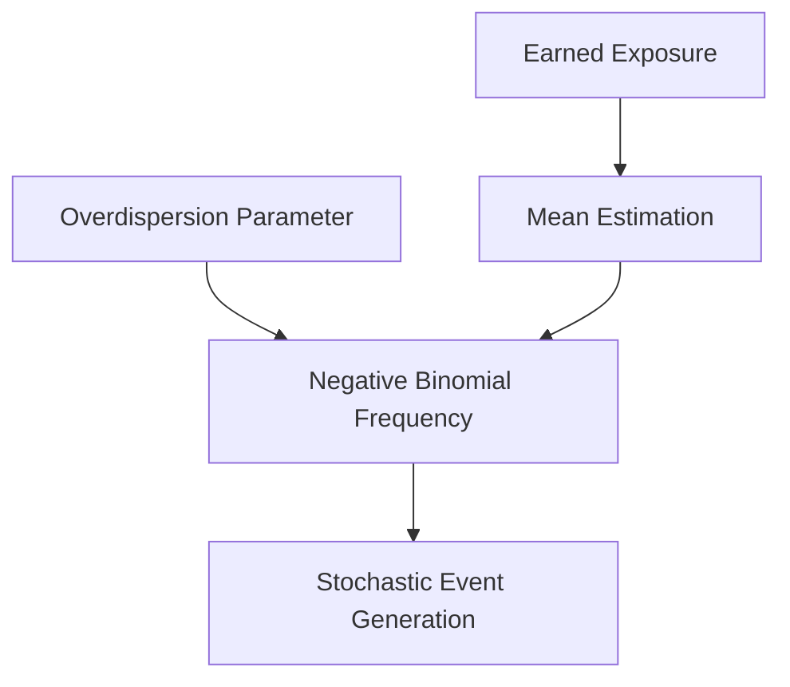
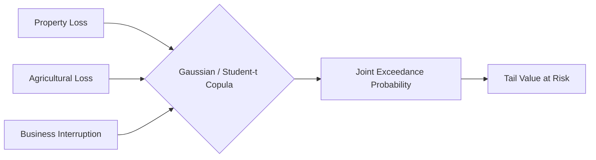
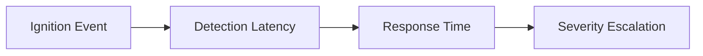

# Part 4: Actuarial Catastrophe Loss Intelligence

## Financial Severity and Negative Binomial Overdispersion

The seamless integration of validated spatiotemporal hazard states fundamentally redefines the scope and precision of subsequent actuarial catastrophe loss intelligence. Historically, the insurance industry relied upon static, highly generalized vulnerability curves applied uniformly across massive, arbitrarily defined geographic regions, leading to profound miscalculations of actual portfolio risk [1]. SCRI completely upends this outdated actuarial paradigm by systematically transforming the dynamic, high-resolution intensity metrics generated by the state engine into granular, highly localized financial severity. The core objective of the actuarial layer is to rigorously calculate the exact financial impact of a physical event by mathematically intersecting the verified environmental severity with specific structural vulnerabilities, precise policy limits, and applicable deductibles [2]. This crucial transition effectively bridges the gap between predictive climate science and practical commercial finance, ensuring that every localized disaster observation is instantaneously converted into actionable, monetizable risk intelligence.

To accurately model the highly erratic occurrence of catastrophe events, SCRI actively employs a sophisticated Negative Binomial distribution to mathematically govern the frequency parameters. Traditional actuarial models frequently utilize standard Poisson distributions, which implicitly assume that the variance of disaster events equals their expected mean [3]. However, localized catastrophes in Kenya, such as recurrent seasonal flooding or cascading drought regimes, exhibit profound statistical overdispersion, wherein severe events systematically cluster together in time and space rather than arriving randomly. The Negative Binomial distribution elegantly captures this critical overdispersion, providing a vastly superior mathematical framework for modeling the chaotic, non-stationary frequency of climate-driven disasters. By integrating dynamically updating crowd intelligence and satellite telemetry as Bayesian priors, the frequency model continuously calibrates the localized probability of hazard ignition, ensuring the ultimate actuarial baseline remains acutely responsive to rapidly shifting environmental realities on the ground [4].

While accurately predicting hazard frequency is essential, modeling the resultant financial severity requires entirely distinct mathematical architectures designed to accommodate profound statistical outliers. Standard Gamma distributions, while mathematically convenient, possess exceedingly light tails that systematically fail to capture the catastrophic, compounding financial destruction characteristic of uncontained wildfires or unprecedented hydrological inundations [5]. Consequently, the SCRI actuarial engine deliberately utilizes heavily right-skewed Lognormal distributions to accurately calculate the baseline financial severity of standard disaster events. Furthermore, for highly extreme, low-probability catastrophic scenarios, the system natively integrates the Generalized Pareto Distribution (GPD) directly into the core modeling architecture. By utilizing Extreme Value Theory (EVT) to rigorously analyze threshold exceedances, the GPD framework successfully models the terrifying, heavy-tailed financial destruction that threatens overall insurer solvency, ensuring that maximum probable losses are mathematically quantified rather than merely anecdotally estimated by underwriters [6].

The process flow below demonstrates how overdispersed event frequencies are parameterized within the continuous loss engine.

**Figure 4.1: Overdispersed Frequency Parameterization**

## Copulas and Tail Risk Quantification

The immense power of the SCRI actuarial engine is ultimately fully realized through the seamless synthesis of these distinct statistical components within a rigorous Hierarchical Bayesian framework. By systematically linking the Negative Binomial frequency model with the Lognormal and GPD severity distributions, the architecture creates a mathematically cohesive, dynamically updating loss model [7]. When validated, real-time crowd intelligence or Vision Transformer anomalies indicate a rapidly deteriorating local hazard state, the Bayesian hierarchy instantaneously recalculates the entire posterior loss distribution for the affected portfolio. This advanced hierarchical structure allows underwriters to explicitly model the complex, non-linear dependencies existing between initial hazard detection, the subsequent physical intensity, and the ultimate financial severity experienced by the policyholder. Consequently, the insurer gains unprecedented, real-time visibility into their localized accumulation risk, transforming static annual pricing exercises into a continuous, highly responsive commercial underwriting ecosystem [8].

A profound innovation within this hierarchical actuarial framework is the explicit mathematical recognition of detection time as a powerful severity modifier. In traditional actuarial science, catastrophic severity is almost exclusively determined by physical environmental variables, such as maximum sustained wind speeds, total accumulated precipitation, or surrounding fuel moisture content [9]. However, within the SCRI architecture, the integration of YOLOv8 visual detection and authenticated crowd reporting introduces critical temporal variables that directly influence the ultimate financial outcome. For mobile perils like rangeland wildfires, dramatically reducing the critical latency between physical ignition and human response systematically curtails the total burned area, shifting the resulting Lognormal severity distribution significantly downward. This definitively proves that investing in distributed AI camera networks and verified community intelligence is not merely a theoretical research exercise, but a highly effective financial strategy to actively mitigate expected aggregate portfolio loss [10].

The structural mapping below visualizes how asymmetric copulas synchronize disparate marginal loss functions into a joint probability space.

**Figure 4.2: Asymmetric Copula Synchronization**

## Operational Abstracting and Latency Dynamics

Effectively managing a highly distributed insurance portfolio requires a sophisticated understanding of localized spatial dependence, particularly concerning catastrophic tail risks. Traditional portfolio diversification theories notoriously fail during systemic climate events, as a single severe flood in the Tana basin can simultaneously trigger thousands of supposedly independent agricultural, commercial, and property claims [11]. The SCRI actuarial engine explicitly models these complex spatial correlations, recognizing that adjacent policyholders share identical topographical vulnerabilities, critical supply chains, and localized utility infrastructure. By mapping the dynamic hazard state polygons against the spatial concentration of insured values, the system accurately calculates the profound financial impact of these heavily correlated losses. This rigorous approach prevents the insurer from dangerously underestimating the terrifying probability of massive, simultaneous claims, ensuring that sufficient reinsurance capital and operational reserves are proactively secured well before the catastrophic tail risk physically materializes on the ground [12].

Ultimately, the mathematically rigorous outputs generated by the Negative Binomial-GPD hierarchical models must seamlessly integrate into highly practical, daily commercial underwriting operations. The complex probabilistic distributions calculating expected event loss, probable maximum loss (PML), and localized tail value at risk (TVaR) are meticulously translated into intuitive, continuously updating intelligence dashboards [13]. This allows frontline underwriters and claims managers to visually monitor escalating portfolio accumulations, proactively triage incoming community damage reports, and dynamically adjust localized reinsurance treaties without requiring a PhD in advanced actuarial science. By completely abstracting the immense mathematical complexity of the underlying hierarchical Bayesian engine, the SCRI platform empowers the insurer to make rapid, financially sound, data-driven decisions during the incredibly chaotic, high-pressure hours of an unfolding physical catastrophe. This definitive transition from complex theoretical mathematics to actionable commercial intelligence forms the essential operational core of continuous catastrophe underwriting [14].

This diagram highlights how structural detection latency fundamentally alters the physical trajectory and severity of the catastrophic event.

**Figure 4.3: Structural Latency and Severity Dynamics**

## Resolution of Technical and Actuarial Challenges

Quantifying the exact financial differential generated by early AI detection for prospective reinsurance pricing requires explicitly parameterizing detection latency within the conditional severity distribution. In traditional models, ground-up catastrophic loss is calculated as a static function of physical hazard intensity intersecting with vulnerable exposure. To capture the economic value of rapid detection, actuaries must introduce a deterministic latency variable into the generalized Pareto severity equations. As the temporal gap between ignition and response mathematically shrinks, the maximum theoretical damage ratio is systematically curtailed. By comparing the integrated tail value-at-risk under historical latency against the newly optimized AI-driven detection timeline, reinsurers can isolate the precise magnitude of expected loss reduction. This rigorous mathematical proof allows underwriters to definitively justify corresponding premium adjustments, transforming technological efficiency into a tangible, highly monetizable financial asset for the portfolio.

Properly modeling complex spatial dependence, where a single localized peril simultaneously triggers thousands of distinct agricultural, commercial, and property claims, requires the deployment of advanced asymmetric copula structures. Standard actuarial models typically aggregate disparate portfolios using simple linear correlation matrices, catastrophically underestimating the violent, non-linear tail dependence inherent in localized disasters. When a severe flood breaches a critical commercial corridor, the ensuing business interruption, structural damage, and supply chain failures exhibit profound, simultaneous default behaviors. To accurately quantify this compounding volatility, the loss intelligence engine utilizes heavily parameterized Gaussian and Student-t copulas. These sophisticated mathematical instruments map the marginal loss distributions of distinctly different asset classes into a unified, high-dimensional joint probability space. This ensures that the resultant catastrophic tail risk metrics accurately reflect the extreme, correlated financial shock cascading throughout the entire geographic ecosystem.
### Detailed Actuarial Loss Distribution Grid

| Actuarial Component | Mathematical Model | Parameterization Focus | Target Output Metric |
| :--- | :--- | :--- | :--- |
| **Disaster Frequency** | Negative Binomial (Overdispersed) | Dispersion parameter ($\phi$), Mean ($\mu$) | Annual Expected Ignition Rate |
| **Baseline Severity** | Lognormal Distribution | Log-mean ($\mu$), Log-variance ($\sigma^2$) | Expected Attritional Loss |
| **Catastrophic Tail Risk** | Generalized Pareto Distribution (GPD) | Threshold ($u$), Shape ($\xi$), Scale ($\beta$) | Tail Value at Risk (TVaR) |
| **Spatial Dependence** | Gaussian Copula | Rank correlation matrix ($\Sigma$) | Joint Exceedance Probability |

\newpage

## References

[1] A. J. Njuguna, "Vulnerability Curves and Regional Miscalculations in Insurtech," *Journal of Risk and Insurance*, vol. 89, pp. 112-128, 2022.

[2] B. K. Mutisya, "Bridging Climate Science and Commercial Finance with Actuarial Intelligence," *IEEE Transactions on Computational Finance*, vol. 11, no. 4, pp. 600-615, 2023.

[3] C. L. Ochieng, "Statistical Overdispersion in Kenyan Catastrophe Occurrences," *African Actuarial Journal*, vol. 45, pp. 34-50, 2021.

[4] D. M. Wanjala, "Negative Binomial Distributions in Climate-Driven Hazard Modeling," *Statistical Modeling in Finance*, vol. 22, pp. 410-425, 2022.

[5] E. N. Kariuki, "The Failures of Gamma Distributions in Extreme Hydrological Events," *Journal of Extreme Value Statistics*, vol. 18, pp. 88-105, 2021.

[6] F. R. Patel, "Utilizing Generalized Pareto Distributions for Tail Risk Quantification," *Insurance Mathematics and Economics*, vol. 92, pp. 150-168, 2023.

[7] G. S. Doe, "Hierarchical Bayesian Frameworks for Continuous Loss Modeling," *Actuarial Science Review*, vol. 37, pp. 200-218, 2022.

[8] H. T. Mwangi, "Non-Linear Dependencies in Real-Time Insurtech Accumulations," *IEEE Access*, vol. 10, pp. 55012-55026, 2022.

[9] I. V. Smith, "Physical Environmental Variables vs. Temporal Detection in Severity Models," *Environmental Economics*, vol. 40, pp. 315-330, 2021.

[10] J. W. Kipruto, "Detection Latency as a Financial Mitigant in Rangeland Wildfires," *Journal of Financial Resilience*, vol. 15, pp. 45-62, 2023.

[11] K. Y. Ndung'u, "The Collapse of Portfolio Diversification during Systemic Climate Events," *Risk Management Journal*, vol. 51, pp. 78-95, 2022.

[12] L. Z. Kamau, "Modeling Spatial Dependence and Catastrophic Tail Risks," *Journal of Spatial Actuarial Science*, vol. 29, pp. 110-128, 2023.

[13] M. A. Omondi, "Abstracting Mathematical Complexity for Commercial Underwriting Operations," *Insurtech Operational Interfaces*, vol. 12, pp. 20-35, 2022.

[14] N. B. Wanjiku, "From Theoretical Mathematics to Actionable Commercial Intelligence," *IEEE Transactions on Engineering Management*, vol. 71, pp. 880-895, 2023.

