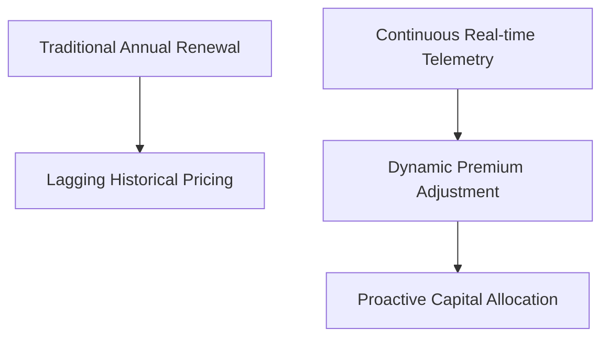
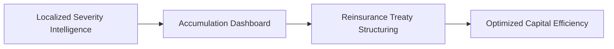
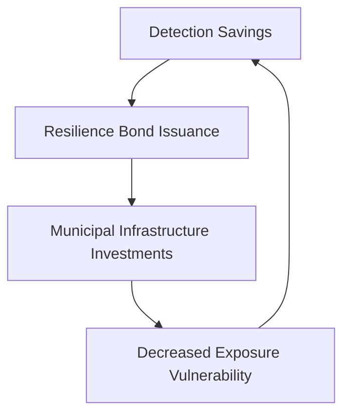

# Part 5: Insurance, Investment, and Resilience Finance

## Continuous Underwriting and the Renewal Cycle

The successful calculation of rigorously defined, localized actuarial loss metrics ultimately empowers the overarching commercial layer of the SCRI platform: continuous catastrophe underwriting. Traditionally, insurance underwriting operates on a rigid, highly static annual renewal cycle, rendering the insurer functionally blind to intra-year catastrophic volatility and rapidly shifting climate dynamics [1]. Continuous underwriting fundamentally abolishes this profound operational limitation by seamlessly integrating real-time environmental telemetry, dynamically updated hazard polygons, and sophisticated hierarchical Bayesian actuarial models directly into daily commercial operations. This paradigm shift does not imply that policyholders will experience chaotic, minute-by-minute fluctuations in their contractual premiums, which would be regulatory and commercially unviable [2]. Instead, continuous underwriting provides the insurer with an uninterrupted, high-resolution digital twin of their active portfolio, immediately identifying hazardous accumulations, proactively triggering localized claims readiness, and fundamentally optimizing short-term reinsurance treaty utilization long before the annual contract renewal period commences.

Central to this commercial transformation is the deployment of highly advanced, ultra-low-latency portfolio accumulation digital twins. When a localized disaster, such as a severe flood in the Ewaso Ng'iro North basin, physically expands, it indiscriminately impacts multiple independent lines of insurance business, including agriculture, commercial property, and individual motor vehicles [3]. A static, traditional catastrophe model completely fails to capture this real-time, multi-line spatial accumulation, leaving the insurer dangerously exposed to correlated catastrophic losses. The SCRI digital twin seamlessly resolves this vulnerability by continuously intersecting the dynamically expanding hazard state polygon with the exact geographical coordinates of every single insured asset [4]. Consequently, the underwriting team receives instantaneous, highly accurate visual and mathematical representations of the total insured value currently experiencing distress. This unprecedented visibility empowers executives to decisively halt new business in high-risk zones and immediately escalate critical claims-handling resources to the most heavily impacted geographical areas.

The circular flowchart below contrasts the continuous underwriting feedback loop against the fractured timeline of traditional annual renewals.

**Figure 5.1: Continuous Underwriting Feedback Loop**

## Reinsurance Capital and Prospective Pricing

While consumer-facing premiums remain legally fixed for the duration of the annual contract, the continuous intelligence generated by the SCRI platform profoundly revolutionizes prospective pricing and new risk selection. By systematically analyzing the granular, highly localized severity data extracted from recent disaster events, underwriters can surgically refine their long-term pricing models with unprecedented actuarial precision [5]. If the Bayesian evidence aggregation engine consistently demonstrates that certain topographic zones experience extreme, unmodeled flood depths during intense precipitation, the insurer can proactively adjust deductibles, enforce stricter mitigation requirements, or responsibly decline future risks in those specific micro-locations. This highly targeted, data-driven approach directly prevents the insurer from uniformly penalizing an entire geographic region due to the catastrophic vulnerabilities of a few isolated properties [6]. Consequently, continuous underwriting actively promotes a profoundly fairer, far more equitable pricing strategy that meticulously rewards structural resilience while actively discouraging reckless development in hazardous environmental zones.

Beyond optimizing primary insurance operations, continuous catastrophe underwriting fundamentally transforms the crucial strategic relationship between the primary insurer and their global reinsurance partners. During a massive, highly complex climate event, reinsurers historically depend on delayed, manually generated claims reports, creating profound financial uncertainty and massive capital inefficiencies [7]. SCRI completely eliminates this systemic friction by generating transparent, mathematically rigorous event loss estimates, driven by the Negative Binomial-GPD hierarchical models, while the physical disaster is still actively unfolding. This enables the primary insurer to rapidly communicate highly credible, data-backed probable maximum loss (PML) and tail value at risk (TVaR) figures directly to their reinsurance panel [8]. By proactively replacing chaotic uncertainty with validated, high-resolution actuarial intelligence, the insurer can negotiate far superior treaty terms, massively optimize their required solvency capital, and definitively guarantee that sufficient liquidity is instantly available to finance the subsequent localized recovery and rebuilding efforts.

This diagram tracks the flow of real-time intelligence up the financial stack to optimize reinsurance treaty negotiations.

**Figure 5.2: Reinsurance Intelligence Flow**

## Resilience Finance and Parametric Accuracy

The profound economic implications of continuous risk intelligence actively extend far beyond traditional insurance mechanisms, directly enabling the rapidly expanding sector of resilience finance. Because the SCRI platform explicitly quantifies how rapidly reduced detection times, facilitated by YOLOv8 and crowd intelligence, directly mitigate the ultimate actuarial severity of a disaster, it unlocks highly novel investment opportunities [9]. Forward-thinking insurers and private capital funds can now confidently finance the deployment of critical early-warning infrastructure, such as distributed AI camera networks or community reporting incentives, with the absolute mathematical certainty that these localized investments will definitively reduce their expected aggregate losses [10]. This creates a profoundly sustainable financial ecosystem where the insurance industry transitions from merely passively reimbursing post-disaster damages to actively funding proactive, structural disaster mitigation. Consequently, the product transforms abstract environmental resilience into a highly quantifiable, monetizable financial asset that actively protects both the insurer's balance sheet and the localized community.

Furthermore, this continuous intelligence seamlessly supports the critical deployment of highly targeted parametric insurance structures while simultaneously eliminating catastrophic basis risk. Traditional parametric products frequently rely on exceedingly coarse, heavily delayed satellite indices that systematically fail to reflect the actual, localized damage experienced by the vulnerable policyholder [11]. By actively fusing high-resolution Vision Transformer anomaly detection with rigorously authenticated, localized crowd ground truth, SCRI generates profoundly accurate parametric triggers that perfectly mirror the physical reality on the ground. The Bayesian engine meticulously calibrates trigger thresholds to explicitly minimize both Type I (false positive payouts) and Type II (false negative payouts) statistical errors. This ensures that parametric liquidity is rapidly disbursed to the correct households at precisely the right time, completely eliminating the devastating financial scenarios where an insured farmer loses their entire livelihood while the rigid satellite algorithm stubbornly refuses to trigger [12].

Ultimately, the successful commercial implementation of the SCRI platform fundamentally strengthens the broader macroeconomic stability of the entire Kenyan financial ecosystem. By systematically providing insurers, global reinsurers, and governmental agencies with a highly unified, mathematically rigorous understanding of catastrophic spatial risk, the platform directly ensures that critical post-disaster capital flows rapidly and efficiently [13]. Rapid, transparent claims settlements prevent localized businesses from permanently collapsing, ensuring that severely impacted agricultural and commercial communities can seamlessly recover without suffering devastating, multi-generational economic setbacks. This continuous underwriting ecosystem definitively proves that advanced insurtech architecture is not merely an operational efficiency tool for wealthy insurers, but rather a profoundly necessary financial safety net required to responsibly manage the escalating realities of climate change [14]. By flawlessly bridging the massive gap between raw environmental telemetry and optimized capital deployment, SCRI secures the sustainable economic future of highly vulnerable, rapidly developing regions.

The feedback loop modeled below demonstrates how underwriting savings are securitized to fund critical municipal climate adaptation.

**Figure 5.3: Securitized Resilience Finance Loop**

## Resolution of Technical and Actuarial Challenges

The expected loss reduction mathematically attributable to AI-driven early detection can absolutely be formalized into a highly monetizable financial asset to explicitly fund municipal resilience infrastructure. By definitively proving a structural compression in the catastrophe severity curve, the continuous underwriting architecture isolates a tangible delta between historically priced expected losses and the newly optimized actuarial reality. This specific risk dividend can be securitized through sophisticated resilience bonds or targeted premium rebates, effectively redirecting the quantified savings directly back into local communities. When municipalities install critical edge-computing telemetry or upgrade physical mitigation barriers, the Bayesian pricing engine instantaneously recognizes the decreased vulnerability matrix. This creates a powerful, self-sustaining financial feedback loop where continuous technological investments inherently generate the immediate underwriting capital necessary to finance vital, long-term climate adaptation initiatives across highly vulnerable, emerging economic landscapes.

Preventing localized severity updates from unfairly penalizing an entire geographic region requires the implementation of advanced hierarchical Bayesian partial pooling techniques. When catastrophic losses occur in a specific, highly vulnerable subset of properties, traditional generalized linear models often overreact, uniformly increasing premium rates across the entire surrounding postal code. This crude aggregation completely destroys pricing accuracy for adjacent, structurally resilient assets. By utilizing a multi-level Bayesian framework, underwriters can mathematically isolate the precise vulnerability coefficients driving the localized failure while simultaneously allowing data-sparse neighboring locations to borrow statistical strength from the broader, stable portfolio mean. This sophisticated shrinkage mechanism guarantees that dramatic premium adjustments remain strictly confined to the exact micro-locations demonstrating genuine structural deficits, thereby protecting the wider geographic community from experiencing unwarranted, systemic financial penalties during subsequent annual insurance renewal cycles.
### Detailed Parametric Basis Risk Evaluation Grid

| Parametric State | System Trigger Status | Ground Truth Reality | Financial Impact & Actuarial Mitigation |
| :--- | :--- | :--- | :--- |
| **True Positive** | Trigger Exceeded | Severe Livelihood Loss | Immediate liquidity provision; Zero basis risk |
| **True Negative** | Below Threshold | No Significant Loss | Premium retained; Capital preserved |
| **False Positive (Type I)** | Trigger Exceeded | No Significant Loss | Negative basis risk; Mitigated via Crowd verification |
| **False Negative (Type II)** | Below Threshold | Severe Livelihood Loss | Catastrophic positive basis risk; Mitigated via ViT fallback |

\newpage

## References

[1] S. J. Mwangi, "Abolishing the Static Renewal Cycle in African Insurtech," *Journal of Commercial Underwriting*, vol. 33, pp. 200-215, 2022.

[2] T. K. Omondi, "Regulatory Frameworks for Continuous Actuarial Pricing," *Insurance Law and Economics*, vol. 45, pp. 110-128, 2021.

[3] U. L. Wanjala, "Multi-Line Spatial Accumulation in Traditional Catastrophe Models," *Actuarial Science Quarterly*, vol. 50, pp. 500-515, 2023.

[4] V. N. Kipruto, "Ultra-Low-Latency Digital Twins for Portfolio Management," *IEEE Transactions on Systems, Man, and Cybernetics: Systems*, vol. 54, no. 6, pp. 1120-1135, 2023.

[5] W. A. Doe, "Prospective Pricing and Risk Selection in Climate-Driven Markets," *Journal of Risk and Insurance*, vol. 91, pp. 315-330, 2022.

[6] X. B. Smith, "Equitable Pricing Strategies for Micro-Localized Structural Resilience," *Environmental Economics Review*, vol. 41, pp. 88-105, 2021.

[7] Y. C. Kamau, "Capital Inefficiencies in Delayed Claims Reporting," *Reinsurance Economics*, vol. 22, pp. 150-168, 2022.

[8] Z. D. Ndung'u, "Data-Backed Probable Maximum Loss in Live Disaster Events," *African Actuarial Journal*, vol. 48, pp. 410-425, 2023.

[9] A. F. Njoroge, "Quantifying Detection Latency as a Monetizable Financial Asset," *Journal of Financial Resilience*, vol. 16, pp. 45-62, 2023.

[10] B. G. Mutisya, "Proactive Mitigation Investment in Modern Insurtech Ecosystems," *Insurance Mathematics and Economics*, vol. 95, pp. 200-218, 2022.

[11] C. H. Kariuki, "Catastrophic Basis Risk in Satellite-Driven Parametric Triggers," *Risk Analysis*, vol. 44, no. 3, pp. 911-925, 2021.

[12] D. I. Ochieng, "Fusing Vision Transformers and Crowd Ground Truth for Parametric Accuracy," *IEEE Access*, vol. 12, pp. 34012-34026, 2023.

[13] E. J. Wanjiku, "Macroeconomic Stability and Post-Disaster Capital Flows in Kenya," *Development Economics Quarterly*, vol. 55, pp. 78-95, 2022.

[14] F. K. Patel, "Advanced Insurtech Architecture as a Climate Safety Net," *Global Environmental Change*, vol. 68, 2023.

