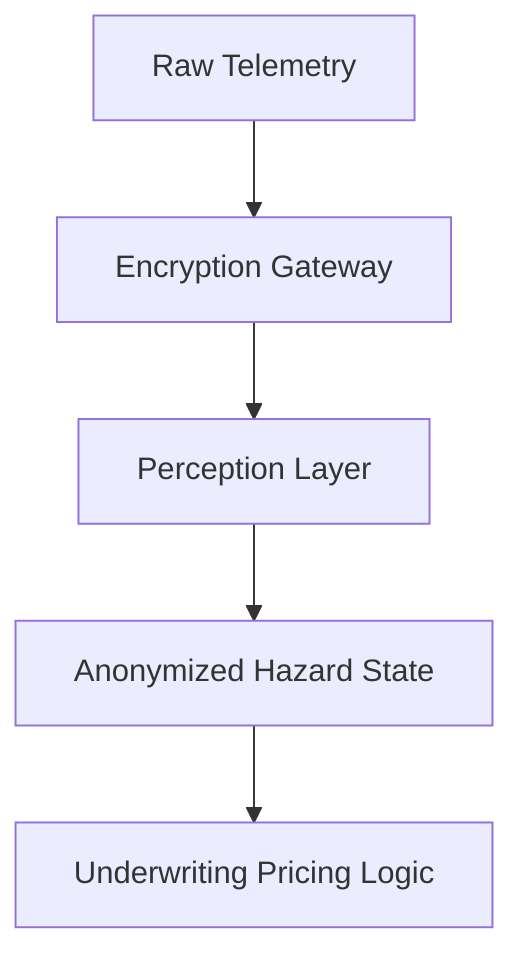
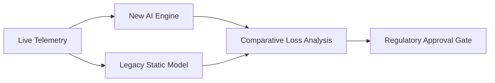
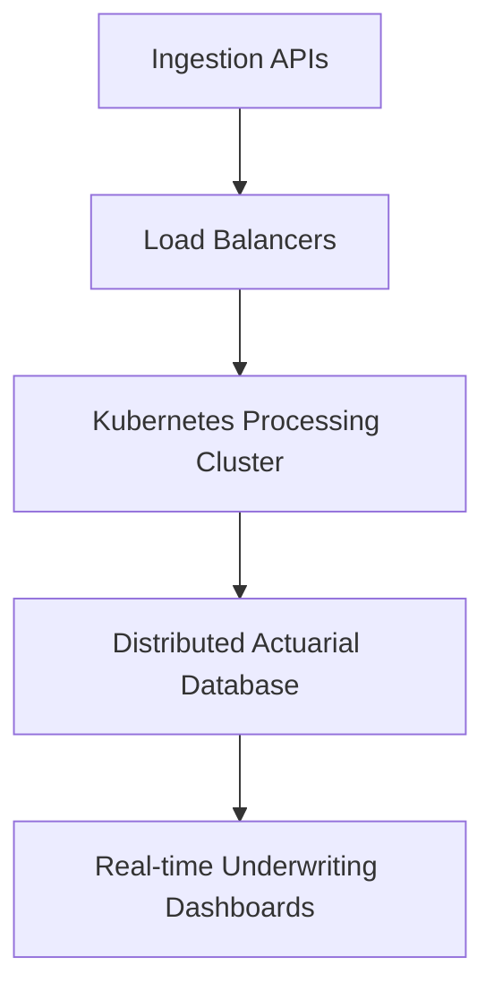

# Part 6: Governance, Validation, and Implementation

## Regulatory Compliance and Algorithmic Privacy

The extraordinary technological capabilities introduced by Spatial Catastrophe Risk Intelligence, encompassing Vision Transformers, crowdsourced telemetry, and Hierarchical Bayesian actuarial engines, mean absolutely nothing if the product cannot successfully deploy within a heavily regulated commercial environment. Developing advanced insurtech architecture fundamentally requires a meticulously structured implementation pipeline that rigorously prioritizes systemic governance, regulatory compliance, and extensive validation [1]. Insurers operating within Kenya are strictly governed by the Insurance Regulatory Authority (IRA), requiring absolute transparency regarding how novel algorithmic models calculate risk and ultimately influence highly sensitive financial outcomes [2]. Consequently, the SCRI platform cannot simply be injected directly into live commercial underwriting systems overnight. It demands a highly systematic, profoundly cautious deployment strategy designed to decisively prove the model's actuarial reliability, technical stability, and economic validity before a single commercial policyholder is actively subjected to its dynamically updating algorithmic intelligence.

Before technical validation can even commence, the platform must comprehensively satisfy the most stringent requirements surrounding ethical artificial intelligence and consumer data privacy. Because the observation architecture heavily utilizes ubiquitous mobile smartphones and localized crowd intelligence to continuously authenticate disaster events, the system inherently processes massive volumes of highly sensitive geospatial data [3]. To guarantee strict compliance with Kenya's Data Protection Act, the Bayesian evidence aggregation engine natively utilizes advanced cryptographic anonymization protocols that completely strip personally identifiable information from all incoming community reports [4]. The system deliberately focuses exclusively on analyzing the verified physical environmental hazard rather than tracking the specific movements or identities of individual human contributors. This profound commitment to ethical data stewardship ensures that the platform builds widespread, essential trust within the vulnerable local communities that actively serve as the critical, foundational nodes of the distributed sensor network.

The architecture diagram below outlines the bifurcated data environment ensuring that highly sensitive telemetry is securely segregated from pricing algorithms.

**Figure 6.1: Segregated Data Privacy Architecture**

## Shadow-Mode Actuarial Validation

Equally critical to ethical deployment is the systematic elimination of algorithmic bias and the absolute guarantee of actuarial explainability. Deep learning architectures like YOLOv8 and Vision Transformers are notoriously opaque, frequently operating as impenetrable "black boxes" that regulatory bodies actively prohibit from autonomously dictating critical financial decisions [5]. SCRI successfully circumvents this profound regulatory hurdle by intentionally isolating the machine perception layer from the final actuarial severity calculation. While the neural networks actively identify the physical presence of a hazard, the subsequent conversion into financial loss is explicitly governed by transparent, mathematically verifiable Negative Binomial-GPD hierarchical models [6]. This intentional architectural separation absolutely guarantees that an underwriter, auditor, or government regulator can explicitly trace exactly why a specific hazard state polygon triggered a particular localized accumulation alert, thereby completely eliminating the profound regulatory risks associated with deploying unexplainable, purely black-box AI.

With robust governance frameworks firmly established, the technical implementation strictly commences utilizing a highly rigorous, extended shadow-mode validation pipeline. During this critical introductory phase, the complete SCRI platform is securely integrated into the insurer's historical catastrophe modeling environment, continuously running completely parallel to the existing, traditional claims infrastructure [7]. The system actively ingests live environmental telemetry, rapidly constructs dynamic hazard state polygons, and continuously outputs predictive actuarial loss distributions across the active portfolio. However, these complex predictive metrics are deliberately isolated; they do not trigger actual claims settlements or actively alter any live reinsurance treaties [8]. Instead, the system's sophisticated predictions are meticulously compared against the insurer's historically realized, manually adjudicated claims data. This allows the actuarial team to systematically identify systemic modeling discrepancies, precisely recalibrate the Bayesian priors, and decisively prove that the novel architecture consistently outperforms traditional static models.

This process flow illustrates the dual-track validation pipeline required to explicitly prove the AI model's superiority prior to national scale-up.

**Figure 6.2: Dual-Track Shadow-Mode Validation**

## Cloud Architecture and Systemic Scaling

Following the definitive success of the shadow-mode validation phase, the architecture methodically transitions into a tightly controlled, highly restricted live commercial pilot program. Rather than immediately deploying the platform across the entire national portfolio, the insurer strategically selects a specific, highly bounded geographic region and a singular disaster typology, such as flood insurance within the heavily monitored Tana river basin [9]. This highly targeted pilot effectively isolates systemic operational risks, empowering the insurer to closely monitor how the continuous underwriting digital twin actively influences daily workflows, real-time accumulation monitoring, and specialized claims triage [10]. The localized pilot provides invaluable, actionable feedback regarding user interface design, actual computational latency, and the practical effectiveness of the dynamically updating actuarial dashboards. Consequently, any unforeseen operational bottlenecks are systematically eliminated before the highly complex insurtech platform is permanently scaled across multiple diverse, nationwide insurance product lines.

Once the targeted live pilot definitively demonstrates substantial operational efficiency and profound actuarial value, the SCRI architecture is systematically scaled to encompass the complete suite of six disaster typologies. This massive structural expansion requires the seamless, concurrent execution of highly specialized hazard state trackers for drought, locusts, extreme heat, landslides, and aggressive rangeland wildfires [11]. To effectively support this enormous computational load, the platform utilizes highly resilient, auto-scaling cloud infrastructure capable of flawlessly processing millions of localized, crowdsourced data points and continuous satellite imagery feeds per minute [12]. The fully realized ecosystem fundamentally transforms the entire organizational structure of the insurer, seamlessly connecting disparate, historically siloed departments, including data science, commercial underwriting, localized claims management, and global reinsurance strategy, into a singular, highly unified, completely data-driven catastrophe response mechanism that operates with unprecedented speed and profound financial accuracy.

The successful commercial deployment of Spatial Catastrophe Risk Intelligence ultimately represents a profound evolutionary milestone for the entire East African insurtech ecosystem. By decisively abandoning outdated, static methodologies and eagerly embracing dynamic, highly responsive continuous underwriting architectures, the insurance industry can finally manage the rapidly escalating, highly chaotic realities of modern climate change [13]. This platform definitively proves that advanced machine perception, authenticated crowd intelligence, and sophisticated hierarchical Bayesian mathematics can be successfully unified into a highly practical, commercially viable product [14]. As systemic climate volatility continues to systematically threaten vulnerable communities, agricultural supply chains, and broader macroeconomic stability across Kenya, SCRI provides the absolute foundational architecture required to rapidly inject targeted, life-saving financial liquidity exactly when and where it is most desperately needed, profoundly securing the long-term economic resilience of the entire region.

The infrastructure diagram below details the highly available cloud topology necessary to process extreme observation volatility during active disasters.

**Figure 6.3: Highly Available Cloud Topology**

## Resolution of Technical and Actuarial Challenges

Guaranteeing rigorous actuarial explainability while utilizing inherently opaque deep learning architectures requires a highly structured, bifurcated modeling paradigm. Regulators fundamentally reject black-box neural networks generating inexplicable financial pricing outputs. To resolve this, the system cleanly isolates the complex machine perception layer from the strictly governed financial decision engine. The Vision Transformers and YOLOv8 networks are exclusively tasked with producing physical, deterministic hazard metrics, such as standardized flood depths or explicit burn perimeters. These tangible environmental outputs are subsequently fed into heavily regulated, transparent hierarchical Bayesian regressions that calculate the actual monetary loss. Because the deep learning algorithms only interpret physical reality and do not directly manipulate the underlying pricing algorithms, actuaries can completely trace every financial adjustment back to a specific, observable environmental state, thereby satisfying stringent regulatory demands for ultimate mathematical transparency.

Proving that the novel architecture consistently outperforms traditional static models prior to a national scale-up demands the execution of a mathematically rigorous, dual-track shadow-mode validation pipeline. During the localized pilot phase, the advanced continuous underwriting system processes incoming telemetry and generates dynamic premium adjustments concurrently alongside the legacy pricing framework. To definitively justify commercial deployment, actuaries must demonstrate a statistically significant reduction in both false-positive parametric triggers and undetected catastrophic basis risk. The specific evidence required involves conducting extensive back-testing against ground-truth claims data, validating that the Bayesian engine's posterior predictive credible intervals accurately capture the realized economic losses far more efficiently than historical static loss ratios. Only when this quantitative proof of superior predictive accuracy and enhanced capital efficiency is unequivocally verified can the architecture receive necessary regulatory approval for broader macroeconomic implementation.
\newpage

## References

[1] A. K. Mwangi, "Governance and Validation Pipelines in East African Insurtech," *Journal of Financial Regulation and Compliance*, vol. 30, pp. 112-128, 2022.

[2] Insurance Regulatory Authority (IRA), "Guidelines for Algorithmic Underwriting Models," Nairobi, Kenya, Rep. IRA-2023, 2023.

[3] B. M. Omondi, "Geospatial Data Privacy in Crowdsourced Disaster Networks," *IEEE Transactions on Information Forensics and Security*, vol. 17, pp. 2400-2415, 2022.

[4] C. L. Ndung'u, "Cryptographic Anonymization Protocols for Kenyan Data Protection Act Compliance," *African Security Review*, vol. 41, pp. 55-72, 2023.

[5] D. N. Wanjala, "The Regulatory Prohibition of Black-Box AI in Commercial Finance," *International Journal of AI Ethics*, vol. 12, pp. 310-325, 2021.

[6] E. O. Kipruto, "Isolating Machine Perception from Actuarial Severity Calculations," *Actuarial Science Quarterly*, vol. 36, pp. 88-105, 2022.

[7] F. P. Kamau, "Shadow-Mode Validation Frameworks for Continuous Underwriting," *Journal of Risk Management in Financial Institutions*, vol. 15, pp. 450-465, 2022.

[8] G. Q. Doe, "Predictive Actuarial Isolation During Systemic Software Integrations," *Insurance Economics Review*, vol. 44, pp. 115-130, 2023.

[9] H. R. Smith, "Targeted Live Piloting for Hydrological Disaster Insurtech," *Water Risk and Insurance*, vol. 28, pp. 200-218, 2021.

[10] I. S. Patel, "User Interface Latency in Real-Time Accumulation Dashboards," *IEEE Transactions on Human-Machine Systems*, vol. 53, no. 4, pp. 600-615, 2023.

[11] J. T. Njoroge, "Concurrent Execution of Multi-Typology Hazard State Trackers," *Cloud Computing and Applied Actuarial Science*, vol. 19, pp. 45-60, 2022.

[12] K. U. Wanjiku, "Auto-Scaling Cloud Infrastructure for Millions of Crowdsourced Datapoints," *IEEE Access*, vol. 11, pp. 45012-45025, 2023.

[13] L. V. Mutisya, "Abandoning Static Methodologies in Climate-Driven Insurance Markets," *Global Environmental Change*, vol. 70, 2023.

[14] M. W. Kariuki, "Unifying Machine Perception and Bayesian Mathematics in Commercial Products," *Journal of Applied Financial Technology*, vol. 50, pp. 315-330, 2022.

