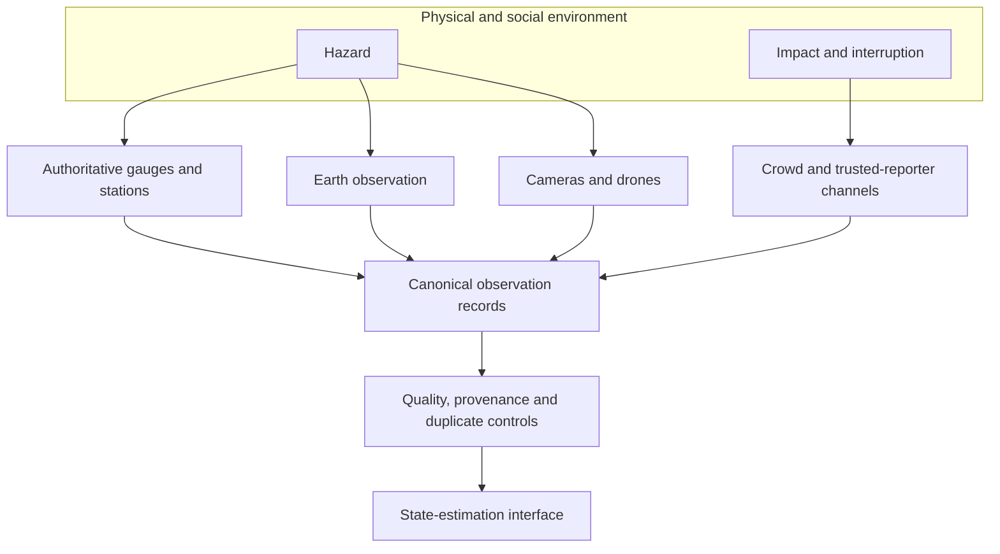
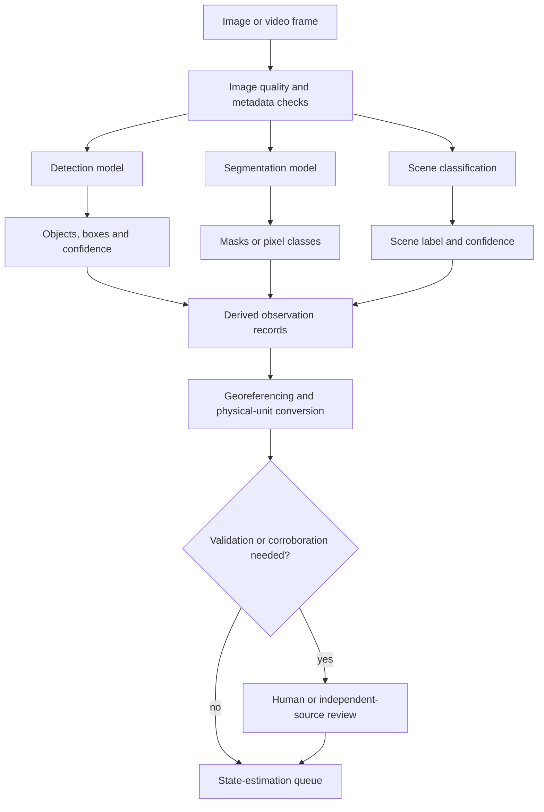
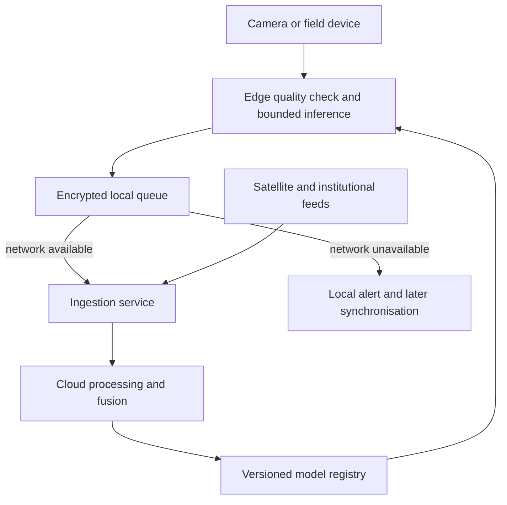
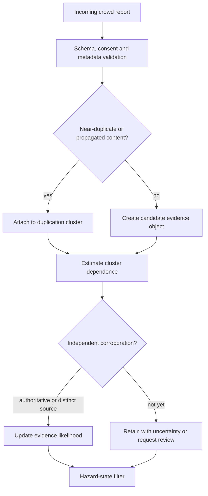

# Part 2: Crowd AI and Observation Architecture

## The distributed sensor network

During a flood, the first useful observation can arrive through many channels: a gauge rise upstream, a radar image acquired hours later, a matatu driver reporting an impassable bridge, or a farmer photographing a waterline against a familiar wall. Each source contributes a different fragment. SCRI combines those fragments into a progressively clearer event view.

Spatial Catastrophe Risk Intelligence (SCRI) begins with an observation contract that gives artificial intelligence a defined job. Kenya already has authoritative hydrometeorological infrastructure, including manual and telemetric surface-water monitoring across basin areas [1]. Sentinel-1 adds day-and-night, all-weather radar imagery, with emergency products that delineate inundation at the sensor’s operational resolution [2]. Community reports add effects that remote sensing may miss: a road is unusable, livestock cannot reach water, a health facility has lost power, or a crop was at a vulnerable stage when inundation occurred.

The commercial advantage comes from joining those perspectives while preserving their meaning. A river gauge is a calibrated measurement at a known location. A satellite-derived mask is a model output with acquisition and processing uncertainty. A photograph contributes frame-specific evidence. A text report is a claim by a contributor, expressed in language and affected by access, incentives and memory. The platform stores each source according to what it is.


**Figure 2.1: Multimodal evidence enters through one governed interface**

The minimum record is deliberately explicit:

```text
observation_id
hazard_type
source_type
source_id_or_pseudonym
event_time
knowledge_time
ingestion_time
geometry
coordinate_reference_system
observed_variable
value
unit
model_or_report_confidence
source_reliability
provenance
duplication_cluster
consent_and_permitted_use
quality_flags
correction_or_predecessor
schema_version
```

Three times are required because catastrophe reconstruction is a point-in-time problem. **Event time** records when the condition was observed. **Knowledge time** records when the source could have made it available. **Ingestion time** records when SCRI received it. A 10:00 replay therefore uses only evidence available by 10:00, while a flood photograph uploaded at 15:00 enters later versions. This distinction protects model validation from hindsight and allows an insurer to ask the operational question that matters: *what could we reasonably have known then?*

Geometry is equally disciplined. A phone coordinate is a point with an accuracy radius; a road report may be a line segment; a satellite mask is a raster or polygon at a stated resolution; a drought indicator may be a zonal statistic over a livelihood area. Every value carries a unit. Every model-derived feature carries the model version and lineage to the raw input. Provenance follows the general principle expressed in the W3C PROV data model: a derived entity should remain traceable to the activities and sources that produced it [3].

## Machine perception with defined jobs

YOLO has a useful and clearly defined role. Object detection produces classes, confidence scores and bounding boxes. An instance-segmentation model produces object masks. Semantic segmentation assigns a class to pixels across a scene. Current Ultralytics documentation exposes those as distinct tasks and outputs [4]. SCRI creates flood or burn polygons from suitable segmentation and geospatial processing, while bounding boxes remain object observations.

For wildfire, detection may identify smoke, flame, vehicles or people; segmentation may estimate a visible flame or burn boundary; thermal data may provide another signal. For flood, radar- or optical-image segmentation can estimate water extent, while depth usually requires terrain, gauges, hydraulics or a separately validated inference model. For locusts, an object detector supports close-range survey imagery, while regional swarm density comes from multiple surveys, movement evidence and ecological state. For landslide, models may segment a scar after failure while precursor risk remains a state-estimation problem. For drought and heat, time-series anomalies are often more important than vision.


**Figure 2.2: Detection, segmentation and state estimation remain separate**

Model confidence and hazard probability answer different questions. A detector confidence of 0.86 describes support for a class prediction under the model’s training and calibration regime. The fusion layer combines that output with image time, location and independent observations to estimate hazard probability; the loss layer then evaluates financial consequences.

Performance thresholds are set during hazard- and use-case-specific validation. A target such as “mAP greater than 0.75 under occlusion” becomes meaningful when it is tied to a dataset, class distribution, camera geometry, decision threshold and cost of errors. Each model card states the intended use, excluded conditions, training geography, evaluation split and metrics. Detection and segmentation models are evaluated on event and geography holdouts, with precision-recall curves, class-specific recall, calibration, intersection-over-union or Dice scores where appropriate, and operational latency. Error slices include darkness, glare, rain, smoke, low bandwidth, small objects and unfamiliar landscapes.

SCRI uses a hybrid edge-and-cloud design. Edge inference is valuable when latency or connectivity matters and the task can run on bounded hardware - for example, screening a camera stream for smoke and transmitting a short alert package. Cloud inference supports computationally intensive earth-observation processing, model comparison and retraining. The hybrid design maintains useful service through local queues, later synchronisation and explicit degraded modes when either side is unavailable.


**Figure 2.3: Hybrid inference with an offline path**

## Inclusive crowd intelligence

The defining statistical problem is dependence among crowd reports. Fifty forwarded copies of one image share a common information origin. SCRI first creates a **duplication and propagation cluster** using perceptual image hashes, text similarity, shared URLs, timestamps, geometry, device metadata where lawfully available and known forwarding relationships. The cluster becomes one correlated evidence object with an internal report count. Independent corroboration is then assessed across distinct evidence origins.


**Figure 2.4: Separating correlated repetition from independent corroboration**

Contributor reliability is contextual. The platform evaluates location precision, timestamp quality, report completeness, sensor calibration, agreement with independent sources and known operating conditions. Historical performance can contribute as a capped, regularly re-estimated input, while first-time reporters, shared-device users and remote communities remain eligible sources. Community coverage becomes a monitored variable, and sparse-reporting areas receive wider uncertainty and targeted outreach.

A practical evidence update can be written as:

$$
p(Z_t\mid Y_{1:S,t})
\propto
p(Z_t\mid Z_{t-1},X_t)
\prod_{c=1}^{C_t}
p(Y_{c,t}\mid Z_t,q_{c,t},\rho_c).
\tag{2.1}
$$

where $Z_t$ is the hazard state, $Y_{c,t}$ is an evidence cluster rather than an individual forwarded message, $q_{c,t}$ represents observable quality and $\rho_c$ represents residual dependence inside the cluster. The interface supports a Kalman-family filter, particle filter, variational approximation, ensemble update or deterministic rule-based baseline according to hazard and latency. Offline MCMC remains useful for calibration and model comparison where computation permits. Appendix D derives Equation (2.1) from Bayes' rule, shows how duplication dependence changes effective information, and develops source-reliability and geolocation-error updates.

Privacy uses several reinforcing controls. Geotagged images, phone numbers, faces, vehicle plates and property details may be personal data. Kenya’s Data Protection Act requires lawful, fair and transparent processing; specified purposes; data minimisation; accuracy; retention discipline; safeguards for transfer and enforceable data-subject rights [5]. SCRI separates the identifiable contribution store from the hazard-evidence store, applies encryption and role-based access, redacts visible identifiers where practical and records permitted uses. Pseudonymisation reduces direct identifiability, while access and retention controls address the residual identifiability of rich geospatial records.

Safe degradation is designed before scale. If the crowd channel fails, the state engine widens uncertainty and uses authoritative and earth-observation sources. A stale gauge receives a freshness flag and decaying evidential weight. Delayed satellite acquisition appears as footprint age. During cloud outages, edge devices retain evidence and authorised local warnings follow the responsible agency’s manual route. Missing evidence produces an explicit coverage gap and wider confidence interval.

The output of Part 2 is a versioned collection of admissible evidence with uncertainty, correction history and provenance intact. Part 3 can therefore estimate hazard state while Part 4’s actuary can trace every financial update back to its observational basis.

\newpage

## References

[1] Water Resources Authority, “Surface Water Assessment & Monitoring,” 2026. [Online]. Available: https://wra.go.ke/surface-water-assesment-monitoring/. Accessed: Aug. 28, 2026.

[2] European Space Agency, “Sentinel-1: Emergency response.” [Online]. Available: https://www.esa.int/Applications/Observing_the_Earth/Copernicus/Sentinel-1/Emergency_response. Accessed: Aug. 28, 2026.

[3] W3C, “PROV-DM: The PROV Data Model,” W3C Recommendation, Apr. 30, 2013. [Online]. Available: https://www.w3.org/TR/prov-dm/. Accessed: Aug. 28, 2026.

[4] Ultralytics, “Instance Segmentation with Ultralytics YOLO,” 2026. [Online]. Available: https://docs.ultralytics.com/tasks/segment/. Accessed: Aug. 28, 2026.

[5] Republic of Kenya, *Data Protection Act*, Cap. 411C. [Online]. Available: https://new.kenyalaw.org/akn/ke/act/2019/24/eng@2022-12-31. Accessed: Aug. 28, 2026.
