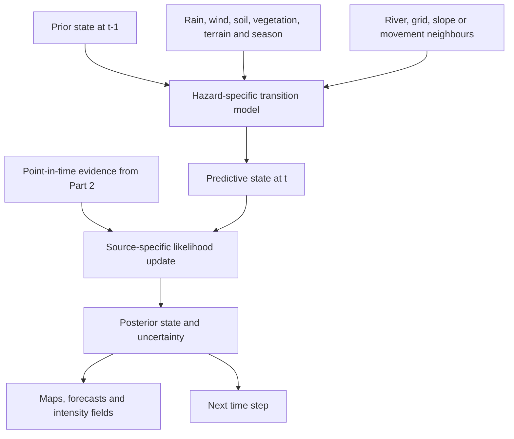
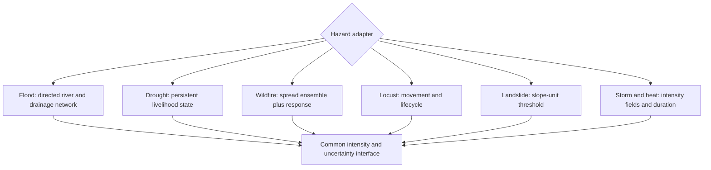
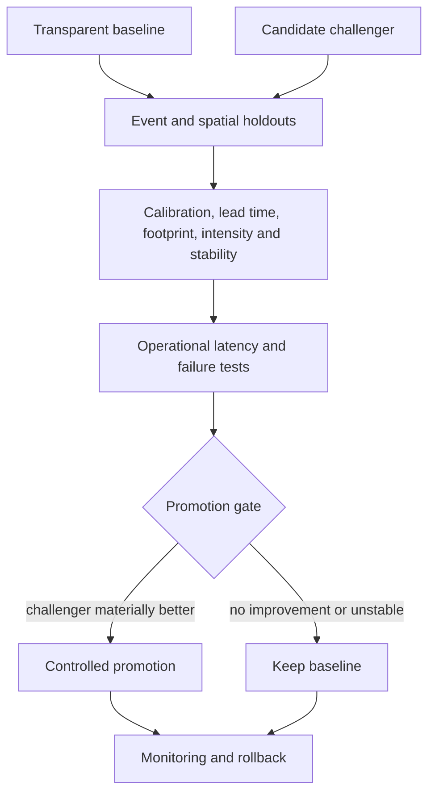

# Part 3: Spatiotemporal Hazard-State Modelling

## From evidence to an evolving physical state

At 08:00, an insurer may know that rain has fallen upstream, one gauge is rising and three community reports describe water on a road. At 11:00, a radar acquisition reveals a wider inundated area. At 15:00, a photograph corrects the assumed location of the road closure. The event has changed, but so has knowledge of the event. A catastrophe-state engine must represent both.

Spatial Catastrophe Risk Intelligence (SCRI) treats the latest polygon as one observation within a posterior distribution over the physical variables relevant to a peril and forecast horizon:

$$
p\!\left(Z_{g,t}\mid Y_{1:t}\right).
\tag{3.1}
$$

where $Z_{g,t}$ is the latent or partially observed hazard state for spatial unit $g$ at time $t$, and $Y_{1:t}$ is the evidence that was available by that valuation time. A map presents one view of this distribution, such as median extent, probability of inundation or a credible interval around a perimeter. The underlying model retains the complete probability representation.

The state evolves through a hazard-specific process:

$$
p\!\left(Z_{g,t}\mid Z_{g,t-1},Z_{\mathcal N_h(g),t-1},X_{g,t},\theta_h\right).
\tag{3.2}
$$

where $\mathcal N_h(g)$ defines the relevant neighbourhood for hazard $h$, $X_{g,t}$ contains forcing variables and $\theta_h$ contains model parameters. For flood, the neighbourhood may be directed upstream and downstream through a river or drainage network. For wildfire, it follows adjacency, wind, slope and fuel. For locusts, it is a movement corridor. For drought, temporal persistence and livelihood zones may dominate. For landslide, the state may be local to a slope unit. For heat, it may follow a gridded temperature and humidity field combined with the built environment. Appendix E derives the prediction-update recursion behind Equations (3.1)-(3.2) and states the conditional-independence assumptions needed for spatial factorisation.


**Figure 3.1: Prediction and evidence update are separate operations**

Every advanced model has a transparent baseline. A flood baseline may combine gauge thresholds, terrain and a precomputed inundation library. A drought baseline may reproduce the existing indicator-and-phase logic used in public bulletins. A fire baseline may use confirmed ignition, wind buffers and simple rate-of-spread rules. A locust baseline may advect the last confirmed location with forecast wind and wide uncertainty. A landslide baseline may combine susceptibility with rainfall thresholds. A heat baseline may use station or gridded temperature thresholds and duration. These baselines establish an understandable, fast and operationally resilient benchmark.

The challenger may be a hierarchical Bayesian state-space model, finite hidden Markov model, hidden semi-Markov model, switching process model or physics-informed ensemble. An infinite hidden Markov model becomes a research candidate when discovering an unknown number of regimes is useful. Model choice follows calibration, lead time, transfer, decision value, operating latency and compute budget.

## Six hazard adapters

### Flood: routed dependence from extent to depth

A Sentinel-1 flood mask can reveal extent under cloud. SCRI combines that extent with rainfall, river levels, terrain, drainage and hydraulic or hydrological relationships to estimate water depth at exposed properties. WRA’s basin structure and monitoring network provide the institutional and physical starting point [1]. The state vector may include:

$$
Z^{flood}_{g,t}=\{p^{wet}_{g,t},d_{g,t},v_{g,t},\tau^{on}_{g,t},\tau^{rec}_{g,t}\}.
\tag{3.3}
$$

representing inundation probability, depth, velocity, onset and recession. Each component has its own uncertainty. The product reports spatial and depth precision at the support justified by the radar, terrain, gauges and model validation [2]. Appendix E expands Equation (3.3) into a joint state with marginal and cross-component uncertainty.

### Drought: duration and livelihood condition

Drought requires memory. A finite HMM can represent phases; a hidden semi-Markov or continuous state-space model can represent explicit duration where livelihood deterioration persists, while a transparent composite indicator remains the baseline. NDMA’s four indicator families - biophysical, production, access and utilisation - connect rainfall and vegetation to water access, livestock condition, markets and household utilisation [3]. The insurer’s model consumes the authoritative drought phase as one observation or contextual variable, while the responsible public institution continues to issue that phase.

### Wildfire: detection, spread and response

The fire state separates ignition from detection:

$$
T^{ign}\le T^{det}\le T^{dispatch}\le T^{response}.
\tag{3.4}
$$

The spread model conditions on wind, fuel, moisture, terrain and suppression. The observed perimeter anchors a forecast ensemble. Community knowledge remains operationally relevant around Mount Kenya, where access, land use, fire practice and preparedness affect both observation and response [4]. SCRI reports the probability that an exposure lies within future fire footprints at selected horizons, conditional on explicit response assumptions. Appendix E derives the associated latency decomposition and shows why occurrence probability and detection probability remain separate.

### Locust: a mobile biological process

Locust state includes location, density, lifecycle and movement. Wind and vegetation affect the transition, while surveillance and control actions change what happens next. The 2019-2020 Kenya response relied on surveillance, identification of breeding grounds, ground and aerial control and livelihood restoration [5]. SCRI records control operations as state-changing interventions and widens uncertainty where surveillance coverage is sparse.

### Landslide: slope units and threshold exceedance

Landslide susceptibility answers *where failure is more plausible*; rainfall and soil conditions help answer *when*. State estimation operates over slope units or other geotechnically defensible geometries. Reports of fissures or blocked drainage contribute local evidence with measured false-alarm potential. The output is a conditional failure probability and access-impact scenario with uncertainty suited to inspection and response planning. Kenyan synthesis evidence connects rainfall, steep terrain, deforestation and drainage with regional patterns including Murang’a and West Pokot [6].

### Severe storm and heat: fields, persistence and compound effects

Storm state includes rainfall intensity, wind, hail where observed, lightning and duration. Heat state includes temperature, humidity or an approved heat-stress measure, persistence, time of day and spatial differences created by altitude, coast and urban form. A storm can trigger flood and landslide; drought and heat can increase fire-conducive conditions; heat and power failure can compound health and business interruption. The state engine records those dependencies while preserving the identity and physics of each hazard.


**Figure 3.2: Common interface, different physics**

## Resolution, validation and operational promotion

Resolution is chosen from the decision backwards. Property claims triage may need building or parcel-level intersection, while the underlying hazard may support a coarser estimate. Drought may be credible at a livelihood-zone or subcounty scale while a gauge is a point measurement and a slope unit is highly local. SCRI stores native resolution, display resolution and any downscaling method separately, then communicates uncertainty at the support justified by the data.

Each operational state output includes:

```text
event_id and hazard_type
valuation_time and forecast_horizon
state_variable and unit
native_geometry and resolution
posterior mean or median
credible or prediction interval
probability thresholds
observation cut-off time
model and parameter version
forcing-data versions
quality and degradation status
scenario assumptions, including response
```

Validation follows the event through time. Hindcasting freezes the evidence available at each historical cut-off. Event holdouts test temporal generalisation; spatial holdouts test transfer to untrained areas; extreme-event holdouts test the tail. Metrics are matched to output: Brier or log score and reliability diagrams for probabilities; intersection-over-union for extent; continuous ranked probability score for distributions; absolute or relative error for depth, intensity or onset; lead time at a stated false-alarm rate; and duration error for slow states.


**Figure 3.3: Promotion follows demonstrated operational value**

The state engine passes distributions with provenance to the actuarial layer. A flood footprint may narrow as new radar arrives; a drought posterior may remain broad because household data are sparse; a fire forecast may branch under alternative suppression scenarios. Part 4 converts those uncertain states into damage and insured loss while preserving where the uncertainty came from.

\newpage

## References

[1] Water Resources Authority, “Basin Areas,” 2026. [Online]. Available: https://wra.go.ke/basin-areas-2/. Accessed: Aug. 28, 2026.

[2] European Space Agency, “Sentinel-1: Emergency response.” [Online]. Available: https://www.esa.int/Applications/Observing_the_Earth/Copernicus/Sentinel-1/Emergency_response. Accessed: Aug. 28, 2026.

[3] National Drought Management Authority, “National Drought Early Warning Bulletin, March 2026,” Apr. 2026. [Online]. Available: https://knowledgeweb.ndma.go.ke/Content/LibraryDocuments/National_Drought_Early_Warning_Bullletin_March_202620260411222758.pdf. Accessed: Aug. 28, 2026.

[4] M. N. Ndalila, F. Lala and S. M. Makindi, “Community perceptions on wildfires in Mount Kenya forest: implications for fire preparedness and community wildfire management,” *Fire Ecology*, vol. 20, art. no. 92, 2024, doi: 10.1186/s42408-024-00326-3. [Online]. Available: https://doi.org/10.1186/s42408-024-00326-3. Accessed: Aug. 29, 2026.

[5] World Bank, “FAQs—Kenya Locust Response Project,” Oct. 1, 2020. [Online]. Available: https://www.worldbank.org/en/country/kenya/brief/faqs-kenya-locust-response-project. Accessed: Aug. 28, 2026.

[6] E. T. N. Kinyeru, M. N. Harris and J. Jansz, “Why do landslides occur in Kenya, and what can be done to mitigate their occurrences?” *Natural Hazards*, vol. 122, art. no. 155, 2026, doi: 10.1007/s11069-025-07938-1. [Online]. Available: https://doi.org/10.1007/s11069-025-07938-1. Accessed: Aug. 29, 2026.
