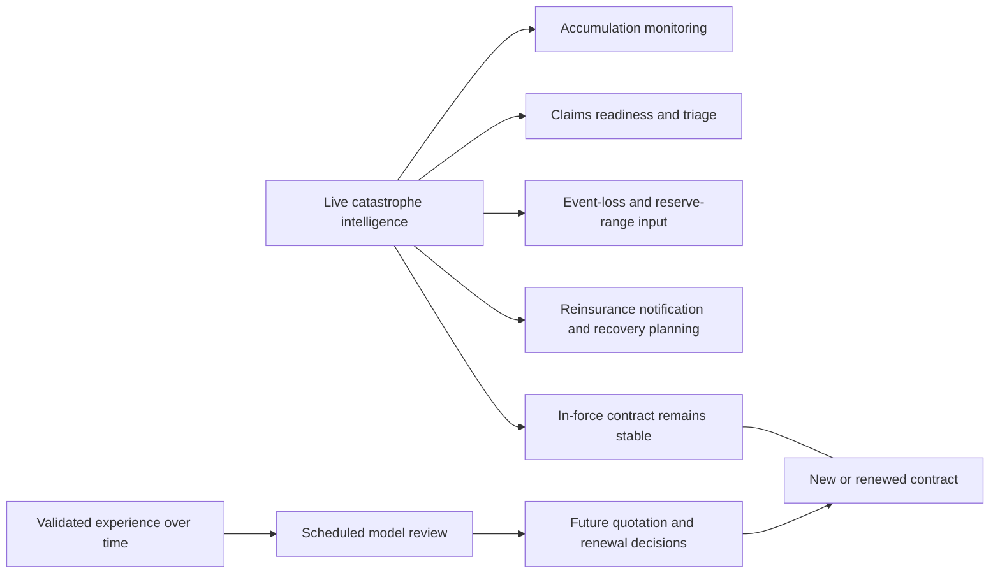
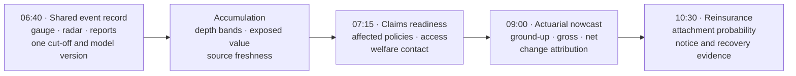
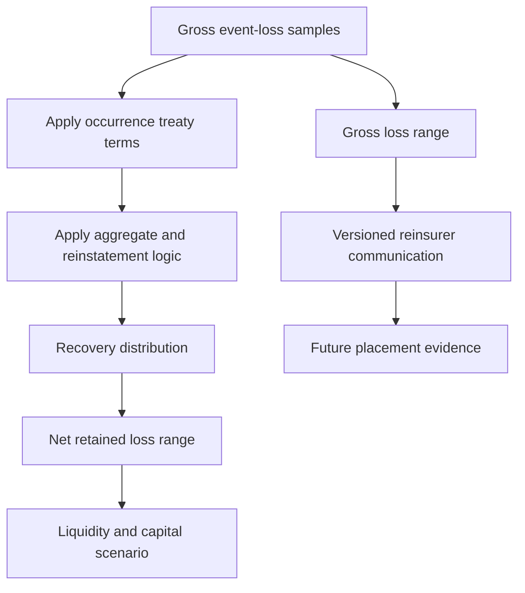
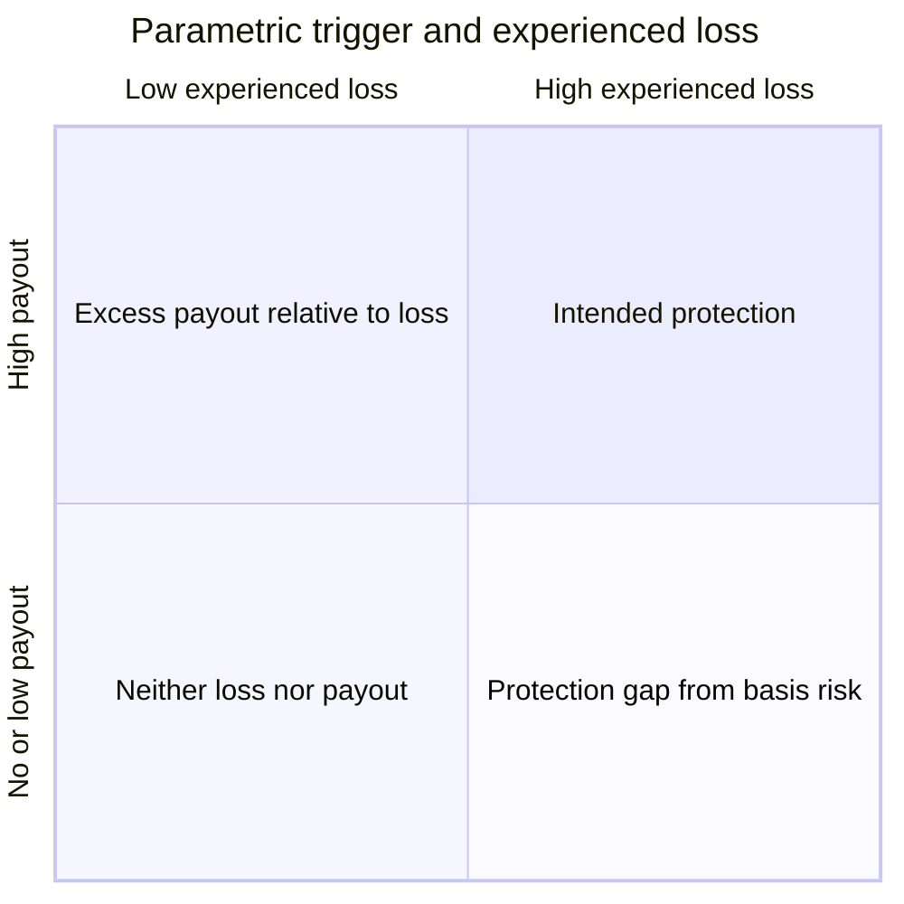
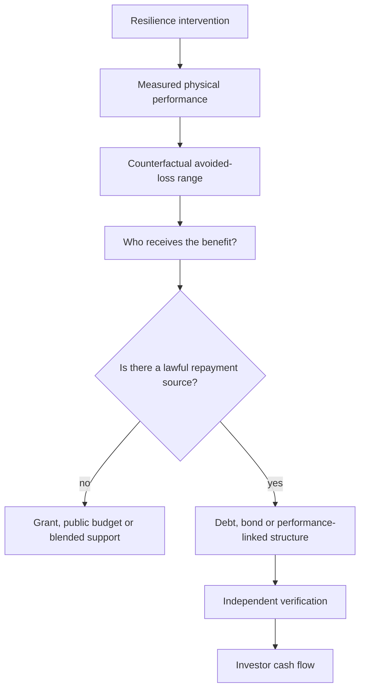

# Part 5: Insurance, Investment and Resilience Finance

## Continuous underwriting with a stable customer promise

When the Nzoia leaves its banks, an insurer has several urgent questions. Which active policies intersect the credible flood footprint? How much insured value sits within each depth band? Which claims channels, adjusters and repair networks should be prepared? What range of gross and net loss should be communicated internally and to reinsurers? SCRI answers these operational questions while the customer’s in-force promise remains stable.

That operating model defines **continuous catastrophe underwriting** in Spatial Catastrophe Risk Intelligence (SCRI). The product continuously observes the portfolio and serves each insurance team on its own decision clock. During an event, it supports accumulation, claims readiness, event-loss nowcasting, reinsurance notification and liquidity planning. At a future quotation or renewal, governed experience informs rating, deductibles, limits, mitigation requirements and appetite. The Insurance Regulatory Authority’s insurance-risk guideline treats pricing, underwriting, claims, reserving and reinsurance as distinct controlled processes [1]; SCRI gives them a common evidence foundation.

**Figure 5.1: Continuous intelligence and contractual underwriting run on different clocks**

The distinction changes the product interface. A portfolio manager sees exposure by hazard intensity, confidence and line of business. A claims manager sees likely affected policies, contact status, access constraints and triage priority. A reserving actuary sees a versioned event-loss distribution, reported emergence and uncertainty. A reinsurance manager sees estimated loss by treaty, attachment proximity and data cut-off. An underwriter’s prospective workspace presents long-term hazard and mitigation evidence at quotation or renewal.

| Decision moment | SCRI may support | SCRI does not authorise |
|---|---|---|
| Active event, in-force policy | Exposure matching, welfare contact, claims triage, reserve-range input, reinsurance notice | Premium change, cancellation, new exclusion or retroactive deductible |
| Quote already issued | Flag for authorised human review under documented rules | Silent withdrawal or discriminatory treatment |
| New quotation | Prospective risk assessment using approved model and data | Unreviewed automated refusal based on a crowd report |
| Renewal | Experience analysis, mitigation recognition, filed or approved pricing workflow as applicable | Treating one event nowcast as a new annual tariff |
| Claims decision | Evidence retrieval and prioritisation | Automatic coverage or causation determination from a hazard polygon |

More precise geography can improve risk differentiation by replacing county-wide assumptions with local exposure mechanisms. It also reveals affordability challenges for highly exposed households. SCRI therefore reports affordability, take-up, declination and subgroup outcomes alongside discrimination and calibration. Partial pooling stabilises sparse estimates, while explicit product choices govern cross-subsidy, public support and risk-pool design.

## One flood, four desks, one evidence trail

At 06:40, a basin gauge and rainfall nowcast push the lower-Nzoia state above the insurer’s accumulation-watch threshold. The screen shows how the probability of specified depth bands has changed, names the observations responsible, marks one gauge as twelve minutes stale and displays active exposure within each credible footprint. The accumulation analyst acknowledges the watch and requests an update in thirty minutes.

At 07:15, two independently sourced road reports and radar-derived water extent increase confidence in one area while a copied image cluster is consolidated. The claims operations lead receives likely affected policies, last verified contact channel, accessibility, policy type and the reason for each priority. Welfare contact and claim-intake preparation begin under an approved playbook. Customers can respond through smartphone, contact-centre or field channels, and sparse digital reporting appears as uncertainty rather than apparent safety.

At 09:00, the reserving actuary opens the same event at the same knowledge cut-off. The interface displays ground-up, gross insured and net retained distributions separately. A change panel attributes the movement since 07:15 to four factors: expanded footprint, revised flood depth, corrected policy coordinates and new reported claims. The actuary can download unit-level samples, reproduce the financial transform and interpret the nowcast within the insurer’s reserve process.

At 10:30, the reinsurance manager sees the occurrence layer approaching attachment under the central estimate, with a probability distribution around that outcome. The communication pack includes the treaty version, exposure cut-off, model version, outstanding data failures and a link to supporting evidence. Recovery status develops as the contract and event facts mature. The prospective underwriting workspace remains scheduled around quotation and renewal.

**Figure 5.2: Product-interface narrative during one flood morning**

The interface is organised around questions, not model names:

| Workspace | First question | Minimum visible evidence | Human action |
|---|---|---|---|
| Event overview | What changed, where and how certain is it? | Cut-off time, footprint bands, source freshness, contradictions | Acknowledge or challenge the state |
| Portfolio | Which active exposures drive the range? | Policy snapshot, value, line, location quality, depth band | Investigate concentration and data defects |
| Claims readiness | Who may need contact or field support? | Triage reason, access, contact status, uncertainty | Contact, assign or override |
| Actuarial loss | What are the ground-up, gross and net distributions? | Samples, terms, version, change attribution | Interpret for reserving and risk management |
| Reinsurance | Which contractual layers may be affected? | Treaty encoding, attachment probability, exclusions, evidence pack | Notify and prepare recovery documentation |

Every workspace carries the same event identifier, observation cut-off, exposure snapshot and model version. That continuity prevents a polished dashboard from hiding mismatched vintages. The user can move from a portfolio total to the physical evidence and back to the exact policy transform. A decision log records what the user saw, what action was taken and whether the recommendation was overridden. This is the product proposition in operational form: earlier shared intelligence, different owned decisions.

## Reinsurance, parametric products and financial protection

An unfolding event estimate can improve the conversation with reinsurers. It provides earlier notice, likely affected layers, recovery documentation and a consistent view of uncertainty. Attachment, limit, hours clauses, reinstatements, exclusions and reporting obligations continue to govern the executed treaty. Over time, validated event intelligence strengthens future placement and capital planning by giving both parties a more transparent risk record.

**Figure 5.3: Reinsurance intelligence applies existing terms before informing future strategy**

Parametric insurance defines its promise in advance. The contract names the trigger variable, observation source, calculation agent, threshold, geographic unit, data-continuity rule and payout formula. Crowd evidence can improve product design, validate the historical relationship between index and loss, support customer communication and activate a predefined fallback where the contract provides one.

Let $T_e$ denote trigger status and $L_e$ experienced loss. Basis risk remains:

$$
BR_e=P(T_e)-L_e.
\tag{5.1}
$$

under a common monetary or utility scale. A payout with limited local loss is one direction; severe local loss without payout is the other. Higher-resolution evidence can reduce expected basis error, while trigger testing, layered indices, contractually defined fallbacks, dispute processes and complementary indemnity or social-protection arrangements manage the remaining difference. Spatial tail dependence and local heterogeneity are recognised challenges in rainfall insurance [2]. Appendix G derives the expected payout, mean basis error and mean-squared basis-risk decomposition associated with Equation (5.1).

**Figure 5.4: Parametric accuracy is tested against experienced loss**

At sovereign and county level, catastrophe intelligence sits inside a broader financial-protection strategy. Kenya has used a layered approach including contingency mechanisms, contingent credit, agricultural and livestock insurance and social-protection instruments. The World Bank’s account of Kenya’s Cat DDO describes a US$200 million contingent line and the role of prearranged finance in faster response [3]. The wider disaster-risk-finance framework distinguishes retention for frequent or moderate losses from risk transfer for less frequent, severe losses [4], while established guidance emphasises that public intervention responds to the market and affordability constraints of catastrophe finance [5]. SCRI estimates the loss and funding need associated with each layer, giving the authorised institution earlier evidence for drawdown, allocation or trigger decisions.

## Resilience investment requires a cash-flow bridge

Resilience finance begins by connecting physical performance to an investable cash-flow structure. A financeable structure needs an issuer or borrower, a lawful source of repayment, a term, covenants, performance measurement, a verification agent, risk allocation and a credible counterfactual. SCRI supplies risk analytics and monitoring evidence; the transaction sponsor supplies the repayment source and financial structure.

For a proposed intervention $a$, the analytical starting point is:

$$
NPV(a)=
-C_0
+\sum_{t=1}^{T}
\frac{
\mathbb E[\Delta L_t(a)]
+B_t(a)
-O_t(a)
}{(1+r)^t}.
\tag{5.2}
$$

where $C_0$ is initial capital expenditure, $\Delta L_t$ is avoided loss under an explicit counterfactual, $B_t$ is other measurable benefit, $O_t$ is operating cost and $r$ is a discount rate appropriate to the decision owner. This is a benefit-cost assessment. It becomes a financing structure only after mapping benefits to a party able and willing to make payments. Appendix G derives Equation (5.2) from discounted cash flow, develops the benefit-cost ratio and shows how attachment and exhaustion define a financial risk layer.

**Figure 5.5: Avoided loss becomes financeable only through an identified payment mechanism**

The intervention mechanism varies by hazard. Flood investment may improve drainage, protect a road or restore a wetland. Drought investment may improve water access, fodder systems or anticipatory livestock support. Wildfire investment may combine observation with access, fuel management, equipment and trained response. Locust investment may strengthen surveillance and timely control. Landslide investment may address drainage, slope stabilisation and road redundancy. Heat investment may support shade, ventilation, work practices, cooling and resilient power. Each requires different physical evidence and beneficiaries.

The platform therefore generates separate decision products:

- **Insurer:** event-loss range, affected policies, claims workload, accumulation, gross/net loss and future risk evidence.
- **Reinsurer:** versioned event estimate, treaty-layer impact, recovery documentation and uncertainty.
- **Lender or investor:** site hazard, downtime, revenue stress, resilience expenditure and residual risk.
- **Government:** affected population, infrastructure and fiscal-loss scenarios, emergency liquidity need and financing-layer exhaustion.
- **Development financier:** additionality, beneficiary reach, avoided-loss range, monitoring evidence and failure conditions.
- **Policyholder or community:** warning source, expected effects, protective action, coverage, trigger and claims information in accessible language.

These outputs share the catastrophe state while each institution applies its own decision rule. A lender’s probability of default model, an insurer’s loss model and a county’s emergency-allocation rule receive separate calibration, governance and legal authority. That separation allows one product platform to serve several markets with precision.

The commercial thesis is focused and testable. SCRI can help capital arrive earlier by reducing uncertainty, preparing operations and providing traceable evidence. It can improve the cost of capital where validated information changes risk selection, mitigation or reinsurance confidence. Success is measured through lead time, operational readiness, basis-risk performance, customer outcomes and finance structures with real repayment mechanisms.

\newpage

## References

[1] Insurance Regulatory Authority, “Guideline to the Insurance Industry on Insurance Risk,” IRA/PG/17. [Online]. Available: https://ira.go.ke/assets/file/Guideline_on_Insurance_Risk.pdf. Accessed: Aug. 28, 2026.

[2] D. S. Negi and B. Ramaswami, “Basis risk and the demand for catastrophic rainfall insurance,” *Q Open*, vol. 4, no. 1, qoae009, 2024, doi: 10.1093/qopen/qoae009. [Online]. Available: https://doi.org/10.1093/qopen/qoae009. Accessed: Aug. 29, 2026.

[3] World Bank, “Faster Access to Better Financing for Emergency Response and Resilience in Kenya,” Aug. 20, 2020. [Online]. Available: https://www.worldbank.org/en/country/kenya/brief/faster-access-to-better-financing-for-emergency-response-resilience-kenya. Accessed: Aug. 28, 2026.

[4] World Bank, “Disaster Risk Finance and Insurance.” [Online]. Available: https://www.worldbank.org/ext/en/topic/financial-sector/disaster-risk-finance-and-insurance. Accessed: Aug. 28, 2026.

[5] O. Mahul and J. D. Cummins, *Catastrophe Risk Financing in Developing Countries: Principles for Public Intervention*. Washington, DC, USA: World Bank, 2009, doi: 10.1596/978-0-8213-7736-9. [Online]. Available: https://doi.org/10.1596/978-0-8213-7736-9. Accessed: Aug. 29, 2026.
