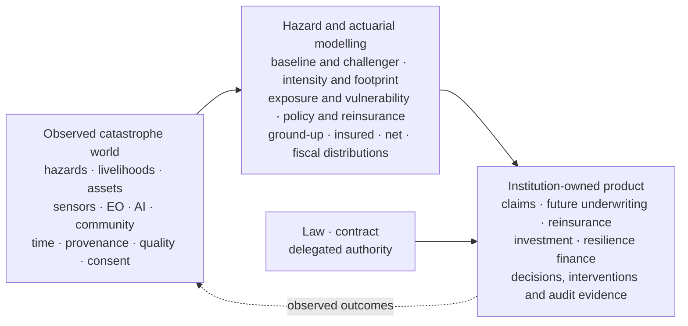

# Part 7: Appendices

## Appendix A: Shared notation and definitions

The notation preserves the transformations established in the six parts. Observations inform hazard state; hazard and exposure generate damage; policy terms generate insured loss; and authorised actuarial, claims or contractual processes translate loss evidence into reserves or payouts.

### Indices, space and time

| Symbol | Definition |
|---|---|
| $e$ | Catastrophe event under a stated event-definition rule |
| $i$ | Exposure, asset, coverage or policy unit, stated by context |
| $h$ | Hazard type |
| $g$ | Spatial unit in the hazard model |
| $c(i)$ | Exposure or vulnerability class of unit $i$ |
| $s$ | Observation-source class or individual source, stated by context |
| $t$ | Event-state or valuation time |
| $y$ | Annual catalogue or portfolio year |
| $k$ | Claims-development period or other local sequence index |
| $\mathcal N_h(g)$ | Hazard-specific neighbours of spatial unit $g$ |

### Observation and state layer

| Symbol | Definition and unit requirement |
|---|---|
| $Y_{s,g,t}$ | Source-specific observation; its physical unit and geometry are stored with the record |
| $q_{s,g,t}$ | Observable source-quality vector, not hazard probability |
| $\rho_c$ | Dependence parameter or descriptor for duplication cluster $c$ |
| $Z_{g,t}$ | Latent or partially observed physical hazard state |
| $X_{g,t}$ | Exogenous forcing and contextual covariates |
| $I_{e,h}(g)$ | Hazard intensity for event $e$, hazard $h$ and geometry $g$, with a peril-specific unit |
| $T^{ign},T^{det},T^{response}$ | Ignition or onset, detection and effective response times where those concepts apply |

### Exposure, damage and finance layer

| Symbol | Definition |
|---|---|
| $V_i$ | Replacement value, sum insured, crop value or another explicitly named exposure measure |
| $M_i$ | Secondary vulnerability modifiers for exposure $i$ |
| $D_{h,c(i)}(\cdot)$ | Stochastic damage-ratio function for hazard and exposure class |
| $L^{GU}_{e,i}$ | Ground-up physical/economic loss before insurance terms |
| $L^{COV}_{e,i}$ | Covered portion of ground-up loss after exclusions and coverage definition |
| $L^{INS}_{e,i}$ | Gross insured loss after direct policy terms |
| $L^{NET}_{e}$ | Insurer-retained event loss after reinsurance terms |
| $d_i,\ell_i,q_i$ | Deductible, applicable limit and insured/coinsurance share |
| $N_{h,g,y}$ | Long-term event count for a stated hazard, region, year and event definition |
| $S_y$ | Aggregate annual loss in year $y$ on a stated gross or net basis |

### Canonical meanings

- **Observation confidence** describes support for an observation or model-derived feature under its source model.
- **Hazard probability** describes uncertainty about the physical state or event.
- **Damage ratio** describes physical/economic damage relative to a stated value measure.
- **Event-loss nowcast** is a versioned estimate of ultimate loss for an unfolding event.
- **Reserve** is an accounting estimate owned under the insurer’s reserving basis.
- **Parametric payout** is calculated under a contractually specified trigger and formula.
- **Avoided loss** is a causal comparison requiring an intervention record and counterfactual.

## Appendix B: Canonical systems architecture


**Figure B.1: Canonical SCRI architecture**

## Appendix C: Mathematical supplement to Part 1 - product thesis and value creation

### C.1 Numbering convention

Main-text equations use the part number and their order of appearance, such as Equation (4.5). Appendix derivations use the form (A$p$.$n$), where $p$ is the associated part. Thus (A4.3) is the third appendix equation supporting Part 4. Inline symbol definitions remain inline; every displayed mathematical statement is numbered.

### C.2 Ground-up loss: bounds, expectation and variance

Part 1 begins with the asset-level relationship in Equation (1.1). For this derivation, condition on hazard intensity $I_i=I_{e,h}(g_i)$ and vulnerability modifiers $M_i$. Write the random damage ratio as $D_i=D_{h,c(i)}(I_i,M_i)$. Then:

$$
L^{GU}_{e,i}=V_iD_i,
\qquad 0\le D_i\le 1.
\tag{A1.1}
$$

If $V_i\ge0$, multiplication preserves the bounds, which proves:

$$
0\le L^{GU}_{e,i}\le V_i.
\tag{A1.2}
$$

The upper bound changes when the value measure includes business interruption, debris removal or another loss component that can exceed physical replacement value; the value basis and admissible damage-ratio range must then be restated. Under the bounded physical-damage definition, conditional expectation follows from linearity because $V_i$ is fixed at the valuation snapshot:

$$
\mathbb E[L^{GU}_{e,i}\mid I_i,M_i]
=V_i\,\mathbb E[D_i\mid I_i,M_i].
\tag{A1.3}
$$

Variance scales with the square of value:

$$
\operatorname{Var}(L^{GU}_{e,i}\mid I_i,M_i)
=V_i^2\operatorname{Var}(D_i\mid I_i,M_i).
\tag{A1.4}
$$

Equations (A1.3)-(A1.4) show why exposure error matters multiplicatively. A 10 percent upward value error raises the conditional mean by 10 percent and, holding the damage-ratio distribution fixed, raises the conditional variance by 21 percent.

For a portfolio of $n$ assets, $L^{GU}_e=\sum_i L^{GU}_{e,i}$. The variance expansion is:

$$
\operatorname{Var}(L^{GU}_e)
=\sum_{i=1}^{n}\operatorname{Var}(L^{GU}_{e,i})
+2\sum_{i<j}\operatorname{Cov}(L^{GU}_{e,i},L^{GU}_{e,j}).
\tag{A1.5}
$$

The covariance term proves why catastrophe accumulation cannot be represented by adding independent asset variances. Shared depth, wind, fire perimeter, drought regime, construction practice and response conditions create dependence.

**Dimensional check.** $D_i$ is dimensionless and $V_i$ is measured in currency or another declared value unit. Therefore $L^{GU}_{e,i}$ has the same unit as $V_i$. Variance has squared currency units, while standard deviation returns to currency units.

### C.3 Avoided expected loss as a causal contrast

Let $L_e(a)$ denote the potential loss for event $e$ under intervention $a$, and let $a_0$ denote the reference response. Equation (1.2) is equivalently:

$$
\Delta EL(a)=\mathbb E[L_e(a_0)-L_e(a)].
\tag{A1.6}
$$

The equality between Equation (1.2) and Equation (A1.6) follows directly from linearity of expectation:

$$
\mathbb E[L_e(a_0)-L_e(a)]
=\mathbb E[L_e(a_0)]-\mathbb E[L_e(a)].
\tag{A1.7}
$$

Observed data reveal only one potential outcome for each event. Identification from non-random operational data therefore requires a defensible version of four conditions:

1. **Consistency:** the recorded response corresponds to the defined intervention.
2. **Conditional exchangeability:** after conditioning on measured confounders $X$, response assignment is independent of the potential losses.
3. **Positivity:** each relevant event type has a non-zero probability of receiving the compared responses.
4. **Stable treatment definition:** the intervention does not conceal materially different response intensities, and spillovers are represented where one intervention changes neighbouring losses.

Under consistency, conditional exchangeability and positivity, the adjustment identity is:

$$
\mathbb E[L_e(a)]
=\int \mathbb E[L_e\mid A=a,X=x],dF_X(x).
\tag{A1.8}
$$

Equation (A1.8) is obtained by the law of total expectation, followed by exchangeability to replace the unobserved conditional potential-outcome mean with the observed conditional mean. This is an identification result, not a guarantee that the conditions hold. The manuscript therefore treats avoided loss as an estimated range with stated assumptions.

### C.4 Value of information and value of action

Let $U(a,Z)$ be the utility of action $a$ when catastrophe state $Z$ occurs, and let $Y$ be new information. Before observing $Y$, the best expected utility is $\max_a\mathbb E[U(a,Z)]$. With $Y$, the action may depend on the observation. The expected value of sample information is:

$$
EVSI
=\mathbb E_Y\!\left[\max_a\mathbb E[U(a,Z)\mid Y]\right]
-\max_a\mathbb E[U(a,Z)].
\tag{A1.9}
$$

To prove $EVSI\ge0$, choose the pre-information optimal action $a^*$ after every possible observation. Because the conditional maximum is at least the value of this feasible constant rule:

$$
\mathbb E_Y\!\left[\max_a\mathbb E[U(a,Z)\mid Y]\right]
\ge
\mathbb E_Y\!\left[\mathbb E[U(a^*,Z)\mid Y]\right]
=\mathbb E[U(a^*,Z)].
\tag{A1.10}
$$

The last equality is the tower property. Information therefore has weakly non-negative decision value when it is free and the decision-maker may ignore it. Operational cost, delay and harmful action can make the **net** value negative, which is why SCRI measures value after implementation cost and actual response behaviour.

## Appendix D: Mathematical supplement to Part 2 - evidence, dependence and reliability

### D.1 Bayesian evidence update

Let $Z_t$ be the current hazard state and $Y_{1:C_t,t}$ the set of evidence clusters available at time $t$. Bayes' rule gives:

$$
p(Z_t\mid Y_{1:C_t,t})
=\frac{p(Y_{1:C_t,t}\mid Z_t)p(Z_t)}
{\int p(Y_{1:C_t,t}\mid z)p(z),dz}.
\tag{A2.1}
$$

The denominator does not depend on the candidate value of $Z_t$, so the posterior is proportional to likelihood times prior. If evidence clusters are conditionally independent given $Z_t$ and their quality vectors, the joint likelihood factorises:

$$
p(Y_{1:C_t,t}\mid Z_t,q_{1:C_t,t})
=\prod_{c=1}^{C_t}p(Y_{c,t}\mid Z_t,q_{c,t}).
\tag{A2.2}
$$

Substituting the predictive state distribution $p(Z_t\mid Z_{t-1},X_t)$ for the prior in Equation (A2.1) and using Equation (A2.2) yields Equation (2.1). The factorisation applies to independent evidence origins, not to every forwarded copy or adjacent video frame.

### D.2 Dependence and effective information

Suppose a duplication cluster contains $n_c$ reports with common pairwise correlation $\rho_c$ and equal marginal variance $\sigma^2$. The variance of their mean is:

$$
\operatorname{Var}(\bar Y_c)
=\frac{\sigma^2}{n_c}\left[1+(n_c-1)\rho_c\right].
\tag{A2.3}
$$

Proof follows by expanding the variance of a sum: $n_c$ variance terms contribute $n_c\sigma^2$, while $n_c(n_c-1)$ ordered covariance terms contribute $n_c(n_c-1)\rho_c\sigma^2$, after which division by $n_c^2$ gives Equation (A2.3).

Equating Equation (A2.3) to the variance $\sigma^2/n^{eff}_c$ of an independent sample defines the effective sample size:

$$
n^{eff}_c
=\frac{n_c}{1+(n_c-1)\rho_c}.
\tag{A2.4}
$$

When $\rho_c=0$, all reports contribute independent information and $n^{eff}_c=n_c$. When $\rho_c=1$, identical copies have $n^{eff}_c=1$. This derivation supplies a transparent diagnostic; the production likelihood can model dependence more directly through a common latent origin.

### D.3 Source reliability as a sequential posterior

For a narrowly defined report class, let $r_s$ be the probability that source $s$ produces a verified report under stated conditions. A Beta prior and Bernoulli verification outcomes provide a simple baseline:

$$
r_s\sim\operatorname{Beta}(a_0,b_0),
\qquad
K_s\mid r_s\sim\operatorname{Binomial}(n_s,r_s).
\tag{A2.5}
$$

Multiplying the Beta density by the Binomial likelihood gives the conjugate posterior:

$$
r_s\mid K_s,n_s
\sim\operatorname{Beta}(a_0+K_s,b_0+n_s-K_s).
\tag{A2.6}
$$

The posterior mean is:

$$
\mathbb E[r_s\mid K_s,n_s]
=\frac{a_0+K_s}{a_0+b_0+n_s}.
\tag{A2.7}
$$

Equation (A2.7) shrinks sparse histories toward the prior rather than assigning extreme scores to first-time reporters. In SCRI, reliability is contextual and capped; it complements present-report quality and cannot substitute for coverage monitoring or independent corroboration.

### D.4 Geolocation uncertainty

Let $G$ be the unknown true location and $G^{obs}$ the reported coordinate. The evidential likelihood must average over plausible true locations:

$$
p(Y\mid Z,G^{obs})
=\int p(Y\mid Z,G=g)\,p(g\mid G^{obs}),dg.
\tag{A2.8}
$$

Equation (A2.8) follows from marginalisation over the latent location. A narrow accuracy radius concentrates the integral near the reported point; a broad or displaced distribution spreads evidential weight across neighbouring cells. This prevents false precision when a report names the correct event but supplies an inaccurate coordinate.

**Dimensional check.** Probabilities and reliability parameters are dimensionless. A likelihood for a continuous measured variable is a density and therefore carries reciprocal measurement units; integration over the observation or latent location restores a dimensionless probability. Geometry retains the coordinate reference system and accuracy unit from the observation contract.

### D.5 Calibration of perception scores

If a perception model emits score $S\in[0,1]$, calibration asks whether the empirical event frequency matches the score:

$$
\Pr(Y=1\mid S=s)=s.
\tag{A2.9}
$$

A calibration mapping $g$ estimated on held-out Kenyan data produces $\hat p=g(S)$. The calibrated score remains a probability about the perception label, not the full hazard-state probability. Equation (2.1) performs the later evidence fusion.

## Appendix E: Mathematical supplement to Part 3 - dynamic hazard state

### E.1 Prediction-update recursion

Let $Z_t$ be a Markov state and $Y_{1:t-1}$ the evidence available before the current observation. The predictive distribution is obtained by marginalising the previous state:

$$
p(Z_t\mid Y_{1:t-1})
=\int p(Z_t\mid Z_{t-1},X_t)
p(Z_{t-1}\mid Y_{1:t-1})\,dZ_{t-1}.
\tag{A3.1}
$$

The derivation uses the law of total probability and the Markov property $Z_t\perp Y_{1:t-1}\mid Z_{t-1},X_t$. On receipt of $Y_t$, Bayes' rule gives the filtering update:

$$
p(Z_t\mid Y_{1:t})
=\frac{p(Y_t\mid Z_t)p(Z_t\mid Y_{1:t-1})}
{\int p(Y_t\mid z)p(z\mid Y_{1:t-1})\,dz}.
\tag{A3.2}
$$

Equations (A3.1)-(A3.2) derive the posterior in Equation (3.1). Kalman, ensemble, particle, variational and discrete-state filters are alternative numerical realisations of this recursion.

### E.2 Spatial dependency graph

For grid cells or hazard units $g=1,\ldots,G$, a local Markov assumption yields the transition factorisation:

$$
p(Z_{1:G,t}\mid Z_{1:G,t-1},X_t)
=\prod_{g=1}^{G}
p\!\left(Z_{g,t}\mid Z_{g,t-1},Z_{\mathcal N_h(g),t-1},X_{g,t}\right).
\tag{A3.3}
$$

Equation (A3.3) follows from the assumption that each current cell is conditionally independent of non-neighbouring prior cells once its own prior state, hazard-specific neighbours and forcing variables are known. For a river network, $\mathcal N_h(g)$ is directed; for fire, it is anisotropic under wind and slope; for locusts, it changes with movement conditions. The factorisation is therefore hazard-specific rather than a universal square-grid rule.

### E.3 Joint flood state and uncertainty propagation

Equation (3.3) is a state vector rather than five independent estimates. Let:

$$
\mathbf Z^{flood}_{g,t}
=\left(p^{wet}_{g,t},d_{g,t},v_{g,t},\tau^{on}_{g,t},\tau^{rec}_{g,t}\right)^{\!\top}.
\tag{A3.4}
$$

Its posterior covariance matrix is:

$$
\Sigma_{g,t}
=\mathbb E\!\left[
(\mathbf Z_{g,t}-\boldsymbol\mu_{g,t})
(\mathbf Z_{g,t}-\boldsymbol\mu_{g,t})^{\top}
\mid Y_{1:t}
\right].
\tag{A3.5}
$$

Off-diagonal terms preserve relationships such as deeper water tending to recede later. If an asset-loss function is $f(\mathbf Z)$, a first-order uncertainty approximation is:

$$
\operatorname{Var}\!\left[f(\mathbf Z)\mid Y_{1:t}\right]
\approx
\nabla f(\boldsymbol\mu)^{\top}
\Sigma
\nabla f(\boldsymbol\mu).
\tag{A3.6}
$$

Equation (A3.6) is the multivariate delta method, obtained by a first-order Taylor expansion of $f$ around $\boldsymbol\mu$. Simulation is preferred where the loss function is highly nonlinear or contains policy thresholds.

### E.4 Occurrence, detection and false reports

Let $O_t$ denote true event occurrence and $R_t$ a report or detector alert. The probability of an alert is:

$$
\Pr(R_t=1)
=\Pr(R_t=1\mid O_t=1)\Pr(O_t=1)
+\Pr(R_t=1\mid O_t=0)\Pr(O_t=0).
\tag{A3.7}
$$

This is the law of total probability. The first conditional probability is detection sensitivity; the second is the false-positive rate. Bayes' rule then gives the probability that an event occurred after an alert:

$$
\Pr(O_t=1\mid R_t=1)
=\frac{\Pr(R_t=1\mid O_t=1)\Pr(O_t=1)}
{\Pr(R_t=1)}.
\tag{A3.8}
$$

Equations (A3.7)-(A3.8) prove that detector confidence or sensitivity is not occurrence probability. Base rates and false alerts matter.

### E.5 Detection and response latency

Equation (3.4) implies three non-negative operational intervals:

$$
\tau^{det}=T^{det}-T^{ign},
\quad
\tau^{dispatch}=T^{dispatch}-T^{det},
\quad
\tau^{response}=T^{response}-T^{dispatch}.
\tag{A3.9}
$$

Adding the intervals telescopes, proving total ignition-to-response latency:

$$
T^{response}-T^{ign}
=\tau^{det}+\tau^{dispatch}+\tau^{response}.
\tag{A3.10}
$$

This decomposition separates value created by earlier detection from delay in decision, mobilisation or access.

### E.6 Explicit duration for slow-onset states

For a semi-Markov drought regime $k$, let $D_k$ be its duration. The probability of leaving at duration $d$ is the discrete hazard:

$$
h_k(d)=\Pr(D_k=d\mid D_k\ge d)
=\frac{\Pr(D_k=d)}{\Pr(D_k\ge d)}.
\tag{A3.11}
$$

The survival recursion follows from conditioning on survival through the previous period:

$$
\Pr(D_k>d)
=\prod_{j=1}^{d}\left[1-h_k(j)\right].
\tag{A3.12}
$$

Equation (A3.12) allows persistence that differs from the geometric duration imposed by a conventional HMM.

**Dimensional check.** Equation (A3.4) deliberately contains components with different units, so it is a typed state vector rather than a quantity to be added componentwise. Depth is a length, velocity is length per time, onset and recession are times, and inundation probability is dimensionless. Covariance entries in Equation (A3.5) carry the product of the corresponding component units.

## Appendix F: Mathematical supplement to Part 4 - actuarial loss

### F.1 Damage moments with uncertain hazard

Conditional on intensity and modifiers, Equation (4.1) has the moments derived in Appendix C. When intensity is uncertain, the tower property gives:

$$
\mathbb E[L^{GU}_{e,i}\mid Y]
=V_i\,\mathbb E_{I\mid Y}\!\left[
\mathbb E[D_i\mid I,M_i]
\right].
\tag{A4.1}
$$

The law of total variance separates vulnerability randomness from hazard-state uncertainty:

$$
\operatorname{Var}(L^{GU}_{e,i}\mid Y)
=V_i^2\mathbb E_{I\mid Y}[\operatorname{Var}(D_i\mid I,M_i)]
+V_i^2\operatorname{Var}_{I\mid Y}(\mathbb E[D_i\mid I,M_i]).
\tag{A4.2}
$$

The first term is conditional damage uncertainty; the second is uncertainty about hazard intensity. This decomposition supports the product's explanation of why a loss range changed.

### F.2 Piecewise policy transform

Let $x=L^{COV}_{e,i}$. Equation (4.2) is equivalent to:

$$
L^{INS}_{e,i}(x)=q_i
\begin{cases}
0, & x\le d_i,\\
x-d_i, & d_i<x<d_i+\ell_i,\\
\ell_i, & x\ge d_i+\ell_i.
\end{cases}
\tag{A4.3}
$$

Proof follows by evaluating the nested maximum and minimum in each region. Below the deductible, $x-d_i\le0$ and the maximum is zero. Between deductible and exhaustion, $0<x-d_i<\ell_i$ and the inner value passes through. Above exhaustion, the minimum fixes the result at $\ell_i$. Consequently:

$$
0\le L^{INS}_{e,i}\le q_i\ell_i.
\tag{A4.4}
$$

The result is monotone non-decreasing in covered loss, with slope $0$, $q_i$ and $0$ across the three regions. Actual wording can introduce additional layers and aggregation rules, but the same sample-by-sample logic applies.

### F.3 Negative Binomial frequency and exposure offset

Use the mean-dispersion parameterisation in which Equation (4.3) satisfies:

$$
\mathbb E[N_{h,g,y}]=\mu_{h,g,y},
\qquad
\operatorname{Var}(N_{h,g,y})
=\mu_{h,g,y}+\frac{\mu_{h,g,y}^2}{\phi_h}.
\tag{A4.5}
$$

One derivation uses a Poisson-Gamma mixture. Let $N\mid\Lambda\sim\operatorname{Poisson}(\Lambda)$, with $\mathbb E[\Lambda]=\mu$ and $\operatorname{Var}(\Lambda)=\mu^2/\phi$. Then:

$$
\operatorname{Var}(N)
=\mathbb E[\operatorname{Var}(N\mid\Lambda)]
+\operatorname{Var}(\mathbb E[N\mid\Lambda])
=\mu+\frac{\mu^2}{\phi}.
\tag{A4.6}
$$

Exponentiating Equation (4.4) gives:

$$
\mu_{h,g,y}=E_{h,g,y}\exp(\eta_{h,g,y})
=E_{h,g,y}\lambda_{h,g,y}.
\tag{A4.7}
$$

Thus $\lambda=\exp(\eta)$ is the unit-exposure event rate and $\mu$ is already the expected cell count. Equation (A4.7) proves why multiplying by exposure a second time would double-count it.

### F.4 Compound annual loss moments

Let annual event count $N$ be independent of identically distributed event severities $L_1,L_2,\ldots$, with mean $m_L$ and variance $v_L$. From Equation (4.5):

$$
S=\sum_{e=1}^{N}L_e.
\tag{A4.8}
$$

Conditioning on $N$ gives $\mathbb E[S\mid N]=Nm_L$ and $\operatorname{Var}(S\mid N)=Nv_L$. The tower property and total-variance identity therefore yield:

$$
\mathbb E[S]=\mathbb E[N]m_L,
\tag{A4.9}
$$

$$
\operatorname{Var}(S)
=\mathbb E[N]v_L+\operatorname{Var}(N)m_L^2.
\tag{A4.10}
$$

Event clustering, shared climate regimes and cross-peril dependence invalidate the simple independence assumption. SCRI then simulates the joint annual process, while Equations (A4.9)-(A4.10) remain valuable reconciliation baselines.

### F.5 Occurrence exceedance probability

Let $M=\max(L_1,\ldots,L_N)$ and suppose $N\sim\operatorname{Poisson}(\lambda)$. Conditional on $N=n$, $\Pr(M\le x\mid N=n)=F_L(x)^n$. Averaging over the Poisson count gives:

$$
\Pr(M\le x)
=\sum_{n=0}^{\infty}F_L(x)^n
\frac{e^{-\lambda}\lambda^n}{n!}
=\exp\{-\lambda[1-F_L(x)]\}.
\tag{A4.11}
$$

The occurrence exceedance probability is therefore:

$$
OEP(x)=1-\exp\{-\lambda[1-F_L(x)]\}.
\tag{A4.12}
$$

The second equality in Equation (A4.11) uses the exponential power series.

### F.6 Aggregate exceedance probability

For a compound Poisson sum, let $M_L(t)=\mathbb E[e^{tL}]$ be the severity moment-generating function where it exists. Conditioning on $N$ and summing its Poisson distribution gives:

$$
M_S(t)
=\mathbb E[e^{tS}]
=\exp\{\lambda[M_L(t)-1]\}.
\tag{A4.13}
$$

Equation (A4.13) characterises the annual aggregate distribution; numerical inversion or simulation yields:

$$
AEP(x)=\Pr(S>x)=1-F_S(x).
\tag{A4.14}
$$

OEP and AEP coincide only in special cases. AEP captures multiple events and is therefore generally the relevant annual aggregate measure for capital and reinsurance accumulation.

### F.7 Pure premium

For exposure $E_i$, unit event rate $\lambda_i$ and mean insured severity $m_i$, expected count is $\mu_i=E_i\lambda_i$. Applying Equation (A4.9) gives:

$$
PP_i=\mathbb E[S_i]
=E_i\lambda_i m_i
=\mu_i m_i.
\tag{A4.15}
$$

This derivation reconciles the rate and expected-count formulations and confirms that either $E_i\lambda_i$ or $\mu_i$ enters, not both.

### F.8 Generalized Pareto tail quantile

For excess $X=L-u\mid L>u$ under Equation (4.6), the Generalized Pareto distribution for $\xi\ne0$ has:

$$
F_X(x)=1-\left(1+\frac{\xi x}{\beta_u}\right)^{-1/\xi},
\qquad x\ge0,
\quad 1+\frac{\xi x}{\beta_u}>0.
\tag{A4.16}
$$

Set $F_X(x_p)=p$ and solve algebraically:

$$
x_p=\frac{\beta_u}{\xi}\left[(1-p)^{-\xi}-1\right].
\tag{A4.17}
$$

As $\xi\to0$, the limit is $x_p=-\beta_u\log(1-p)$, obtained from the standard exponential limit. Tail estimates also require the probability of exceeding $u$ and parameter uncertainty.

### F.9 Claims emergence

Let $F_k=F_N(k\mid x_e)$. From Equation (4.7), conditional moments are:

$$
\mathbb E[N^{rep}_{e,k}\mid N^{ult}_e]=N^{ult}_eF_k,
\qquad
\operatorname{Var}(N^{rep}_{e,k}\mid N^{ult}_e)
=N^{ult}_eF_k(1-F_k).
\tag{A4.18}
$$

If $F_k$ is known and positive, the chain-ladder-style count estimator is:

$$
\widehat N^{ult}_e=\frac{N^{rep}_{e,k}}{F_k}.
\tag{A4.19}
$$

Conditional unbiasedness follows immediately from Equation (A4.18): $\mathbb E[\widehat N^{ult}_e\mid N^{ult}_e]=N^{ult}_e$. In practice, uncertainty in $F_k$, event heterogeneity, reporting dependence and changing operations widen the prediction interval.

### F.10 Intervention contrast

Equation (4.8) writes conditional mean loss as baseline mechanism plus intervention effect. For two response states $a$ and $a_0$ at common intensity and covariates:

$$
\mathbb E[L^{GU}\mid I,X,A=a,\tau_a]
-\mathbb E[L^{GU}\mid I,X,A=a_0,\tau_{a_0}]
=\delta_h(a,\tau_a)-\delta_h(a_0,\tau_{a_0}).
\tag{A4.20}
$$

The baseline $m_h(I,X)$ cancels algebraically. Causal interpretation still requires the identification conditions in Appendix C.

**Dimensional check.** Damage ratios and probabilities are dimensionless. $V$, $L$, deductibles, limits, pure premium and tail quantiles share a declared currency and price basis. Event rates have inverse-exposure units; multiplying by exposure produces an expected count. OEP and AEP are dimensionless probabilities over a stated occurrence or annual horizon.

## Appendix G: Mathematical supplement to Part 5 - insurance and resilience finance

### G.1 Parametric payout and basis risk

Let index $J_e$ activate a payout schedule $P(J_e)$. A simple layer with threshold $k$, scale $s>0$ and cap $\ell$ is:

$$
P(J_e)=\min\{s(J_e-k)_+,\ell\},
\qquad (x)_+=\max(x,0).
\tag{A5.1}
$$

Equation (A5.1) is the increasing-index form. A low-index trigger, such as a vegetation or rainfall deficit convention, first transforms the index direction or uses $(k-J_e)_+$.

Its expected payout is obtained by integrating over the index distribution:

$$
\mathbb E[P(J)]
=\int \min\{s(j-k)_+,\ell\}\,dF_J(j).
\tag{A5.2}
$$

Equation (5.1) defines monetary basis error $BR=P(J)-L$. The expected basis error is:

$$
\mathbb E[BR]=\mathbb E[P(J)]-\mathbb E[L].
\tag{A5.3}
$$

Mean-squared basis risk decomposes as:

$$
\mathbb E[BR^2]
=\operatorname{Var}(P(J)-L)
+\left(\mathbb E[P(J)]-\mathbb E[L]\right)^2.
\tag{A5.4}
$$

Equation (A5.4) follows from $\mathbb E[X^2]=\operatorname{Var}(X)+\mathbb E[X]^2$. Expanding the variance shows the importance of payout-loss association:

$$
\operatorname{Var}(P-L)
=\operatorname{Var}(P)+\operatorname{Var}(L)
-2\operatorname{Cov}(P,L).
\tag{A5.5}
$$

A well-designed trigger therefore considers both mean payout alignment and covariance with experienced loss. Geographic and livelihood heterogeneity can make one aggregate trigger perform differently across groups.

### G.2 Discounted cash-flow derivation

Let net benefit in year $t$ be $NB_t(a)=\mathbb E[\Delta L_t(a)]+B_t(a)-O_t(a)$. One unit of currency invested today grows to $(1+r)^t$ after $t$ periods, so a future amount $NB_t$ has present value $NB_t/(1+r)^t$. Adding the initial outflow gives Equation (5.2), equivalently:

$$
NPV(a)=-C_0+\sum_{t=1}^{T}\frac{NB_t(a)}{(1+r)^t}.
\tag{A5.6}
$$

The intervention creates positive discounted economic value under the stated assumptions when:

$$
\sum_{t=1}^{T}\frac{NB_t(a)}{(1+r)^t}>C_0.
\tag{A5.7}
$$

This is an algebraic rearrangement of $NPV(a)>0$. It does not establish who receives the benefit or who can repay finance.

### G.3 Benefit-cost ratio

Separate discounted gross benefits from discounted costs:

$$
PV_B=\sum_{t=1}^{T}
\frac{\mathbb E[\Delta L_t(a)]+B_t(a)}{(1+r)^t},
\qquad
PV_C=C_0+\sum_{t=1}^{T}\frac{O_t(a)}{(1+r)^t}.
\tag{A5.8}
$$

The benefit-cost ratio is:

$$
BCR(a)=\frac{PV_B}{PV_C}.
\tag{A5.9}
$$

For positive $PV_C$, $BCR>1$ is equivalent to $PV_B-PV_C>0$, which is the same sign test as NPV. NPV measures absolute value; BCR measures value per discounted cost and can rank projects differently when scale differs.

### G.4 Financial risk layers

For loss $L$, attachment $a$ and exhaustion $b>a$, the payout of a layer is:

$$
X_{a,b}(L)=\min\{(L-a)_+,b-a\}.
\tag{A5.10}
$$

For any non-negative loss, the stop-loss identity gives expected layer loss:

$$
\mathbb E[X_{a,b}(L)]
=\int_a^b \Pr(L>x)\,dx.
\tag{A5.11}
$$

To derive Equation (A5.11), write $X_{a,b}(L)=\int_a^b\mathbf 1\{L>x\},dx$ and interchange expectation and integration. The result connects financing layers directly to the exceedance curve. Pricing then adds expenses, risk margin, capital cost, counterparty terms and market conditions.

### G.5 Liquidity requirement

If funding sources $F_1,\ldots,F_J$ become available with delays $\tau_j$, emergency liquidity over horizon $k$ is:

$$
Q_k=\left[L^{cash}_k-\sum_{j=1}^{J}F_j\mathbf 1\{\tau_j\le k\}\right]_+.
\tag{A5.12}
$$

Equation (A5.12) distinguishes ultimate economic loss from cash required before slower financing arrives, which is central to contingency funding and claims-payment readiness.

**Dimensional check.** Parametric payout, experienced loss, NPV, benefits, costs and liquidity are expressed in the same currency and price basis before subtraction. The discount rate is a dimensionless rate per stated period. BCR is dimensionless. Attachment and exhaustion share the loss unit.

## Appendix H: Mathematical supplement to Part 6 - validation and governance

### H.1 Expected operational decision loss

For scenario $s$, let an error generate cost $C_s$. Expected loss is the probability-weighted average across mutually exclusive outcomes. Restricting the displayed baseline to false negatives and false positives gives Equation (6.1). A fuller confusion-matrix form is:

$$
R(m)=\sum_{s\in\mathcal S}\pi_s
\sum_{o\in\{TP,TN,FP,FN\}}
c_{s,o}\Pr(o\mid s,m).
\tag{A6.1}
$$

Equation (6.1) follows from Equation (A6.1) when correct-decision costs are set to zero or removed as a common constant. The weights $\pi_s$ define the evaluation population; changing them changes the product objective and therefore requires ownership.

### H.2 Champion-challenger evidence

Let $\Delta R=R(m_b)-R(m_c)$ be improvement over the baseline. Equation (6.2) can be rewritten:

$$
\Pr(\Delta R>\delta\mid\mathcal D_{val})\ge1-\alpha.
\tag{A6.2}
$$

A paired bootstrap approximates this probability by resampling validation events, preserving within-event spatial dependence, recalculating both models and recording $\Delta R^{(b)}$. The empirical estimate is:

$$
\widehat{\Pr}(\Delta R>\delta)
=\frac{1}{B}\sum_{b=1}^{B}
\mathbf 1\{\Delta R^{(b)}>\delta\}.
\tag{A6.3}
$$

Event-level rather than image-level resampling prevents thousands of correlated frames from creating artificial precision.

### H.3 Brier score and calibration-resolution decomposition

For binary outcome $Y\in\{0,1\}$ and forecast probability $p$, the Brier score is:

$$
BS=\frac{1}{n}\sum_{i=1}^{n}(p_i-y_i)^2.
\tag{A6.4}
$$

Group forecasts into bins $k$ with count $n_k$, mean forecast $\bar p_k$, observed frequency $\bar y_k$, and overall event rate $\bar y$. The empirical decomposition is:

$$
BS=
\underbrace{\sum_k\frac{n_k}{n}(\bar p_k-\bar y_k)^2}_{\text{reliability}}
-\underbrace{\sum_k\frac{n_k}{n}(\bar y_k-\bar y)^2}_{\text{resolution}}
+\underbrace{\bar y(1-\bar y)}_{\text{uncertainty}}
+\epsilon_{bin}.
\tag{A6.5}
$$

The identity follows by adding and subtracting $\bar y_k$ and $\bar y$ inside the squared error and collecting terms; $\epsilon_{bin}$ records finite-bin approximation when individual probabilities vary within bins. Lower reliability error and higher resolution improve the score.

### H.4 Subgroup calibration

For group $a$, calibration error over bins is:

$$
ECE_a=\sum_{k=1}^{K}\frac{n_{a,k}}{n_a}
\left|\bar p_{a,k}-\bar y_{a,k}\right|.
\tag{A6.6}
$$

An average metric can improve while one group worsens. The release scorecard therefore reports $ECE_a$, sample size and uncertainty for each operationally relevant group rather than relying only on a pooled ECE.

### H.5 Distribution drift

For categorical or binned feature distribution $p_k$ in the reference period and $q_k$ in the monitoring period, the population stability index is:

$$
PSI=\sum_{k=1}^{K}(q_k-p_k)\log\!\left(\frac{q_k}{p_k}\right).
\tag{A6.7}
$$

Each term is non-negative in aggregate because Equation (A6.7) is the sum of two Kullback-Leibler divergences, $D_{KL}(q\|p)+D_{KL}(p\|q)$. It is zero only when the binned distributions match. Small smoothing constants are declared where empty bins occur. Drift prompts diagnosis; it does not by itself prove performance loss.

### H.6 Safe degradation and uncertainty expansion

Let $\sigma^2_{full}$ be posterior variance with all expected source classes and let source class $j$ fail. Under an information-form Gaussian approximation, precisions add:

$$
\sigma^{-2}_{full}=\sigma^{-2}_{prior}+\sum_{j=1}^{J}\mathcal I_j,
\tag{A6.8}
$$

where $\mathcal I_j\ge0$ is source information. Removing failed source $r$ gives:

$$
\sigma^{-2}_{-r}=\sigma^{-2}_{full}-\mathcal I_r
\le\sigma^{-2}_{full},
\qquad
\sigma^2_{-r}\ge\sigma^2_{full}.
\tag{A6.9}
$$

Thus a missing informative source widens uncertainty in the approximation. This supplies the mathematical rationale for degraded-mode intervals and for suppressing uses whose evidence threshold is no longer met.

### H.7 Sequential monitoring boundary

Let $E_t$ be a non-negative test martingale under the no-drift null with $\mathbb E[E_t]\le1$. Ville's inequality gives:

$$
\Pr\!\left(\sup_{t\ge1}E_t\ge\frac{1}{\alpha}\right)\le\alpha.
\tag{A6.10}
$$

This provides an optional always-valid alert boundary for repeated monitoring without treating every daily check as an independent fixed-sample test. The chosen monitoring method, assumptions and response playbook remain part of the model card.

**Dimensional check.** Error probabilities, Brier score, calibration error, PSI and posterior promotion probability are dimensionless. In Equations (6.1) and (A6.1), multiplying an error probability by its monetary or utility cost gives that cost unit; scenario weights are dimensionless and sum to one under the declared evaluation design. The materiality threshold $\delta$ therefore has the same unit as operational decision loss.

## Appendix I: Canonical loss interface

```text
event_id
hazard_type
valuation_time
observation_cut_off_time
forecast_horizon
scenario_or_posterior_state_version
exposure_snapshot_version
currency_and_price_basis
ground_up_loss_distribution
gross_insured_loss_distribution
net_retained_loss_distribution
reported_and_ultimate_claims_views
mean_and_quantiles
occurrence_or_aggregate_exceedance_probabilities
uncertainty_components
policy_terms_version
reinsurance_terms_version
model_version
data_quality_and_degradation_status
accountable_owner
permitted_use
```

Every interface consumer must preserve the valuation time, gross/net basis, currency, horizon, uncertainty and model version. A dashboard may simplify the presentation; it may not discard the meaning.
