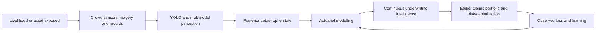

# Product-narrative redesign brief

## Why the first edition missed the intended form

The archived edition is technically useful but speaks mainly in the voice of a policy framework. Its dominant verbs are *govern*, *separate*, *validate*, *preserve*, *permit* and *review*. Its dominant subjects are institutions, interfaces, controls and categories. That voice is suitable for a regulator's concept paper or a programme design manual. It is not yet the voice of a founder-led Insurtech white paper.

The intended paper must instead build one commercial and actuarial argument. A reader should be able to answer five questions within the opening pages:

1. Whose livelihood is interrupted when catastrophe information arrives late?
2. What Insurtech product is being built?
3. What does crowd intelligence or YOLO observe that a conventional catastrophe model does not know in time?
4. How does new evidence change an actuarial frequency, severity or portfolio-loss estimate?
5. Which insurer action becomes earlier, more accurate or less costly as a result?

Governance remains necessary, but it becomes a constraint around the product rather than the product's narrative centre.

## Working product definition

**Spatial Catastrophe Risk Intelligence (SCRI)** is the working description, not a final brand name. It is a Kenya-first Insurtech product that continuously converts crowd reports, computer vision, earth observation, environmental sensors and insurer data into four connected outputs:

- a current probability distribution for hazard state, footprint and intensity;
- a time-versioned map of insured exposure at risk;
- an event and portfolio loss distribution produced through actuarial modelling; and
- a controlled underwriting, claims, accumulation or reinsurance decision product.

The product is not a national disaster-management platform with an insurance module attached. Its first economic customer is an insurer or reinsurer. Public and community information matters because it improves observation and may enable loss-reducing action. Government, humanitarian and resilience-finance applications are adjacent markets or partnerships, not co-equal protagonists in every chapter.

The core product chain is:

## Narrative contract

Every major chapter follows the same book-like movement:

1. **A recognisable Kenyan life or operating problem.** The subject is a household, farmer, pastoralist, health worker, shopkeeper, transporter, insurer or claims team—not an abstract stakeholder matrix.
2. **The physical catastrophe mechanism.** The paper locates the event in a real basin, rangeland, escarpment, forest, crop system or urban network.
3. **The information failure.** It shows what the insurer cannot see from annual maps, historical claims or a delayed field survey.
4. **The product mechanism.** Crowd intelligence, YOLO, sensors and earth observation create a new admissible signal.
5. **The actuarial transformation.** The signal updates occurrence, detection, intensity, footprint, vulnerability, severity, dependence or loss development.
6. **The underwriting consequence.** The insurer prepares claims, changes future appetite, manages accumulation, allocates capital, purchases reinsurance or designs a product.
7. **The commercial value.** The chapter identifies who pays, what cost or loss is reduced, and what evidence would prove value.
8. **The boundary.** Contract, conduct, privacy and institutional authority are stated where they constrain that mechanism.

Equations should arrive after the reader understands the human and commercial mechanism. Matrices are used to reconcile details, not to carry the main story.

## Six-part book architecture

The source remains modular Markdown, but the reader receives one integrated white paper.

| Part | Working title | Narrative job | Target body pages | Maximum numbered chapters |
|---|---|---|---:|---:|
| 1 | The Kenya Insurtech Product and the Livelihoods It Protects | Establish the human problem, product thesis and six peril journeys | 18–22 | 6 |
| 2 | The Distributed Sensor Network | Show how crowd intelligence, YOLO, satellites and sensors make catastrophe observable | 22–26 | 6 |
| 3 | The Catastrophe State Engine | Develop flood, drought, fire, locust, landslide and storm/heat state models | 25–30 | 6 |
| 4 | Actuarial Modelling | Move from regime to frequency, severity, dependence and portfolio loss | 25–30 | 6 |
| 5 | Continuous Catastrophe Underwriting | Design underwriting, claims, accumulation, reinsurance and product economics | 22–26 | 6 |
| 6 | Building the Product | Take one insurer from data partnership to pilot, validation and measured scale | 18–22 | 8 |

Front matter, references and a concise reader guide may add 10–15 pages. The target remains approximately 160–170 pages, comparable with the 169-page benchmark, but no part should feel like an encyclopaedia. Subordinate concepts remain visible in the prose and index without each becoming a numbered contents entry.

## The six livelihood journeys

The hazards are not presented as equal boxes in a matrix. Each becomes a different test of the same product.

### Flood: connected water, connected balance sheets

The flood journey follows the lower Nzoia plains and the Lake Victoria basin, then contrasts them with Tana River and Nairobi's urban drainage. A river gauge rise upstream, radar-derived water extent, a photograph of a road crossing and an insurer's geocoded portfolio describe the same water from different positions. The story moves from a farm and market journey to motor, property, crop, business-interruption and public-infrastructure loss.

### Drought: a catastrophe without a single start time

The drought journey follows a pastoral household in the ASAL counties. Rainfall, vegetation, water distance, livestock body condition, milk production, market price and school or nutrition stress deteriorate on different clocks. The product must estimate a persistent livelihood state without pretending that one satellite threshold is the loss.

### Wildfire and rangeland fire: detection changes the tail

The fire journey connects Mount Kenya's water-tower function, protected areas and rangeland livelihoods. It distinguishes beneficial or managed fire from destructive wildfire. Its central actuarial question is inherited from the workshop: can earlier validated detection change response time, burned area and the conditional severity distribution?

### Locust: a mobile biological catastrophe

The locust journey begins with reports crossing from Mandera through Wajir and Garissa toward cropping and grazing systems farther south. A swarm is not a fixed polygon. Its direction depends on wind, lifecycle and vegetation; loss depends on crop stage and pasture dependence; control changes the process being modelled. The product must value surveillance lead time and livelihood protection, not merely count detections.

### Landslide: a national platform meets a local slope

The landslide journey uses West Pokot, Murang'a and the Elgeyo-Marakwet escarpment to show why national-resolution hazard scores can miss metre-scale susceptibility, blocked access and isolated households. Crowd reports and road intelligence may be as important operationally as a regional susceptibility map.

### Severe storm and extreme heat: invisible interruption

The final journey follows outdoor and community health work in Mombasa and Tana River, crop and roof damage from wind or hail, and power or cooling stress. Heat tests a product whose largest loss may be reduced hours, health stress and service interruption rather than a visible destroyed asset.

## Editorial rules for the new edition

- Use **Actuarial modelling**, with British spelling, throughout.
- Use *catastrophe underwriting product* or *continuous catastrophe underwriting*, not a generic multi-hazard platform, when describing the proposition.
- Open every part with a human or insurer scene.
- Keep one named product and one causal spine throughout the book.
- Treat flood, drought, wildfire, locust, landslide and storm/heat as narrative case systems, not checklist rows.
- Separate real researched examples from clearly labelled composite or synthetic illustrations.
- Place governance at the decision boundary where it changes product design.
- Do not imply that a live risk update permits mid-event cancellation or repricing.
- Do not claim avoided loss without detection, intervention and counterfactual evidence.
- Use no more than six numbered chapters per technical part and no more than eight in implementation.
- Keep the detailed matrices in appendices or registers unless a table advances the story.

## Definition of the next complete edition

The redesign is complete when a reader can follow one continuous commercial story from a Kenyan livelihood through observation, perception, hazard state, actuarial modelling, underwriting action and financial outcome; every hazard is geographically and socially grounded; each technical model answers a product question; the contents fit on approximately five pages; and the total volume remains close to the benchmark without being padded.

## Rewrite status — 26 August 2026

- The governance-led edition has been preserved under `documentation/2026-08-26_policy-framework-draft/`.
- Part 1 has been rewritten as the product-narrative template and now contains six researched Kenyan livelihood journeys.
- The six part titles, author metadata, cover proposition and front matter have been re-centred on continuous catastrophe underwriting.
- The compiled contents has been curated to expose only each part's narrative spine; detailed body headings remain available without appearing in the book-level contents.
- Parts 2–6 retain much of the archived technical prose and are the next rewrite workstream. Their policy matrices will be retained selectively as appendices, while their main chapters will be rebuilt around the SCRI product and insurer workflow.
