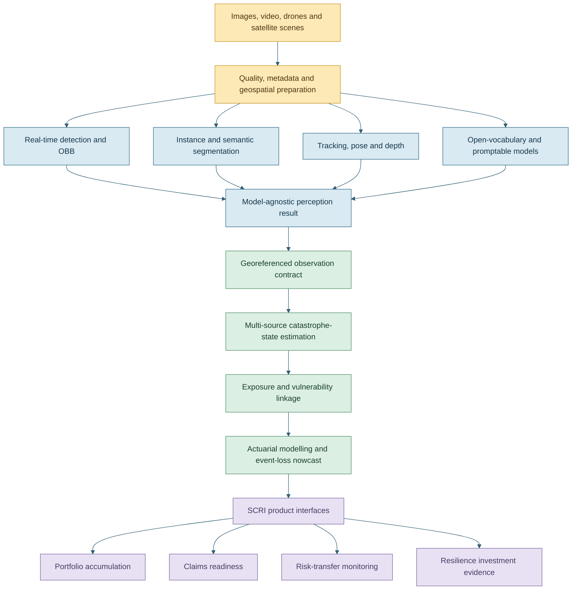

# Ultralytics and Vision Transformer Implementation Plan

**Project:** Spatial Catastrophe Risk Intelligence (SCRI)  
**Author:** Nevil Maloba  
**Prepared:** 29 August 2026  
**Purpose:** Expand the manuscript from a narrow account of YOLO detection into a complete, product-led computer-vision architecture while retaining Vision Transformers as validated model candidates.

## 1. Executive decision

SCRI will use **Ultralytics as a computer-vision workbench and model lifecycle layer**, rather than presenting YOLO object detection as the whole vision strategy. The workbench will support detection, instance segmentation, semantic segmentation, tracking, oriented bounding boxes, classification, depth estimation, pose estimation, open-vocabulary detection, promptable segmentation, training, validation, export and deployment benchmarking.

This decision does **not** remove Vision Transformers.

Ultralytics and Vision Transformers describe different architectural levels:

- **Ultralytics** is a framework and ecosystem through which several perception tasks and model families can be trained, evaluated, exported and deployed.
- **YOLO** is a family of real-time vision models available within that ecosystem.
- **Vision Transformers** are attention-based model architectures. They may run within the Ultralytics ecosystem, as in transformer or transformer-assisted models such as RT-DETR and the SAM family, or through a separate implementation behind SCRI's common observation interface.

SCRI will therefore use a **portfolio of perception models**. Compact real-time models will usually lead on constrained edge hardware. Transformer and hybrid models will compete where global context, promptability, open-vocabulary recognition, temporal association or high-resolution scene understanding may improve the result. The promoted model for each task will be selected through Kenyan event, geography and hardware validation.

The product principle is:

> Select the best validated perception component for each catastrophe observation job, then translate every model output into the same georeferenced, time-aware and uncertainty-bearing observation contract.

## 2. Why the manuscript needs this expansion

Part 2 currently contains approximately 1,570 words. Its machine-perception section explains object detection, instance segmentation, semantic segmentation, scene classification, confidence, model cards and hybrid edge/cloud inference. This is a sound foundation, but it does not yet give the reader a book-level account of the complete visual-intelligence product.

The present text needs five additions:

1. A complete capability taxonomy covering the supported perception tasks.
2. A model-family strategy explaining CNN, YOLO, detection-transformer, Vision Transformer, promptable foundation-model and vision-language roles.
3. Hazard-specific workflows showing how pixels become physical observations and then actuarial variables.
4. A deployment and MLOps account covering data, annotation, training, validation, export, hardware, latency, cost, drift and fallback.
5. Product-interface narratives showing what an insurer, claims officer, catastrophe analyst or emergency partner sees and does with the output.

The planned revision will expand Part 2 to approximately 8,000-8,500 substantive words. About 6,500-7,000 words will be new. Concise supporting additions will also be made to Parts 1, 3, 4, 5, 6 and the appendices so that the expanded perception architecture remains connected to the complete SCRI product.

## 3. Target product architecture



**Proposed figure:** One perception workbench, one observation contract and several Insurtech products.

The architecture will keep three boundaries visible:

- Perception models interpret pixels and video frames.
- Catastrophe-state models combine those interpretations with gauges, weather, terrain, earth observation, crowd reports and process models.
- Actuarial modelling converts the estimated hazard state into exposure, vulnerability and financial-loss distributions.

These boundaries allow model families to change without redesigning the entire product.

## 4. Model portfolio: where Vision Transformers remain

### 4.1 Real-time edge perception

Compact YOLO-family models will be the initial candidates for smoke, flame, vehicle, livestock, locust, obstruction and damage detection where seconds matter and compute is bounded. Their product value comes from low latency, mature export paths and the ability to run on phones, cameras, drones or modest edge accelerators.

The edge benchmark will compare model sizes and export formats on the actual target hardware. Accuracy, calibration, throughput, peak memory, power draw, start-up time and thermal stability will be measured together. A higher laboratory mAP will not compensate for a model that cannot meet the field latency or energy budget.

### 4.2 Transformer and hybrid detection

RT-DETR will remain a detection challenger. Its convolutional backbone and hybrid transformer encoder provide an important comparison where crowded scenes, scale variation or broader context may improve detection. It can be evaluated through the same Ultralytics training, validation and export interface as supported YOLO models.

The manuscript will explain that this is not a contest between two brand names. It is a comparison between candidate model architectures for a defined observation job.

### 4.3 Vision Transformers for scene understanding

Vision Transformer, Swin-style and SegFormer-style models will remain candidates for:

- semantic segmentation of floodwater, burn area, vegetation condition and affected cropland;
- classification of damage state, crop condition and image usability;
- high-resolution aerial or satellite scene interpretation;
- pre-event and post-event feature comparison;
- broad contextual reasoning where local convolutional features alone may be insufficient.

Their use will be strongest in regional or cloud processing, where tiles can be batched and compute is available. Efficient or distilled transformer variants may also compete at the edge.

### 4.4 Promptable segmentation and foundation models

SAM-family models will support analyst-guided delineation, rapid annotation and candidate-mask generation. This is especially valuable when a new Kenyan event produces features for which a complete training set does not yet exist. Examples include an unfamiliar landslide morphology, a new pattern of roof damage or a flood boundary in a previously unseen settlement form.

Promptable masks will enter a human verification workflow. Verified masks can enrich the Kenyan training corpus and support later fine-tuning of efficient production segmentation models.

### 4.5 Open-vocabulary and vision-language perception

YOLO-World, YOLOE or another validated open-vocabulary model can propose objects described in text before the production taxonomy has a fully trained class. Its roles include discovery, analyst search and rapid event adaptation.

Open-vocabulary output will retain the prompt, model version, candidate label, confidence and reviewer disposition. Recurrent useful concepts can be promoted into the governed label taxonomy and a supervised evaluation set.

### 4.6 Temporal and video intelligence

Multi-object tracking will associate detections through time. The manuscript will distinguish:

- a detected object in one frame;
- a track representing a hypothesised persistent object across frames;
- a physical movement estimate after camera motion and geometry have been addressed;
- a hazard-state update after fusion with other evidence.

Tracking can support vehicle movement through floodwater, movement of people or livestock, response-resource deployment, smoke-plume evolution and close-range pest observations. SAM 2-style video segmentation can be tested where persistent masks are more informative than boxes.

### 4.7 Capabilities that remain outside pure vision

Vision contributes valuable evidence without carrying the whole hazard model. River hydraulics, drought evolution, locust ecology, slope stability, extreme heat and insured loss require non-visual state variables and domain models. The perception workbench supplies structured evidence to those models.

## 5. Capability implementation matrix

| Capability | Required output | Principal catastrophe uses | Initial model candidates | Transformer role | Validation emphasis |
|---|---|---|---|---|---|
| Object detection | Class, box, confidence | People, vehicles, livestock, smoke, flame, locusts, blockages, damage indicators | Compact YOLO and larger YOLO variants; RT-DETR challenger | RT-DETR comparison for contextual detection | Class recall, false alarms, calibration, small objects, latency |
| Instance segmentation | Object-specific masks | Flooded buildings, roof damage, flame regions, crop patches | YOLO segmentation; SAM-assisted annotation | SAM candidate generation and review | Mask IoU/Dice, boundary accuracy, object separation |
| Semantic segmentation | Dense class map | Flood extent, burn area, land cover, vegetation stress | Ultralytics semantic models; SegFormer challenger | Strong candidate for global and multiscale context | Class IoU, boundary error, geographic transfer |
| Multi-object tracking | Track ID, trajectory, confidence | People, vehicles, livestock, debris, response resources | BoT-SORT/ByteTrack or validated tracker; SAM 2 for mask tracking | Appearance encoders or video transformers as challengers | Identity switches, track fragmentation, motion error |
| Oriented bounding boxes | Rotated geometry, class, confidence | Roofs, roads, fields, fallen infrastructure, aerial objects | Ultralytics OBB models | Transformer detector may be explored where supported | Rotated IoU, orientation error, aerial-scale performance |
| Classification | Scene or crop/damage state | Damage grades, crop health, smoke/no-smoke, usable/unusable imagery | YOLO classification; ViT/Swin challenger | Core challenger for contextual classification | Macro F1, subgroup calibration, geographic transfer |
| Monocular depth | Relative or metric depth map with uncertainty | Water-level cues, obstruction geometry, scene interpretation | Ultralytics depth model; task-specific depth model | Transformer depth candidates where context helps | Scale bias, reference-object error, field calibration |
| Pose estimation | Keypoints and confidence | Rescue triage and bounded human-safety workflows | Ultralytics pose model | Optional keypoint transformer challenger | Keypoint error, occlusion, consent and necessity |
| Open-vocabulary detection | Prompt, box/mask, label proposal | Emerging damage concepts and rapid event discovery | YOLO-World, YOLOE | Vision-language transformer components remain central | Prompt sensitivity, unknown-class precision, reviewer yield |
| Promptable segmentation | Prompt and candidate mask | Fast annotation and analyst-assisted delineation | SAM, SAM 2, MobileSAM or FastSAM | SAM-family transformer models remain available | Reviewer correction time, mask quality, domain shift |
| Change analysis | Pre/post feature or damage change | Flood, fire, landslide, storm and infrastructure impact | Siamese CNN baseline; transformer challenger | Valuable for long-range correspondence and scene change | Registration sensitivity, false change, event holdout |

## 6. Hazard-by-capability implementation

### 6.1 Flood

The principal workflow will combine water segmentation, building or vehicle detection, tracking in fixed-camera or drone video and depth-related visual cues. Terrain, gauge levels and hydraulic evidence will convert visible water into a physically meaningful flood state.

The worked narrative will follow a flood observation from a geotagged image or drone frame through segmentation, georeferencing, exposure intersection and a property/crop loss nowcast. It will show how a mask becomes an inundated-area estimate, how depth uncertainty is represented and how claims teams use the result.

### 6.2 Wildfire and rangeland fire

Detection will identify smoke or flame candidates; segmentation will estimate the visible fire or burn region; tracking will describe plume or perimeter evolution where the camera geometry supports it. Thermal imagery, wind, fuel and response evidence will update the fire-state model.

A Vision Transformer or transformer-assisted segmentation challenger will be assessed for contextual smoke discrimination, while a compact edge model will be assessed for rapid camera alerts.

### 6.3 Locust and catastrophic crop pests

Close-range imagery will use detection, counting and tracking. Aerial imagery may use OBB or segmentation where swarm or affected-crop geometry is visible. Open-vocabulary search can help analysts explore unfamiliar pest or crop-damage appearances before a governed class is established.

Regional swarm state will continue to depend on field surveillance, lifecycle, rainfall, vegetation and wind. Vision provides observations rather than a complete movement model.

### 6.4 Rainfall-induced landslide

Semantic or instance segmentation will delineate visible scars, debris and blocked roads. Pre/post change analysis will estimate affected geometry. OBB can contribute to aerial infrastructure assessment. Rainfall, terrain, soil moisture and susceptibility models will estimate precursor state.

### 6.5 Severe storm

Detection, segmentation and OBB will estimate roof, pole, road, tree and other visible damage. Pre/post imagery will support change analysis. Tracking can assist analysis of moving debris in fixed-camera footage where operationally useful.

### 6.6 Drought and extreme heat

Classification and segmentation can describe visible crop condition, livestock body condition, water-point status, shade access or infrastructure condition. Vision Transformer models may be useful for broad scene context and earth-observation tiles. The primary drought and heat state will still come from rainfall, soil moisture, vegetation, temperature, humidity, water availability and livelihood time series.

## 7. Common perception-result contract

Part 2 will add a model-agnostic interface so a YOLO detector, RT-DETR, SAM, SegFormer or later challenger can be substituted without changing downstream actuarial systems.

```text
perception_result_id
source_observation_id
hazard_type
task_type
model_family
model_name
model_version
weights_version
event_time
inference_time
geometry_type
geometry
coordinate_space
class_or_concept
prompt_if_used
confidence_raw
confidence_calibrated
calibration_dataset_version
track_id_if_applicable
depth_unit_and_scale_if_applicable
input_quality_flags
deployment_target
latency_ms
human_review_status
derived_observation_ids
provenance
correction_or_predecessor
```

The explanatory prose will show how each task populates the interface. A bounding box, mask, keypoint set, depth map and track are different geometry products; the contract preserves those differences while standardising identity, time, model version, confidence and provenance.

## 8. Kenyan data and annotation programme

The revised paper will describe a practical data programme rather than imply that generic pretrained weights are sufficient.

### 8.1 Dataset inventory

For each peril and sensor class, record:

- geography and livelihood zone;
- season and event;
- daylight, darkness, cloud, smoke, rain and glare conditions;
- camera, drone or satellite characteristics;
- image resolution and ground sample distance where available;
- label taxonomy and annotation method;
- licence, consent, permitted use and retention;
- class frequency and rare-event representation;
- linkage to authoritative or field verification;
- known gaps and excluded uses.

### 8.2 Annotation workflow

1. Define the physical observation to be labelled.
2. Produce an annotation guide with positive, ambiguous and negative examples.
3. Use promptable segmentation or model-assisted proposals to accelerate labelling.
4. Require human correction and approval for the verified training set.
5. Measure inter-annotator agreement and adjudicate difficult classes.
6. Preserve raw, proposed and final annotations with lineage.
7. Create event and geography holdouts before model development.

### 8.3 Active learning

The production candidate can identify uncertain, novel or high-value examples for review. Selection will include data-poor counties and difficult operating conditions so that active learning does not concentrate only where imagery and connectivity are already abundant.

## 9. Training, evaluation and model selection

### 9.1 Baseline-first comparisons

Each task will begin with a transparent baseline. Advanced models will enter as challengers:

- detection: compact YOLO baseline versus larger YOLO and RT-DETR;
- semantic segmentation: efficient convolutional baseline versus Ultralytics semantic and SegFormer-style transformer models;
- classification: convolutional baseline versus ViT/Swin challenger;
- promptable segmentation: human-only annotation time versus SAM-assisted workflow;
- tracking: simple geometry association versus supported multi-object trackers;
- change detection: image differencing or Siamese baseline versus transformer challenger.

### 9.2 Validation splits

Random image splits will not be the principal evidence. The plan will use:

- event holdout;
- county or basin holdout;
- sensor holdout;
- season and weather-condition holdout;
- temporal replay;
- difficult-condition slices;
- vulnerable-group and sparse-connectivity coverage checks where people are represented.

### 9.3 Metrics

Model selection will combine:

- precision, recall, F1 and precision-recall curves;
- mAP and class-specific recall for detection;
- IoU, Dice and boundary error for segmentation;
- expected calibration error and reliability diagrams;
- identity switches and trajectory error for tracking;
- rotated IoU and angle error for OBB;
- depth absolute-relative error and field-reference error;
- inference latency, throughput, memory and power;
- analyst correction time and acceptance rate;
- downstream hazard-state and loss-nowcast improvement.

The final criterion is product value. A perception model is promoted when it improves the observation required by a user workflow at an acceptable operational cost.

## 10. Edge, cloud and deployment implementation

### 10.1 Deployment tiers

| Tier | Typical use | Model tendency | Required test |
|---|---|---|---|
| Phone or field device | Guided capture, image-quality screening, bounded inference | Small YOLO, MobileSAM or compact classifier | Offline operation, battery, thermal stability, privacy |
| Camera or drone edge | Smoke, flame, vehicle or livestock screening | Small/medium detector, OBB or tracker | Frames per second, false alerts, dropped frames, reconnect |
| County or insurer server | Event imagery, claims support, batch inference | Larger YOLO, RT-DETR, segmentation models | Throughput, concurrency, resilience, cost |
| Central cloud/geospatial environment | Satellite mosaics, transformer inference, retraining | ViT, SegFormer, SAM and ensemble challengers | Tile seams, GPU memory, queue latency, reproducibility |

### 10.2 Export and benchmarking

Ultralytics export and benchmark modes will be described as implementation tools, not as proof of field performance. ONNX, TensorRT, OpenVINO and other relevant formats will be tested on the actual deployment devices. Quantisation will be accepted after task-specific accuracy and calibration checks.

### 10.3 Model lifecycle

Every deployed model will have:

- a model card;
- dataset and weights lineage;
- approved task and deployment target;
- performance thresholds;
- monitoring metrics;
- rollback package;
- expiry or review date;
- owner and challenger;
- dependency and software-bill-of-materials records.

## 11. Product-interface narratives

The manuscript will add three end-to-end product stories.

### 11.1 Event workspace

An event analyst sees a map with validated observations, water or burn masks, objects and tracks, model confidence, evidence age and source coverage. Selecting an observation reveals the source image, model version, geometry, corroboration and reviewer status. The analyst can accept, correct, reject or request another observation.

### 11.2 Claims readiness

A claims manager sees affected policy counts, likely damage classes, access constraints and an evidence-ranked inspection queue. Vision outputs support prioritisation and evidence collection. Policy terms, coverage and settlement remain in the claims workflow, with the visual evidence linked rather than collapsed into a generic score.

### 11.3 Actuarial event-loss nowcast

An actuary sees how the latest verified footprint changes exposed values, mean damage ratios and loss quantiles. The interface separates the visual observation, fused hazard state, exposure snapshot, vulnerability assumption and financial terms. This makes every movement in the loss distribution traceable.

## 12. Manuscript change plan

### Part 1: product thesis

Add approximately 400-600 words and one revised architecture figure. Introduce the perception workbench as a product capability and explain why several model families can serve one governed observation architecture.

### Part 2: major expansion

Replace the current short machine-perception section with approximately 6,500-7,000 words organised as:

1. A Kenyan catastrophe scene introducing the visual problem.
2. Perception task taxonomy.
3. Ultralytics workbench and supported model families.
4. Vision Transformer and hybrid-model strategy.
5. Hazard-by-capability applications.
6. Common perception-result contract.
7. Kenyan dataset and annotation programme.
8. Training, validation and champion-challenger evaluation.
9. Edge/cloud deployment and hardware benchmarking.
10. Product-interface narratives.
11. Privacy, proportionality and human review for people-centred imagery.
12. Limitations, research questions and transition to hazard-state modelling.

### Part 3: hazard-state modelling

Add approximately 500-700 words explaining source-specific emission models for boxes, masks, tracks, depth cues and open-vocabulary proposals. Define how correlated video frames and multiple detections from one source are prevented from becoming false independent corroboration.

### Part 4: actuarial modelling

Add approximately 500-700 words and a worked bridge from segmented footprint to exposure intersection, vulnerability selection and event-loss distribution. Include examples of how segmentation or damage classification error propagates into loss uncertainty.

### Part 5: Insurtech products

Add approximately 400-600 words describing event workspace, claims readiness and portfolio accumulation screens. Translate perception metrics into operational and financial value.

### Part 6: governance and implementation

Add approximately 600-800 words covering model inventory, dataset rights, commercial software licensing, procurement, security, dependency management, model monitoring, fallback and vendor exit.

Ultralytics states that proprietary or closed-source commercial deployment requires an appropriate commercial licence unless the complete project follows the AGPL-3.0 route. The implementation will therefore include an early legal and procurement decision on open-source versus enterprise licensing, documented against the intended product architecture [9].

### Appendices and controls

Add:

- perception-result schema;
- model-card template;
- capability-to-hazard matrix;
- benchmark scorecard;
- dataset register fields;
- licensing and dependency register;
- promptable/open-vocabulary review log;
- figure and source updates.

## 13. Planned figures and tables

All new diagrams will use the established coloured Mermaid theme and remain readable at 100 percent PDF view.

1. Ultralytics workbench within the SCRI product architecture.
2. Model portfolio: edge CNN/YOLO, hybrid transformer and cloud Vision Transformer paths.
3. Task outputs: boxes, masks, keypoints, tracks, OBB and depth maps.
4. Promptable-segmentation annotation loop.
5. Video tracking versus physical movement versus hazard-state update.
6. Image-to-actuarial-loss lineage.
7. Hardware export and benchmarking matrix.
8. Champion-challenger promotion workflow.
9. Hazard-by-capability table.
10. Product-interface evidence hierarchy.

Figures with more than ten meaningful nodes will be split or given a dedicated half-page/full-page layout.

## 14. Phased execution and gates

### Phase 0: source and architecture control

**Work**

- Add all official Ultralytics and primary model papers to the source register.
- Record the source URL, version/access date and exact claim supported.
- Decide whether manuscript terminology will refer to current named versions or version-neutral capabilities.
- Add the software-licensing diligence item.

**Gate**

Every capability claim has an official URL, and the model hierarchy distinguishes framework, task, architecture and product output.

### Phase 1: narrative and taxonomy draft

**Work**

- Open with a Kenyan event workflow rather than a catalogue of model names.
- Write the perception task taxonomy.
- Add the explicit Vision Transformer decision.
- Build the capability and hazard matrices.

**Gate**

A reader can explain why detection, segmentation, tracking and state estimation are different, and why Ultralytics and Vision Transformers are complementary.

### Phase 2: data and model-development design

**Work**

- Specify dataset inventory, taxonomy, annotation and quality assurance.
- Define the model-agnostic result schema.
- Define baselines, challengers, splits and metrics.
- Specify promptable and open-vocabulary review workflows.

**Gate**

One labelled image can be traced through training, inference, human review and a versioned observation record.

### Phase 3: hazard and product integration

**Work**

- Write six hazard workflows.
- Add flood and wildfire worked examples.
- Connect perception outputs to state estimation and actuarial modelling.
- Write event-workspace, claims and actuarial product narratives.

**Gate**

Every visual output has a defined downstream physical variable, user, decision and uncertainty treatment.

### Phase 4: deployment and commercial readiness

**Work**

- Define edge, server and cloud benchmarks.
- Document export formats, quantisation tests and rollback.
- Complete software licensing and procurement diligence.
- Add monitoring, drift and operational-cost measures.

**Gate**

The candidate architecture can be costed and tested on named hardware without committing the product to one model family.

### Phase 5: manuscript integration and PDF QA

**Work**

- Reconcile terminology and references across Parts 1-6.
- Render all new Mermaid diagrams with coloured backgrounds.
- Check table and figure legibility at normal reading size.
- Verify URLs, numbering, cross-references and word counts.
- Conduct technical, actuarial, product and editorial review.

**Gate**

The expanded section reads as part of the SCRI Insurtech story, all figures are legible without zoom, and no unsupported model claim remains.

## 15. Acceptance tests

The implementation is complete when:

- Part 2 reaches approximately 8,000-8,500 substantive words without repetitive catalogue prose.
- The manuscript explicitly states that Ultralytics is a workbench, YOLO is a model family and Vision Transformers remain candidates.
- Detection, instance segmentation, semantic segmentation, tracking, OBB, classification, depth, pose, open-vocabulary and promptable segmentation are each defined by input, output, catastrophe use and validation method.
- RT-DETR, SAM and Vision Transformer roles are explained accurately.
- All six hazards have a capability mapping and at least one concrete product consequence.
- A model-agnostic perception-result contract is included.
- Kenyan dataset, annotation and holdout requirements are explicit.
- Edge and cloud candidates are compared on accuracy, calibration, latency, memory, energy and cost.
- The image-to-state-to-loss-to-product chain is traceable.
- People-centred imagery has a defined proportionality, privacy and review workflow.
- Commercial licensing and dependency diligence are recorded.
- Every material technical claim has a source URL.
- All new diagrams have coloured backgrounds and remain legible at 100 percent view.

## 16. Initial source set

[1] Ultralytics, “Computer Vision Tasks Supported by Ultralytics,” 2026. [Online]. Available: https://docs.ultralytics.com/tasks/. Accessed: Aug. 29, 2026.

[2] Ultralytics, “Models Supported by Ultralytics,” 2026. [Online]. Available: https://docs.ultralytics.com/models/. Accessed: Aug. 29, 2026.

[3] Ultralytics, “Semantic Segmentation,” 2026. [Online]. Available: https://docs.ultralytics.com/tasks/semantic/. Accessed: Aug. 29, 2026.

[4] Ultralytics, “Oriented Bounding Boxes Object Detection,” 2026. [Online]. Available: https://docs.ultralytics.com/tasks/obb/. Accessed: Aug. 29, 2026.

[5] Ultralytics, “YOLO Multi-Object Tracking in Video,” 2026. [Online]. Available: https://docs.ultralytics.com/modes/track/. Accessed: Aug. 29, 2026.

[6] Ultralytics, “Model Export with Ultralytics YOLO,” 2026. [Online]. Available: https://docs.ultralytics.com/modes/export/. Accessed: Aug. 29, 2026.

[7] Ultralytics, “Model Benchmarking with Ultralytics YOLO,” 2026. [Online]. Available: https://docs.ultralytics.com/modes/benchmark/. Accessed: Aug. 29, 2026.

[8] Ultralytics, “Segment Anything Model,” 2026. [Online]. Available: https://docs.ultralytics.com/models/sam/. Accessed: Aug. 29, 2026.

[9] Ultralytics, “Ultralytics License,” 2026. [Online]. Available: https://www.ultralytics.com/license. Accessed: Aug. 29, 2026.

[10] A. Dosovitskiy *et al.*, “An Image Is Worth 16x16 Words: Transformers for Image Recognition at Scale,” *International Conference on Learning Representations*, 2021. [Online]. Available: https://arxiv.org/abs/2010.11929.

[11] W. Lv *et al.*, “DETRs Beat YOLOs on Real-time Object Detection,” 2023. [Online]. Available: https://arxiv.org/abs/2304.08069.

[12] A. Kirillov *et al.*, “Segment Anything,” 2023. [Online]. Available: https://arxiv.org/abs/2304.02643.

[13] E. Xie *et al.*, “SegFormer: Simple and Efficient Design for Semantic Segmentation with Transformers,” 2021. [Online]. Available: https://arxiv.org/abs/2105.15203.

## 17. Final architectural position

SCRI will keep Vision Transformers because they offer a valuable alternative for contextual recognition, semantic segmentation, promptable masks, open-vocabulary discovery and high-resolution scene analysis. It will keep YOLO-family models because real-time speed, exportability and edge efficiency are central to catastrophe operations. It will use RT-DETR, SAM and other transformer or hybrid models where their validation results justify them.

The durable product asset is therefore not one model name. It is the governed path from Kenyan visual evidence to a calibrated observation, an evolving catastrophe state, an actuarial loss estimate and a useful Insurtech action.
