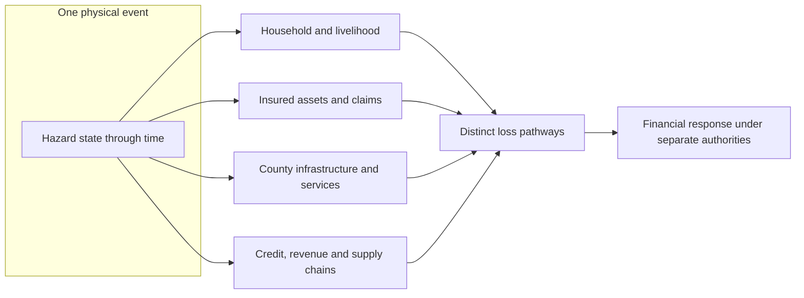
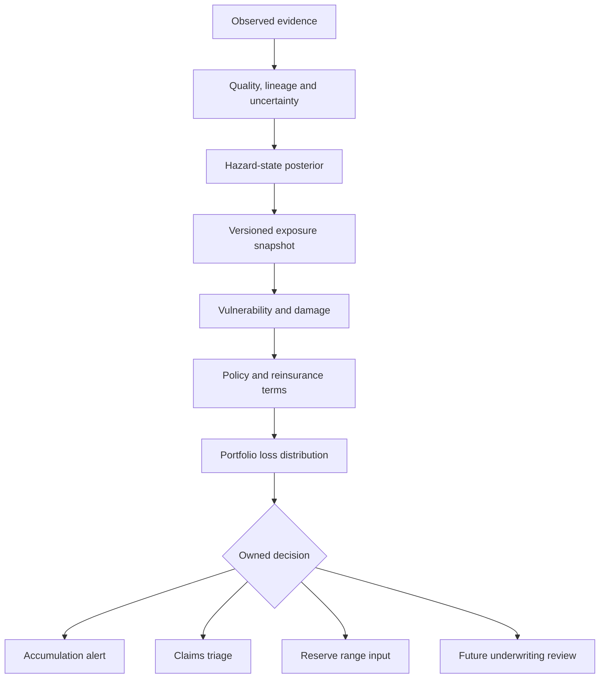
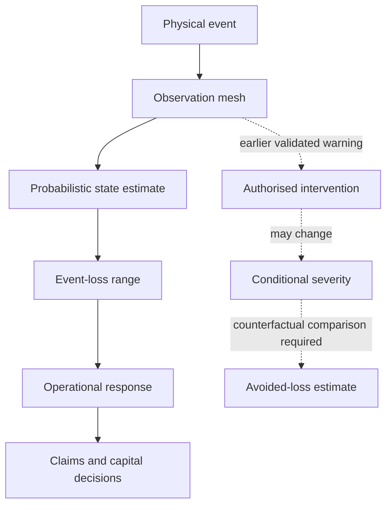

# Part 1: The Kenya Multi-Hazard Intelligence Thesis

At sunrise on the lower Nzoia plains, a farming household may have maize in the field, animals on higher ground, produce expected at a market and schoolchildren who cross the same road used by traders and milk collectors. Upstream precipitation is not yet a household loss, and a rising river is not yet an insurance claim. The catastrophe takes financial form when water leaves the channel, enters a cultivated field, closes the primary road, contaminates stored food and forces the family to spend scarce cash on transport, shelter or replacement supplies. An insurer encounters the same water later and through disconnected files: a motor claim arrives with one photograph, a property policyholder reports damaged contents, and a crop portfolio reveals a concentration of affected farms.

The river does not experience those consequences as separate events. The household, county engineer, lender and insurer do. That separation is the commercial problem addressed by **Spatial Catastrophe Risk Intelligence (SCRI)**: an insurer-facing product that turns observations of one evolving physical event into an uncertainty-bearing view of exposed policies, likely damage, claims workload and portfolio loss.

## Six catastrophes, six livelihood pathways

Kenya’s flood risk unfolds through six Water Resources Authority basin areas, each shaped by its topography, settlement, infrastructure and economic activity [1]. In the Lake Victoria North basin, the Nzoia links highland rainfall to low-lying agricultural exposure. In the Tana basin, a river originating around Mount Kenya and the Aberdares passes through steep upper catchments, major infrastructure and flatter middle and lower reaches before the delta [2]. The Athi system carries metropolitan, industrial and downstream exposure; Ewaso Ng’iro North connects water scarcity, pastoral mobility and episodic flooding. SCRI preserves those directed relationships through probability distributions over depth, extent, velocity and duration on river-and-drainage networks.

Drought emerges gradually for a pastoral household in Wajir, Mandera or another arid and semi-arid county. Rainfall may arrive late, fall unevenly or stop before pasture and water sources recover. Loss accumulates through longer walks to water, declining livestock body condition, lower milk production, altered migration, unfavourable terms of trade, reduced food consumption and the sale of productive animals. Kenya’s National Drought Early Warning System recognises this progression through biophysical, production, access and utilisation indicators [3]. SCRI translates that governed drought state into the exposures and contractual terms of an insurer’s livestock, crop, health, credit-linked or business portfolio.

Wildfire around Mount Kenya presents a different chain. The forest supports water, grazing, firewood, cultivation and tourism-linked livelihoods; research with surrounding communities also shows that fire knowledge, deliberate land use and preparedness are inseparable from the physical hazard [4]. A camera model can detect smoke or flame earlier. That detection creates economic value when a responsible responder receives the alert, reaches the fire and changes its spread. The product therefore models **ignition -> detection -> dispatch -> intervention -> conditional severity**, connecting signal quality to response and avoided-loss evidence.

The 2019-2020 desert locust invasion makes the mobile biological peril equally concrete. Swarms crossed borders and counties while crops and pasture remained fixed. The loss depended on swarm density, lifecycle, wind, vegetation, crop stage and the timing and reach of control operations. The response combined movement surveillance with food-security protection, control, livelihood support and restoration of productive assets [5]. SCRI helps an agricultural insurer identify insured crops and grazing areas within forecast swarm corridors, then combines surveillance with field evidence and crop-stage vulnerability to estimate loss.

Rainfall-induced landslide is intensely local. A household on an escarpment may lose a dwelling; a road blockage may isolate farms, schools and health facilities well beyond the slide footprint. Kenyan evidence describes recurrent shallow failures in Murang’a and destructive debris flows in West Pokot under combinations of intense rainfall, slope, land cover and drainage conditions [6]. A national susceptibility map supports regional screening, while reports of cracks, blocked culverts or slope movement raise the priority of local inspection and conditional failure analysis.

Extreme heat and severe storm often reveal themselves through distributed effects rather than one continuous visible scar. Heat loss can appear as reduced working hours, health expenditure, lower productivity, refrigeration demand and service disruption. Kenyan research with community health workers shows how exposure, long outdoor journeys, low income and limited access to cooling combine to affect work and livelihoods [7]. A severe storm creates another pattern: roof and crop damage from wind or hail, road interruption from intense rain, power failure, injury and business interruption. The two hazards may share meteorological observations while retaining distinct vulnerability functions and insurance terms.

Kenya’s recent climate reports describe the coexistence of heatwaves, floods, intense rainfall and strong winds, together with disruption to agriculture, infrastructure, health and displacement [8]. SCRI therefore combines one shared financial interface with six physical adapters. The product communicates uncertainty and loss consistently while preserving the science of river routing, drought persistence, fire spread, swarm movement, slope failure and heat stress.

## Three Kenyan events seen through the product

The architecture becomes credible when it reconstructs what was knowable during a real event as well as the finished disaster. A reconstruction is therefore written on two timelines. **Event time** records when rain fell, a river rose or a swarm moved. **Knowledge time** records when a usable observation reached the insurer. Later official totals enrich the historical record, while each model replay remains frozen to the information genuinely available at its cut-off.

**The March-to-May 2024 floods: a national emergency made of local pathways.** Kenya’s 2024 State of the Climate report records severe flooding during the long-rains season. By 19 May, 41 counties and 412,763 people had been affected; 55,676 households, representing 278,380 people, had been displaced; and the official situation record reported 295 deaths, 188 injuries and 78 people missing. Sixty-four health facilities in 12 counties were affected [9]. Those totals establish the human scale. SCRI adds the event footprint, exposure intersection and insured-loss view required by an insurer.

For a lower-Nzoia portfolio, a point-in-time reconstruction would begin before the first claim. The prior state would contain seasonal forecasts, recent basin rainfall, river-level history, drainage and terrain, and the policy snapshot in force before the event. As upstream rainfall and gauge evidence arrived, the state model would update inundation probability along the directed river network. Radar water detections and independently corroborated reports would then sharpen the footprint. Only after intersection with buildings, crops, roads and policy terms would the insurer see a range of possible claims. A road closure could delay market access and claims inspection without being covered physical damage; an inundated field could be a livelihood loss even where no crop policy existed. The product must show both facts without adding the uninsured loss to the insurer’s booked amount.

The operational story is also temporal. Before overtopping, the accumulation desk sees insured value by possible depth band and the claims team prepares accessible reporting routes. During inundation, uncertainty may narrow in some cells and widen in others when gauges fail or roads become inaccessible. During recession, water extent can shrink while mould, contamination, crop loss and business interruption continue. The version history explains every revised loss estimate through a new footprint, improved depth, corrected exposure, reported claims or policy interpretation.

**The 2019-2020 locust invasion: movement, surveillance and control.** The World Bank described the invasion as Kenya’s worst in 70 years. Swarms spread to 28 counties; about 175,000 hectares of crop and pasture were affected; nearly 164,000 households were within the response population; and roughly three million vulnerable people were placed at food-security risk [5]. The financial pathway extended from damaged crops to pasture, livestock feeding and mobility, public surveillance and control costs, household income, food access and restoration of productive assets.

An SCRI reconstruction clusters reports, aircraft observations and imagery into possible biological entities, with wind, vegetation and lifecycle information shaping movement scenarios. Each scenario is intersected with crop stage, grazing dependence and insured units. Control activity is recorded as an intervention with time, location and coverage. Weather, swarm behaviour, reporting coverage and control selection enter the counterfactual analysis of whether intervention changed the subsequent loss distribution. The insurer receives a corridor of possible exposure and claims, while the responsible agencies maintain the public-response record.

**Isiolo in January 2026: drought as a sequence rather than a date.** The county drought bulletin placed Isiolo in Alert and deteriorating conditions. It reported rainfall of 3.8 mm against a normal reference of 12.2 mm, a three-month Vegetation Condition Index of 22.8 against 34.8, milk production of 1.40 litres against a reference above 1.70, a food-consumption score of 34.5 against a reference above 40.3, and an at-risk mid-upper-arm-circumference share of 10.5 per cent against a reference below 9.2 per cent [10]. The indicators move at different speeds and use different units. Together they reveal a livelihood pathway from insufficient rainfall to weaker vegetation and water access, reduced livestock production and declining household consumption.

{ width=92% }

**Figure 1.1: Published Isiolo indicators as a drought-signal profile.** Values are normalised to their bulletin reference for visual comparison. The chart feeds drought-state assessment; exposure, vulnerability and contract terms produce the insured-loss view.

For an insurer, this profile updates a latent drought state and directs attention to exposed livestock or livelihood products. Field evidence establishes mortality and crop damage; policy terms establish coverage; and any parametric contract calculates payout from its pre-agreed index. Household experience described by milk, nutrition and water access then supports basis-risk evaluation.

{ width=92% }

**Figure 1.2: Evidence geography used in this sample edition.** The points are approximate orientation locations for reported or studied evidence. They are neither hazard boundaries nor a comparative risk map.

These reconstructions expose the same product discipline in three different physical systems. Flood intelligence routes water through a basin; locust intelligence tracks a mobile biological population; drought intelligence accumulates persistent and sometimes contradictory indicators. Each can use crowd and AI observations. The shared product path connects physical state to exposed livelihood, damage mechanism, contract and owned decision.

**Figure 1.3: One catastrophe, several loss pathways**

## The product and the information gap

SCRI performs four connected jobs. It observes the event through authoritative sensors, earth observation, cameras, field reports and institutional records. It estimates the unobserved state while retaining uncertainty and provenance. It intersects that state with a versioned exposure portfolio and vulnerability functions. It then produces institution-specific intelligence for accumulation monitoring, claims triage, event-loss nowcasting, reinsurance communication and future underwriting review.

SCRI preserves the meaning of every transformation. A gauge reading informs flood probability; the hazard state drives a damage distribution; exposure and policy terms produce insured-loss samples; authorised teams interpret those samples for claims, reserving, capital and underwriting. Each stage carries its own data, model, owner and audit trail, allowing users to move from a portfolio number back to the evidence that shaped it.

**Figure 1.4: The SCRI product chain**

The immediate product is a continuously refreshed catastrophe view. During an event, the insurer can identify policies that may be affected, estimate a range of gross and insured loss, prepare claims capacity, notify reinsurers and test liquidity. Validated experience then enters the insurer’s established prospective process for pricing and risk appetite. The Insurance Regulatory Authority’s insurance-risk guideline already treats product design, pricing, underwriting, claims management, reserving and reinsurance as connected but distinct responsibilities [11]. SCRI carries one evidence trail into those different workflows while preserving the decision rights of each team.

**Figure 1.5: From better estimation to effective loss-reducing action**

## Actuarial modelling as the commercial bridge

The product’s centre is **Actuarial modelling**. Machine perception structures observations; hazard science estimates the physical event; actuarial modelling determines what that event means for an insurance portfolio. The calculation begins at asset level:

$$
L^{GU}_{e,i}=V_i\,D_{h,c(i)}\!\left(I_{e,h}(g_i),M_i\right).
\tag{1.1}
$$

where $V_i$ is the replacement value or other relevant exposure measure, $I_{e,h}(g_i)$ is the uncertain hazard intensity at the asset location, $M_i$ contains vulnerability modifiers, and $D_{h,c(i)}$ is a damage-ratio distribution for hazard $h$ and exposure class $c(i)$. Policy deductibles, limits, exclusions and coverage conditions are then applied to obtain insured loss. Aggregating those distributions across correlated assets produces an event-loss range rather than a single exact number. Appendix C derives the conditional moments, bounds and portfolio aggregation implied by Equation (1.1).

Real-time observations principally update the current event. They may change the estimated footprint, intensity or confidence, and therefore the event-loss distribution. Long-term annual catalogues, vulnerability calibration and tariff indications change through controlled model-development cycles using sufficient experience, exposure normalisation and independent validation.

The second claim - the value of action - asks when earlier intelligence changes the event outcome. Let $a$ denote an intervention and $\tau$ the elapsed time between detection and effective response. Lower latency creates economic value when a responsible team can act and the action changes conditional severity. For some hazards:

$$
\Delta EL(a)=
\mathbb E[L\mid \text{available response},a_0]
-
\mathbb E[L\mid \text{available response},a].
\tag{1.2}
$$

may be positive. Estimating $\Delta EL(a)$ requires a credible counterfactual, an intervention record and uncertainty about response effectiveness. It may be material for suppressible fires, movable livestock, pest control or asset protection. It may be small when flood defences are already overwhelmed, communications fail or no responder has authority and resources to act. Appendix C expresses Equation (1.2) in potential-outcomes notation, derives its identification conditions and distinguishes the value of information from the value of intervention.

Community access follows the same evidence trail. A household, cooperative, community enterprise or county-supported group can bring a locally defined resilience need into SCRI through assisted, digital or field channels. The product connects that need to its hazard exposure, affected livelihoods, proposed intervention, expected protection and potential delivery vehicle, allowing public, concessional, insurance and commercial capital to meet the project at an appropriate scale.

This calibrated distinction strengthens the commercial proposition. SCRI offers a traceable way to reduce uncertainty earlier, direct scarce operational attention and learn which interventions change claims and losses. Observation gaps, trigger error and response constraints become measurable product questions rather than hidden assumptions. That is the thesis the remaining parts now make implementable.

\newpage

## References

[1] Water Resources Authority, “Basin Areas,” 2026. [Online]. Available: https://wra.go.ke/basin-areas-2/. Accessed: Aug. 28, 2026.

[2] Water Resources Authority, “Tana Basin Area,” 2026. [Online]. Available: https://wra.go.ke/tana-basin-area/. Accessed: Aug. 28, 2026.

[3] National Drought Management Authority, “National Drought Early Warning Bulletin, March 2026,” Apr. 2026. [Online]. Available: https://knowledgeweb.ndma.go.ke/Content/LibraryDocuments/National_Drought_Early_Warning_Bullletin_March_202620260411222758.pdf. Accessed: Aug. 28, 2026.

[4] M. N. Ndalila, F. Lala and S. M. Makindi, “Community perceptions on wildfires in Mount Kenya forest: implications for fire preparedness and community wildfire management,” *Fire Ecology*, vol. 20, art. no. 92, 2024, doi: 10.1186/s42408-024-00326-3. [Online]. Available: https://doi.org/10.1186/s42408-024-00326-3. Accessed: Aug. 29, 2026.

[5] World Bank, “FAQs—Kenya Locust Response Project,” Oct. 1, 2020. [Online]. Available: https://www.worldbank.org/en/country/kenya/brief/faqs-kenya-locust-response-project. Accessed: Aug. 28, 2026.

[6] E. T. N. Kinyeru, M. N. Harris and J. Jansz, “Why do landslides occur in Kenya, and what can be done to mitigate their occurrences?” *Natural Hazards*, vol. 122, art. no. 155, 2026, doi: 10.1007/s11069-025-07938-1. [Online]. Available: https://doi.org/10.1007/s11069-025-07938-1. Accessed: Aug. 29, 2026.

[7] T. W. Maina *et al.*, “Heat is a danger to my health even though I said I am used to it: qualitative insights of workplace heat among community health workers and health promoters in Kenya,” *PLOS Climate*, vol. 4, no. 12, e0000748, 2025, doi: 10.1371/journal.pclm.0000748. [Online]. Available: https://doi.org/10.1371/journal.pclm.0000748. Accessed: Aug. 29, 2026.

[8] Kenya Meteorological Department, “State of the Climate in Kenya 2025,” Mar. 23, 2026. [Online]. Available: https://meteo.go.ke/documents/3009/State_of_the_Climate_Report_2025.pdf. Accessed: Aug. 28, 2026.

[9] Kenya Meteorological Department, “State of the Climate Report, Kenya 2024,” 2025. [Online]. Available: https://meteo.go.ke/documents/1353/State_of_the_Climate_Kenya_2024_v1.pdf. Accessed: Aug. 28, 2026.

[10] National Drought Management Authority, “Isiolo County Drought Early Warning Bulletin, January 2026,” 2026. [Online]. Available: https://knowledgeweb.ndma.go.ke/Library/doclink.aspx?document=0340e354-b9d3-4168-b723-a10ac5dff90b. Accessed: Aug. 28, 2026.

[11] Insurance Regulatory Authority, “Guideline to the Insurance Industry on Insurance Risk,” IRA/PG/17. [Online]. Available: https://ira.go.ke/assets/file/Guideline_on_Insurance_Risk.pdf. Accessed: Aug. 28, 2026.
