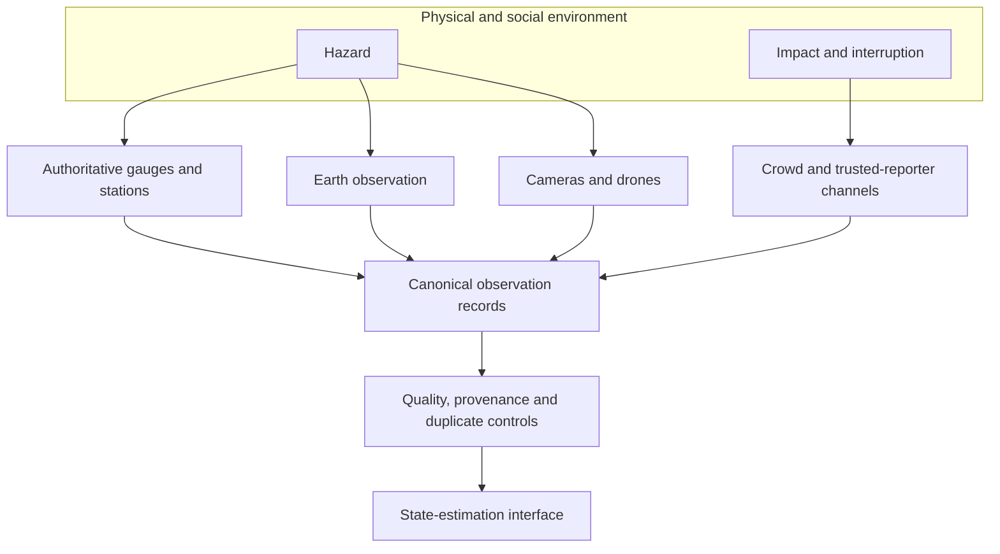
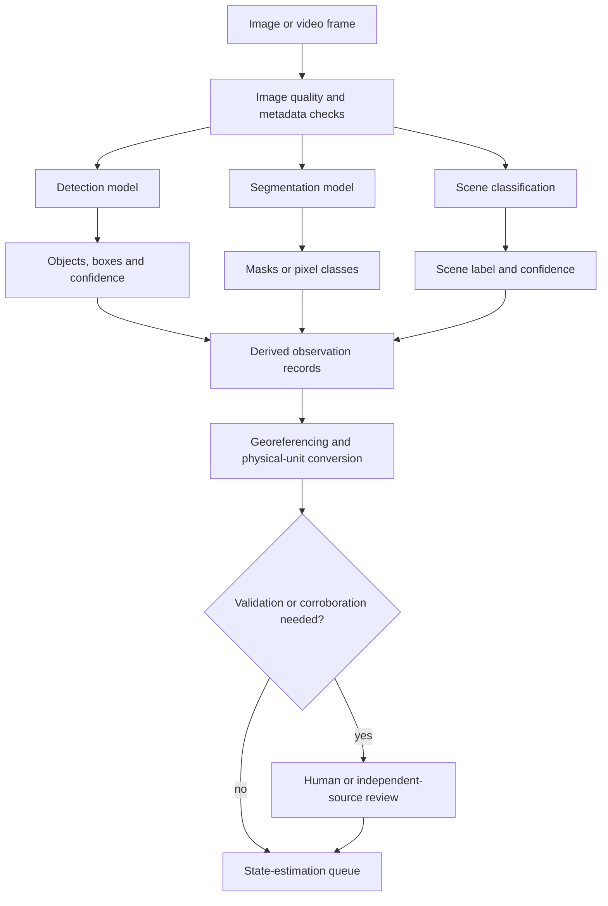
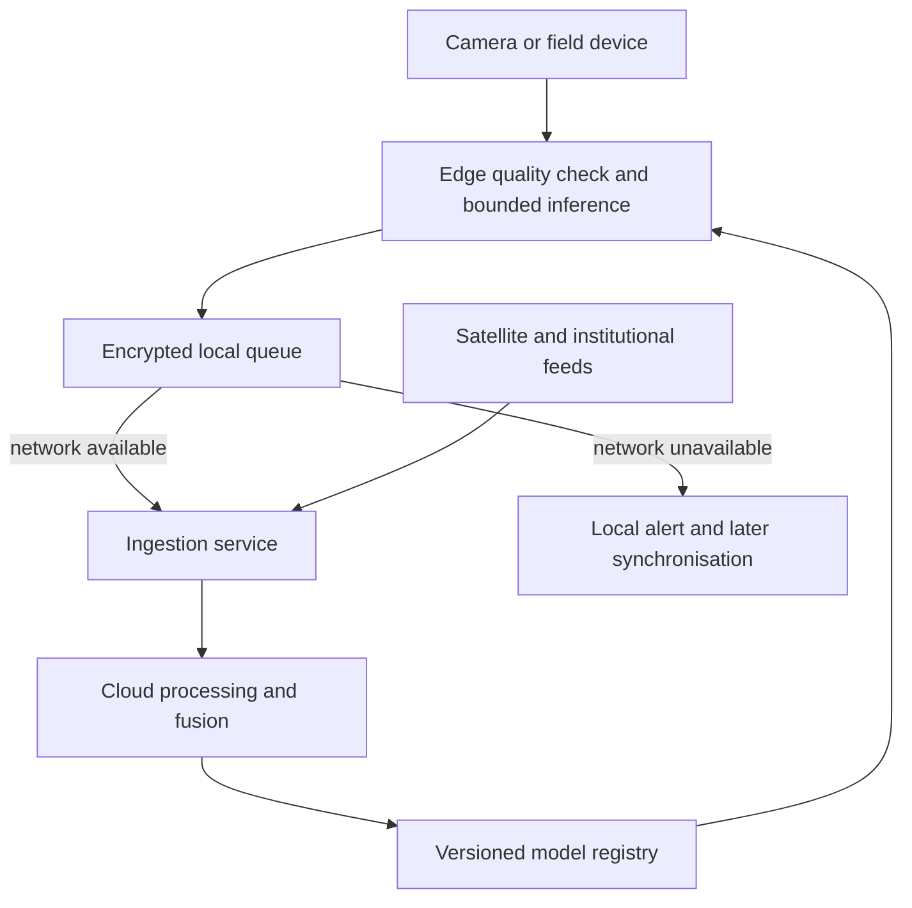
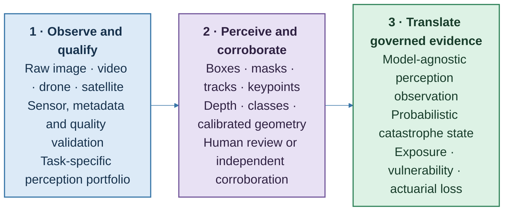
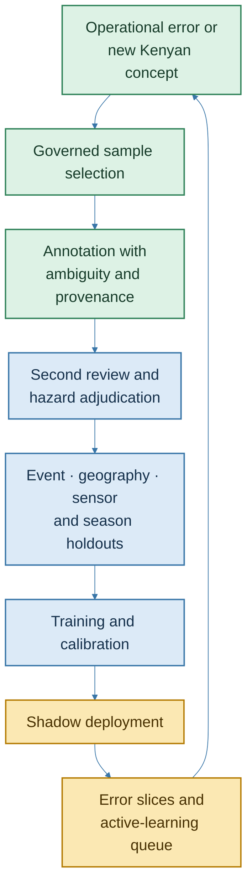
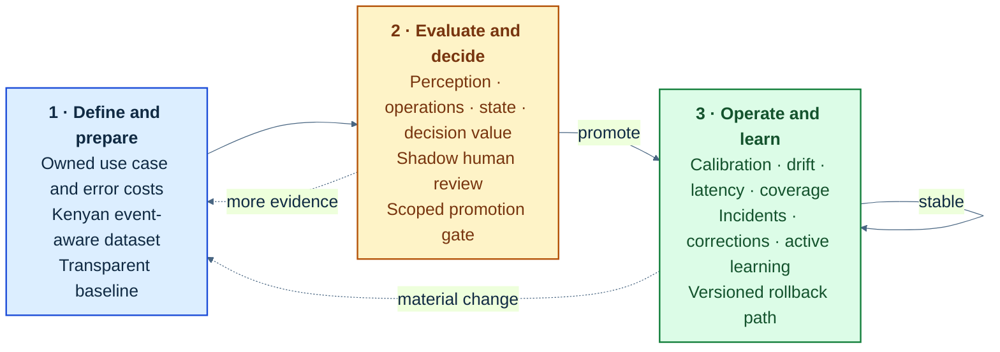
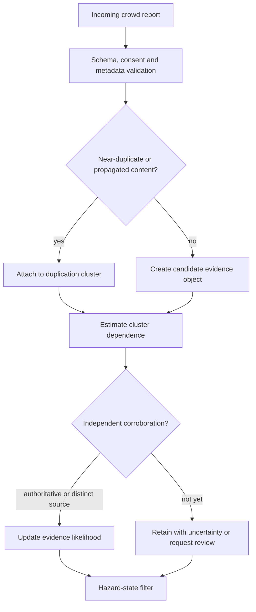

# Part 2: Crowd AI and Observation Architecture

## The distributed sensor network

During a flood, the first useful observation can arrive through many channels: a gauge rise upstream, a radar image acquired hours later, a matatu driver reporting an impassable bridge, or a farmer photographing a waterline against a familiar wall. Each source contributes a different fragment. SCRI combines those fragments into a progressively clearer event view.

Spatial Catastrophe Risk Intelligence (SCRI) begins with an observation contract that gives artificial intelligence a defined job. Kenya already has authoritative hydrometeorological infrastructure, including manual and telemetric surface-water monitoring across basin areas [1]. Sentinel-1 adds day-and-night, all-weather radar imagery, with emergency products that delineate inundation at the sensor’s operational resolution [2]. Community reports add effects that remote sensing may miss: a road is unusable, livestock cannot reach water, a health facility has lost power, or a crop was at a vulnerable stage when inundation occurred.

The commercial advantage comes from joining those perspectives while preserving their meaning. A river gauge is a calibrated measurement at a known location. A satellite-derived mask is a model output with acquisition and processing uncertainty. A photograph contributes frame-specific evidence. A text report is a claim by a contributor, expressed in language and affected by access, incentives and memory. The platform stores each source according to what it is.


**Figure 2.1: Multimodal evidence enters through one governed interface**

The minimum record is deliberately explicit:

```text
observation_id
hazard_type
source_type
source_id_or_pseudonym
event_time
knowledge_time
ingestion_time
geometry
coordinate_reference_system
observed_variable
value
unit
model_or_report_confidence
source_reliability
provenance
duplication_cluster
consent_and_permitted_use
quality_flags
correction_or_predecessor
schema_version
```

Three times are required because catastrophe reconstruction is a point-in-time problem. **Event time** records when the condition was observed. **Knowledge time** records when the source could have made it available. **Ingestion time** records when SCRI received it. A 10:00 replay therefore uses only evidence available by 10:00, while a flood photograph uploaded at 15:00 enters later versions. This distinction protects model validation from hindsight and allows an insurer to ask the operational question that matters: *what could we reasonably have known then?*

Geometry is equally disciplined. A phone coordinate is a point with an accuracy radius; a road report may be a line segment; a satellite mask is a raster or polygon at a stated resolution; a drought indicator may be a zonal statistic over a livelihood area. Every value carries a unit. Every model-derived feature carries the model version and lineage to the raw input. Provenance follows the general principle expressed in the W3C PROV data model: a derived entity should remain traceable to the activities and sources that produced it [3].

## Machine perception with defined jobs

YOLO has a useful and clearly defined role. Object detection produces classes, confidence scores and bounding boxes. An instance-segmentation model produces object masks. Semantic segmentation assigns a class to pixels across a scene. Current Ultralytics documentation exposes those as distinct tasks and outputs [4]. SCRI creates flood or burn polygons from suitable segmentation and geospatial processing, while bounding boxes remain object observations.

For wildfire, detection may identify smoke, flame, vehicles or people; segmentation may estimate a visible flame or burn boundary; thermal data may provide another signal. For flood, radar- or optical-image segmentation can estimate water extent, while depth usually requires terrain, gauges, hydraulics or a separately validated inference model. For locusts, an object detector supports close-range survey imagery, while regional swarm density comes from multiple surveys, movement evidence and ecological state. For landslide, models may segment a scar after failure while precursor risk remains a state-estimation problem. For drought and heat, time-series anomalies are often more important than vision.


**Figure 2.2: Detection, segmentation and state estimation remain separate**

Model confidence and hazard probability answer different questions. A detector confidence of 0.86 describes support for a class prediction under the model’s training and calibration regime. The fusion layer combines that output with image time, location and independent observations to estimate hazard probability; the loss layer then evaluates financial consequences.

Performance thresholds are set during hazard- and use-case-specific validation. A target such as “mAP greater than 0.75 under occlusion” becomes meaningful when it is tied to a dataset, class distribution, camera geometry, decision threshold and cost of errors. Each model card states the intended use, excluded conditions, training geography, evaluation split and metrics. Detection and segmentation models are evaluated on event and geography holdouts, with precision-recall curves, class-specific recall, calibration, intersection-over-union or Dice scores where appropriate, and operational latency. Error slices include darkness, glare, rain, smoke, low bandwidth, small objects and unfamiliar landscapes.

SCRI uses a hybrid edge-and-cloud design. Edge inference is valuable when latency or connectivity matters and the task can run on bounded hardware - for example, screening a camera stream for smoke and transmitting a short alert package. Cloud inference supports computationally intensive earth-observation processing, model comparison and retraining. The hybrid design maintains useful service through local queues, later synchronisation and explicit degraded modes when either side is unavailable.


**Figure 2.3: Hybrid inference with an offline path**

## From a model catalogue to a perception workbench

The production design uses **Ultralytics as a machine-perception workbench, not YOLO as a synonym for artificial intelligence**. The distinction matters because catastrophe imagery creates several different tasks. A detector locates bounded objects. A segmenter delineates a surface. A tracker associates evidence through time. A classifier describes the whole scene. An oriented box represents a rotated but bounded object. A pose model estimates keypoints. A depth model proposes scene geometry. An open-vocabulary model helps analysts discover a class that has not yet entered the production taxonomy. Ultralytics documents a common train, validate, predict, track, export and benchmark workflow across several of these tasks and model families [6]-[8].

SCRI places those implementations behind a stable interface. A current compact YOLO-family model may be the best edge detector for livestock near a threatened water point. An RT-DETR challenger may provide a better accuracy-latency trade-off for another object set; RT-DETR was designed as an end-to-end real-time detector with a transformer encoder-decoder architecture [9]. A SAM-family model may accelerate interactive masks. A Swin or SegFormer implementation may outperform both on a high-resolution semantic-segmentation problem. The institutional product should be able to promote the validated challenger without changing the loss engine, claims workflow or evidence schema.


**Figure 2.4: The perception workbench ends in governed evidence, not an autonomous financial decision**

### A model-agnostic perception-result contract

The contract prevents one vendor, architecture or model version from becoming the platform's ontology. It extends the canonical observation record with fields that describe the visual inference itself:

```text
perception_result_id
parent_observation_id
task_type
model_family and model_version
weights_version and training_dataset_version
input_asset_hash and frame_or_tile_reference
sensor_type and acquisition_geometry
class_taxonomy_version
prediction_geometry
coordinate_reference_system
score_type and calibrated_probability
uncertainty_components
ground_sample_distance or image_scale
spatial_support and boundary_tolerance
correlation_group
review_status and reviewer_provenance
permitted_use
runtime, hardware and export_format
```

`prediction_geometry` can contain a box, oriented box, polygon, raster probability surface, track, keypoint set or depth raster. `score_type` distinguishes a raw logit, confidence heuristic, calibrated class probability, mask probability or conformity score. `correlation_group` links frames from one video, overlapping drone tiles, one satellite acquisition or an ensemble created from the same source. The state engine can therefore recognise that fifty frame-level detections may describe one physical observation sequence.

The contract has a positive operational effect: a county analyst, catastrophe modeller and claims team can discuss the same evidence without discussing the neural-network internals. The analyst sees the image and review status; the state engine receives a likelihood-bearing observation; the actuary sees the resulting change in exposure and loss. Model detail remains available for audit and validation.

## The perception portfolio by task

### Detection: bounded and countable objects

Detection is appropriate where the object has a defensible class and bounded location: people, vehicles, livestock, locusts in survey imagery, flames, road obstructions, fallen poles and damaged components. The production metric follows the decision. A rescue workflow may prioritise recall and rapid human review. A claims-survey workflow may prioritise class precision and geometry. A locust counting workflow must report the smallest detectable object at the image's ground sample distance and how occlusion changes undercount.

Aggregate metrics remain useful for engineering comparison, but the model card reports class-level precision, recall, average precision, calibration and error cost. A model with attractive mean average precision can still be unsuitable if it repeatedly misses people in glare, dark livestock against burned ground, smoke against bright cloud or small vehicles in wide drone scenes. The validation set therefore includes hazard, county, sensor, season, lighting and acquisition-height slices.

### Instance and semantic segmentation: from pixels to physical surfaces

Instance segmentation separates individual flooded buildings, damaged roofs, crop plots or discrete debris regions. Semantic segmentation is better for continuous water, burn, vegetation-stress, smoke or debris surfaces. The output becomes a physical quantity only through an explicit geospatial transformation:

1. Validate or estimate camera geometry and image quality.
2. Georeference, co-register or orthorectify the scene.
3. Preserve per-pixel probability and boundary uncertainty.
4. Convert pixels into area, length or intersection at the native support.
5. Reconcile sensor resolution with the exposure geometry.
6. Pass a probability surface or sampled boundaries to state inference.

If pixel $j$ represents ground area $a_j$ and has calibrated water probability $p_j$, an expected visible inundated area is:

$$
\mathbb E[A^{vis}]=\sum_{j=1}^{J}a_jp_j.
\tag{2.1}
$$

This expectation does not claim that pixels are independent. Operational sampling should preserve spatially coherent mask uncertainty, sensor artefacts and common scene error. A hard polygon remains useful for display and routing, while the probabilistic surface remains available for state inference and loss sampling.

### Multi-object and mask tracking: evidence through time

Tracking associates observations across frames. A vehicle moving through floodwater is a temporal object-association problem. A livestock group moving toward a water point may be counted without double counting. A road camera can reveal when water first crosses a carriageway. SAM 2 is a promptable image-and-video segmentation model with a streaming-memory architecture, making it a useful candidate for analyst-assisted mask propagation and video segmentation [10].

The physical interpretation remains peril-specific. A smoke plume deforms and advects; temporal segmentation, optical flow or an atmospheric dispersion representation is usually more faithful than a rigid-object tracker. Close-range tracking of locusts can improve counting in one survey clip, but regional swarm movement requires wind, ecological state and sequential field locations. Camera motion from a drone must be separated from object motion through stabilisation, pose estimation or georegistration.

SCRI converts a sequence into one correlated evidence object with time-indexed manifestations. This preserves onset and movement information while avoiding the fiction that 300 adjacent frames are 300 independent confirmations.

### Oriented bounding boxes and non-rectangular infrastructure

Oriented bounding boxes are useful for bounded objects whose angle matters: roofs, vehicles, rail wagons, fallen poles, bridge elements or some aerial infrastructure. They can reduce background area relative to axis-aligned boxes and represent the orientation of damage. Roads, rivers, floodplains, fields and landslide scars often need polylines, polygons or segmentation because an oriented rectangle would discard their physical form. The task is chosen from the geometry of the evidence, not from the availability of a model endpoint.

### Monocular depth as provisional geometry

Monocular depth contributes relative scene geometry and, under controlled conditions, provisional metric evidence. A visually plausible depth map is not automatically water depth. Flood depth normally requires a chain that may combine camera calibration, known reference objects, waterline detection, terrain elevation, gauge observations and hydraulic constraints.

SCRI therefore distinguishes:

- **relative depth**, which orders surfaces by apparent distance;
- **camera-referenced metric depth**, which uses calibration and scale evidence;
- **water depth above local ground**, which also needs water-surface and terrain geometry; and
- **hydraulically reconciled depth**, which conditions the visual estimate on gauge, terrain and flow information.

For camera $c$ and location $g$, a fused depth observation can be represented as:

$$
Y^{depth}_{c,g}=d_g+b_c+\epsilon^{scale}_{c,g}+\epsilon^{scene}_{c,g},
\tag{2.2}
$$

where $d_g$ is the physical depth of interest, $b_c$ is camera-specific bias and the error terms represent scale and scene ambiguity. The likelihood passed to Part 3 carries these uncertainties. It does not turn a depth-model output into a precise hydraulic measurement.

### Pose estimation for bounded rescue assistance

Pose estimation can support a narrow rescue-assistance workflow: a person may appear fallen, stranded or signalling. The system can prioritise a frame for a trained human, establish the camera and time, and route the evidence to the responsible response process. Necessity, image quality, occlusion, consent, retention and permitted purpose are explicit. The output remains a review cue, and operational teams confirm the situation through available channels.

This bounded design concentrates the capability where it creates clear human value. It also avoids repurposing sensitive human imagery for underwriting, pricing or unrelated surveillance.

### Open-vocabulary detection and promptable segmentation

Open-vocabulary and promptable models are discovery and annotation accelerators. YOLOE and YOLO-World are examples of promptable or open-vocabulary capabilities exposed in the current Ultralytics ecosystem [11]. An analyst can search for an emerging damage concept, use a visual or text prompt to propose objects, or ask a SAM-family model to delineate a new surface.

The output initially enters a **candidate-review queue**. The queue records the prompt, model, image, proposed class and reviewer decision. Recurrent concepts then move through taxonomy definition, annotation guidance, Kenyan training examples, closed-set validation and production approval. This makes open vocabulary a disciplined route for discovering Kenya-specific catastrophe features rather than a shortcut around validation.

### Vision Transformers remain in the architecture

Vision Transformers remain because context is often the deciding evidence in catastrophe imagery. The original ViT demonstrated image classification through sequences of image patches [12]. Swin introduced hierarchical shifted-window attention suitable for multiscale dense-prediction tasks [13]. SegFormer combines a hierarchical transformer encoder with a lightweight decoder for semantic segmentation [14]. These designs are useful challengers for contextual scene classification, high-resolution earth observation, pre/post-event change detection and semantic surfaces.

Their value is tested rather than assumed. Global context may help distinguish smoke from cloud, haze or dust; multiscale context may improve the delineation of water between buildings; change models may detect roof loss or new landslide scars. Compact convolutional or hybrid models may still dominate on low-power devices. The product strategy is a portfolio:

| Operational need | Baseline or candidate | Promotion evidence |
|---|---|---|
| Low-latency bounded objects at the edge | Compact YOLO-family detector | Class recall, calibration, watts, latency and degraded-mode performance |
| End-to-end real-time detection challenger | RT-DETR family | Event/geography holdout gain at an acceptable compute cost |
| Scene classification | CNN and ViT challengers | County, sensor and season transfer; smoke/cloud/dust discrimination |
| Semantic surfaces | U-Net-style baseline; SegFormer or Swin challenger | Boundary accuracy, calibration, spatial transfer and runtime |
| Promptable annotation | SAM-family model | Analyst time saved and corrected-mask quality |
| Video masks | SAM 2 or task-specific temporal segmenter | Drift, occlusion recovery and frame-sequence calibration |
| Open-vocabulary discovery | YOLOE, YOLO-World or comparable model | Reviewer precision and successful taxonomy conversion |

## Geospatial and remote-sensing imagery

Catastrophe imagery extends beyond ordinary RGB photographs. Sentinel-1 synthetic-aperture radar brings all-weather, day-and-night observation, while backscatter depends on acquisition geometry, surface roughness and the interaction between water and the built environment. Speckle, layover, shadow and double-bounce effects require remote-sensing treatment. A general RGB detector cannot simply be pointed at a radar raster and treated as validated.

Multispectral imagery carries physically meaningful bands beyond visible colour. Pre/post-event change requires co-registration, radiometric or sensor harmonisation and a statement of temporal difference. Drone imagery may need camera calibration, mosaicking and orthorectification. Ground sample distance sets the smallest defensible visible object. Cloud, shadow, smoke, glare, turbidity and vegetation generate different error modes by peril.

Specialised geospatial models therefore sit behind the same perception-result contract. A Sentinel-1 flood classifier, a multispectral vegetation-stress model and an Ultralytics detector can coexist because each publishes geometry, scale, provenance, uncertainty and model lineage in the same language.

## Building the Kenyan catastrophe-vision dataset

Model architecture is only one part of performance. The durable product asset is a governed Kenyan dataset that reflects seasons, landscapes, building forms, roads, crops, livestock, cameras, languages and operational conditions.

The programme begins with a **hazard-task taxonomy**. Flood labels include visible water, passability, waterline, affected building, exposed vehicle and image usability. Fire labels distinguish smoke, flame, burned surface, active perimeter evidence, firefighting assets and visibility. Locust labels specify lifecycle, survey scale and counting limitations. Landslide labels distinguish scar, debris, blocked road and precursor evidence where scientifically defensible. Drought and heat focus on visible crop, livestock and asset conditions while earth-observation and time-series models remain the primary state engines.

Annotation guidance defines positive, negative and ambiguous examples. Annotators can mark an uncertain boundary, occluded object, image-quality failure or class disagreement. A second reviewer checks high-consequence classes and a hazard specialist adjudicates difficult cases. Agreement statistics are reported by class and event; disagreement becomes annotation uncertainty rather than being silently removed.

Dataset splitting follows catastrophe reality:

- **event holdout** prevents frames from one flood or fire appearing in both training and test sets;
- **geography holdout** measures transfer to a county, basin or landscape not used for training;
- **sensor holdout** tests new cameras, drones or satellites;
- **season holdout** tests wet/dry, crop-stage and atmospheric changes; and
- **extreme-condition holdout** tests darkness, rain, smoke, glare, occlusion and low bandwidth.

Random image splitting would overstate performance because neighbouring frames, drone tiles and copied photographs share information. The dataset registry therefore records an origin cluster and event identifier before splitting.


**Figure 2.5: Kenyan dataset development is a continuous, event-aware learning cycle**

Active learning prioritises examples that can improve an approved use case: low-confidence but high-exposure scenes, model disagreement, novel domains, repeated human correction and errors near decision thresholds. Sampling is balanced so connected urban areas do not consume the annotation budget while remote pastoral, agricultural or forest landscapes remain underrepresented. Analysts can also request deliberate negative examples, because a system trained mostly on disasters may generate false alarms during ordinary conditions.

## Perception uncertainty as a product output

SCRI separates six uncertainties:

1. **Aleatoric uncertainty** from inherent ambiguity such as smoke, darkness, occlusion or a mixed water boundary.
2. **Epistemic uncertainty** from limited Kenyan examples or unfamiliar construction and land cover.
3. **Domain-shift uncertainty** from a new county, sensor, season, altitude or viewing geometry.
4. **Annotation uncertainty** from legitimate disagreement about a mask or damage class.
5. **Geometric uncertainty** from coordinate error, camera pose, orthorectification and raster resolution.
6. **Operational uncertainty** from compression, dropped frames, stale imagery and partial uploads.

Calibration is measured on the deployment-like holdouts, not only the training distribution. Reliability diagrams, Brier or log score, expected calibration error and class-specific threshold analysis accompany precision and overlap metrics. Ensembles can expose model disagreement. Conformal methods can be evaluated for prediction sets or mask uncertainty; recent work proposes conformal prediction sets for instance segmentation, while its coverage assumptions still need testing under event and geographic shift [15].

Uncertainty changes action constructively. A clear, calibrated road-obstruction detection may enter a rapid verification queue. A broad flood boundary produces an exposure range. A new sensor with strong domain-shift indicators routes more scenes to human review. A high-consequence rescue cue stays visible with its uncertainty and review status.

## Deployment, export, licensing and maintenance

The hardware decision is empirical. Each candidate is benchmarked on representative phones, edge accelerators, drone computers, county servers and cloud instances using the intended image size, batch size and precision. The register records latency percentiles, throughput, memory, energy where measurable, export success, accuracy change after quantisation, start-up time and behaviour under thermal or network constraint. Ultralytics supports several export and benchmarking pathways, but each exported artefact remains a separately versioned model requiring equivalence checks [8].

The edge package contains the model, taxonomy, thresholds, quality checks, permitted use, expiry or review date and rollback version. A signed update is staged, tested and progressively deployed. If the model or camera degrades, the device can return to capture-and-forward mode or a transparent rule baseline.

The dependency register records source code, model weights, training data, licence, attribution, redistribution rights, export format, security updates and vendor-exit plan. This is particularly important where a research model, commercial workbench and proprietary Kenyan data are combined. The architectural contract allows SCRI to replace a dependency while retaining the observation and actuarial interfaces.

## Six peril-specific perception products

The shared workbench becomes useful when each peril gives it a concrete observation job. SCRI therefore configures a peril adapter that specifies the scene, target variable, acceptable evidence, spatial support, temporal meaning, quality test and downstream decision. The adapter also states which physical model carries the main state-estimation responsibility.

### Flood: from visible water to depth, access and accumulation

In the Nzoia basin, a satellite-derived water surface can contribute broad footprint evidence while a bridge camera records local onset and a field photograph anchors a waterline. In Nairobi, a short intense storm can overwhelm drainage between satellite acquisitions, so road cameras, community evidence and terrain-aware rainfall-runoff estimates may carry more immediate value. The flood adapter supports a probabilistic visible-water surface, building and road intersections, time-indexed passability, calibrated waterline evidence, provisional depth and post-event damage cues.

The perception output identifies what is visible and how certain it is. Terrain, drainage, gauges and hydrological or hydraulic models reconcile the surface into depth, duration and propagation. For an insurer, the first interface is exposure accumulation by credible depth band. For a county team, it is the road, facility or settlement whose access state changed. For claims, it is an inspection and contact queue linked to the original evidence.

### Drought: visible condition inside a slow environmental state

Drought is primarily a time-series and livelihood-system problem. Rainfall, soil moisture, vegetation, water availability, markets and household or livestock indicators establish the evolving state. Machine perception adds focused evidence where visual assessment is meaningful: crop phenology and condition, surface-water availability, livestock body condition under a validated protocol, rangeland cover, borehole surroundings and exposed infrastructure.

A photograph of one animal cannot represent a county drought phase. The adapter records sampling design, species, age class, view quality, assessor protocol, location, season and representativeness. Computer vision can support consistent field measurement and triage, while the state engine aggregates it with NDMA and environmental evidence. The product can then show whether deterioration came from vegetation, water, livestock, prices or access and where anticipatory action may still protect livelihoods.

### Wildfire and rangeland fire: detection, perimeter and operational access

Fire perception serves a sequence. A compact edge model screens a fixed camera for smoke or flame. A confirmed cue creates a short evidence package containing frames before and after detection, camera identity, bearing, weather and model version. Thermal or satellite evidence and independent reports support confirmation. Segmentation and time-series imagery then help estimate active perimeter, burned area and change; vehicles, water points, access routes and structures form the exposure context.

Smoke, dust, haze and cloud create a contextual classification problem suited to transformer challengers as well as compact detectors. Night, wind, camera shake and backlighting receive their own evaluation slices. A plume is interpreted through temporal masks and wind rather than as a rigid object. The response interface presents bearing, age, corroboration and routes. The actuarial interface receives footprint and intensity samples together with suppression evidence.

### Locust and catastrophic crop pests: survey counting inside a mobile biological process

Close-range imagery can detect or count insects under a defined survey geometry. Drone or field imagery can also document crop condition and treatment evidence. The regional problem is a mobile biological population with lifecycle, wind-assisted movement, vegetation response and control intervention. The locust adapter therefore preserves survey area, camera height, image scale, occlusion, lifecycle class, count uncertainty and sampling protocol.

Tracking prevents double counting within a short clip. Open-vocabulary review can help discover a visually similar pest or damage manifestation, after which the class enters expert taxonomy and validation. Swarm density and direction emerge from multiple surveys and ecological inference. Agricultural exposure adds crop type, stage, area, expected yield, prices, control cost and livelihood dependence. The field interface supplies a spatially prioritised survey queue while the actuarial layer models production and income loss.

### Landslide: local change, blockage and slope context

Pre- and post-event aerial or satellite imagery can reveal a scar, debris field, blocked road or altered channel. Segmentation represents irregular scars and debris more faithfully than a rectangle. Oriented boxes remain useful for rotated vehicles, roofs, poles or bounded infrastructure components. Co-registration uncertainty is essential because apparent change can come from parallax, season, shadow or sensor geometry.

The perception product complements rainfall, saturation, terrain, geology and susceptibility. It can rapidly map access disruption and identify candidate affected structures after failure. Precursor monitoring uses appropriate deformation, ground-sensor or geotechnical evidence. The infrastructure interface follows the affected road or service network; the state model retains the intensely local spatial support.

### Severe storm and extreme heat: damage evidence and visible vulnerability

After severe wind or hail, drone and street imagery can detect damaged roofs, fallen trees, poles, debris and blocked access. Oriented boxes and segmentation support aerial inspection, while pre-event imagery helps separate old condition from new damage. Scene classifiers can assess image usability and distinguish weather-related cues from ordinary deterioration.

Extreme heat is less visually observable. Weather, humidity, building physics, power demand, health and labour indicators carry the state. Vision can document shade, roof material, ventilation features, queues at water points, livestock condition or visible infrastructure stress where the purpose is defined. SCRI treats these as exposure or vulnerability observations. The heat product focuses on neighbourhood and asset conditions, service continuity and protective action.

Across all six adapters, the workbench produces comparable provenance and uncertainty while the underlying physics remain peril-specific.

## Operational validation and model promotion

SCRI evaluates a model as part of a workflow. The starting point is a transparent baseline: human review, threshold rule, established remote-sensing classifier or current production model. A challenger earns promotion through event- and geography-held-out evidence, operational usefulness and deployability.

The evaluation catalogue contains four linked groups:

1. **Perception performance:** precision, recall, average precision, overlap, boundary error, count error, tracking association, depth error and calibration.
2. **Operating performance:** end-to-end latency, throughput, energy, memory, transmission volume, review workload, failure recovery and availability in degraded conditions.
3. **Catastrophe-state value:** change in state calibration, footprint accuracy, lead time, false and missed event states, and uncertainty reduction after dependence is accounted for.
4. **Decision value:** change in inspection yield, claims readiness, route selection, analyst time, response lead time and actuarial loss calibration.

Let $k$ index error types, $s$ evaluation slices and $c_{k,s}$ the owned consequence of an error. A decision-weighted perception risk is:

$$
R_{perception}(f)
=\sum_s w_s\sum_k c_{k,s}
\Pr_f(Error_k\mid Slice_s),
\tag{2.3}
$$

where $w_s$ represents the agreed evaluation population. A rescue-screening false negative can receive a different consequence from an extra review cue. A flood-boundary error near dense exposure can receive a different priority from the same pixel error in open water. The weights are published with the result so ranking remains understandable.

Calibration is assessed before and after score mapping. Thresholds are selected on validation data and frozen for the holdout. Event-block bootstrap intervals reflect within-event correlation. A model can be promoted for one class, county, sensor or device and remain a challenger elsewhere. This scoped promotion builds a portfolio that improves by evidence rather than by a single global launch.

The quality gate requires stated uses, a frozen origin-aware dataset split, identical baseline and challenger holdouts, uncertainty and subgroup results, exported-artefact equivalence, measured review capacity, replayed state and actuarial impact, and a ready rollback path.


**Figure 2.6: Machine-perception promotion links offline metrics to shadow operation and monitored product value**

### Shadow operation, drift and learning

In shadow mode, the model produces observations beside the existing workflow. Analysts record whether they accepted, corrected or ignored each result and why. SCRI measures review time, queue ageing, error discovery, operational action and downstream state movement. Stratified sampling concentrates review on high-consequence, low-confidence, novel-domain and apparent-disagreement cases.

Drift monitoring distinguishes input change from performance change. Sensor, compression, brightness, ground sample distance, geography, season and class prevalence can all move. Feature-distribution diagnostics identify change for investigation. Delayed verified labels, analyst corrections and event reconstructions measure actual performance. A drift alert increases sampling or narrows scope; demonstrated performance deterioration triggers a threshold, model or workflow response.

The registry keeps candidate, shadow, production, degraded and retired states. Every result retains its model and weights version, so replay can show how a later model would have behaved without changing the historical decision record. Rollback restores the last validated artefact and thresholds. Capture-and-forward, human review and authoritative-source workflows continue during correction.

## Deployment tiers and service design

National deployment uses several compute tiers because each has a different combination of latency, energy, privacy and imagery scale.

| Tier | Typical work | Product priority | Promotion evidence |
|---|---|---|---|
| Phone or assisted field device | Image-quality guidance and bounded inference | Offline usability, battery, privacy and correction | Device matrix, thermal test, upload recovery and user test |
| Fixed camera or edge accelerator | Smoke/flame screening, road-water onset and counts | Low latency, continuous operation and compact evidence | Long-duration false-alert rate, recall, power and network-failure test |
| Drone computer | Flight-time quality check and selected inference | Throughput, motion handling and geospatial lineage | Altitude/GSD slices, stabilisation, battery and mosaic reconciliation |
| County or institutional server | Local batch inference, review and degraded service | Data control, resilience and team workflow | Capacity, failover, access controls and synchronisation replay |
| Cloud geospatial platform | Satellite processing, large segmentation, ensembles and replay | Scale, lineage and multi-source fusion | Cost, latency, reproducibility, outage drill and vendor-exit test |

Every tier publishes a service envelope. A smoke-screening edge model states a tested frame rate and evidence-package latency under named hardware and visibility. A satellite flood product states acquisition time, processing time, native resolution and update interval. A field application states how long it queues evidence offline and what happens when storage fills. These envelopes let the state engine model freshness and operations plan around the actual service.

A deployment utility can combine performance and resources:

$$
\begin{aligned}
U(f,d)={}&Benefit_{decision}(f,d)
-\lambda_LLatency(f,d)-\lambda_EEnergy(f,d)\\
&-\lambda_CCost(f,d)-\lambda_RReviewLoad(f,d).
\end{aligned}
\tag{2.4}
$$

The weights express the owned use case. Life-safety screening may value latency and recall strongly; retrospective claims mapping can favour boundary quality and throughput. The utility supports an explicit decision record.

The perception service publishes an immediate observation and any later correction. Each contains acquisition and processing times, geometry, score type, uncertainty, correlation group and review state. The event engine subscribes to admissible evidence; response users receive purpose-qualified cues; portfolio users receive hazard-state changes by default; claims users receive inspection rationale; model operations receives drift and device telemetry; authorised audit users can traverse lineage.

Latency is measured from acquisition, not merely the start of inference. Availability includes sensor, network, queue, inference, geospatial transform and delivery. Coverage reports where no eligible sensor exists. This aligns the service level with the observation process in Part 3.

## Human imagery, participation and narrow purpose

The ingestion workflow identifies whether an image may contain faces, plates, homes, documents, children, injured people or precise private locations. It applies purpose-based access, redaction where appropriate, retention and review before wider use.

Community contribution states what is requested, why it helps, how it will be checked, who may use it, how long it is retained and how a contributor can correct or withdraw eligible data. Assisted and offline channels support people without a modern smartphone. A contributor can report an effect without uploading identifiable imagery. Trusted field networks receive task-specific training and safety guidance.

The same interface returns practical value to contributors: locally relevant warnings, the status of submitted evidence, protective actions, coverage or claims routes, and visibility into resilience projects that use the shared record. Community representatives can also propose or validate project locations, beneficiary groups and operating conditions, connecting local knowledge to the investment evidence developed in Part 5.

Dataset creation records the lawful and contractual basis for training, evaluation and publication examples separately. Customer data, community evidence, open imagery and research datasets can have different permitted uses. Derived embeddings and annotations retain lineage because derivation does not erase underlying rights or sensitivity. Published examples pass through an editorial and redaction process.

The narrow-purpose design improves model quality. A rescue cue, road-passability observation and insurance damage indicator use different taxonomies, thresholds and retention. Each community and institution can therefore understand the precise service it supports.

## A perception-to-actuarial worked example

Consider a road camera overlooking a market corridor during a flood. At 07:05, the quality check confirms the camera identity, clock and visibility. A semantic segmenter produces a water probability surface; a detector identifies three vehicles; a waterline routine finds a calibrated wall reference. Geometry processing projects the surface into the local coordinate system and returns an estimated visible inundated area with boundary samples. The depth workflow combines the waterline, terrain and an upstream gauge to produce a depth likelihood rather than a point estimate.

The observation contract sends four correlated products to the state engine: visible-water surface, provisional depth, vehicle observations and passability evidence. They share one camera sequence and therefore one correlation group. A second road report and later radar acquisition provide independent evidence. Part 3 updates the flood state across the drainage network.

Part 4 intersects posterior flood samples with shops, dwellings, vehicles and road-dependent businesses. For posterior sample $m$:

$$
L^{(m)}=\sum_i V_iD_i\!\left(I^{(m)}(g_i),M_i,\varepsilon_i^{(m)}\right),
\qquad
I^{(m)}\sim p(I\mid Y_{1:t}).
\tag{2.5}
$$

The perception model has not calculated a claim. It has improved the evidence distribution that generates depth and footprint samples. The claims workspace can show why expected loss changed: new water evidence, stronger depth information and corrected passability. The actuary retains the exposure, vulnerability and policy transformation.

Product interfaces express the same chain differently:

- **Community and field interface:** what was observed, the practical effect, recommended authoritative action and a correction route.
- **County or response interface:** verified obstruction, accessible alternatives, observation age and review priority.
- **Insurer portfolio interface:** affected exposure by probability and intensity band, with image evidence accessible under permitted use.
- **Claims interface:** candidate affected policies and inspection priority, without using perception as automatic coverage proof.
- **Actuarial interface:** posterior hazard samples, uncertainty attribution and the observation/model versions responsible for movement.
- **Model-operations interface:** drift, calibration, runtime, data coverage and rollback status.

This completes the perception product. Pixels become calibrated, georeferenced observations; observations update a catastrophe state; catastrophe states generate loss distributions; and institution-owned workflows turn those distributions into action.

## Two product-interface journeys

### A Mount Kenya landscape fire seen by several users

At 13:42, a camera overlooking a forest-agriculture boundary produces a smoke cue. The edge device has already checked clock synchronisation, lens obstruction and the proportion of sky in the frame. It packages six seconds of imagery before and after the cue, the camera bearing, the calibrated smoke probability, a broad angular uncertainty and the device/model versions. Rather than transmitting a continuous identifiable video stream, it sends the bounded evidence package required by the approved fire-screening purpose.

The event interface creates a candidate fire observation. A contextual classifier shows that bright cloud is a plausible alternative, so the cue appears as amber rather than red. Wind direction and a later thermal observation support the same general location. A ranger report supplies an independently described smoke bearing. The state engine intersects those uncertain bearings and updates ignition probability across a set of cells. The screen shows which evidence generated the movement and how much uncertainty remains.

For the response analyst, the interface leads with practical questions: where is the likely origin, which roads and water points remain accessible, how old is the evidence, and which observation can confirm the state most efficiently? It proposes two camera views and a field verification point. The analyst chooses the next action and records the result. If the report confirms a fire, the perimeter product begins a time-indexed series using thermal, optical and field observations. Wind, fuel, slope and suppression feed the propagation model.

For an insurer, the same evidence appears later through a portfolio lens. The user sees insured farms, buildings, tourism assets and equipment intersecting posterior intensity bands. Raw frames containing people remain in the restricted evidence store; the portfolio view receives the governed state and permitted thumbnails. The loss distribution changes through the fire model, exposure and vulnerability—not through a direct multiplication of smoke confidence by insured value.

For a claims lead, post-event drone imagery creates building and crop inspection candidates. Pre-event scenes help distinguish existing roof condition from new loss. Each mask or oriented box carries geometry, model version, probability and review status. The interface groups multiple drone tiles by flight so they do not appear as independent confirmation. Adjusters can accept, correct or deprioritise a candidate, and their findings return to the evidence and dataset programmes under the agreed use.

For model operations, the event becomes a structured learning record. The team reviews whether the smoke cue arrived earlier than other evidence, whether the contextual classifier reduced false escalation, whether the edge package met latency and energy targets, how the perimeter masks drifted, and whether the downstream state was calibrated. The finding may promote a challenger for bright-cloud conditions, add a new negative example or refine the camera's service envelope. One real event improves the product without erasing what users knew at each earlier decision time.

### A drought month in a pastoral livelihood system

The drought product moves at a different rhythm. At the start of the month, the county view already contains rainfall, vegetation condition, water-point reports, livestock movement, market access and previous phase history. Field officers use an offline-first application to collect a stratified sample of water and livestock observations. The application guides image angle, distance, reference scale and minimum metadata. It also accepts a structured non-image report where photography is unsafe, intrusive or unhelpful.

At a water point, an image-quality model confirms that the scene is usable. Segmentation proposes the visible water surface and identifies shadows as uncertain. The officer reviews the mask and records whether the point is functioning, estimated queue, access condition and the source of the water. A nearby livestock assessment uses a species- and protocol-specific workflow. The interface presents the model suggestion as a measurement aid and records the trained assessor's result. Neither observation is asked to stand for the entire livelihood zone.

The county analyst receives a coverage map before a drought-phase map. It shows which strata were sampled, which roads prevented access, where connectivity delayed upload and which communities have no current field observation. The analyst can direct the next visits toward information gaps rather than repeatedly collecting evidence near easy roads. Satellite and authoritative indicators continue to update while field packages wait offline; later synchronisation preserves their event time and knowledge time.

The probabilistic engine asks whether the field evidence is consistent with the evolving vegetation, water and livelihood state. A low water surface at one point becomes more influential when independent borehole, rainfall and usage evidence agree and when the sampling design supports representation. Several forwarded photographs remain one evidence origin. Silence in a disconnected area increases uncertainty through the reporting model rather than creating an apparent absence of stress.

For an insurer or livelihood-protection partner, the interface shows the contractual index, observed livelihood effects and basis-risk evidence separately. For a lender, it shows possible revenue and repayment pressure through livestock condition, market access and customer exposure, while the lender's credit model owns PD and LGD. For a county or anticipatory-action programme, it shows the populations, water systems and livelihood assets associated with each credible state and the lead time for available interventions.

At month end, the product closes a versioned assessment rather than declaring the event finished. Drought duration continues, evidence can be corrected and the next period starts from the posterior state. The model-operations team reviews sampling balance, assessor agreement, device performance, uncertainty coverage and whether recommended information-gathering improved decisions. This is continuous intelligence adapted to a slow catastrophe: the product preserves persistence, livelihoods and uneven observation rather than forcing drought into a rapid-alert template.

These two journeys show why the perception architecture is both shared and plural. The evidence contract, calibration, lineage, review and deployment disciplines are common. Fire and drought create different clocks, physical states, field practices, product users and actuarial consequences.

## Inclusive crowd intelligence

The defining statistical problem is dependence among crowd reports. Fifty forwarded copies of one image share a common information origin. SCRI first creates a **duplication and propagation cluster** using perceptual image hashes, text similarity, shared URLs, timestamps, geometry, device metadata where lawfully available and known forwarding relationships. The cluster becomes one correlated evidence object with an internal report count. Independent corroboration is then assessed across distinct evidence origins.


**Figure 2.7: Separating correlated repetition from independent corroboration**

Contributor reliability is contextual. The platform evaluates location precision, timestamp quality, report completeness, sensor calibration, agreement with independent sources and known operating conditions. Historical performance can contribute as a capped, regularly re-estimated input, while first-time reporters, shared-device users and remote communities remain eligible sources. Community coverage becomes a monitored variable, and sparse-reporting areas receive wider uncertainty and targeted outreach.

A practical evidence update can be written as:

$$
p(Z_t\mid Y_{1:t})
\propto
p(Z_t\mid Y_{1:t-1},X_t)
\prod_{c=1}^{C_t}
p(Y_{c,t}\mid Z_t,q_{c,t},\rho_c).
\tag{2.6}
$$

where $Z_t$ is the hazard state, $Y_{c,t}$ is an evidence cluster rather than an individual forwarded message, $q_{c,t}$ represents observable quality and $\rho_c$ represents residual dependence inside the cluster. The predictive prior marginalises uncertainty in the preceding state rather than conditioning on an unknown $Z_{t-1}$. The interface supports a Kalman-family filter, particle filter, variational approximation, ensemble update or deterministic rule-based baseline according to hazard and latency. Offline MCMC remains useful for calibration and model comparison where computation permits. Appendix D derives Equation (2.6) from Bayes' rule, shows how duplication dependence changes effective information, and develops source-reliability and geolocation-error updates.

Privacy uses several reinforcing controls. Geotagged images, phone numbers, faces, vehicle plates and property details may be personal data. Kenya’s Data Protection Act requires lawful, fair and transparent processing; specified purposes; data minimisation; accuracy; retention discipline; safeguards for transfer and enforceable data-subject rights [5]. SCRI separates the identifiable contribution store from the hazard-evidence store, applies encryption and role-based access, redacts visible identifiers where practical and records permitted uses. Pseudonymisation reduces direct identifiability, while access and retention controls address the residual identifiability of rich geospatial records.

Safe degradation is designed before scale. If the crowd channel fails, the state engine widens uncertainty and uses authoritative and earth-observation sources. A stale gauge receives a freshness flag and decaying evidential weight. Delayed satellite acquisition appears as footprint age. During cloud outages, edge devices retain evidence and authorised local warnings follow the responsible agency’s manual route. Missing evidence produces an explicit coverage gap and wider confidence interval.

The output of Part 2 is a versioned collection of admissible evidence with uncertainty, correction history and provenance intact. Part 3 can therefore estimate hazard state while Part 4’s actuary can trace every financial update back to its observational basis.

\newpage

## References

[1] Water Resources Authority, “Surface Water Assessment & Monitoring,” 2026. [Online]. Available: https://wra.go.ke/surface-water-assesment-monitoring/. Accessed: Aug. 28, 2026.

[2] European Space Agency, “Sentinel-1: Emergency response.” [Online]. Available: https://www.esa.int/Applications/Observing_the_Earth/Copernicus/Sentinel-1/Emergency_response. Accessed: Aug. 28, 2026.

[3] W3C, “PROV-DM: The PROV Data Model,” W3C Recommendation, Apr. 30, 2013. [Online]. Available: https://www.w3.org/TR/prov-dm/. Accessed: Aug. 28, 2026.

[4] Ultralytics, “Instance Segmentation with Ultralytics YOLO,” 2026. [Online]. Available: https://docs.ultralytics.com/tasks/segment/. Accessed: Aug. 28, 2026.

[5] Republic of Kenya, *Data Protection Act*, Cap. 411C. [Online]. Available: https://new.kenyalaw.org/akn/ke/act/2019/24/eng@2022-12-31. Accessed: Aug. 28, 2026.

[6] Ultralytics, “Computer Vision Tasks.” [Online]. Available: https://docs.ultralytics.com/tasks/. Accessed: Aug. 30, 2026.

[7] Ultralytics, “Multi-Object Tracking with Ultralytics YOLO.” [Online]. Available: https://docs.ultralytics.com/modes/track/. Accessed: Aug. 30, 2026.

[8] Ultralytics, “Model Export with Ultralytics YOLO.” [Online]. Available: https://docs.ultralytics.com/modes/export/. Accessed: Aug. 30, 2026.

[9] Y. Zhao *et al*., “DETRs Beat YOLOs on Real-time Object Detection,” in *Proc. IEEE/CVF Conf. Computer Vision and Pattern Recognition*, 2024, pp. 16965-16974. [Online]. Available: https://openaccess.thecvf.com/content/CVPR2024/papers/Zhao_DETRs_Beat_YOLOs_on_Real-time_Object_Detection_CVPR_2024_paper.pdf. Accessed: Aug. 30, 2026.

[10] N. Ravi *et al*., “SAM 2: Segment Anything in Images and Videos,” in *Proc. ICLR*, 2025. [Online]. Available: https://openreview.net/pdf?id=Ha6RTeWMd0. Accessed: Aug. 30, 2026.

[11] Ultralytics, “YOLOE: Real-Time Seeing Anything.” [Online]. Available: https://docs.ultralytics.com/models/yoloe/. Accessed: Aug. 30, 2026.

[12] A. Dosovitskiy *et al*., “An Image Is Worth 16x16 Words: Transformers for Image Recognition at Scale,” in *Proc. ICLR*, 2021. [Online]. Available: https://openreview.net/pdf?id=YicbFdNTTy. Accessed: Aug. 30, 2026.

[13] Z. Liu *et al*., “Swin Transformer: Hierarchical Vision Transformer Using Shifted Windows,” in *Proc. IEEE/CVF Int. Conf. Computer Vision*, 2021, pp. 10012-10022, doi: 10.1109/ICCV48922.2021.00986. [Online]. Available: https://openaccess.thecvf.com/content/ICCV2021/papers/Liu_Swin_Transformer_Hierarchical_Vision_Transformer_Using_Shifted_Windows_ICCV_2021_paper.pdf. Accessed: Aug. 30, 2026.

[14] E. Xie *et al*., “SegFormer: Simple and Efficient Design for Semantic Segmentation with Transformers,” in *Advances in Neural Information Processing Systems 34*, 2021. [Online]. Available: https://proceedings.neurips.cc/paper_files/paper/2021/hash/64f1f27bf1b4ec22924fd0acb550c235-Abstract.html. Accessed: Aug. 30, 2026.

[15] K. Lu, D. M. Kluger, S. Bates and S. Wang, “Conformal Prediction Sets for Instance Segmentation,” arXiv:2602.10045, 2026. [Online]. Available: https://arxiv.org/abs/2602.10045. Accessed: Aug. 30, 2026.
