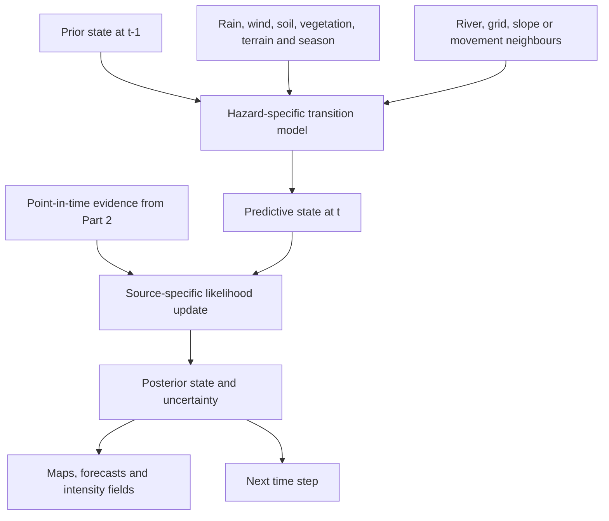
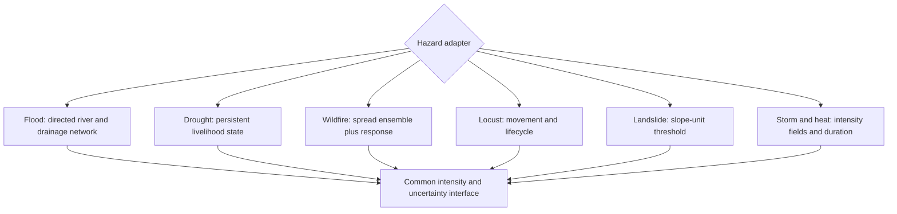
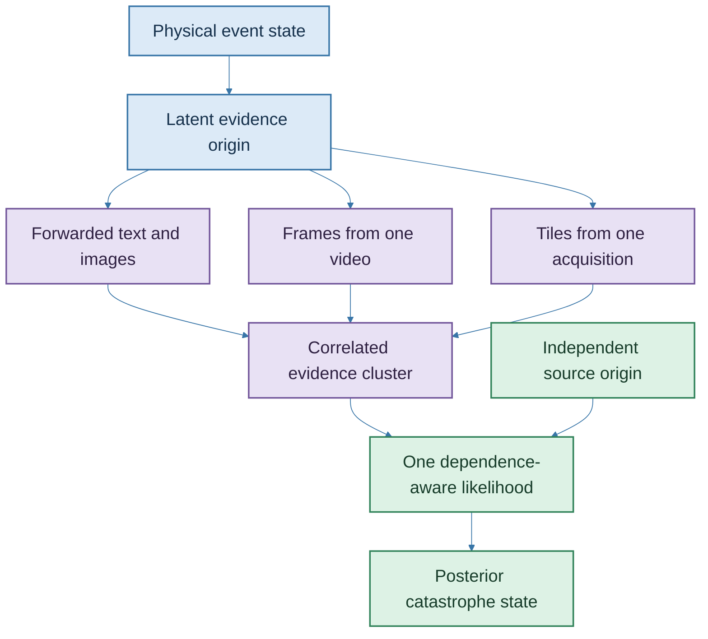
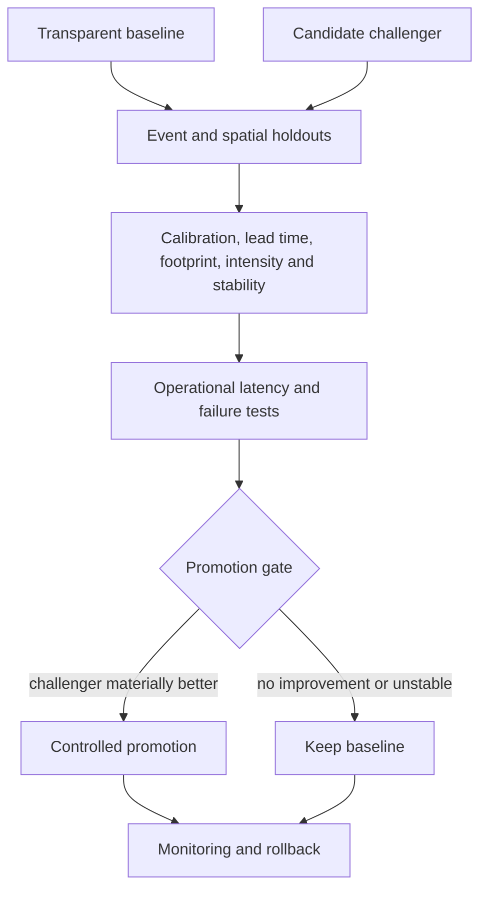

# Part 3: Spatiotemporal Hazard-State Modelling

## From evidence to an evolving physical state

At 08:00, an insurer may know that rain has fallen upstream, one gauge is rising and three community reports describe water on a road. At 11:00, a radar acquisition reveals a wider inundated area. At 15:00, a photograph corrects the assumed location of the road closure. The event has changed, but so has knowledge of the event. A catastrophe-state engine must represent both.

Spatial Catastrophe Risk Intelligence (SCRI) treats the latest polygon as one observation within a posterior distribution over the physical variables relevant to a peril and forecast horizon:

$$
p\!\left(Z_{g,t}\mid Y_{1:t}\right).
\tag{3.1}
$$

where $Z_{g,t}$ is the latent or partially observed hazard state for spatial unit $g$ at time $t$, and $Y_{1:t}$ is the evidence that was available by that valuation time. A map presents one view of this distribution, such as median extent, probability of inundation or a credible interval around a perimeter. The underlying model retains the complete probability representation.

The state evolves through a hazard-specific process:

$$
p\!\left(Z_{g,t}\mid Z_{g,t-1},Z_{\mathcal N_h(g),t-1},X_{g,t},\theta_h\right).
\tag{3.2}
$$

where $\mathcal N_h(g)$ defines the relevant neighbourhood for hazard $h$, $X_{g,t}$ contains forcing variables and $\theta_h$ contains model parameters. For flood, the neighbourhood may be directed upstream and downstream through a river or drainage network. For wildfire, it follows adjacency, wind, slope and fuel. For locusts, it is a movement corridor. For drought, temporal persistence and livelihood zones may dominate. For landslide, the state may be local to a slope unit. For heat, it may follow a gridded temperature and humidity field combined with the built environment. Appendix E derives the prediction-update recursion behind Equations (3.1)-(3.2) and states the conditional-independence assumptions needed for spatial factorisation.


**Figure 3.1: Prediction and evidence update are separate operations**

Every advanced model has a transparent baseline. A flood baseline may combine gauge thresholds, terrain and a precomputed inundation library. A drought baseline may reproduce the existing indicator-and-phase logic used in public bulletins. A fire baseline may use confirmed ignition, wind buffers and simple rate-of-spread rules. A locust baseline may advect the last confirmed location with forecast wind and wide uncertainty. A landslide baseline may combine susceptibility with rainfall thresholds. A heat baseline may use station or gridded temperature thresholds and duration. These baselines establish an understandable, fast and operationally resilient benchmark.

The challenger may be a hierarchical Bayesian state-space model, finite hidden Markov model, hidden semi-Markov model, switching process model or physics-informed ensemble. An infinite hidden Markov model becomes a research candidate when discovering an unknown number of regimes is useful. Model choice follows calibration, lead time, transfer, decision value, operating latency and compute budget.

## Six hazard adapters

### Flood: routed dependence from extent to depth

A Sentinel-1 flood mask can reveal extent under cloud. SCRI combines that extent with rainfall, river levels, terrain, drainage and hydraulic or hydrological relationships to estimate water depth at exposed properties. WRA’s basin structure and monitoring network provide the institutional and physical starting point [1]. The state vector may include:

$$
Z^{flood}_{g,t}=\{p^{wet}_{g,t},d_{g,t},v_{g,t},\tau^{on}_{g,t},\tau^{rec}_{g,t}\}.
\tag{3.3}
$$

representing inundation probability, depth, velocity, onset and recession. Each component has its own uncertainty. The product reports spatial and depth precision at the support justified by the radar, terrain, gauges and model validation [2]. Appendix E expands Equation (3.3) into a joint state with marginal and cross-component uncertainty.

### Drought: duration and livelihood condition

Drought requires memory. A finite HMM can represent phases; a hidden semi-Markov or continuous state-space model can represent explicit duration where livelihood deterioration persists, while a transparent composite indicator remains the baseline. NDMA’s four indicator families - biophysical, production, access and utilisation - connect rainfall and vegetation to water access, livestock condition, markets and household utilisation [3]. The insurer’s model consumes the authoritative drought phase as one observation or contextual variable, while the responsible public institution continues to issue that phase.

### Wildfire: detection, spread and response

The fire state separates ignition from detection:

$$
T^{ign}\le T^{det}\le T^{dispatch}\le T^{response}.
\tag{3.4}
$$

The spread model conditions on wind, fuel, moisture, terrain and suppression. The observed perimeter anchors a forecast ensemble. Community knowledge remains operationally relevant around Mount Kenya, where access, land use, fire practice and preparedness affect both observation and response [4]. SCRI reports the probability that an exposure lies within future fire footprints at selected horizons, conditional on explicit response assumptions. Appendix E derives the associated latency decomposition and shows why occurrence probability and detection probability remain separate.

### Locust: a mobile biological process

Locust state includes location, density, lifecycle and movement. Wind and vegetation affect the transition, while surveillance and control actions change what happens next. The 2019-2020 Kenya response relied on surveillance, identification of breeding grounds, ground and aerial control and livelihood restoration [5]. SCRI records control operations as state-changing interventions and widens uncertainty where surveillance coverage is sparse.

### Landslide: slope units and threshold exceedance

Landslide susceptibility answers *where failure is more plausible*; rainfall and soil conditions help answer *when*. State estimation operates over slope units or other geotechnically defensible geometries. Reports of fissures or blocked drainage contribute local evidence with measured false-alarm potential. The output is a conditional failure probability and access-impact scenario with uncertainty suited to inspection and response planning. Kenyan synthesis evidence connects rainfall, steep terrain, deforestation and drainage with regional patterns including Murang’a and West Pokot [6].

### Severe storm and heat: fields, persistence and compound effects

Storm state includes rainfall intensity, wind, hail where observed, lightning and duration. Heat state includes temperature, humidity or an approved heat-stress measure, persistence, time of day and spatial differences created by altitude, coast and urban form. A storm can trigger flood and landslide; drought and heat can increase fire-conducive conditions; heat and power failure can compound health and business interruption. The state engine records those dependencies while preserving the identity and physics of each hazard.


**Figure 3.2: Common interface, different physics**

## Constructing the operational posterior

The state engine becomes operational when each source enters through a likelihood that describes what the source could have produced under alternative physical states. A confidence score alone cannot do that work. The system needs the probability of the measurement, mask, detection or report conditional on the catastrophe state, its spatial support and the conditions under which it was created.

The complete filtering step is:

$$
p(Z_t\mid Y_{1:t},X_{1:t})
\propto
p(Y_t\mid Z_t,\Psi_t)
\int p(Z_t\mid Z_{t-1},X_t,A_t,\theta)
p(Z_{t-1}\mid Y_{1:t-1},X_{1:t-1})\,dZ_{t-1},
\tag{3.5}
$$

where $\Psi_t$ contains source, reporting, spatial-support and dependence information, and $A_t$ contains interventions that can change the physical process. The integral is the predictive prior. It carries forward the full uncertainty from the preceding state rather than substituting one estimated state. Linear-Gaussian cases admit Kalman-family solutions; nonlinear or non-Gaussian cases may use ensembles, particles, variational approximations or other validated filters. Standard Bayesian filtering and smoothing provide the algorithmic foundation [7].

### Source-specific likelihoods

A source adapter publishes the statistical relationship between the observation and the state. The first operational set is:

| Source | Candidate observation model | Material uncertainty |
|---|---|---|
| River gauge | Gaussian or robust measurement error around stage; rating-curve model for discharge | Sensor calibration, datum, rating-curve parameter, freshness and failure state |
| Rainfall station | Error model conditional on intensity and accumulation interval | Wind undercatch, missing interval and spatial representativeness |
| Segmentation surface | Pixel or region probability model with spatially correlated boundary error | Calibration, sensor artefact, co-registration, class confusion and resolution |
| Object detector | Class-specific sensitivity and false-positive model conditional on quality | Threshold, object scale, occlusion, domain shift and duplicated frames |
| Crowd report | Truthfulness and geolocation model conditional on reporting access and wording | Reporting selection, contributor context, copied origin, memory and location error |
| Satellite product | Coverage-conditioned retrieval likelihood | Acquisition time, cloud or radar geometry, processing version and unavailable coverage |
| Institutional record | Revision and delay model around the recorded variable | Administrative cut-off, definition change and reporting latency |

For a gauge reading $y_{s,t}$ measuring latent river stage $h_t$, a robust baseline is:

$$
y_{s,t}\mid h_t,b_s,\sigma_s,\nu
\sim t_{\nu}(h_t+b_s,\sigma_s),
\tag{3.6}
$$

where $b_s$ is station bias, $\sigma_s$ is observation scale and the Student-$t$ likelihood reduces the influence of an isolated extreme residual. A separate health state models a stuck or stale gauge. A discharge estimate derived from stage carries rating-curve parameter uncertainty rather than being treated as a direct measurement.

For a calibrated detector with binary class output $D_{s,t}$ and physical class-presence indicator $O_t$:

$$
P(D_{s,t}=1\mid O_t,Q_t)
=
\begin{cases}
Se_s(Q_t), & O_t=1,\\
1-Sp_s(Q_t), & O_t=0,
\end{cases}
\tag{3.7}
$$

where sensitivity $Se_s$ and specificity $Sp_s$ vary with the quality context $Q_t$, such as object scale, rain, smoke, darkness or sensor. A segmentation likelihood operates over a spatial field and must preserve local correlation; treating every pixel as independent would create implausibly concentrated posteriors.

### Reporting is part of the model

Silence in a crowd channel has several explanations. The hazard may be absent, connectivity may have failed, a community may lack access, people may prioritise safety, or the event may have damaged communications. SCRI models whether a report could have been observed:

$$
R_{s,g,t}\sim\operatorname{Bernoulli}(\pi_{s,g,t}),
\qquad
\operatorname{logit}(\pi_{s,g,t})
=\alpha_s+\beta_Z Z_{g,t}+\beta_A A^{access}_{g,t}
+\beta_C C_{g,t}+\beta_T T_{g,t}.
\tag{3.8}
$$

Here $R=1$ means a report is observed, $A^{access}$ describes access to the reporting channel, $C$ describes connectivity and $T$ describes timing and contributor availability. The content likelihood is evaluated conditional on a report. The model can therefore distinguish a verified negative report from no report and can widen uncertainty where observation access is weak.

This structure also exposes data inequality. A remote area with limited reporting cannot appear safer merely because the reporting probability is lower. Coverage indicators and posterior uncertainty become visible product outputs, while field partnerships and offline channels can improve the observation process itself.

### Contextual reliability through partial pooling

A contributor, sensor or model does not have one timeless reliability score. Reliability varies by hazard, location, variable, device, visibility, report age and verification method. The Beta-Binomial update in Appendix D remains the transparent baseline. The production challenger uses a hierarchical model:

$$
\operatorname{logit}(r_{s,k})
=\mu+u_s+v_{hazard(k)}+w_{region(k)}+\gamma^{\top}Q_k,
\tag{3.9}
$$

where $r_{s,k}$ is reliability for source $s$ in context $k$, $u_s$, $v$ and $w$ are partially pooled effects and $Q_k$ contains observable quality. A new source begins near the context-level distribution rather than at zero credibility. A source with strong flood-road reporting history does not automatically inherit the same reliability for wildfire smoke or crop-stage assessment.

Reliability is attached to a source-task context and capped as one component of the likelihood. It does not become a social score. Contributors can challenge corrections and remain eligible even when they share a device or operate in a previously sparse area.

### Common origins and correlated manifestations

Copying and platform propagation create many reports from one origin. Video frames, overlapping satellite tiles and multiple predictions from one model run create similar dependence. SCRI introduces a latent evidence origin $O_j$:

$$
p(Y_{1:n_j}\mid Z_t)
=\int p(O_j\mid Z_t)
\prod_{i=1}^{n_j}p(Y_{j,i}\mid O_j,\kappa_{j,i})\,dO_j,
\tag{3.10}
$$

where $\kappa$ describes copying, frame or processing relationships. This factorisation allows several manifestations to sharpen understanding of the origin without pretending they are independent observations of the physical state.

The duplication cluster from Part 2 supplies candidate origin links. The probabilistic layer can retain uncertainty when provenance is incomplete. One independent gauge, one satellite acquisition and one genuinely separate community photograph can provide stronger corroboration than hundreds of forwarded copies.


**Figure 3.3: Visible report count is separated from independent evidence origins**

### Asynchronous evidence, correction and replay

Operational filtering processes evidence as it arrives. Catastrophe reconstruction must also handle a photograph uploaded hours late, a gauge correction, a revised satellite mask or a policy coordinate fixed after a claim. SCRI maintains three inference products:

1. **Online filter:** the best state using evidence available at the operational cut-off.
2. **Fixed-lag smoother:** a revised recent trajectory after delayed evidence arrives.
3. **Retrospective smoother:** a complete event reconstruction for validation and learning.

An out-of-sequence observation with event time $\tau<t$ updates the stored state at $\tau$ and re-propagates affected states to the current time. The system retains the previous version, correction reason and knowledge time. Operational decisions remain auditable against what was known then, while the retrospective record can become more accurate.

The replay engine is part of validation. A model is back-tested with the same ingestion lags, missing feeds and corrections that occurred historically. This prevents a retrospective reconstruction from being presented as if it had been available during the emergency.

### Change of spatial support

SCRI combines point gauges, road lines, camera fields of view, raster pixels, polygons, basin totals and livelihood-zone indicators. Each observation is linked to the latent field through a support operator $H_s$:

$$
Y_{s,t}=H_s[Z_t]+\epsilon_{s,t},
\qquad
H_s[Z_t]=\int_{B_s}w_s(g)Z(g,t)\,dg,
\tag{3.11}
$$

where $B_s$ is the observation footprint and $w_s$ is a normalised weighting or physical response. A point gauge has highly local support; a satellite pixel integrates a ground footprint; a drought bulletin aggregates a larger administrative or livelihood area. Spatial hierarchical modelling provides the broader framework for linking latent processes and misaligned observations [8].

The operator prevents false precision. A county-level drought phase cannot be copied into each building as if it were a property measurement. A small camera view cannot define a basin-wide flood surface. Downscaling, interpolation or hydrological routing becomes an explicit model with uncertainty.

### Interventions change transitions

Information can change loss only when it changes action and the action changes the physical or social process. Drainage operation can alter urban water depth; suppression can alter fire spread; pest control can alter swarm survival; water allocation can alter drought impact; road closure can alter human exposure. The transition therefore includes $A_t$ in Equation (3.5).

For two intervention scenarios $a$ and $a'$, SCRI can simulate:

$$
Z_{t+1}^{(m)}(a)\sim p(Z_{t+1}\mid Z_t^{(m)},X_{t+1},A_{t+1}=a),
\tag{3.12}
$$

then pass both state paths to the loss engine. The intervention effect remains conditional on implementation quality and causal evidence. Observed action time, location, capacity and completion are required inputs, not narrative annotations.

### Nonstationarity and structural change

Seasonality belongs in the transition process, while long-run change can enter parameters, covariates or alternative scenarios. Relevant changes include climate forcing, land cover, urban drainage, irrigation, vegetation, building and infrastructure condition, observation coverage and response capacity. A dynamic parameter may follow:

$$
\theta_{g,t}=\theta_{g,t-1}+B x^{trend}_{g,t}+\eta_{g,t},
\tag{3.13}
$$

with shrinkage or structural-break alternatives where gradual drift is implausible. The model separates changing hazard, changing exposure, changing vulnerability and changing observation access. Otherwise, improved reporting can be mistaken for increasing event frequency, or urban growth can be incorrectly absorbed into a vulnerability parameter.

Transportability is tested by county, basin, livelihood system and sensor. Local effects are partially pooled where mechanisms are shared. Scenario outputs state their climate, land-use, exposure and response assumptions and avoid unsupported precision beyond the evidence horizon.

### Posterior samples are the actuarial interface

The principal interface to Part 4 is a set of weighted state paths:

$$
\left\{Z_{1:T}^{(m)},w_m\right\}_{m=1}^{M}
\sim p(Z_{1:T}\mid Y_{1:t},X_{1:T}),
\qquad \sum_{m=1}^{M}w_m=1.
\tag{3.14}
$$

Each sample carries extent, intensity, duration, scenario assumptions and provenance. The actuarial engine calculates damage and financial terms for every sample. This preserves thresholds, limits, deductibles, network failure and nonlinear vulnerability. Posterior means and covariance summaries remain useful for display and reconciliation, but do not replace samples where the financial transform is nonlinear.

Model-form uncertainty can be represented through stacking or Bayesian model averaging. Predictive stacking selects weights from out-of-sample predictive performance rather than rewarding model complexity in-sample [9]. The ensemble retains a transparent baseline and names each component. Posterior predictive checks compare simulated observations and events with real ones, including false alarms, missed events, duration, footprint, reporting coverage and extremes.

The operational posterior is therefore more than a coloured map. It is a versioned probability distribution that explains which sources entered, how their observation processes were modelled, which dependencies were retained, how interventions changed transitions and how uncertainty reaches the loss engine.

## Resolution, validation and operational promotion

Resolution is chosen from the decision backwards. Property claims triage may need building or parcel-level intersection, while the underlying hazard may support a coarser estimate. Drought may be credible at a livelihood-zone or subcounty scale while a gauge is a point measurement and a slope unit is highly local. SCRI stores native resolution, display resolution and any downscaling method separately, then communicates uncertainty at the support justified by the data.

Each operational state output includes:

```text
event_id and hazard_type
valuation_time and forecast_horizon
state_variable and unit
native_geometry and resolution
posterior mean or median
credible or prediction interval
probability thresholds
observation cut-off time
model and parameter version
forcing-data versions
quality and degradation status
scenario assumptions, including response
```

Validation follows the event through time. Hindcasting freezes the evidence available at each historical cut-off. Event holdouts test temporal generalisation; spatial holdouts test transfer to untrained areas; extreme-event holdouts test the tail. Metrics are matched to output: Brier or log score and reliability diagrams for probabilities; intersection-over-union for extent; continuous ranked probability score for distributions; absolute or relative error for depth, intensity or onset; lead time at a stated false-alarm rate; and duration error for slow states.


**Figure 3.4: Promotion follows demonstrated operational value**

The state engine passes distributions with provenance to the actuarial layer. A flood footprint may narrow as new radar arrives; a drought posterior may remain broad because household data are sparse; a fire forecast may branch under alternative suppression scenarios. Part 4 converts those uncertain states into damage and insured loss while preserving where the uncertainty came from.

\newpage

## References

[1] Water Resources Authority, “Basin Areas,” 2026. [Online]. Available: https://wra.go.ke/basin-areas-2/. Accessed: Aug. 28, 2026.

[2] European Space Agency, “Sentinel-1: Emergency response.” [Online]. Available: https://www.esa.int/Applications/Observing_the_Earth/Copernicus/Sentinel-1/Emergency_response. Accessed: Aug. 28, 2026.

[3] National Drought Management Authority, “National Drought Early Warning Bulletin, March 2026,” Apr. 2026. [Online]. Available: https://knowledgeweb.ndma.go.ke/Content/LibraryDocuments/National_Drought_Early_Warning_Bullletin_March_202620260411222758.pdf. Accessed: Aug. 28, 2026.

[4] M. N. Ndalila, F. Lala and S. M. Makindi, “Community perceptions on wildfires in Mount Kenya forest: implications for fire preparedness and community wildfire management,” *Fire Ecology*, vol. 20, art. no. 92, 2024, doi: 10.1186/s42408-024-00326-3. [Online]. Available: https://doi.org/10.1186/s42408-024-00326-3. Accessed: Aug. 29, 2026.

[5] World Bank, “FAQs—Kenya Locust Response Project,” Oct. 1, 2020. [Online]. Available: https://www.worldbank.org/en/country/kenya/brief/faqs-kenya-locust-response-project. Accessed: Aug. 28, 2026.

[6] E. T. N. Kinyeru, M. N. Harris and J. Jansz, “Why do landslides occur in Kenya, and what can be done to mitigate their occurrences?” *Natural Hazards*, vol. 122, art. no. 155, 2026, doi: 10.1007/s11069-025-07938-1. [Online]. Available: https://doi.org/10.1007/s11069-025-07938-1. Accessed: Aug. 29, 2026.

[7] S. Särkkä and L. Svensson, *Bayesian Filtering and Smoothing*, 2nd ed. Cambridge, UK: Cambridge University Press, 2023. [Online]. Available: https://doi.org/10.1017/9781108917407. Accessed: Aug. 30, 2026.

[8] S. Banerjee, B. P. Carlin and A. E. Gelfand, *Hierarchical Modeling and Analysis for Spatial Data*, 2nd ed. Boca Raton, FL, USA: CRC Press, 2014. [Online]. Available: https://doi.org/10.1201/b17115. Accessed: Aug. 30, 2026.

[9] Y. Yao, A. Vehtari, D. Simpson and A. Gelman, “Using Stacking to Average Bayesian Predictive Distributions,” *Bayesian Analysis*, vol. 13, no. 3, pp. 917-1007, 2018, doi: 10.1214/17-BA1091. [Online]. Available: https://doi.org/10.1214/17-BA1091. Accessed: Aug. 30, 2026.
