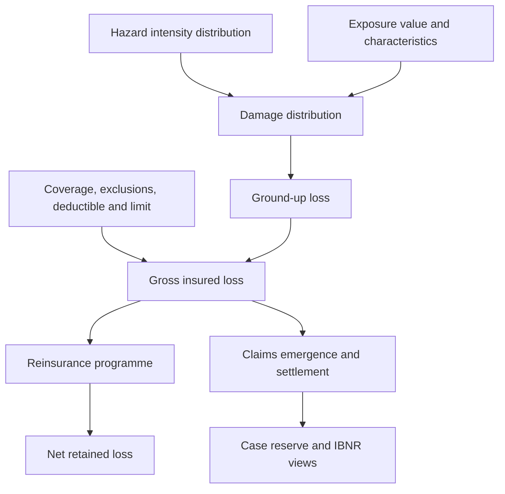
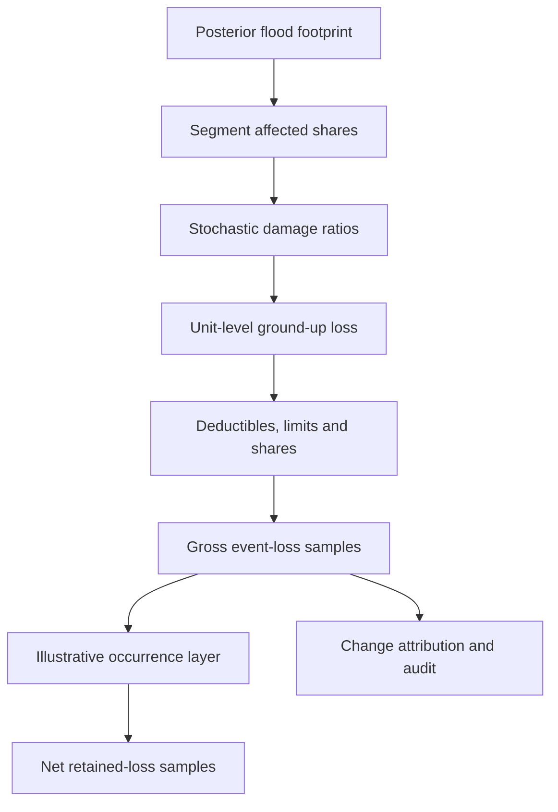
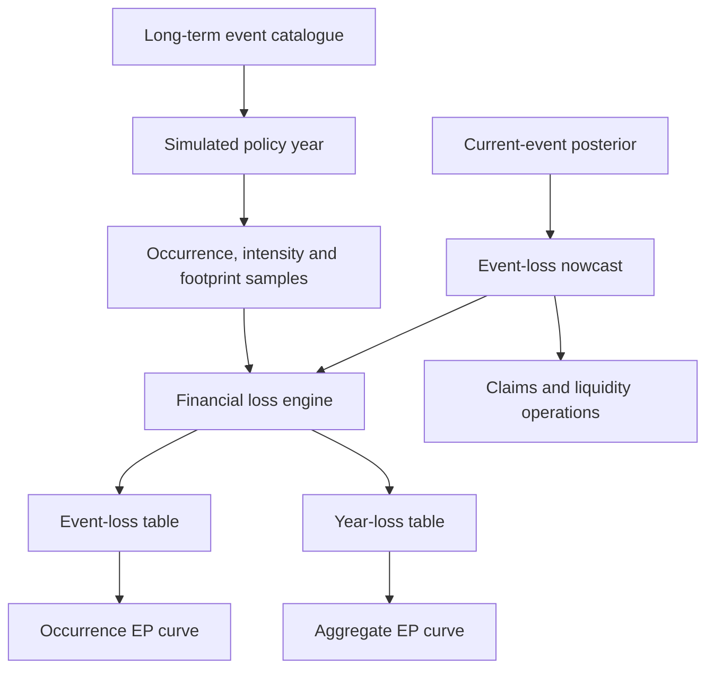
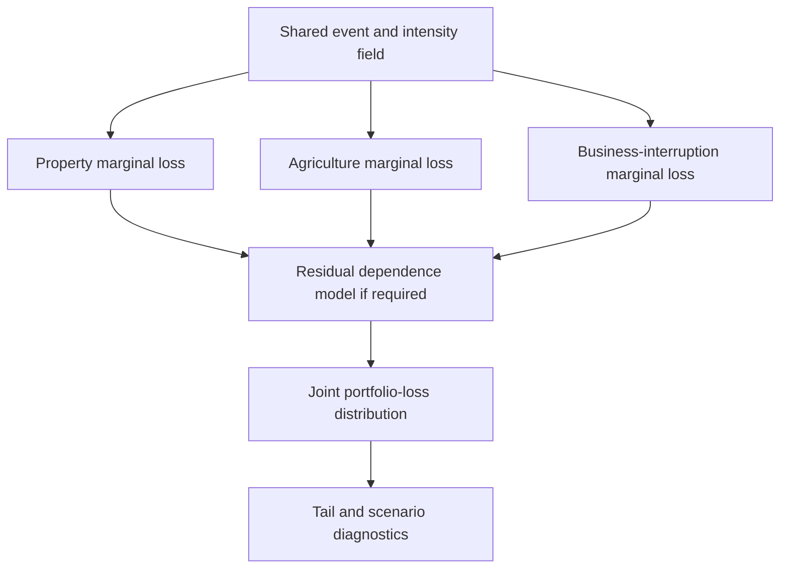

# Part 4: Actuarial Catastrophe Loss Intelligence

## The loss engine follows the policy from damage to recovery

When floodwater reaches a warehouse, depth and duration influence damage; construction and contents influence vulnerability; and replacement values establish the ground-up financial scale. Deductibles, limits, sublimits, exclusions, waiting periods, coinsurance and coverage interpretation then turn covered damage into an insured claim. Reinsurance terms determine how much of the portfolio loss remains with the insurer.

This sequence is the actuarial centre of Spatial Catastrophe Risk Intelligence (SCRI). Catastrophe modelling practice separates event, hazard, exposure, vulnerability and financial modules for a reason [1]. The state engine from Part 3 estimates the peril. The actuarial engine answers a different question: *given what is currently known about this event and this exact exposure snapshot, what distribution of ground-up, gross insured and net retained loss follows?*

For asset or coverage unit $i$ affected by event $e$ and hazard $h$:

$$
L^{GU}_{e,i}=V_i\,D_{h,c(i)}\!\left(I_{e,h}(g_i),M_i,\varepsilon_{e,i}\right).
\tag{4.1}
$$

where $V_i$ is the relevant value measure, $I_{e,h}(g_i)$ is the uncertain intensity at location $g_i$, $c(i)$ is the exposure class, $M_i$ contains secondary vulnerability modifiers and $\varepsilon_{e,i}$ represents residual damage uncertainty. The damage function $D$ is a bounded distribution where the physical quantity requires it, carrying both a mean damage ratio and variability. For a crop it may depend on inundation duration and crop stage; for a building, depth and construction; for livestock drought, the insured index or mortality mechanism; for business interruption, physical damage, access and restoration time.

A simplified occurrence-level insurance transform is:

$$
L^{INS}_{e,i}
=
q_i\,
\min\!\left[
\max\!\left(L^{COV}_{e,i}-d_i,0\right),
\ell_i
\right].
\tag{4.2}
$$

where $L^{COV}_{e,i}$ is the covered portion of ground-up loss after exclusions and sublimits, $d_i$ is the deductible, $\ell_i$ is the applicable limit and $q_i$ is the insured or coinsurance share. Real implementations also preserve policy aggregation, hours clauses, waiting periods, reinstatements and the order in which terms apply. The Oasis financial module illustrates why policy and reinsurance terms must be applied explicitly to ground-up samples to obtain gross and net perspectives [2]. Appendix F derives the moments of Equation (4.1), proves the piecewise policy transform in Equation (4.2), and shows how dependence enters portfolio aggregation.


**Figure 4.1: Physical damage, insured loss and accounting views are distinct**

The insured event total is $L^{INS}_e=\sum_i L^{INS}_{e,i}$, but the sum must retain dependence. Two adjacent buildings can share flood depth, construction practice, utility failure and access interruption. Crop policies may share the same weather and planting calendar. Motor, property and business interruption can accumulate around one blocked transport corridor. Independent asset simulations would understate the tail.

## A worked flood portfolio: from footprint to retained loss

The following **synthetic, reproducible Nzoia flood portfolio** makes every financial transformation inspectable before real exposure, claims and vulnerability evidence are introduced. Its counts, values, damage ratios, policy terms, event frequency and curve points are demonstration assumptions rather than Kenya market estimates.

The illustrative insurer has four groups exposed to the same flood footprint. The central scenario translates the posterior footprint into affected counts and one mean damage ratio for each group. Values and all losses are in KES millions.

| Segment | Policies | Value per unit | Total insured value | Central affected count | Mean damage ratio | Deductible | Limit | Insured share |
|---|---:|---:|---:|---:|---:|---:|---:|---:|
| Dwellings | 120 | 4.00 | 480.00 | 72 | 18% | 0.10 | 2.50 | 100% |
| Small businesses | 80 | 8.00 | 640.00 | 36 | 22% | 0.25 | 5.00 | 100% |
| Crop plots | 300 | 0.30 | 90.00 | 210 | 35% | 0.03 | 0.27 | 80% |
| Vehicles | 50 | 2.00 | 100.00 | 15 | 28% | 0.10 | 1.50 | 100% |
| **Portfolio** | **550** | — | **1,310.00** | **333** | — | — | — | — |

For dwellings, the central ground-up loss is $72\times4.00\times0.18=51.84$. The insured amount per affected dwelling is $\min[\max(4.00\times0.18-0.10,0),2.50]=0.62$, giving KES 44.64 million. The same order of operation is repeated for each segment; applying a portfolio-average deductible after aggregation would be wrong.

| Segment | Ground-up loss | Gross insured loss | Difference created by terms |
|---|---:|---:|---:|
| Dwellings | 51.84 | 44.64 | 7.20 |
| Small businesses | 63.36 | 54.36 | 9.00 |
| Crop plots | 22.05 | 12.60 | 9.45 |
| Vehicles | 8.40 | 6.90 | 1.50 |
| **Central scenario** | **145.65** | **118.50** | **27.15** |

Suppose, for this demonstration, that a catastrophe excess-of-loss layer pays losses above KES 75 million up to KES 100 million. At the central gross loss of KES 118.50 million, the illustrative recovery is $\min[\max(118.50-75,0),100]=43.50$ million and the insurer’s event retention is KES 75.00 million. A production extension would add reinstatement premium, aggregate terms, exclusions, collectability, loss-adjustment expense and the timing of cash recovery.

The simulation expands the central scenario into a loss distribution. It treats affected share and mean damage ratio as uncertain beta variables, applies policy terms at unit level and preserves one common event draw within each segment. Across 60,000 event simulations, gross insured loss has a P10 of KES 83.51 million, a median of KES 115.86 million, a P90 of KES 155.58 million and a P95 of KES 168.83 million. The deterministic central case differs from the median because deductibles, limits and stochastic affected counts make the transform nonlinear.

Here **P10** means the tenth percentile of the simulated event-loss distribution: 10% of simulated losses are at or below that value. It is not a “1-in-10-year” loss. A 1-in-10-year annual loss corresponds to a 10% annual exceedance probability on a stated OEP or AEP curve. SCRI displays percentile, exceedance probability, return period, horizon and gross/net basis together.


**Figure 4.2: Calculation path for the synthetic worked example**

To demonstrate the annual clock, a second simulation samples 100,000 synthetic years with a Poisson mean of 0.65 events per year and the event-loss distribution above. It produces an illustrative annual average gross insured loss of KES 76.36 million. The model’s three-year AEP and OEP points are KES 110.36 million and KES 107.06 million respectively; at 100 years they are KES 386.83 million and KES 188.17 million. The widening gap is expected: AEP includes every event in a year, whereas OEP uses only the largest event.

{ width=94% }

**Figure 4.3: Synthetic aggregate and occurrence exceedance curves.** The fixed seed, assumptions and generated values are stored with the manuscript. These curves demonstrate the interface; production pricing, reserving, reinsurance and capital use begins after empirical calibration and independent review.

The next evidence layer upgrades the demonstration into an empirically calibrated model. Policy records establish location, coverage, values and terms. Claims and engineering evidence calibrate vulnerability by depth, duration and asset type. Historical event catalogues and climate assumptions support frequency. Reinsurance contracts are encoded and independently reconciled. Until those steps are complete, the product label remains **demonstration**.

## Current-event loss and long-term catastrophe risk

SCRI operates on two clocks. The **event clock** updates the unfolding catastrophe. New gauges, imagery and reports change the posterior intensity and footprint, which change the event-loss distribution. The **portfolio clock** governs annual expected loss, tariff support, risk appetite, reinsurance purchase and capital. It changes only through a controlled model version using an event catalogue, exposure assumptions, vulnerability calibration and financial terms appropriate to that horizon.

For the long-term catalogue, event count in hazard $h$, region $g$ and year $y$ may use a Poisson, Negative Binomial, point-process, renewal or state-duration model. A Negative Binomial is a candidate when conditional counts remain overdispersed after relevant covariates:

$$
N_{h,g,y}\sim\operatorname{NegBin}(\mu_{h,g,y},\phi_h).
\tag{4.3}
$$

$$
\log\mu_{h,g,y}
=
\log E_{h,g,y}+\eta_{h,g,y}.
\tag{4.4}
$$

where $E_{h,g,y}$ is an exposure-to-occurrence measure such as years, area-time or another definition established for that hazard. When $\mu$ contains the exposure offset, it already represents the expected count for that observation cell and enters the pure-premium calculation once. Appendix F derives the mean-variance relationship for Equation (4.3) and the rate interpretation of the exposure offset in Equation (4.4).

Frequency modelling follows each hazard. A drought episode may be represented by a persistent regime and duration. A wildfire catalogue may distinguish ignitions from escaped fires. Locust outbreaks may be conditioned on regional biological and climate regimes. A Poisson or empirical-frequency baseline makes the challenger’s improvement measurable. Real-time reports update the current event record, while the annual catalogue changes through a separate controlled event-definition process.

Annual aggregate loss is generated from the catalogue:

$$
S_y=\sum_{e=1}^{N_y}L^{NET}_{e,y}.
\tag{4.5}
$$

with event clustering, cross-peril relationships and policy/reinsurance terms applied in the correct order. Simulated year-loss tables or equivalent analytical outputs support:

- annual average loss, $\mathbb E[S_y]$;
- occurrence exceedance probability, based on the largest event loss in a year;
- aggregate exceedance probability, based on total annual loss;
- selected quantiles such as VaR at a stated probability;
- TVaR or expected shortfall beyond a stated quantile;
- scenario losses and uncertainty ranges.

“Probable maximum loss” is reported with its definition. It may refer to a quantile of occurrence loss, aggregate annual loss or a deterministic scenario; the probability, horizon, gross/net basis, currency, exposure date and model version accompany it.


**Figure 4.4: Event nowcasting and annual risk use related but different clocks**

## Severity, tails and dependence are empirical choices

SCRI evaluates candidate bulk distributions such as Gamma, Lognormal, Weibull or mixtures; asset-level loss may instead emerge from stochastic vulnerability functions. Selection uses exposure- and inflation-normalised data, censored and truncated likelihoods where required, diagnostic plots, proper scoring rules and out-of-sample validation.

If a peaks-over-threshold model is used, exceedances above threshold $u$ may follow a Generalized Pareto distribution:

$$
L-u\mid L>u
\sim
\operatorname{GPD}(\xi,\beta_u).
\tag{4.6}
$$

Threshold choice is a model decision with a bias-variance trade-off. The analysis states the exceedance count, threshold diagnostics, parameter stability, continuity or splicing method, treatment of limits and inflation, and uncertainty. Research on insurance-loss modelling likewise treats threshold selection and bootstrap uncertainty as substantive parts of the method [3], while standard quantitative-risk texts place tail estimates inside a wider framework of model and parameter uncertainty [4]. Where the Kenyan tail sample is sparse, documented external data, engineering scenarios and expert judgement support wider and more transparent uncertainty ranges. Appendix F derives compound annual-loss moments, OEP and AEP relationships and the tail-quantile expression implied by Equations (4.5)-(4.6).

Dependence receives the same discipline. A Gaussian copula is symmetric and has no asymptotic tail dependence; a conventional Student-$t$ copula has symmetric tail dependence. Where upper- and lower-tail behaviour differs, candidates may include appropriate Archimedean families, vines, factor models, max-stable or spatial-process approaches [5]. Model selection considers dimensionality, data volume, physical mechanism and tail diagnostics. For many catastrophe portfolios, shared event and intensity fields already induce dependence, so any residual copula is calibrated to the dependence remaining after the hazard simulation.


**Figure 4.5: Dependence begins with the common physical event**

## Completing the event-loss distribution

The event-loss distribution must carry uncertainty from every major transformation, not only hazard intensity. A building may be geocoded to a parcel centroid when the insured structure sits at a different elevation. Replacement value may be indexed from an old declaration. Construction, occupancy, crop stage or asset condition may be misclassified. A vulnerability curve may be estimated from a small, selectively reported claims sample. SCRI represents these as model inputs with distributions and provenance.

For posterior hazard sample $m$, an expanded unit loss is:

$$
L_{e,i}^{GU,(m)}
=V_i^{(m)}D_{h,C_i^{(m)}}
\!\left(I_{e,h}^{(m)}(G_i^{(m)}),M_i^{(m)},\beta_h^{(m)},\varepsilon_{e,i}^{(m)}\right),
\tag{4.7}
$$

where value $V$, geolocation $G$, class $C$, modifiers $M$ and vulnerability parameter $\beta$ can all be uncertain. Shared draws preserve dependence: one post-event inflation factor may affect many repairs; one location-quality process may affect a block of legacy policies; one vulnerability parameter draw affects all assets in its class. The output can then attribute variance to hazard, exposure, vulnerability and financial terms.

### Damage distributions with boundary mass

A mean damage ratio alone rarely describes claims adequately. Many exposed assets experience no damage, while a smaller group reaches constructive or actual total loss. A flexible bounded model can combine a zero-damage mass, a continuous damage ratio and a total-loss mass:

$$
D_i\sim
\begin{cases}
0, & \text{with probability }\pi_{0,i},\\
\operatorname{Beta}(a_i,b_i), & \text{with probability }1-\pi_{0,i}-\pi_{1,i},\\
1, & \text{with probability }\pi_{1,i}.
\end{cases}
\tag{4.8}
$$

Both boundary probabilities can depend on intensity and vulnerability. For drought or crop loss, the boundary may represent no yield effect and complete insured yield loss. For business interruption, a separate occurrence indicator and restoration-time distribution are often more interpretable than forcing the outcome into one damage ratio.

Claims used for calibration can be censored by policy limits, truncated by reporting thresholds or altered by deductibles. The likelihood must follow the observed quantity. A policy-limit payment indicates that covered loss was at least the exhaustion point; it is not evidence that ground-up loss equalled the limit. Closed-without-payment claims, partial inspections and missing uninsured damage also carry selection information.

### Demand surge, inflation and settlement economics

Catastrophes change the cost of repair. Labour, materials, transport, accommodation and specialist capacity may become scarce. SCRI separates ordinary valuation inflation from event demand surge and from claims-development inflation. A scenario factor can depend on affected construction volume, access and elapsed time, with common draws across the affected region. The model reports the price date of values and the currency basis of every loss.

Claims leakage, fraud, salvage and subrogation are separate transformations. Leakage and fraud require claims evidence and operational controls; they are not inferred from a hazard footprint. Salvage and subrogation reduce ultimate cost with their own timing and recovery uncertainty. Direct and indirect loss-adjustment expense are modelled explicitly so operational workload and external-adjuster cost do not disappear inside indemnity loss.

### Business interruption and infrastructure networks

Business interruption depends on more than physical damage. Restoration time can include inspection, repair, utility recovery, access, supplier recovery and policy waiting periods. A simple representation is:

$$
L_i^{BI}=m_i\,[T_i^{restore}-w_i]^+,
\qquad
T_i^{restore}=\max(T_i^{asset},T_i^{access},T_i^{utility},T_i^{supplier}),
\tag{4.9}
$$

where $m_i$ is the insured contribution margin or other contractually defined rate and $w_i$ is the waiting period. Contingent business interruption uses supplier or customer dependencies even when the insured site has limited physical damage.

Infrastructure networks create correlated interruption. A bridge, substation, water plant or communication link can connect many exposures. SCRI represents critical nodes and service areas, then simulates component failure and restoration. The same network view supports uninsured livelihood and public-service loss, while insured coverage remains subject to policy wording.

### Reinsurance, event definition and collectability

Reinsurance recovery depends on contract terms, event aggregation and timing. Hours clauses and event definitions determine which losses may be grouped. Event clustering can create several occurrences close together or one compound event affecting several perils. The event catalogue therefore stores physical lineage, contractual occurrence assignment and alternative interpretations where wording is unresolved.

Expected recovery also carries counterparty and dispute uncertainty. A recoverable calculated from treaty terms is different from cash collected. Collectability scenarios consider reinsurer credit, collateral, documentation, dispute, currency and settlement timing. The net-loss record presents contractual recovery, expected collectable recovery and cash timing separately.

Multi-peril annual catalogues preserve the possibility that drought, heat and fire share a climate regime; storm and flood occur in one system; or flooding and landslide affect the same road network. Correlation is calibrated through physical and statistical evidence, with scenario stress where data are sparse.

## Claims nowcasting, reserves and the value of intervention

An event-loss nowcast supports operations before all claims are reported. It estimates a range of ultimate insured loss from the current footprint, exposure, vulnerability and financial terms. A claims emergence model then connects that ultimate view to reported counts and paid amounts:

$$
N^{rep}_{e,k}\mid N^{ult}_e
\sim
\operatorname{Binomial}\!\left(N^{ult}_e,F_N(k\mid x_e)\right).
\tag{4.10}
$$

where $k$ is elapsed development time and $F_N$ is a reporting curve conditional on event and operational characteristics. Severity development, reopening, salvage, loss-adjustment expense and claims inflation require separate treatment. The nowcast enters the reserving process as evidence, while the insurer’s actuarial and finance functions own case reserves, IBNR and accounting entries under the applicable basis.

Detection latency enters the model only where an intervention pathway exists. Let $A_e$ record whether a response was available and implemented, and $\tau_e$ the effective response delay. Conditional severity may include:

$$
\mathbb E[L^{GU}_e\mid I_e,X_e,A_e,\tau_e]
=
m_h(I_e,X_e)+\delta_h(A_e,\tau_e).
\tag{4.11}
$$

Here $\delta_h$ is a causal effect estimated from evidence. Confounding is substantial: severe events may be detected earlier because they are visible, while easier-to-reach events may receive faster intervention and also cause less loss. Credible estimation may require matched events, quasi-experimental designs, randomised operational trials where ethical, or structured scenario analysis. The output is an avoided-loss range conditional on assumptions. Appendix F derives the reporting-count moments in Equation (4.10), an ultimate-count estimator, and the causal contrast associated with Equation (4.11).

## Catastrophe-informed reserving

Claims nowcasting and reserving answer related but different questions. The nowcast asks what ultimate insured loss follows from the current catastrophe state and exposure. The reserve combines that prior view with reported, paid, case-estimate and settlement evidence under the insurer's reserving basis.

Let $U_e$ denote ultimate event loss and $C_{e,1:k}$ the complete claims-development evidence available through development time $k$. The challenger posterior is:

$$
p(U_e\mid C_{e,1:k},H_{e,t})
\propto
p(C_{e,1:k}\mid U_e,\theta_C)
p(U_e\mid H_{e,t},E,V,F),
\tag{4.12}
$$

where the prior is generated by posterior hazard $H$, exposure $E$, vulnerability $V$ and financial terms $F$. As claims mature, the likelihood increasingly informs the posterior. The system records how much movement came from changing catastrophe evidence, new claims, case revisions, payment, inflation or closure.

The event reserve view reconciles:

$$
U_e
=P_e+RBNS_e+IBNER_e+IBNR_e+REOPEN_e+LAE_e-SALV_e-SUBR_e,
\tag{4.13}
$$

where $P$ is paid loss, RBNS is reported but not settled, IBNER is development on reported claims, IBNR is unreported loss, $REOPEN$ covers reopened claims, $LAE$ is loss-adjustment expense, and salvage and subrogation reduce ultimate cost. Reinsurance recoveries are developed in a separate gross-to-net reconciliation.

Count and severity development are modelled separately where useful. Reporting-time survival models condition on channel, accessibility, catastrophe severity and operational disruption. Settlement and closure models condition on claim type, damage, documentation, repair capacity and dispute. Paid and incurred development models incorporate calendar inflation and event-specific operational effects.

Transparent baselines remain mandatory:

- chain ladder for stable development triangles;
- Bornhuetter-Ferguson to combine an a priori expectation with emergence;
- Cape Cod where exposure and historical experience support the expected loss ratio;
- Mack distribution-free process uncertainty under its assumptions;
- bootstrap or GLM reserving for predictive distributions; and
- claim-level reporting, payment, settlement and reopening models.

The catastrophe-informed Bayesian reserve is promoted only when point-in-time back-testing shows improved ultimate prediction, interval coverage and operational interpretation. The test set reconstructs historical events at successive knowledge cut-offs. It measures bias, mean absolute or squared error, quantile loss, coverage, reserve variability and one-year deterioration. Established stochastic reserving literature provides the baseline framework for prediction and uncertainty [6], [7].

The reserve dashboard displays paid, case, IBNER, IBNR, LAE, recoveries and uncertainty by event, peril, county and line. Each figure states valuation date, currency and gross/net basis. The responsible actuary owns assumptions and booking; SCRI supplies reproducible evidence, posterior samples and diagnostics.

## IFRS 17 is an accounting translation

IFRS 17 measurement is introduced after the reserve model because it has a different purpose. The standard describes fulfilment cash flows as estimates of amounts expected to be collected and paid, including adjustments for timing and risk, and defines a risk adjustment for non-financial risk [8]. SCRI can provide claim and expense cash-flow scenarios, timing evidence and uncertainty analysis, while the insurer's accounting policy determines grouping, measurement model, discounting, risk adjustment, presentation and disclosure.

For incurred claims, an illustrative fulfilment-cash-flow view is:

$$
FCF_t
=\mathbb E_t\!\left[\sum_{u>t}\frac{CF_u}{B(t,u)}\right]+RA_t,
\tag{4.14}
$$

where $CF_u$ contains probability-weighted future claim, expense and recovery cash flows within the applicable boundary, $B(t,u)$ is the accumulation or discount factor and $RA_t$ is the entity's risk adjustment for non-financial risk. This expression is explanatory; the insurer applies the complete standard and its accounting policy.

Four quantities remain distinct:

| Quantity | Primary purpose | Owner |
|---|---|---|
| Event-loss nowcast | Operational estimate of ultimate loss from the unfolding event | Catastrophe analytics and claims |
| Actuarial reserve estimate | Best estimate and uncertainty for outstanding claims | Reserving actuary and finance |
| IFRS 17 liability and risk adjustment | Financial reporting under the entity's accounting policy | Finance, actuarial and audit |
| Internal economic capital | Management view of capital required for the risk profile | Risk, capital and board |

## One-year economic-capital modelling

Economic capital measures the adverse one-year change in available capital or net asset value under the institution's internal risk framework. Define:

$$
X_{1y}=-\Delta NAV_{1y}.
\tag{4.15}
$$

An internal unexpected-loss measure at confidence level $\alpha$ is:

$$
EC_{\alpha}=VaR_{\alpha}(X_{1y})-\mathbb E[X_{1y}],
\tag{4.16}
$$

while tail value at risk is:

$$
TVaR_{\alpha}(X_{1y})
=\mathbb E[X_{1y}\mid X_{1y}>VaR_{\alpha}(X_{1y})],
\tag{4.17}
$$

with an appropriate discrete-distribution definition where needed. VaR gives a quantile; TVaR describes the average beyond it and is often more informative about tail severity. Confidence level, horizon, balance-sheet perimeter, management actions and valuation basis accompany both.

The one-year simulation combines:

- catastrophe underwriting loss from the multi-peril year catalogue;
- attritional premium risk and ordinary claims variability;
- reserve deterioration on prior events and accident years;
- reinsurance recovery and counterparty-credit risk;
- market and asset-value risk;
- operational, cyber, vendor and model events where included in the framework;
- liquidity stress from claim and recovery timing; and
- concentration by county, basin, peril, line and counterparty.

Dependencies follow plausible mechanisms. A catastrophe can simultaneously increase claims, weaken investment assets, delay reinsurance cash and create operational disruption. Drought, heat and fire may share a regime. Flood can damage collateral and create credit stress for policyholders or counterparties. Alternative dependency and reverse-stress scenarios test model-form uncertainty.

Kenya's regulatory capital requirement remains the applicable statutory measure. The Insurance (Capital Adequacy) Guidelines require insurers to assess capital required and available and maintain a capital adequacy level commensurate with their risk profile [9]. SCRI does not replace that calculation. It supports catastrophe scenarios, concentrations and evidence that may inform the insurer's regulatory and internal capital processes.

| Capital or margin concept | Meaning |
|---|---|
| Kenya regulatory risk-based capital | Statutory solvency requirement under the applicable Kenyan framework |
| Internal economic capital | Management estimate of capital needed for the institution's chosen risk appetite and profile |
| IFRS 17 risk adjustment | Compensation the insurer requires for bearing non-financial risk in insurance-contract cash flows |
| Reinsurance or transaction risk margin | Commercial pricing component determined by the contract or transaction |

### Capital allocation and risk-adjusted return

If portfolio capital is a positively homogeneous risk measure $\rho(X)$, Euler allocation assigns component $j$:

$$
EC_j=x_j\frac{\partial\rho(X)}{\partial x_j},
\qquad
\sum_j EC_j=\rho(X),
\tag{4.18}
$$

under the required differentiability conditions. Components can be peril, county, line, treaty or customer segment. Marginal and scenario contributions remain useful when the conditions are not satisfied. Allocation is a management lens, not a claim that each county holds a physically separate pot of capital.

Risk-adjusted return can be expressed as:

$$
RAROC_j=\frac{\mathbb E[Profit_j]-Cost_j^{risk}}{EC_j},
\tag{4.19}
$$

with numerator and capital definitions documented. The measure can reveal concentrations that earn attractive nominal premium but consume disproportionate tail capital. It can also recognise a validated resilience intervention where it changes the loss distribution rather than merely receiving a label.

### Reinsurance optimisation and liquidity

Candidate reinsurance programmes are applied to identical year-loss samples. The optimisation considers expected premium and expenses, retained loss, regulatory and economic capital, counterparty risk, reinstatement, collateral, basis risk and claim/recovery timing:

$$
\min_{r\in\mathcal R}
\left\{
Premium(r)+\lambda_C EC_{\alpha}(r)+\lambda_L LiquidityStress(r)
\right\}
\tag{4.20}
$$

subject to risk-appetite, coverage, counterparty and operational constraints. The result is a decision frontier rather than an automatic treaty purchase. Reverse stress testing asks which combination of catastrophe, reserve deterioration, asset loss, failed recovery and operational disruption would breach a capital or liquidity threshold.

Multi-year scenarios connect the one-year capital view to business planning and climate uncertainty. They do not convert a long-run climate scenario directly into a one-year probability without a documented method. The board can see current risk, plausible change, management actions and the conditions under which the strategy needs revision.

The canonical loss record makes every financial quantity auditable:

```text
event_id and hazard_type
valuation_time and observation cut-off
scenario or posterior-state version
exposure snapshot and currency basis
ground-up loss distribution
gross insured loss distribution
net retained loss distribution
reported and ultimate claims views
mean, quantiles and exceedance probabilities
occurrence or aggregate horizon
policy and reinsurance terms versions
uncertainty decomposition
model version and data-quality status
accountable user and permitted use
```

| Output | Meaning | Typical owner | Not interchangeable with |
|---|---|---|---|
| Event-loss nowcast | Current estimate of ultimate loss from one unfolding event | Catastrophe analytics / claims | Booked reserve |
| Gross insured loss | Covered loss after direct policy terms | Actuarial / underwriting | Ground-up economic loss |
| Net retained loss | Gross loss after reinsurance recoveries | Reinsurance / capital | Available cash |
| AAL | Mean annual loss over the model horizon | Pricing / portfolio / capital | Current-event loss |
| OEP / AEP | Annual occurrence or aggregate exceedance relationship | Reinsurance / capital | Deterministic forecast |
| Case reserve / IBNR | Accounting estimate under the insurer’s reserving basis | Reserving actuary / finance | Parametric payout trigger |
| IFRS 17 fulfilment cash flows and risk adjustment | Accounting measurement under the entity's policies and the applicable standard | Finance / actuarial / audit | Internal economic capital |
| Internal economic capital | One-year management view of unexpected loss in available capital or net asset value | Risk / capital / board | Regulatory capital requirement or booked reserve |

The architecture shortens the distance between physical evidence and a financially defined, revisable distribution. It shows why that distribution changed, which policies drove it, which uncertainty remains and which institution owns the next decision. Speed and traceability together make the estimate operationally useful.

\newpage

## References

[1] Institute and Faculty of Actuaries, “Catastrophe Modelling Working Party Report,” 2006. [Online]. Available: https://actuaries.org.uk/media/z0hahpz3/catreport2006.pdf. Accessed: Aug. 28, 2026.

[2] Oasis Loss Modelling Framework, “Oasis Financial Module,” 2016. [Online]. Available: https://oasislmf.org/application/files/9117/1624/0856/Financial_Module.pdf. Accessed: Aug. 28, 2026.

[3] Y. Hou, S. K. Kang, C. C. Lo and L. Peng, “Three-step risk inference in insurance ratemaking,” *Insurance: Mathematics and Economics*, vol. 105, pp. 1–13, 2022, doi: 10.1016/j.insmatheco.2022.03.005. [Online]. Available: https://doi.org/10.1016/j.insmatheco.2022.03.005. Accessed: Aug. 29, 2026.

[4] A. J. McNeil, R. Frey and P. Embrechts, *Quantitative Risk Management: Concepts, Techniques and Tools*, revised ed. Princeton, NJ, USA: Princeton University Press, 2015. [Online]. Available: https://press.princeton.edu/books/hardcover/9780691166278/quantitative-risk-management. Accessed: Aug. 29, 2026.

[5] H. Joe, *Dependence Modeling with Copulas*. Boca Raton, FL, USA: CRC Press, 2014, doi: 10.1201/b17116. [Online]. Available: https://doi.org/10.1201/b17116. Accessed: Aug. 29, 2026.

[6] P. D. England and R. J. Verrall, “Stochastic claims reserving in general insurance,” *British Actuarial Journal*, vol. 8, no. 3, pp. 443–518, 2002, doi: 10.1017/S1357321700003809. [Online]. Available: https://doi.org/10.1017/S1357321700003809. Accessed: Aug. 30, 2026.

[7] T. Mack, “Distribution-free calculation of the standard error of chain ladder reserve estimates,” *ASTIN Bulletin*, vol. 23, no. 2, pp. 213–225, 1993, doi: 10.2143/AST.23.2.2005092. [Online]. Available: https://doi.org/10.2143/AST.23.2.2005092. Accessed: Aug. 30, 2026.

[8] IFRS Foundation, “IFRS 17 key terms.” [Online]. Available: https://www.ifrs.org/supporting-implementation/supporting-materials-by-ifrs-standards/ifrs-17/key-terms/. Accessed: Aug. 30, 2026.

[9] Insurance Regulatory Authority, Kenya, *Insurance (Capital Adequacy) Guidelines, 2017*. [Online]. Available: https://ira.go.ke/assets/file/The%20Insurancce%20Valuation%20of%20Technical%20Provisions%20for%20General%20Insurance%20Business%20Guidelines%202017.pdf. Accessed: Aug. 30, 2026.
