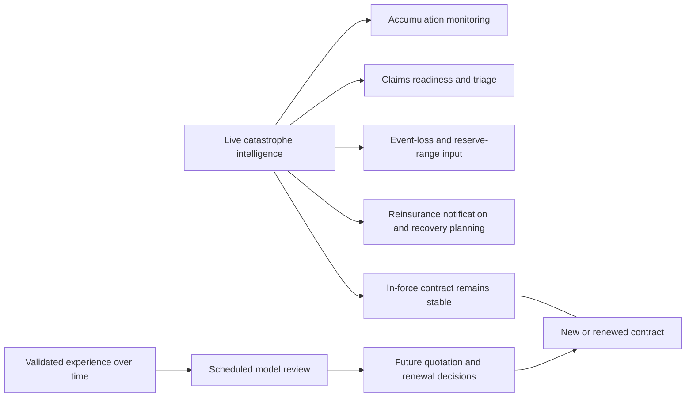
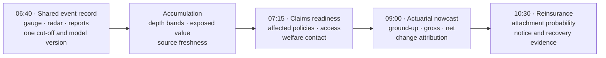
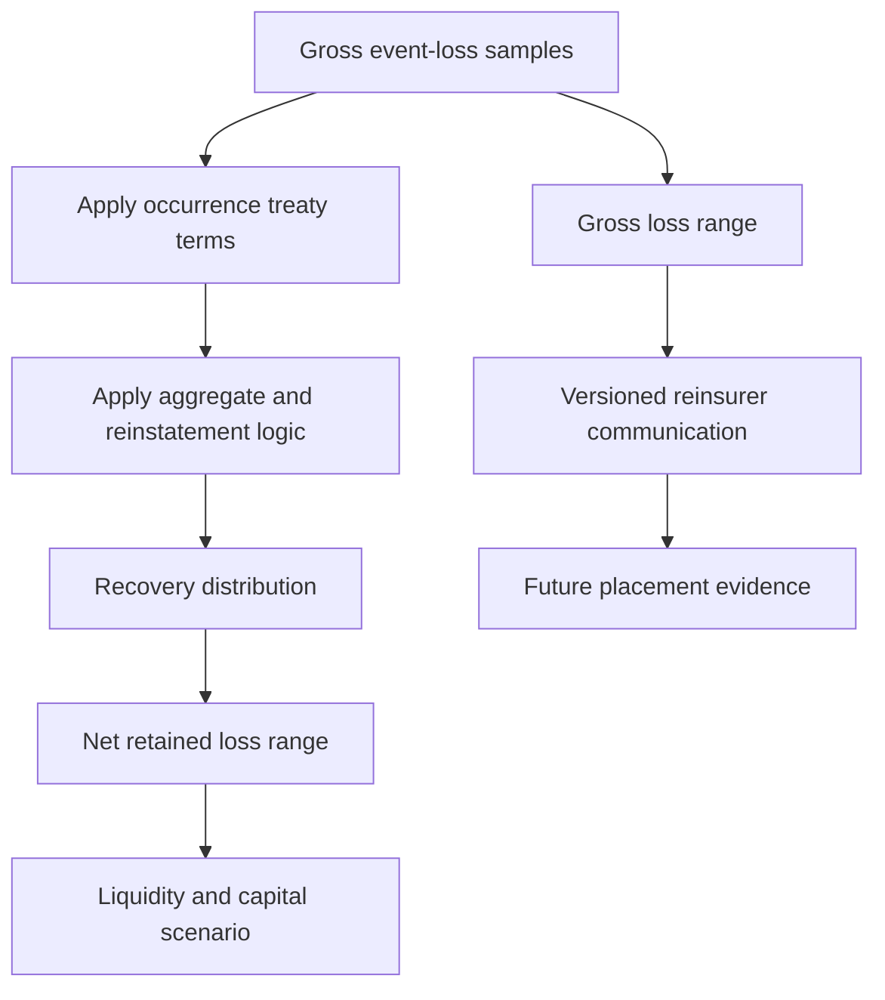
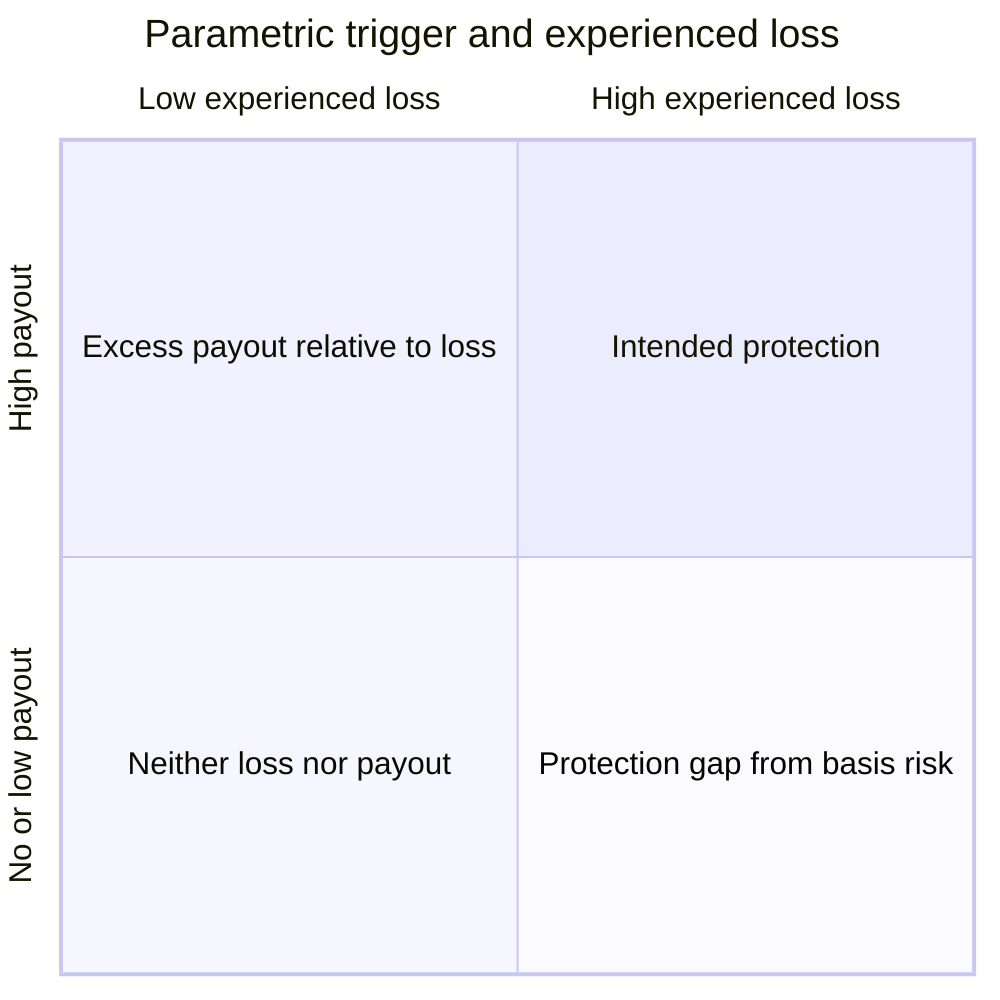
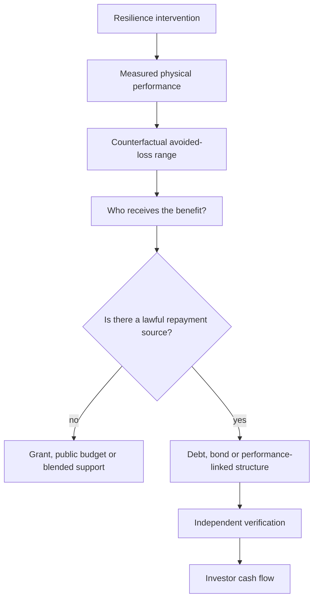
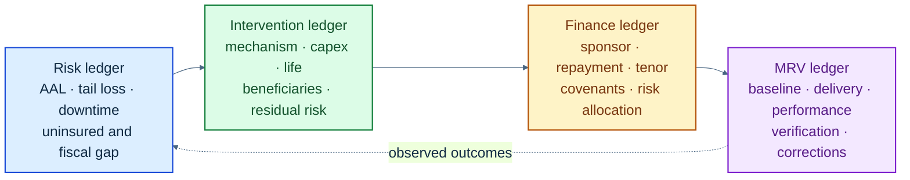
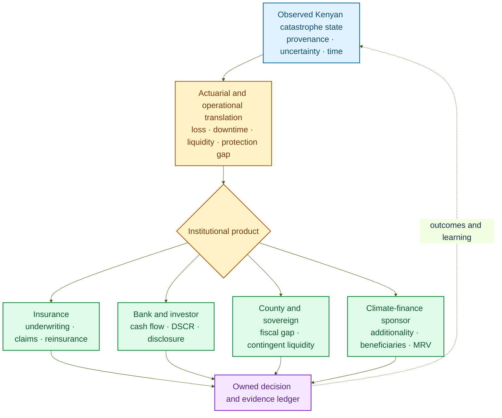

# Part 5: Insurance, Investment and Resilience Finance

## Continuous underwriting with a stable customer promise

When the Nzoia leaves its banks, an insurer has several urgent questions. Which active policies intersect the credible flood footprint? How much insured value sits within each depth band? Which claims channels, adjusters and repair networks should be prepared? What range of gross and net loss should be communicated internally and to reinsurers? SCRI answers these operational questions while the customer’s in-force promise remains stable.

That operating model defines **continuous catastrophe underwriting** in Spatial Catastrophe Risk Intelligence (SCRI). The product continuously observes the portfolio and serves each insurance team on its own decision clock. During an event, it supports accumulation, claims readiness, event-loss nowcasting, reinsurance notification and liquidity planning. At a future quotation or renewal, governed experience informs rating, deductibles, limits, mitigation requirements and appetite. The Insurance Regulatory Authority’s insurance-risk guideline treats pricing, underwriting, claims, reserving and reinsurance as distinct controlled processes [1]; SCRI gives them a common evidence foundation.

**Figure 5.1: Continuous intelligence and contractual underwriting run on different clocks**

The distinction changes the product interface. A portfolio manager sees exposure by hazard intensity, confidence and line of business. A claims manager sees likely affected policies, contact status, access constraints and triage priority. A reserving actuary sees a versioned event-loss distribution, reported emergence and uncertainty. A reinsurance manager sees estimated loss by treaty, attachment proximity and data cut-off. An underwriter’s prospective workspace presents long-term hazard and mitigation evidence at quotation or renewal.

| Decision moment | SCRI may support | SCRI does not authorise |
|---|---|---|
| Active event, in-force policy | Exposure matching, welfare contact, claims triage, reserve-range input, reinsurance notice | Premium change, cancellation, new exclusion or retroactive deductible |
| Quote already issued | Flag for authorised human review under documented rules | Silent withdrawal or discriminatory treatment |
| New quotation | Prospective risk assessment using approved model and data | Unreviewed automated refusal based on a crowd report |
| Renewal | Experience analysis, mitigation recognition, filed or approved pricing workflow as applicable | Treating one event nowcast as a new annual tariff |
| Claims decision | Evidence retrieval and prioritisation | Automatic coverage or causation determination from a hazard polygon |

More precise geography can improve risk differentiation by replacing county-wide assumptions with local exposure mechanisms. It also reveals affordability challenges for highly exposed households. SCRI therefore reports affordability, take-up, declination and subgroup outcomes alongside discrimination and calibration. Partial pooling stabilises sparse estimates, while explicit product choices govern cross-subsidy, public support and risk-pool design.

## One flood, four desks, one evidence trail

At 06:40, a basin gauge and rainfall nowcast push the lower-Nzoia state above the insurer’s accumulation-watch threshold. The screen shows how the probability of specified depth bands has changed, names the observations responsible, marks one gauge as twelve minutes stale and displays active exposure within each credible footprint. The accumulation analyst acknowledges the watch and requests an update in thirty minutes.

At 07:15, two independently sourced road reports and radar-derived water extent increase confidence in one area while a copied image cluster is consolidated. The claims operations lead receives likely affected policies, last verified contact channel, accessibility, policy type and the reason for each priority. Welfare contact and claim-intake preparation begin under an approved playbook. Customers can respond through smartphone, contact-centre or field channels, and sparse digital reporting appears as uncertainty rather than apparent safety.

At 09:00, the reserving actuary opens the same event at the same knowledge cut-off. The interface displays ground-up, gross insured and net retained distributions separately. A change panel attributes the movement since 07:15 to four factors: expanded footprint, revised flood depth, corrected policy coordinates and new reported claims. The actuary can download unit-level samples, reproduce the financial transform and interpret the nowcast within the insurer’s reserve process.

At 10:30, the reinsurance manager sees the occurrence layer approaching attachment under the central estimate, with a probability distribution around that outcome. The communication pack includes the treaty version, exposure cut-off, model version, outstanding data failures and a link to supporting evidence. Recovery status develops as the contract and event facts mature. The prospective underwriting workspace remains scheduled around quotation and renewal.

**Figure 5.2: Product-interface narrative during one flood morning**

The interface is organised around questions, not model names:

| Workspace | First question | Minimum visible evidence | Human action |
|---|---|---|---|
| Event overview | What changed, where and how certain is it? | Cut-off time, footprint bands, source freshness, contradictions | Acknowledge or challenge the state |
| Portfolio | Which active exposures drive the range? | Policy snapshot, value, line, location quality, depth band | Investigate concentration and data defects |
| Claims readiness | Who may need contact or field support? | Triage reason, access, contact status, uncertainty | Contact, assign or override |
| Actuarial loss | What are the ground-up, gross and net distributions? | Samples, terms, version, change attribution | Interpret for reserving and risk management |
| Reinsurance | Which contractual layers may be affected? | Treaty encoding, attachment probability, exclusions, evidence pack | Notify and prepare recovery documentation |

Every workspace carries the same event identifier, observation cut-off, exposure snapshot and model version. That continuity prevents a polished dashboard from hiding mismatched vintages. The user can move from a portfolio total to the physical evidence and back to the exact policy transform. A decision log records what the user saw, what action was taken and whether the recommendation was overridden. This is the product proposition in operational form: earlier shared intelligence, different owned decisions.

## Reinsurance, parametric products and financial protection

An unfolding event estimate can improve the conversation with reinsurers. It provides earlier notice, likely affected layers, recovery documentation and a consistent view of uncertainty. Attachment, limit, hours clauses, reinstatements, exclusions and reporting obligations continue to govern the executed treaty. Over time, validated event intelligence strengthens future placement and capital planning by giving both parties a more transparent risk record.

**Figure 5.3: Reinsurance intelligence applies existing terms before informing future strategy**

Parametric insurance defines its promise in advance. The contract names the trigger variable, observation source, calculation agent, threshold, geographic unit, data-continuity rule and payout formula. Crowd evidence can improve product design, validate the historical relationship between index and loss, support customer communication and activate a predefined fallback where the contract provides one.

Let $T_e$ denote trigger status and $L_e$ experienced loss. Basis risk remains:

$$
BR_e=P(T_e)-L_e.
\tag{5.1}
$$

under a common monetary or utility scale. A payout with limited local loss is one direction; severe local loss without payout is the other. Higher-resolution evidence can reduce expected basis error, while trigger testing, layered indices, contractually defined fallbacks, dispute processes and complementary indemnity or social-protection arrangements manage the remaining difference. Spatial tail dependence and local heterogeneity are recognised challenges in rainfall insurance [2]. Appendix G derives the expected payout, mean basis error and mean-squared basis-risk decomposition associated with Equation (5.1).

**Figure 5.4: Parametric accuracy is tested against experienced loss**

At sovereign and county level, catastrophe intelligence sits inside a broader financial-protection strategy. Kenya has used a layered approach including contingency mechanisms, contingent credit, agricultural and livestock insurance and social-protection instruments. The World Bank’s account of Kenya’s Cat DDO describes a US$200 million contingent line and the role of prearranged finance in faster response [3]. The wider disaster-risk-finance framework distinguishes retention for frequent or moderate losses from risk transfer for less frequent, severe losses [4], while established guidance emphasises that public intervention responds to the market and affordability constraints of catastrophe finance [5]. SCRI estimates the loss and funding need associated with each layer, giving the authorised institution earlier evidence for drawdown, allocation or trigger decisions.

## Resilience investment requires a cash-flow bridge

Resilience finance begins by connecting physical performance to an investable cash-flow structure. A financeable structure needs an issuer or borrower, a lawful source of repayment, a term, covenants, performance measurement, a verification agent, risk allocation and a credible counterfactual. SCRI supplies risk analytics and monitoring evidence; the transaction sponsor supplies the repayment source and financial structure.

Within this architecture, the investable asset is the resilience intervention and its governed delivery contract. Community access can take the form of public service, cooperative or enterprise ownership, insured protection, project employment, reliable infrastructure, or participation in an agreed revenue or benefit-sharing arrangement. SCRI connects the community-defined problem to the evidence package; a county, utility, cooperative, community enterprise, insurer or project vehicle can aggregate the need and receive the appropriate capital.

For a proposed intervention $a$, the analytical starting point is:

$$
NPV(a)=
-C_0
+\sum_{t=1}^{T}
\frac{
\mathbb E[\Delta L_t(a)]
+B_t(a)
-O_t(a)
}{(1+r)^t}.
\tag{5.2}
$$

where $C_0$ is initial capital expenditure, $\Delta L_t$ is avoided loss under an explicit counterfactual, $B_t$ is other measurable benefit, $O_t$ is operating cost and $r$ is a discount rate appropriate to the decision owner. This benefit-cost assessment supports financing design when benefits are mapped to a party able and willing to make payments. Appendix G derives Equation (5.2) from discounted cash flow, develops the benefit-cost ratio and shows how attachment and exhaustion define a financial risk layer.

**Figure 5.5: Avoided loss becomes financeable through an identified payment mechanism**

Community access follows a cash-flow-sensitive route. Projects with service revenue may support loans or performance-linked capital; public goods may use county budgets, grants or blended finance; protection needs may connect to insurance, anticipatory finance or social protection. The resulting asset remains visible to the community through its service promise, ownership or participation terms, maintenance commitments and outcome record.

The intervention mechanism varies by hazard. Flood investment may improve drainage, protect a road or restore a wetland. Drought investment may improve water access, fodder systems or anticipatory livestock support. Wildfire investment may combine observation with access, fuel management, equipment and trained response. Locust investment may strengthen surveillance and timely control. Landslide investment may address drainage, slope stabilisation and road redundancy. Heat investment may support shade, ventilation, work practices, cooling and resilient power. Each requires different physical evidence and beneficiaries.

The platform therefore generates separate decision products:

- **Insurer:** event-loss range, affected policies, claims workload, accumulation, gross/net loss and future risk evidence.
- **Reinsurer:** versioned event estimate, treaty-layer impact, recovery documentation and uncertainty.
- **Lender or investor:** site hazard, downtime, revenue stress, resilience expenditure and residual risk.
- **Government:** affected population, infrastructure and fiscal-loss scenarios, emergency liquidity need and financing-layer exhaustion.
- **Development financier:** additionality, beneficiary reach, avoided-loss range, monitoring evidence and failure conditions.
- **Policyholder or community:** warning source, expected effects, protective action, coverage, trigger and claims information in accessible language.

Community roles can therefore move through the project life cycle: reporter and local knowledge holder at origination; co-designer and beneficiary during appraisal; owner, operator, worker, policyholder or service user during delivery; and participant in monitoring, redress and benefit distribution after financing. The interface presents those roles explicitly so that access is built into the transaction evidence.

These outputs share the catastrophe state while each institution applies its own decision rule. A lender’s probability of default model, an insurer’s loss model and a county’s emergency-allocation rule receive separate calibration, governance and legal authority. That separation allows one product platform to serve several markets with precision.

## The four-ledger finance engine

SCRI turns the cash-flow bridge into a working product through four linked ledgers. Each ledger answers a different diligence question, and their shared identifiers allow a financier to follow one intervention from the original catastrophe problem to verified performance.

**Figure 5.6: Four linked ledgers preserve the chain from catastrophe risk to financed and verified resilience**

The **risk ledger** contains the exposure snapshot, hazard-state samples, annual average loss, occurrence and aggregate exceedance curves, expected downtime, uninsured loss, fiscal exposure and uncertainty. It records whose risk is being measured, at which valuation date and under which climate and development assumptions.

The **intervention ledger** describes the physical or social change: its location, cost, engineering or behavioural mechanism, construction schedule, useful life, maintenance obligation, beneficiaries, expected avoided-loss distribution, residual risk and possible spillovers. Flood drainage, for example, is represented through changed depth, duration or vulnerability—not through an untested resilience label.

The **finance ledger** records the sponsor, borrower or issuer, source and use of funds, repayment source, tenor, pricing, guarantees, insurance, triggers, covenants, waterfall and allocation of construction, performance, market, credit and catastrophe risk. It explains how a socially valuable avoided loss becomes a viable cash flow, public expenditure commitment or grant-supported outcome.

The **monitoring, reporting and verification ledger** preserves the baseline, implementation milestones, physical-performance observations, beneficiary evidence, event outcomes, verifier findings and correction history. Its version links back to the observations and models used at appraisal. A later model revision therefore enriches the record rather than silently rewriting the basis on which capital was committed.

Together, the ledgers support origination, due diligence, approval, drawdown, covenant monitoring, post-event review and refinancing. They also make productive disagreement visible: an engineer may support the physical mechanism while a lender finds the repayment source weak; an actuary may validate loss reduction while a verifier finds incomplete implementation. The product keeps those conclusions distinct and traceable.

## Investment modelling from hazard to debt service

An infrastructure owner experiences catastrophe through service interruption, restoration expenditure, revenue volatility and asset impairment. A lender experiences those effects through borrower cash flow, debt service, collateral and recovery. SCRI therefore translates posterior hazard samples into operating and financing scenarios without treating physical loss as credit loss.

For asset or project $j$, hazard-adjusted operating cash flow in scenario $m$ is:

$$
OCF_{j,t}^{(m)}
=Revenue_{j,t}^{(m)}-OperatingCost_{j,t}^{(m)}-RestorationCost_{j,t}^{(m)},
\tag{5.3}
$$

where revenue reflects downtime, customer disruption or production loss and restoration cost reflects the damage and recovery pathway. A project debt-service coverage ratio is then:

$$
DSCR_{j,t}^{(m)}
=\frac{CFADS_{j,t}^{(m)}}{DebtService_{j,t}},
\tag{5.4}
$$

where $CFADS$ is cash flow available for debt service under the financing definition. The distribution of minimum DSCR, time below covenant and recovery to covenant provide more operational information than a single deterministic stress.

Where a bank has separately validated credit models, catastrophe evidence can enter through conditional probability of default, loss given default and exposure at default:

$$
EL^{credit}_{j,t}
=PD_{j,t}(H,E,V,R)\times LGD_{j,t}(H,C,T)\times EAD_{j,t}.
\tag{5.5}
$$

$C$ represents collateral and $T$ recovery and legal conditions. SCRI supplies physical-risk, interruption, collateral-condition and recovery-time features; the bank owns model calibration, credit policy and decision. The linkage is validated against borrower outcomes because a damaged asset may be well insured, a lightly damaged business may face prolonged access failure, and public support may change recovery.

Project comparison retains the NPV in Equation (5.2) and adds internal rate of return as the rate $r^*$ satisfying:

$$
0=-C_0+\sum_{t=1}^{T}\frac{CF_t(a)}{(1+r^*)^t}.
\tag{5.6}
$$

For resilience projects, $CF_t(a)$ states whose cash flow is counted and how avoided loss enters it. Distributional NPV, probability of negative NPV, covenant breach and tail loss are reported alongside the mean. A staged intervention also has option value: a sponsor can fund a reversible first phase, observe performance and climate evidence, then expand when the expected benefit of learning exceeds the cost of waiting. That real-option view is valuable for interventions whose design can be modular, while urgent life-safety works retain their own decision criteria.

Portfolio screens aggregate assets through shared hazards and dependencies. Roads, substations, water systems and telecommunications may fail together, so apparent geographic diversification can disappear during one event. SCRI reports concentration by basin, county, service network, peril and critical dependency, then runs present-climate, plausible-change and reverse-stress scenarios. The product asks which combination of outage, restoration delay, insurance recovery and refinancing condition challenges the investment thesis.

## Eight finance products, each with a complete product journey

The shared evidence spine supports several financial structures. Each product journey begins with a user, a financing need and a defined decision.

| Structure | Product user and decision | SCRI evidence | Financial completion test |
|---|---|---|---|
| Resilience loan | Bank and borrower choose capex and loan terms | Baseline loss, intervention effect, DSCR stress, residual risk and covenants | Repayment source remains credible under declared stresses |
| Green or adaptation bond | Issuer and investors select eligible projects and reporting terms | Physical-risk rationale, project screening, use-of-proceeds mapping and impact evidence | Eligible use, governance, reporting and external review are established |
| Sustainability-linked finance | Borrower and lender set performance targets | KPI baseline, ambition analysis, observation method and verification trail | KPI is material, measurable, time-bound and financing terms are explicit |
| Parametric insurance | Policyholder, insurer and reinsurer define the trigger | Historical trigger-loss fit, basis-risk distribution, data continuity and fallback | Contract names index, source, agent, geography, thresholds and payout |
| Contingent credit | Public or institutional borrower prepares liquidity | Financing-layer exhaustion, trigger evidence, drawdown need and timing | Eligibility, drawdown authority and repayment terms are prearranged |
| Resilience bond | Sponsor connects risk reduction to insurance and capital | Pre/post loss distributions, premium or risk-cost pathway, MRV and residual risk | A credible source pays investors; modelled savings alone are insufficient |
| Blended or results-based finance | Public, concessional and commercial funders allocate risk | Additionality, beneficiaries, performance states and verification | Capital stack, loss absorption, payment conditions and verifier are agreed |
| County or sovereign risk finance | Treasury and county leaders select retention, contingency and transfer layers | Fiscal AAL, tail loss, vulnerable populations, liquidity timing and layer exhaustion | Budget, credit and transfer instruments align with mandates and response plans |

### Resilience loan: a water system that keeps earning through drought

A water utility or community enterprise proposes borehole rehabilitation, storage, leakage reduction and solar pumping. SCRI reconstructs drought duration, water-point reliability, demand, household and livestock dependence, operating cost and revenue collection. The intervention model produces operating-cash-flow and service-continuity distributions with and without the investment. The lender tests DSCR, reserve accounts and insurance under those scenarios. Covenants may track storage availability, preventive maintenance and service continuity. The MRV ledger records commissioning and performance. The loan is supported by identifiable water-service or public-payment cash flows; the avoided livelihood loss strengthens the public-value case and can justify concessional participation. Community members access the asset through dependable water service and, where chosen, cooperative governance, local operating roles or agreed surplus distribution.

### Green or adaptation bond: a portfolio with traceable physical rationale

A county, infrastructure issuer or financial institution assembles drainage, water, energy and transport investments. SCRI maps each asset to a climate hazard, documents how the activity improves adaptation, estimates beneficiaries and residual risk, and maintains use-of-proceeds and outcome evidence. Kenya's Green Finance Taxonomy and Climate Risk Disclosure Framework, issued by the Central Bank of Kenya in April 2025, provide a current banking-sector classification and disclosure context [6]. CMA's Policy Guidance Note supplies the Kenyan capital-market pathway for green bonds [7]. SCRI supports the evidence; the issuer, arranger, external reviewer and relevant authority complete the transaction.

### Sustainability-linked finance: catastrophe resilience as a measured operating target

An infrastructure or agricultural borrower selects a material performance indicator such as percentage of critical assets meeting an approved resilience standard, verified restoration time, or continuity of service under defined stress. SCRI establishes the baseline, tests ambition against the asset plan, monitors the observation method and preserves verification evidence. Financing terms specify the target dates and economic consequence. The KPI reflects a change the borrower can influence and is accompanied by safeguards against maintaining performance by shifting risk to vulnerable communities.

### Parametric protection: a transparent trigger and a visible basis-risk record

Before placement, SCRI replays the proposed rainfall, river, vegetation or heat index against observed loss and livelihood outcomes. It quantifies missed-loss and excess-payout states, tests alternative thresholds and geographic units, and evaluates source outage and revision. During the contract, the platform displays the governed trigger calculation and local impact evidence side by side. After the event, it updates the basis-risk record. This creates a learning product around the contractual promise in Equation (5.1).

### Contingent credit: liquidity ready before the emergency

A public borrower estimates the probability that contingency budgets and reserves will be exhausted under current and future scenarios. SCRI links the event state, affected services, fiscal-loss distribution and cash timing to the pre-agreed drawdown conditions. The authorised institution chooses whether the conditions are met and executes the facility. The product's value is preparation: data definitions, responsible users and the evidence pack exist before roads, power and communications are under stress.

### Resilience bond: connecting reduced risk to an investor payment

A resilience bond requires a mechanism that turns improved risk into cash. SCRI estimates pre- and post-intervention loss distributions and tracks performance. An insurer may recognise validated reduction through a prospective premium or capacity arrangement; a public sponsor may make availability payments for service continuity; or project revenue may fund debt service. The finance ledger records the chosen mechanism. Sensitivity analysis shows how construction failure, maintenance lapse, changing hazard, model uncertainty and insurance-market conditions affect investor cash flow.

### Blended and results-based finance: allocating risks to the capital best able to carry them

A drought, landscape or community-resilience programme may produce diffuse benefits and limited direct revenue. Concessional or grant capital can fund public goods, absorb first loss, pay for verified outcomes or lower the cost of capital. SCRI defines the baseline, additionality, beneficiary distribution, performance states and verification protocol. Commercial capital enters where a dependable payment or revenue stream exists. Results-based payments follow verified delivery or outcomes specified in advance rather than a retrospective claim of success.

### County and sovereign finance: one multi-hazard liquidity strategy

The National Treasury's *Kenya Disaster Risk Financing Strategy 2026–2030* frames risk reduction, retention, contingency finance and transfer within a multi-hazard national approach [8]. SCRI can provide its operating evidence layer: county and national fiscal-risk views, financing-layer exhaustion, vulnerable populations, event timing, response needs and post-event reconciliation. The public authority retains budget, borrowing, allocation and emergency powers. The platform helps each layer activate with a common, versioned account of the event and funding need.

## Sustainable insurance and climate-risk disclosure inside the product

Sustainability becomes concrete when it changes the data and workflow. The insurer-facing interface maps portfolio concentration, protection gaps, customer resilience and claims outcomes into the institution's sustainable-insurance process. IRA's 2024 Principles of Sustainable Insurance provide a Kenyan supervisory reference for embedding environmental, social and governance considerations [9]. The bank-facing interface maps physical-risk exposure, scenario results, client adaptation and data limitations into the CBK disclosure framework [6].

**Figure 5.7: One catastrophe state becomes distinct insurance, investment, public-finance and climate-finance products**

The finance engine measures distributional outcomes as well as aggregate benefit: people reached, affordability, service continuity, geographic inclusion, livelihood effects and the allocation of residual risk. This allows capital committees to see whether a project improves resilience for the intended beneficiaries and whether another group inherits displaced risk. It also creates evidence for learning across financed interventions.

\enlargethispage{2\baselineskip}

The commercial thesis is focused and testable. SCRI can help capital arrive earlier by reducing uncertainty, preparing operations and providing traceable evidence. It can improve the cost of capital where validated information changes risk selection, mitigation or reinsurance confidence. Success is measured through lead time, operational readiness, basis-risk performance, customer outcomes and finance structures with real repayment mechanisms.

\newpage

## References

[1] Insurance Regulatory Authority, “Guideline to the Insurance Industry on Insurance Risk,” IRA/PG/17. [Online]. Available: https://ira.go.ke/assets/file/Guideline_on_Insurance_Risk.pdf. Accessed: Aug. 28, 2026.

[2] D. S. Negi and B. Ramaswami, “Basis risk and the demand for catastrophic rainfall insurance,” *Q Open*, vol. 4, no. 1, qoae009, 2024, doi: 10.1093/qopen/qoae009. [Online]. Available: https://doi.org/10.1093/qopen/qoae009. Accessed: Aug. 29, 2026.

[3] World Bank, “Faster Access to Better Financing for Emergency Response and Resilience in Kenya,” Aug. 20, 2020. [Online]. Available: https://www.worldbank.org/en/country/kenya/brief/faster-access-to-better-financing-for-emergency-response-resilience-kenya. Accessed: Aug. 28, 2026.

[4] World Bank, “Disaster Risk Finance and Insurance.” [Online]. Available: https://www.worldbank.org/ext/en/topic/financial-sector/disaster-risk-finance-and-insurance. Accessed: Aug. 28, 2026.

[5] O. Mahul and J. D. Cummins, *Catastrophe Risk Financing in Developing Countries: Principles for Public Intervention*. Washington, DC, USA: World Bank, 2009, doi: 10.1596/978-0-8213-7736-9. [Online]. Available: https://doi.org/10.1596/978-0-8213-7736-9. Accessed: Aug. 29, 2026.

[6] Central Bank of Kenya, “Issuance of the Kenya Green Finance Taxonomy and Climate Risk Disclosure Framework for the Banking Sector,” Press Release, Apr. 4, 2025. [Online]. Available: https://www.centralbank.go.ke/uploads/press_releases/1726446167_Press%20Release%20-%20Issuance%20of%20the%20Kenya%20Green%20Finance%20Taxonomy%20and%20Climate%20Risk%20Disclosure%20Framework%20for%20the%20Banking%20Sector.pdf. Accessed: Aug. 30, 2026.

[7] Capital Markets Authority, Kenya, *Policy Guidance Note on Green Bonds*. [Online]. Available: https://cma.or.ke/wp-content/uploads/2023/03/Policy-Guidance-Note-for-Green-Bonds.pdf. Accessed: Aug. 30, 2026.

[8] National Treasury and Economic Planning, Republic of Kenya, *Kenya Disaster Risk Financing Strategy 2026–2030*. Nairobi, Kenya, 2026. [Online]. Available: https://www.treasury.go.ke/sites/default/files/Latest%20updates/Kenya%20Disaster%20Risk%20Financing%20Strategy%202026%20-2030.pdf. Accessed: Aug. 30, 2026.

[9] Insurance Regulatory Authority, Kenya, “Circular IC&RE/10/2024: Principles of Sustainable Insurance,” 2024. [Online]. Available: https://www.ira.go.ke/resource/circular-icre102024-principles-of-sustainable-insurance. Accessed: Aug. 30, 2026.
