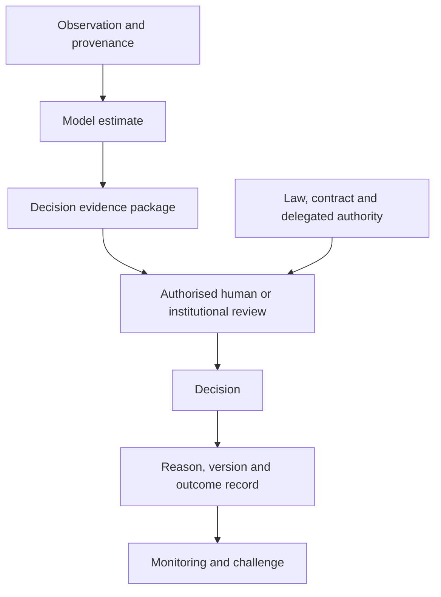
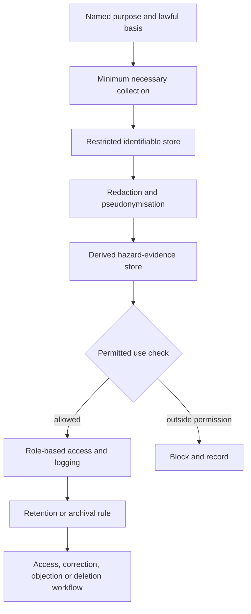
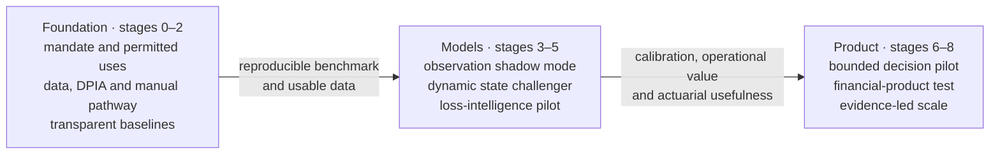
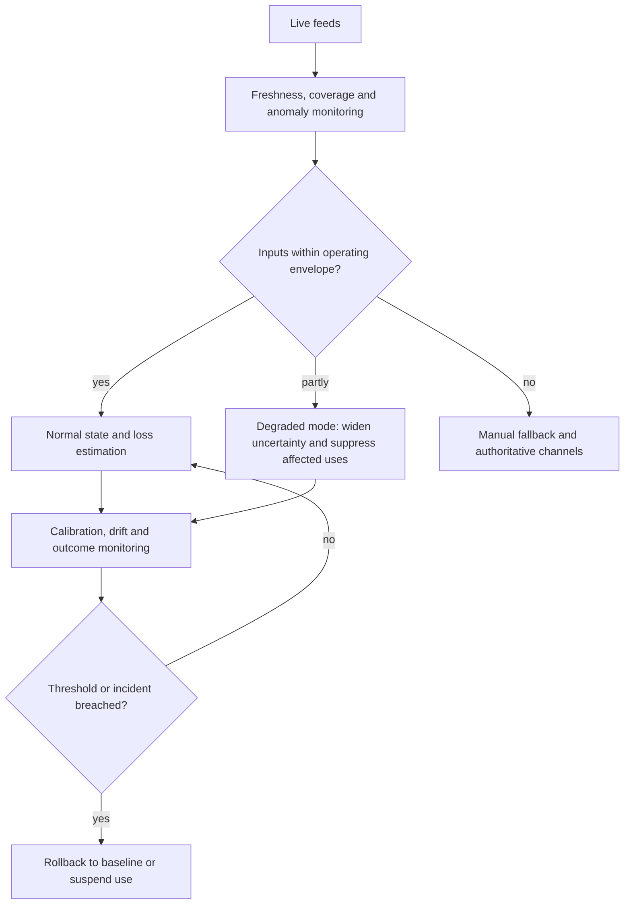
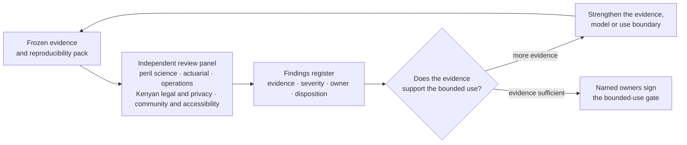

# Part 6: Governance, Validation and Implementation

## Turning evidence into accountable decisions

In the first minutes of a catastrophe, speed and accountability matter together. A community reporter may describe water across a road. Spatial Catastrophe Risk Intelligence (SCRI) may infer that insured properties are likely to be affected. A public authority may issue a warning. A claims officer may contact policyholders. A reserving actuary may revise an estimate. One evidence trail supports all four users, while each acts through a defined institutional mandate.

The operating model therefore assigns ownership before technology:

| Role | Core responsibility |
|---|---|
| Data controller or joint controller | Determines lawful purposes and essential means of personal-data processing |
| Data processor | Processes personal data under documented controller instructions |
| Data steward | Owns schema quality, lineage, access classification and retention execution |
| Hazard-model owner | Defines intended use, physical assumptions, limitations and monitoring |
| Actuarial-model owner | Owns loss definitions, calibration, financial terms and actuarial interpretation |
| Product owner | Connects validated outputs to a bounded insurance workflow and commercial outcome |
| Decision owner | Has legal and institutional authority for the consequential action |
| Independent validator | Challenges data, method, code, performance, limitations and use |
| Community-governance forum | Reviews contribution terms, harms, accessibility, redress and distributional effects |

**Figure 6.1: Evidence flows into accountable institutional decisions**

For insurance, the governing starting point is the Kenyan framework. The Insurance Regulatory Authority’s guideline on insurance risk covers product design, pricing, underwriting, claims management, reserving and reinsurance [1]. SCRI maps its evidence and workflows to those existing responsibilities and to any later applicable instruments confirmed through legal review. Deployment proceeds through the appropriate institutional and regulatory approvals.

## Privacy, AI risk and community legitimacy

Geotagged photographs, phone numbers, voices, property details and contributor histories may identify a person directly or indirectly. Encryption protects confidentiality in transit and at rest. Data minimisation, redaction, pseudonymisation, access control and retention rules address the additional identifiability created by a distinctive home, face, vehicle plate, device trail or precise location.

Kenya’s Data Protection Act requires lawful, fair and transparent processing; explicit purposes; necessity and data minimisation; accuracy; retention limits; safeguards for transfer; and mechanisms through which data subjects can exercise their rights [2]. The General Regulations identify several high-risk activities directly relevant to SCRI, including large-scale processing, systematic monitoring of publicly accessible areas, combining datasets, innovative technologies, sensitive or vulnerable-group data and automated decisions with significant effects. Those conditions can require a data-protection impact assessment before processing [3].

SCRI’s privacy design therefore follows the data lifecycle:

**Figure 6.2: Privacy controls operate across the complete data lifecycle**

Before pilot collection, the operator documents the purpose and lawful basis for every source class; controller and processor roles; data flows and transfers; retention; access roles; security controls; incident response; image-redaction rules; treatment of children and vulnerable persons; and routes for access, correction, withdrawal or deletion where applicable. The Office of the Data Protection Commissioner’s DPIA guidance supplies the relevant Kenyan process [4]. Proportionality guides both emergency value and privacy protection.

Community legitimacy is a product requirement. Reporting channels include low-bandwidth and assisted options; contribution terms explain whether data may be used for warnings, insurance analytics, research or claims. Those purposes are separated. Any contributor payment follows a defined programme with clear terms. Reporting gaps are monitored by geography, language, gender, disability, connectivity and other relevant dimensions. Sparse-reporting areas receive wider uncertainty and targeted outreach.

Community participation continues into project origination and financing. Representatives can nominate priority risks, validate beneficiary definitions, review delivery and maintenance arrangements, and participate in monitoring outcomes. Each financed intervention records its access route, community role, expected service benefit, ownership or participation terms, and benefit-distribution evidence.

Machine perception is consequential because its outputs can change hazard state and claims priority. Explainability therefore runs end to end: source image, model version, output mask, georeferencing, state update, exposure intersection, policy transform and human decision. Layer separation, common identifiers and versioned lineage make that traceability operational.

SCRI maintains a model inventory and one model card for each material component. Each card states intended and prohibited uses, owner, training and validation data, performance by relevant slice, calibration, uncertainty, dependencies, human-review point, monitoring, rollback and retirement. The NIST AI Risk Management Framework is comparative rather than binding in Kenya, but its govern-map-measure-manage structure is useful for organising continuous AI risk management [5].

## From shadow mode to bounded production

The first deployment is a focused test of whether better catastrophe intelligence improves one insurer workflow with acceptable customer and community outcomes. Flood and drought are valuable contrasting pilots because one can evolve rapidly through a directed basin network while the other persists across biophysical and livelihood indicators. Location selection follows evidence and readiness: hazard relevance, authoritative data, exposure quality, claims history, institutional mandate, community participation, connectivity, response pathway and validation feasibility.

**Figure 6.3: Research-to-operation stage gates**

### Stage 0 - mandate and permitted uses

The insurer names the product owner, hazard and actuarial owners, decision owners and independent reviewers. It selects one use case, such as flood accumulation and claims readiness. The approved-use statement covers accumulation, claims readiness and event-loss nowcasting; it reserves coverage determination, in-force contract changes and public warnings for their established authorities.

**Evidence to pass:** approved problem statement, user workflow, authority map, harm assessment and measurable baseline.  
**Stop condition:** no accountable decision owner or no lawful/contractual path from output to action.

### Stage 1 — data, permissions and manual fallback

The team completes source agreements, the source-to-use register, privacy assessment, observation schema, identity and access design, retention and incident procedures. A manual channel allows authorised staff to receive and review critical evidence during outages.

**Evidence to pass:** data lineage tests, access tests, consent or notice materials, correction workflow and continuity exercise.  
**Stop condition:** source rights are ambiguous, high privacy risk remains untreated, or remote communities cannot participate safely.

### Stage 2 — transparent baselines

The team implements the hazard-specific baseline and a manual event-loss workflow using a frozen exposure snapshot and explicit policy terms. Historical replay respects event time, knowledge time and ingestion time. The baseline establishes the standard a challenger must beat.

**Evidence to pass:** reproducible replay, dimensional checks, signed actuarial definitions and documented limitations.  
**Stop condition:** claims, exposure or hazard data cannot be reconciled sufficiently to define ground truth.

### Stages 3 and 4 — observation and state challengers

Crowd and AI components run in shadow mode, where outputs remain advisory while the team tests duplicate attacks, recycled photographs, incorrect coordinates, stale gauges, darkness, rain, low connectivity and sparse-reporting areas. The dynamic state challenger is compared with the baseline on event and spatial holdouts.

**Evidence to pass:** calibrated probabilities, acceptable false-alarm and missed-event trade-offs, stable latency, documented subgroup performance and operational rollback.  
**Stop condition:** improved average discrimination masks worse subgroup calibration; the challenger cannot outperform the baseline; or the system fails during degraded inputs.

### Stage 5 — loss intelligence

The product intersects posterior hazard samples with exposure, vulnerability and policy terms. It reports a range, contributors to change and uncertainty decomposition. Outputs remain advisory.

**Evidence to pass:** historical-event loss capture, stable gross-to-net reconciliation, claims emergence performance, user comprehension and independent actuarial review.  
**Stop condition:** exposure double-counting, unstable tail estimates, untraceable financial transforms or repeated user misinterpretation.

### Stages 6 and 7 — bounded decisions and financial products

A live pilot may allow predefined low-risk actions such as claims staffing, policyholder welfare contact or reinsurance notification. Consequential actions retain human review and a recorded reason. Parametric or financing structures are tested only after trigger independence, continuity, basis risk, dispute routes, repayment mechanics and authority are established.

**Evidence to pass:** operational benefit relative to baseline, acceptable customer outcomes, no material control breach and independent approval.  
**Stop condition:** the pilot encourages opportunistic underwriting, unapproved financial action, customer harm or evidence use outside its permitted purpose.

## Validation, monitoring and safe degradation

Validation measures more than predictive accuracy. Before the pilot, owners set thresholds from decision costs and baseline performance rather than inventing universal numbers. The scorecard includes:

- probability calibration using reliability plots, Brier score or log score;
- event detection recall, false-alarm rate and lead time;
- footprint overlap and intensity/depth error;
- loss-distribution calibration and interval coverage;
- claims-count, claims-severity and triage performance;
- OEP/AEP and tail sensitivity where long-term models are in scope;
- performance and coverage by relevant community and portfolio groups;
- data age, missingness, source failure and correction rate;
- system latency, uptime, recovery-time and recovery-point performance;
- user override, complaint, redress and decision-usefulness outcomes;
- intervention uptake and avoided-loss evidence where claimed.

For a model $m$, a cost-sensitive operational validation score can summarise scenario-specific false-negative and false-positive consequences:

$$
R(m)=\sum_{s\in\mathcal S}\pi_s
\left[
c^{FN}_s\Pr(FN\mid s,m)
+c^{FP}_s\Pr(FP\mid s,m)
\right],
\tag{6.1}
$$

where $\mathcal S$ is the predeclared scenario set, $\pi_s$ is its evaluation weight, and the costs are owned by the relevant product and decision functions. Accuracy and calibration constraints remain visible alongside this score. A challenger $m_c$ is eligible for promotion over baseline $m_b$ when the evidence supports a material improvement $\delta$ at confidence level $1-\alpha$:

$$
\Pr\!\left(R(m_c)<R(m_b)-\delta\mid\mathcal D_{val}\right)
\ge 1-\alpha.
\tag{6.2}
$$

Appendix H derives Equations (6.1)-(6.2), connects them to expected decision loss, and expands calibration, drift, subgroup and safe-degradation tests. Promotion remains a multi-criterion institutional decision: the equations make the evidential threshold reproducible.

**Figure 6.4: Degradation changes the product’s claims and permissions**

Technology choices follow these requirements. The architecture needs durable event ingestion, spatial processing, versioned storage, model execution, access control, observability and offline recovery. Kubernetes is one possible implementation within a functional plan centred on portability, export rights, reproducible model artefacts, tested backups, vendor-exit procedures and the ability to run the transparent baseline when specialist services fail.

The definition of done is deliberately institutional. The product is ready for bounded use when a contributor can correct evidence, an actuary can reproduce a loss, an underwriter can explain a permitted action, a claims manager can override a triage recommendation, an independent validator can challenge the model and the system enters an honest degraded mode during failure. Scale follows demonstrated value and community legitimacy.

## Independent review before rebuilding the production case

This sample edition has completed internal consistency and rendering checks. The next release gate is independent hydrological, actuarial, legal, community and insurance-operations review. Until those reviews are recorded, the edition remains a design demonstration of how the book integrates narrative, data, equations, maps, curves and interfaces.

Independent review begins with a reproducibility package: frozen manuscript, source and claim ledgers, event cut-offs, exposure schema, model cards, code, seeds, generated data, policy and treaty transforms, figure sources and a list of known limitations. Reviewers receive questions tied to their authority rather than a request to endorse the work in general.

| Review lane | Questions that must be answered | Evidence required to close | Current sample status |
|---|---|---|---|
| Flood and hydrology | Are basin topology, depth, duration and gauge-failure assumptions physically credible? | Event replay, gauge and radar comparison, routing diagnostics | Pending independent review |
| Drought and livelihoods | Do indicators preserve NDMA meaning and livelihood sequencing? | Bulletin reconciliation, county and pastoral expertise | Pending independent review |
| Locust and agriculture | Are swarm identity, movement, control and crop-stage effects represented correctly? | Surveillance replay, intervention records, agronomic loss evidence | Pending independent review |
| Fire, landslide and heat | Do detection and susceptibility claims respect local mechanisms and sparse evidence? | Peril-specific holdouts, field and response review | Pending independent review |
| Actuarial modelling | Are exposure, vulnerability, terms, dependence, OEP/AEP and uncertainty coherent? | Reproducible calculations, claims back-test, gross-to-net reconciliation | Synthetic arithmetic checked; empirical calibration pending |
| Insurance operations | Does each screen improve a named workflow without creating conduct risk? | User testing, overrides, customer outcomes, incident scenarios | Narrative prototype only |
| Legal and data protection | Are purposes, authority, controller roles and consequential uses lawful? | Kenyan legal opinion, DPIA, contracts and notices | Pending independent review |
| Community and accessibility | Can contributors understand, contest and safely use the system? | Participatory review, language/accessibility tests, redress exercise | Pending independent review |
| Security and continuity | Does degraded mode work under peak-event failure? | Penetration test, outage exercise, recovery evidence | Design requirement only |

**Figure 6.5: Independent review turns specialist challenge into release evidence**

An independent reviewer works outside ownership of the component being validated and has freedom to record a negative conclusion. Each finding receives an identifier, severity, evidence, accountable owner, due date and disposition. “Accepted risk” requires the named decision owner and a stated reason; legal, actuarial and community-harm objections close through evidence from the responsible discipline.

Five release questions govern the next rebuild. First, can each event reconstruction be replayed at historical knowledge cut-offs using only the evidence then available? Second, do empirical Kenyan claims and exposure data support the vulnerability and tail assumptions? Third, can users reproduce every change from observation to net loss? Fourth, does the workflow remain useful when crowd, gauge, satellite or cloud inputs fail? Fifth, do affected communities and policyholders have meaningful information, correction and redress routes? A research edition can continue exploring open questions; production readiness follows affirmative evidence across all five.

The review sequence also strengthens the narrative. Technical depth makes the livelihood story more precise. Peril reviewers challenge the physical account; actuaries challenge the financial translation; operations teams test whether the interface supports real work; legal and community reviewers establish whether the proposed use is legitimate. Their findings and evidenced closures determine what the production white paper can confidently say.

## References

[1] Insurance Regulatory Authority, “Guideline to the Insurance Industry on Insurance Risk,” IRA/PG/17. [Online]. Available: https://ira.go.ke/assets/file/Guideline_on_Insurance_Risk.pdf. Accessed: Aug. 28, 2026.

[2] Republic of Kenya, *Data Protection Act*, Cap. 411C. [Online]. Available: https://new.kenyalaw.org/akn/ke/act/2019/24/eng@2022-12-31. Accessed: Aug. 28, 2026.

[3] Republic of Kenya, *The Data Protection (General) Regulations*, Legal Notice 263 of 2021. [Online]. Available: https://new.kenyalaw.org/akn/ke/act/ln/2021/263/eng@2022-12-31. Accessed: Aug. 28, 2026.

[4] Office of the Data Protection Commissioner, “Guidance Note on Data Protection Impact Assessment,” 2023. [Online]. Available: https://www.odpc.go.ke/wp-content/uploads/2024/02/ODPC-Guidance-Note-on-Data-Protection-Impact-Assessment-1.pdf. Accessed: Aug. 28, 2026.

[5] E. Tabassi, *Artificial Intelligence Risk Management Framework (AI RMF 1.0)*, NIST AI 100-1. Gaithersburg, MD, USA: National Institute of Standards and Technology, 2023, doi: 10.6028/NIST.AI.100-1. [Online]. Available: https://doi.org/10.6028/NIST.AI.100-1. Accessed: Aug. 29, 2026.
