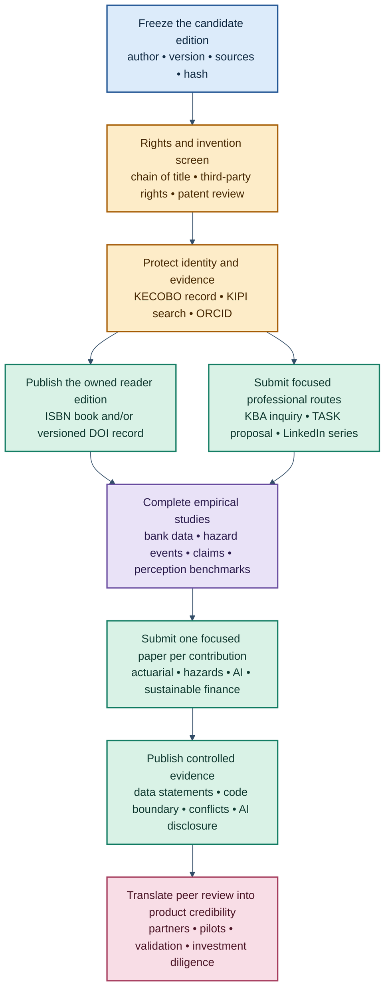

# SCRI Publication Portfolio and Intellectual-Property Submission Strategy

**Author:** Nevil Maloba  
**Affiliation:** Founder, Philtechent LTD; developer of Spatial Catastrophe Risk Intelligence (SCRI)  
**Contact:** nevillemaloba@gmail.com  
**Prepared:** 2 September 2026  
**Status:** Publication-planning and intellectual-property implementation report  

> This report complements the existing *SCRI Intellectual-Property, Publication and National Commercialisation Implementation Guide*. It is a research and implementation plan rather than legal advice. Patent, trademark, copyright, publishing-contract and data-rights decisions should receive Kenyan professional review before filing or signing.

## Executive recommendation

SCRI now contains enough original architecture, narrative and technical reasoning to support several forms of publication. The strongest approach is to publish it as a coordinated portfolio in which every item has a distinct audience, purpose and contribution:

1. **An author-owned SCRI reader edition or book** establishes Nevil Maloba's authorship, the Kenya-first product thesis and the complete interdisciplinary narrative.
2. **A Kenya Bankers Association research paper** tests whether flood and drought intelligence improves bank credit-risk identification and resilience-finance decisions.
3. **An actuarial research paper** formalises catastrophe occurrence, severity, vulnerability, reserving and economic-capital relationships.
4. **A natural-hazards paper** evaluates the observation-to-state-estimation architecture across Kenyan flood and drought cases.
5. **A machine-perception paper** evaluates Ultralytics, vision-transformer and sensor-fusion components using Kenyan imagery and operational conditions.
6. **A sustainable- and resilience-finance paper** tests avoided-loss, residual-risk and financing evidence rather than restating the commercial thesis.
7. **Professional articles and presentations** build readership and partner interest through LinkedIn, the Actuarial Society of Kenya and selected practitioner channels.

The full six-part white paper is best treated as the parent intellectual work. It is not well suited to submission unchanged as a journal article: its breadth, product narrative and current length exceed the conventions of most journals, while several research claims still require empirical results. Focused papers should therefore be extracted from it and developed into genuinely distinct studies. Each paper should contain a separate research question, method, result and conclusion, and should acknowledge the SCRI reader edition where relevant.

The recommended order is:

The first publication decision is therefore a rights decision: freeze the public boundary, record ownership, review inventions, clear the SCRI name and only then release the definitive reader edition. The KBA inquiry and a TASK approach may proceed immediately because the prepared concept documents disclose the research proposition at a controlled level.

## 1. What the existing publication and IP notes already establish

The existing implementation guide adopts a sound three-level disclosure model.

### 1.1 Public reader edition

The public work may disclose the lived catastrophe problem, the SCRI thesis, general architecture, general mathematical relationships, synthetic examples, product narratives, governance philosophy and sourced conclusions. This level should establish authorship and intellectual leadership while remaining useful to researchers, practitioners and potential partners.

### 1.2 Controlled diligence edition

Institutional partners may receive selected model cards, validation summaries, data schemas, security architecture, pilot economics and regulatory analysis under an appropriate confidentiality and permitted-use framework. Each disclosure should identify the recipient, purpose, version, date and authorised materials.

### 1.3 Proprietary implementation

Production code, trained weights, reliability algorithms, deduplication and fraud rules, locally calibrated vulnerability functions, claims transformations, source mappings, customer economics and unpublished technical inventions remain commercial assets. Journal reproducibility can be served through synthetic data, pseudocode, aggregated results, model descriptions and a controlled-access statement where contracts or personal-data duties prevent public release. The precise balance must follow the selected journal's data and code policy.

This structure remains appropriate. Publication expands the public and scholarly layer; it does not require turning the production platform into an open-source implementation. A journal paper must nevertheless disclose enough method and evidence for reviewers to assess its scientific contribution. A paper that cannot support its claims without revealing a protected mechanism should be redesigned, delayed until a filing is made, or submitted to a route compatible with controlled evidence.

## 2. Current publication readiness

### 2.1 The white-paper and book route

The six core manuscripts currently contain approximately 24,000 words, with roughly 6,700 additional words in the appendices. Their strongest assets are the Kenya-first narrative, the multi-hazard architecture, the distinction between observation and hazard state, the actuarial translation, the institutional workspaces and the connection between catastrophe evidence and investable resilience.

The reader edition is conceptually publishable after a final evidence, rights and visual-quality gate. Its next edition should carry:

- author name and contact in the front matter and PDF metadata;
- a clear edition and version number;
- a copyright and reader-permission notice;
- a recommended citation;
- a conflict-of-interest statement identifying Philtechent LTD and SCRI;
- an AI-assistance disclosure appropriate to the extent of the assistance used;
- a source and third-party-rights audit;
- a publication hash and release record;
- an ISBN if issued as a book; and
- a DOI if issued as a citable research publication through a repository.

The reader edition should preserve its book-like narrative. Journal articles should be developed separately rather than compressing the whole work into a single policy-style paper.

### 2.2 KBA paper

The KBA submission package is the most advanced focused research route. It contains an inquiry email, concept note, proposal, biography, data-partner brief and post-approval delivery roadmap. Its provisional title is:

> **Can Spatial Catastrophe Intelligence Improve Bank Credit-Risk Identification in Kenya? A Flood-and-Drought Empirical Framework**

The official 2026 call placed climate-related risk under **Risk Identification and Management** and included a **Methodological Session** for practical solutions. It required a proposal of no more than five pages containing a 300–500-word abstract, motivation, hypotheses and brief methodology. Proposals were due 17 April 2026; author notifications were scheduled for 15 May; full papers and policy briefs were due 30 June; and the conference is scheduled for 17–18 September 2026 [1]. The formal deadlines have passed, so the prepared inquiry should ask KBA to identify the viable route: a late methodological contribution, later Working Paper consideration or the next annual research cycle.

The KBA paper becomes fully competitive when a bank or credit-data partner enables testing of whether spatial flood and drought variables improve discrimination, calibration, early warning, portfolio segmentation or loss estimation over transparent baselines. A public-data methodological demonstrator remains useful, provided it is labelled as a demonstrator rather than bank-performance evidence.

### 2.3 LinkedIn series

The two completed LinkedIn manuscripts are suitable for professional publication now after the public-boundary review:

- *From Catastrophe Intelligence to Investable Resilience*; and
- *Beyond SaaS: Building and Monetising a Nationwide Spatial Catastrophe Risk Intelligence Utility for Kenya*.

LinkedIn permits articles of up to 125,000 characters, whereas ordinary posts are limited to 3,000 characters [2]. All members can create a newsletter, whose subscribers may receive platform and email notifications for new editions [3]. The two long articles should therefore become the first two editions of a named SCRI newsletter, with the existing short posts serving as introductions.

The LinkedIn versions should point readers to the citable reader edition once its DOI or ISBN landing page exists. They should not reproduce unpublished model parameters, private data or the complete text of a journal paper under review.

### 2.4 Scholarly journals

The scholarly papers are at the architecture-and-method stage. They will become submission-ready after the contribution-specific empirical work described below. A credible journal paper needs more than an expanded white-paper chapter: it needs a defined literature gap, data, reproducible method, benchmark, validation, result, limitations and a conclusion tied to the evidence.

## 3. Recommended publication portfolio

| Publication asset | Central question | Primary source material | New evidence required | Preferred first route |
|---|---|---|---|---|
| SCRI reader edition/book | How can Kenya operate continuous multi-hazard catastrophe intelligence for protection and investable resilience? | Parts 1–6 and appendices | Final source audit, independent review and publication-quality figures | KNLS ISBN plus owned distribution; optional Zenodo DOI |
| Bank credit-risk paper | Do point-in-time flood and drought variables improve Kenyan credit-risk identification? | KBA proposal; Parts 3–5 | Bank or aggregate credit outcomes; event-aligned panel | KBA research route; ADFJ as an alternative or later development |
| Actuarial catastrophe paper | How should dynamic hazard evidence update event loss, reserves and economic capital? | Parts 3–4 and mathematical appendices | Claims/exposure case study, simulation study and baselines | Annals of Actuarial Science; ASTIN for a stronger mathematical result |
| Hazard-state paper | How well does governed crowd, sensor and earth-observation fusion estimate flood and drought states? | Parts 1–3 | Event reconstruction, hindcast and spatial/temporal validation | Natural Hazards; IJDRR or Climate Risk Management depending emphasis |
| Machine-perception paper | Which perception ensemble performs reliably under Kenyan catastrophe imaging and connectivity conditions? | Part 2 and perception appendix | Annotated Kenyan dataset; benchmark against simple and modern models; edge tests | IEEE Access or Remote Sensing |
| Resilience-finance paper | Can SCRI evidence improve appraisal and MRV of a specific resilience investment? | Part 5 and LinkedIn Part I | One project case, counterfactual assumptions, avoided- and residual-loss results | Journal of Sustainable Finance & Investment; Climate Risk Management; ADFJ |
| Professional series | How does SCRI change practical insurance, banking, county and community decisions? | LinkedIn articles and reader-edition narratives | Editorial adaptation and reader examples | LinkedIn newsletter; TASK presentation |

This portfolio avoids mechanical “salami slicing.” Each article must have a separate primary question and result. Shared background can be cited rather than copied. If two papers use the same dataset, their outcomes and contribution must remain materially distinct and the relationship must be disclosed to editors.

## 4. Verified publication routes

The details below were reviewed against official publisher or institutional pages on 2 September 2026. Fees, open-access arrangements, calls and deadlines can change; the live instructions should be rechecked immediately before submission.

### 4.1 Kenya Bankers Association Annual Banking Research Conference and Working Paper Series

**Fit.** Highest for the flood-and-drought bank credit-risk study. The KBA call explicitly includes climate-related risks, their implications for banking and economic resilience, and transition pathways towards stability [1].

**2026 route.** The conference is scheduled for 17–18 September 2026. Formal submission milestones have passed. Send the prepared inquiry to `research@kba.co.ke` asking about:

1. a late Methodological Session contribution;
2. a post-conference empirical Working Paper route; or
3. the next conference cycle.

**Submission package.** The official call required a maximum five-page proposal with a 300–500-word abstract, motivation, hypotheses and brief methodology. The existing package already covers these components. The inquiry should attach only the one-page concept note initially unless KBA requests the full proposal.

**Publication and IP point.** KBA describes its Working Papers as work in progress published in the authors' names, while past papers state that their content is protected by copyright and reproduction requires the publisher's consent [4]. Obtain the current author agreement before acceptance and clarify copyright, later journal submission, repository posting and reuse of figures. Do not assume that acceptance preserves every reuse right.

**Official links.** KBA call archive: https://www.kba.co.ke/call-for-papers/. KBA/EconStor Working Paper collection: https://www.econstor.eu/handle/10419/249501.

### 4.2 Actuarial Society of Kenya Annual Convention

**Fit.** Strong for a professional paper or presentation on catastrophe loss intelligence, climate-risk modelling, AI governance, continuous portfolio intelligence or investable resilience.

**Current route.** TASK's 11th Annual Convention is scheduled for 29 September–2 October 2026 in Mombasa under the theme *The Next Frontier: Actuaries Beyond Boundaries*. Its published programme includes climate-risk modelling, AI, ESG and development-finance topics [5]. The programme is already substantially formed. Contact `info@actuarieskenya.or.ke` to ask whether a late presentation, poster, future webinar or 2027 call is available. The 2025 convention's call directed papers to the TASK Secretariat, showing that the Society uses a call-based route [6].

**Recommended submission.** A 12–15-slide professional presentation titled *From Crowd and Earth Observation to Actuarial Catastrophe Loss Intelligence in Kenya*. It should demonstrate one flood event, one drought state, one actuarial loss translation and one product workflow. This presentation should lead readers to the public reader edition while reserving proprietary methods.

**Official links.** Convention: https://convention.actuarieskenya.or.ke/. Society: https://www.actuarieskenya.or.ke/.

### 4.3 African Development Finance Journal, University of Nairobi

**Fit.** Strong regional route for the bank-credit or resilience-finance study, especially when it includes Kenyan data and a clear development-finance implication. The journal welcomes empirical and theoretical papers, case studies, conceptual frameworks, analytical models and simulations [7].

**Format and submission.** The current author guidance specifies English, a maximum of 25 pages, double spacing, a separate title page, an abstract no longer than 150 words, up to eight keywords, numbered sections and APA references. The anonymised main text should omit author identity. The site states that Word or PDF submissions are accepted and directs manuscripts to `editoradfj@uonbi.ac.ke` [7].

**Rights.** The journal states that authors retain copyright and grant it first-publication rights [7]. Confirm the exact licence and repository rights in the acceptance agreement.

**Best SCRI paper.** A Kenyan empirical study of bank credit exposure to flood and drought, or a case study of financing a specific resilience intervention. A high-level commercial proposition without data would be less competitive than the empirical paper already planned for KBA.

**Official link.** https://uonjournals.uonbi.ac.ke/index.php/adfj.

### 4.4 Annals of Actuarial Science

**Fit.** The best first international actuarial target. Its scope includes non-life insurance, finance and investment, statistics, econometrics, quantitative risk management, machine learning, AI and climate science where relevance to insurance is clear [8].

**Article and format.** The journal accepts Original Research, Review and Actuarial Software papers. Current instructions require UK English, a 150–200-word abstract, keywords, correspondence details, consecutively numbered displayed equations, Harvard references, acknowledgements, competing-interest, data-availability and funding statements. Submitted papers should normally be no more than 35 pages; excess appendices can become supplementary material [9]. Submission is through ScholarOne; process questions go to `Journals@actuaries.org.uk` [9].

**Best SCRI paper.** An Original Research paper that demonstrates how real-time hazard evidence updates event-loss distributions, claims nowcasts, reserves or economic-capital scenarios. Include transparent frequency-severity and reserving baselines, a simulation or case study, calibration metrics and sensitivity analysis.

**Software-route caution.** The Actuarial Software stream requires replication materials, basic unit tests, open-source software and a DOI-bearing repository [9]. That route is appropriate only if SCRI deliberately releases a research package. The proprietary production platform can remain closed by using the Original Research route and disclosing the reproducible research method through synthetic or appropriately licensed materials.

**AI and conflict disclosure.** Cambridge requires substantive generative-AI uses in text, images or data analysis to be declared, including the tool, version, dates and use. It does not recognise AI tools as authors [9]. The paper must also disclose Nevil Maloba's role as founder of Philtechent LTD and developer of SCRI.

**Official links.** Author instructions: https://www.cambridge.org/core/journals/annals-of-actuarial-science/information/author-instructions. Preparation: https://www.cambridge.org/core/journals/annals-of-actuarial-science/information/author-instructions/preparing-your-materials.

### 4.5 ASTIN Bulletin — The Journal of the International Actuarial Association

**Fit.** A higher mathematical threshold than the reader edition currently meets. ASTIN is appropriate if the SCRI actuarial work produces a significant quantitative result in catastrophe occurrence, dependence, reserving, capital or insurance mathematics.

**Format and submission.** The journal asks authors to consider splitting submissions over 30 pages. The first page should contain the title, authors, abstract, keywords and affiliations; full contact details appear at the end. It discourages footnotes and uses an alphabetic reference list. Submission is through ScholarOne at https://mc.manuscriptcentral.com/astin [10].

**Evidence expectation.** Data and code supporting the findings are encouraged during review and can accompany accepted papers. Preprints are permitted, but prior or duplicate publication and concurrent journal submission are not [10].

**Publishing model.** Cambridge states that ASTIN became fully Gold Open Access from 31 July 2026, with institutional agreements, article-processing charges or waiver routes determining payment [11]. Check the current fee and eligibility when the paper is ready.

**Best SCRI paper.** A new hierarchical catastrophe-frequency/severity or dynamic reserving method whose mathematical and empirical contribution stands independently of the product architecture. The method should outperform transparent baselines on calibration, tail behaviour and decision value.

**Official links.** https://www.cambridge.org/core/journals/astin-bulletin-journal-of-the-iaa/information/author-instructions and https://mc.manuscriptcentral.com/astin.

### 4.6 Natural Hazards

**Fit.** Strong for a Kenyan event-reconstruction and hazard-state paper connecting crowd reports, authoritative observations, earth observation and uncertainty.

**Format and submission.** The journal is hybrid and uses Editorial Manager. It requires original work that is not simultaneously under consideration, editable `.docx` or LaTeX source, a title page with author and contact information, a 150–250-word abstract, four to six keywords and line numbering. It uses author-year citations and requests DOI references as full links [12]. Funding and competing-interest declarations are required after the references.

**Figures.** The instructions require legible final-size figures; figure lettering is normally 8–12 points. Colour is free online, and figures should also remain intelligible in grayscale and use accessible contrast or patterns [12]. This matches SCRI's requirement for large, readable, coloured diagrams.

**Best SCRI paper.** A flood and drought event/state study with hindcasting, temporal and spatial holdouts, lead-time measurement, uncertainty decomposition and analysis of sparse community reporting. A purely conceptual architecture will be strengthened substantially by at least two reconstructed Kenyan events.

**Prior work.** Springer requires disclosure when a submission expands earlier work and cautions against fragmenting one study into several minimally different papers [12]. Cite the public SCRI edition and explain the new data and scientific result in the cover letter.

**Official link.** https://link.springer.com/journal/11069/submission-guidelines.

### 4.7 International Journal of Disaster Risk Reduction

**Fit.** Strong when the contribution centres on disaster-risk reduction, warning, community intelligence, institutional coordination, cascading risk and operational resilience. The journal accepts fundamental and applied research, reviews, policy papers and case studies across disaster-risk reduction [13].

**Submission route.** Use the `Submit your article` and `Guide for authors` links on the journal's official ScienceDirect page. At the time of review, a separate Editorial Manager page returned a notice that the site was under development; it should not be used until the official journal page directs authors there. An unrelated site using the IJDRR initials is not the Elsevier journal.

**Best SCRI paper.** A mixed-method study of how governed community observations improve flood or drought situational intelligence and early action, with explicit treatment of digital exclusion, duplicated reports, institutional authority and response outcomes.

**Official link.** https://www.sciencedirect.com/journal/international-journal-of-disaster-risk-reduction.

### 4.8 Climate Risk Management

**Fit.** Strong when the paper studies how climate information changes a real decision. The journal publishes original research, reviews and practical experience concerning the use of climate knowledge and information in decision-making and policy [14].

**Best SCRI paper.** A field or case study measuring the value of SCRI information for a flood, drought, credit, insurance or resilience-investment decision. Model accuracy should be connected to lead time, action, avoided loss, claims efficiency or capital allocation.

**Submission route and cost.** Use the current `Submit your article` and `Guide for authors` controls on the official ScienceDirect journal page. The page displayed an open-access article-processing charge of USD 2,720 during this review; confirm the live amount, taxes, waiver position and article requirements before submission.

**Official link.** https://www.sciencedirect.com/journal/climate-risk-management.

### 4.9 Journal of Sustainable Finance & Investment

**Fit.** Strong for a focused paper on climate risk, adaptation finance, sustainable banking, risk pricing, portfolio exposure, resilience investment or disclosure. Its stated scope includes theoretical and empirical work intended for academics, policy makers and practitioners [15].

**Review and submission.** The journal uses double-anonymised peer review and ScholarOne and offers an optional open-access route [15]. Its live instructions page should be checked for the current article type, word limit, formatting and fee immediately before preparation, because a stable detailed limit was not exposed in the current web response.

**Best SCRI paper.** An empirical financing case that connects baseline catastrophe risk, a specified intervention, counterfactual avoided loss, residual risk, beneficiaries, repayment structure and MRV evidence. The LinkedIn essay supplies the conceptual foundation; the journal article must add a literature-grounded method and results.

**Official link.** https://www.tandfonline.com/tsfi20.

### 4.10 Remote Sensing

**Fit.** Suitable for the earth-observation and machine-perception component after a Kenyan image dataset and benchmark study exist. The journal covers remote-sensing science and applications and accepts regular articles, reviews, technical notes and communications [16].

**Format.** The current instructions describe research articles of at least 18 pages, reviews of at least 20 pages, technical notes under 18 pages and communications under 12 pages. Initial submissions can use the Word or LaTeX template or free format. A cover letter should explain significance, scope fit and originality. Maps should include coordinate information, scale and a north arrow, and figures should be publication quality [16].

**Submission and cost.** Submit through https://susy.mdpi.com. The listed article-processing charge is CHF 2,700; verify the amount and any waiver before submission [17]. Authors retain copyright under the journal's open-access terms.

**Best SCRI paper.** A reproducible comparison of detection, segmentation, tracking, oriented bounding boxes and transformer-based geospatial models across flood, fire, landslide or crop-impact imagery. It should report dataset composition, annotation, geography, season, sensor, spatial leakage controls, calibration, subgroup performance and edge-deployment benchmarks.

**Official links.** https://www.mdpi.com/journal/remotesensing/instructions and https://www.mdpi.com/journal/remotesensing/apc.

### 4.11 IEEE Access

**Fit.** Suitable for a validated technical system: multimodal evidence ingestion, edge/cloud inference, model fusion, provenance or a machine-perception benchmark. Its Applied Research category expects quantitative validation [18].

**Format and submission.** IEEE Access requires its double-column template, a matching Word or LaTeX source file and PDF, each under 40 MB. The submitting author needs a public, populated ORCID profile. Biographies are required for all authors; authors select three to ten keywords. Although there is no formal page limit, the journal recommends fewer than 20 pages and requires a pre-submission inquiry for most longer papers [18]. Submit through the portal linked from the official instructions, currently https://ieee.atyponrex.com.

**AI disclosure.** AI-generated text must be disclosed in the acknowledgements, and affected sections should cite the AI system used [18].

**Cost.** IEEE Access is fully open access. Its current official APC page lists USD 2,160 plus applicable taxes, with specified member, institutional and low-income-country discount routes [19].

**Best SCRI paper.** A quantitative Kenyan system paper with end-to-end latency, calibration, spatial accuracy, robustness under smoke/rain/darkness, offline operation, data lineage and ablation tests. A conceptual architecture alone is unlikely to meet the Applied Research expectation.

**Official links.** https://ieeeaccess.ieee.org/authors/submission-guidelines/ and https://ieeeaccess.ieee.org/about/article-processing-charges/.

## 5. Owned and preprint publication routes

### 5.1 Zenodo DOI record

Zenodo is the most practical DOI route for a public SCRI reader edition, research report, data dictionary or synthetic research package. It assigns a DOI when an upload is published and allows an author to reserve the DOI in advance so that it can appear inside the PDF [20]. Its versioning creates a new, linked record and persistent identifier for changed files, preserving the cited version [21].

Recommended metadata:

- **Creator:** Maloba, Nevil;
- **Affiliation:** Philtechent LTD;
- **Title:** *Spatial Catastrophe Risk Intelligence: [final subtitle]*;
- **Resource type:** publication/report or book, depending final form;
- **Version:** 1.0;
- **Language:** English;
- **Keywords:** Kenya; catastrophe risk; actuarial modelling; crowd intelligence; artificial intelligence; disaster risk finance; resilience finance;
- **Rights:** the legally reviewed custom reader permission or selected standard licence;
- **Related identifiers:** ISBN, related datasets, later papers and software records; and
- **Description:** abstract, scope, citation and relationship to Philtechent LTD.

Zenodo warns that published records are persistent and that substantive file changes should use a new version [20], [21]. Complete the rights and invention screen before pressing Publish.

The public reader edition and a journal preprint are different objects. Before uploading a paper intended for a journal, check that journal's preprint policy. ASTIN and Remote Sensing expressly permit preprints; Elsevier generally permits author preprints, but the selected journal's live rules and any KBA agreement govern the final decision. Ask AAS if the relationship is uncertain.

**Official links.** https://help.zenodo.org/docs/get-started/quickstart/, https://help.zenodo.org/docs/deposit/describe-records/reserve-doi/ and https://help.zenodo.org/docs/deposit/manage-versions/.

### 5.2 SSRN

SSRN is appropriate only after the KBA concept becomes a real research paper. Its current guidance accepts rigorous studies with original findings and requires a free account, complete author profile, English title and abstract, author names and affiliations, full-text English PDF and an AI disclosure statement in both the abstract record and PDF [22]. Individual authors can upload without a fee [23].

SSRN's present rules list frameworks, guides, book chapters, news articles, abstract-only submissions and non-scholarly or marketing content among material normally not accepted [22]. The current SCRI book and implementation guides should therefore use Zenodo rather than SSRN. A completed empirical bank-credit, actuarial or finance paper could use SSRN if the intended journal and KBA agreement permit preprint posting.

**Official links.** https://www.elsevier.support/ssrn/answer/get-started and https://hq.ssrn.com.

### 5.3 ISBN, Kenyan bibliography and legal deposit

The Kenya National Library Service provides ISBN, legal-deposit and Kenya National Bibliography services [24]. Its ISBN guidance directs first-time applicants to https://www.isbn.ac.ke, where self-publishers create an account, complete personal and publisher information, order the required ISBN product and receive the number by email after processing [25].

Use a separate ISBN for each qualifying print format or materially new edition. If Philtechent LTD is to operate as the publisher or imprint, settle that ownership and metadata before applying. The title, author and imprint should be identical across the ISBN record, copyright page, cover, KDP or other distributor and public catalogues.

For a commercial book, an author-owned Kenyan ISBN is preferable to Amazon's free ISBN. KDP states that its free ISBN is usable only on KDP and shows the imprint as “Independently published”; an author-owned ISBN can be used outside KDP under the registered imprint [26]. KDP can then distribute an eBook, paperback or hardcover, while the Kenyan ISBN and KNLS record remain the bibliographic foundation. KDP Select introduces eBook exclusivity, so use it only if that commercial choice is deliberate [27].

**Official links.** KNLS: https://www.knls.ac.ke/. ISBN: https://www.isbn.ac.ke/. KDP ISBN guidance: https://kdp.amazon.com/en_US/help/topic/G201834170.

### 5.4 LinkedIn newsletter

Create a newsletter under Nevil Maloba's personal profile, with Philtechent LTD and SCRI clearly identified in the author information. A suitable title is **Spatial Catastrophe Risk Intelligence: Kenya's Resilience Economy**. Publish the two existing articles as Parts I and II, separated by one to two weeks, then continue with shorter peril- and product-specific editions.

Each article should include:

- a concise opening problem in a Kenyan place or livelihood;
- one large, high-contrast diagram exported as an image for LinkedIn;
- a short declaration that the author is founder of Philtechent LTD and developer of SCRI;
- references or direct source links;
- a link to the DOI/ISBN reader edition when available; and
- a closing question that invites institutions and communities to describe the decision they need SCRI to improve.

## 6. Intellectual-property and publication controls

### 6.1 Chain of title

Before the first formal release, decide and document one of two structures:

1. **Nevil Maloba owns the manuscript and licences defined commercial rights to Philtechent LTD**; or
2. **Nevil Maloba assigns defined commercial rights to Philtechent LTD while retaining contractual attribution and agreed publication rights**.

The choice should cover the manuscripts, diagrams, research database design, software, model documentation, product names and later contributions. Employee and contractor agreements should identify background IP, newly created IP, confidentiality, publication approval, data rights and rights after termination.

### 6.2 Copyright record

Copyright in eligible Kenyan literary works arises automatically when the work is fixed; lack of registration does not bar a claim. The Copyright Act also provides for a voluntary register whose certified records can provide prima facie evidence of the registered particulars [28]. The National Rights Registry accepts literary works and software documentation and permits rights holders to obtain certificates [29].

Register the frozen reader edition and, separately where appropriate, important software documentation. Preserve:

- the signed-off source bundle;
- the generated PDF and DOCX;
- the SHA-256 hash for each release file;
- dated Git history;
- source and permission ledger;
- AI-assistance record;
- contributor and assignment documents; and
- the KECOBO certificate and submission evidence.

Registration supports evidence; it does not substitute for a clean chain of title or third-party permissions.

### 6.3 Trademark

Conduct KIPI searches for the full name **Spatial Catastrophe Risk Intelligence**, the acronym **SCRI**, the logo and principal module names. KIPI's current FAQ states that Form TM27 and a KSh 3,000 fee are used for a search, followed by Form TM2 and a KSh 4,000 application fee; it also lists a KSh 3,000 advertisement fee, a 60-day opposition period and a KSh 2,000 registration fee [30]. Fees and forms should be confirmed with KIPI before filing.

Use ™ where the brand is claimed. Use ® only after registration. A trademark protects the source identity of the goods or services; it does not protect the underlying catastrophe-intelligence idea.

### 6.4 Invention screen

Before publishing new technical detail, list each potentially novel mechanism: sensor fusion, point-in-time evidence control, correlated-report deduplication, edge/cloud routing, geospatial inference, event-loss updating or intervention-verification mechanisms. Record the inventors, dates, technical problem, mechanism and evidence of novelty. A Kenyan patent professional should then assess whether any claim is a qualifying technical invention and whether filing should precede disclosure.

Some SCRI concepts have already been described in manuscripts and articles. Counsel should therefore assess the actual disclosure history and its effect on novelty before assuming protection remains available. Future publications should pass the invention screen as a release gate.

### 6.5 Third-party material

Every public figure, map, image, table and quotation should be marked as one of:

- original SCRI material;
- an original figure derived from cited public data;
- third-party material used under an identified licence;
- material used with written permission; or
- excluded from the public edition.

Mermaid code written for SCRI can remain the editable source, while publication exports should embed readable vector or high-resolution graphics. Source attribution should appear in the caption when data or an earlier work materially informs the figure.

### 6.6 Conflict of interest

Use a direct statement tailored to the outlet:

> **Competing interests:** Nevil Maloba is the founder of Philtechent LTD, the company developing Spatial Catastrophe Risk Intelligence (SCRI), which is the subject of this manuscript. The author has a commercial interest in the future development and adoption of SCRI. The research design, evidence sources, assumptions and limitations are disclosed for independent evaluation.

This disclosure strengthens credibility because it allows the editor and reader to understand the author's relationship to the product.

### 6.7 Generative-AI disclosure

The scholarly submission should contain a factual record of AI assistance. A working form is:

> **Use of generative AI:** The author used [tool and version] between [dates] to support literature discovery, document organisation, drafting assistance, code or format transformation, and editorial review. The author defined the research questions and architecture, selected and revised the substantive content, checked cited sources and mathematical expressions, and accepts responsibility for the accuracy, originality and conclusions of the final manuscript. Generative AI was not treated as an author.

Adapt this statement to actual use and the journal's wording. Cambridge, Springer, IEEE and SSRN have materially different disclosure instructions. Maintain an internal AI-use log with dates, tools, purposes, sections affected and human verification so each declaration can be precise.

### 6.8 Data and code statement

Choose the statement that reflects the actual paper:

- **Public data:** provide stable links, extraction dates, transformations and a repository containing code and a data manifest.
- **Licensed bank or claims data:** explain that the data are governed by contractual and data-protection restrictions, identify an access process if one exists, and provide synthetic or aggregated replication materials where permitted.
- **Synthetic methodological study:** publish the generator, parameters and seed or sufficient replication instructions, while labelling all outputs synthetic.
- **No empirical data:** state that no new data were generated or analysed; this is suitable for a perspective or conceptual article, not an empirical claim.

## 7. Submission sequencing and exclusivity

### Stage 1 — Within seven days

1. Send the prepared KBA inquiry with the one-page concept note.
2. Contact TASK about a late 2026 presentation, webinar or the 2027 paper call.
3. Create or complete Nevil Maloba's ORCID profile and add Philtechent LTD accurately.
4. Freeze the intended public reader edition and start the chain-of-title, third-party-rights and invention reviews.
5. Start KIPI clearance searches for the SCRI word mark and logo.
6. Finalise the conflict-of-interest and AI-assistance records.

### Stage 2 — Within two to four weeks

1. Complete independent source, actuarial, hazard-science and editorial review of the reader edition.
2. Add author, version, rights, citation and disclosure metadata.
3. Apply for the Kenyan ISBN if the work will be issued as a book.
4. Reserve a Zenodo DOI if the reader edition will also be deposited as a citable research publication.
5. Publish the first LinkedIn newsletter article and use the DOI/ISBN landing page as its durable destination.
6. Prepare a concise TASK presentation and institutional briefing deck.

### Stage 3 — Within one to four months

1. Secure the bank or credit-data partnership for the KBA paper.
2. Build an event-aligned flood/drought dataset and transparent credit-risk baseline.
3. Complete Kenyan event reconstructions and a governed claims/exposure example for the actuarial paper.
4. Design the machine-perception dataset and annotation protocol; avoid journal commitment before data rights are clear.
5. Select one resilience intervention for counterfactual and MRV analysis.

### Stage 4 — Submit focused papers sequentially

Recommended order:

1. KBA or ADFJ bank-credit paper;
2. Annals of Actuarial Science actuarial paper;
3. Natural Hazards or IJDRR observation/state paper;
4. IEEE Access or Remote Sensing machine-perception paper; and
5. Journal of Sustainable Finance & Investment or Climate Risk Management resilience-finance paper.

Do not submit the same manuscript to two journals simultaneously. Distinct papers may progress in parallel when their questions, data and results are genuinely different, but cross-cite related work and disclose shared methods or datasets. Record every submission, rights agreement, revision, repository version and accepted-manuscript sharing condition in a publication register.

## 8. Outlet decision matrix

| Route | Ready now? | Empirical threshold | Public reach | IP/control fit | Recommendation |
|---|---:|---|---|---|---|
| LinkedIn newsletter | Yes, after release-boundary check | Professional evidence and sources | High professional reach | Strong; author controls the article | Publish Parts I and II first |
| TASK convention/webinar | Inquiry ready | One clear worked case preferred | High Kenyan actuarial relevance | Strong if slides remain public-level | Contact Secretariat now |
| SCRI book/reader edition | Near-ready | Independent review rather than a single empirical test | Broad and durable | Strongest author control | Complete IP gate, ISBN and DOI |
| KBA | Inquiry and proposal ready | Bank/credit outcomes for full empirical paper | High Kenyan banking and policy relevance | Agreement must be reviewed | Priority focused research route |
| ADFJ | Manuscript not yet extracted | Kenyan empirical or rigorous simulation result | Strong African finance audience | Authors retain copyright per current guidance | Practical peer-reviewed alternative |
| Annals of Actuarial Science | Technical foundation ready | Claims/exposure case or substantial simulation and validation | Strong actuarial credibility | Good through Original Research route | First international actuarial target |
| ASTIN Bulletin | Not yet | Novel and substantial actuarial mathematics plus evidence | Highest specialist actuarial threshold | OA/data expectations require planning | Later ambitious target |
| Natural Hazards | Not yet | Event reconstructions and hazard validation | Strong hazards audience | Compatible with protected implementation if method is assessable | First hazards target |
| IJDRR | Not yet | DRR/operational/community outcome evidence | Broad multidisciplinary reach | Good with governed data statement | Use when action and community are central |
| Climate Risk Management | Not yet | Decision-use and value-of-information result | Strong climate-decision audience | APC and sharing terms require review | Use for an applied decision case |
| Sustainable Finance & Investment | Not yet | Financing case and tested counterfactual | Strong finance audience | Check current publishing agreement | Use for intervention/MRV paper |
| Remote Sensing | Not yet | Image dataset and benchmark | Strong EO audience | Open-access publication; public method needed | Use for geospatial perception study |
| IEEE Access | Not yet | Quantitative end-to-end system validation | Broad technical reach | APC and AI disclosure explicit | Use for system engineering study |
| Zenodo | Yes, after IP gate | Metadata, stable edition and rights | Global open discovery | Author selects access/licence | DOI for reader edition and research artefacts |
| SSRN | Only for later research papers | Rigorous method and original findings | Strong economics/finance discovery | Preprint policy and later agreements govern | Do not submit the current framework/book |
| KDP | After book production | Publication-quality interior and cover | Global commercial distribution | Strong if using own ISBN and avoiding unwanted exclusivity | Optional commercial distribution layer |

## 9. Definitions of done

The publication programme is ready to launch when:

- Nevil Maloba's author identity, email and Philtechent LTD affiliation are consistent across the manuscript, metadata and accounts;
- the ownership/licensing relationship between Nevil Maloba and Philtechent LTD is documented;
- the public, controlled and proprietary boundaries are recorded;
- the reader edition passes the invention and third-party-rights screen;
- the SCRI trademark search and filing decision are recorded;
- the copyright notice and reader permission receive Kenyan legal review;
- the final PDF has a release number, date, hash and recommended citation;
- the ISBN and DOI strategy is settled before publication metadata are frozen;
- every paper has a separate question, dataset/result and target outlet;
- every submission contains accurate conflict, funding, data, code and AI disclosures;
- no manuscript is simultaneously under consideration at competing journals; and
- accepted publishing agreements are stored and checked for later reuse, repository and commercial-book rights.

## 10. Recommended immediate position

The public intellectual proposition should be published under Nevil Maloba's name, with Philtechent LTD visibly identified as the company developing SCRI. The book/reader edition should become the authoritative narrative source. Focused research papers should then test components of that proposition and build scientific credibility without reproducing the entire book.

The immediate external sequence is:

1. KBA inquiry now;
2. TASK inquiry now;
3. rights and invention gate;
4. KECOBO registration and KIPI clearance/filing decisions;
5. ISBN and versioned DOI reader edition;
6. LinkedIn newsletter launch; and
7. empirical paper development followed by one carefully selected journal per contribution.

This approach establishes a public record of authorship, reaches readers through accessible professional channels, creates peer-reviewed evidence for the most important technical and financial claims, and keeps SCRI's implementation advantage available for commercialisation through Philtechent LTD.

## References and official submission links

[1] Kenya Bankers Association, “Call for Papers: 15th Annual Banking Research Conference,” 2026. Official call: https://www.kba.co.ke/wp-content/uploads/2026/03/KBA-Call-for-Papers-2026-Advert-3.pdf. Call archive: https://www.kba.co.ke/call-for-papers/. Local copy: `reports/kba_submission_readiness/sources/KBA_Call_for_Papers_2026.pdf`. Accessed: Sep. 2, 2026.

[2] LinkedIn, “Differences between posting updates and publishing articles,” LinkedIn Help. https://www.linkedin.com/help/linkedin/answer/a522483/differences-between-posting-updates-and-publishing. Accessed: Sep. 2, 2026.

[3] LinkedIn, “Newsletters on LinkedIn FAQ,” LinkedIn Help. https://www.linkedin.com/help/linkedin/answer/a517914/newsletters-on-linkedin-faq. Accessed: Sep. 2, 2026.

[4] Kenya Bankers Association, “Working Paper Series,” Centre for Research on Financial Markets and Policy. Example series statement: https://www.kba.co.ke/wp-content/uploads/2022/05/Working_Paper_WPS_01_123.pdf. EconStor collection: https://www.econstor.eu/handle/10419/249501. Accessed: Sep. 2, 2026.

[5] The Actuarial Society of Kenya, “TASK Annual Convention 2026.” https://convention.actuarieskenya.or.ke/. Accessed: Sep. 2, 2026.

[6] The Actuarial Society of Kenya, “10th Actuarial Convention—Call for Papers,” 2025. https://www.actuarieskenya.or.ke/news/10th-actuarial-convention. Accessed: Sep. 2, 2026.

[7] University of Nairobi, “African Development Finance Journal—Author Guideline and Submissions.” https://uonjournals.uonbi.ac.ke/index.php/adfj. Accessed: Sep. 2, 2026.

[8] Cambridge University Press, “Annals of Actuarial Science—Author instructions and scope.” https://www.cambridge.org/core/journals/annals-of-actuarial-science/information/author-instructions. Accessed: Sep. 2, 2026.

[9] Cambridge University Press, “Annals of Actuarial Science—Preparing your materials.” https://www.cambridge.org/core/journals/annals-of-actuarial-science/information/author-instructions/preparing-your-materials. Accessed: Sep. 2, 2026.

[10] Cambridge University Press, “ASTIN Bulletin—Author instructions.” https://www.cambridge.org/core/journals/astin-bulletin-journal-of-the-iaa/information/author-instructions. Submission: https://mc.manuscriptcentral.com/astin. Accessed: Sep. 2, 2026.

[11] Cambridge University Press, “ASTIN Bulletin—Journal information.” https://www.cambridge.org/core/journals/astin-bulletin-journal-of-the-iaa. Accessed: Sep. 2, 2026.

[12] Springer Nature, “Natural Hazards—Submission guidelines.” https://link.springer.com/journal/11069/submission-guidelines. Accessed: Sep. 2, 2026.

[13] Elsevier, “International Journal of Disaster Risk Reduction.” https://www.sciencedirect.com/journal/international-journal-of-disaster-risk-reduction. Accessed: Sep. 2, 2026.

[14] Elsevier, “Climate Risk Management.” https://www.sciencedirect.com/journal/climate-risk-management. Accessed: Sep. 2, 2026.

[15] Taylor & Francis, “Journal of Sustainable Finance & Investment.” https://www.tandfonline.com/tsfi20. Accessed: Sep. 2, 2026.

[16] MDPI, “Remote Sensing—Instructions for Authors.” https://www.mdpi.com/journal/remotesensing/instructions. Accessed: Sep. 2, 2026.

[17] MDPI, “Remote Sensing—Article Processing Charges.” https://www.mdpi.com/journal/remotesensing/apc. Accessed: Sep. 2, 2026.

[18] IEEE, “IEEE Access—Submission Guidelines for Authors.” https://ieeeaccess.ieee.org/authors/submission-guidelines/. Accessed: Sep. 2, 2026.

[19] IEEE, “IEEE Access—Article Processing Charges.” https://ieeeaccess.ieee.org/about/article-processing-charges/. Accessed: Sep. 2, 2026.

[20] Zenodo, “Quick start” and “Digital Object Identifier (DOI).” https://help.zenodo.org/docs/get-started/quickstart/ and https://help.zenodo.org/docs/deposit/describe-records/reserve-doi/. Accessed: Sep. 2, 2026.

[21] Zenodo, “Manage versions.” https://help.zenodo.org/docs/deposit/manage-versions/. Accessed: Sep. 2, 2026.

[22] SSRN, “What are SSRN's submission guidelines?” Elsevier Support Center, updated Aug. 3, 2026. https://www.elsevier.support/ssrn/answer/get-started. Accessed: Sep. 2, 2026.

[23] SSRN, “Are all papers on SSRN free?” Elsevier Support Center. https://www.elsevier.support/ssrn/answer/are-all-papers-on-ssrn-free. Accessed: Sep. 2, 2026.

[24] Kenya National Library Service, “ISBN, legal deposit and Kenya National Bibliography.” https://www.knls.ac.ke/. Accessed: Sep. 2, 2026.

[25] Kenya National Library Service, “FAQ—How do I get an ISBN in Kenya?” https://www.knls.ac.ke/wp-content/uploads/FAQ-ISBN.pdf. ISBN application: https://www.isbn.ac.ke/. Accessed: Sep. 2, 2026.

[26] Amazon Kindle Direct Publishing, “What is an ISBN and Imprint?” https://kdp.amazon.com/en_US/help/topic/G201834170. Accessed: Sep. 2, 2026.

[27] Amazon Kindle Direct Publishing, “Start publishing with KDP.” https://kdp.amazon.com/en_US/help/topic/GHKDSCW2KQ3K4UU4. Accessed: Sep. 2, 2026.

[28] Republic of Kenya, *Copyright Act*, Cap. 130, rev. 2022, secs. 22A–22D. https://copyright.go.ke/sites/default/files/downloads/CopyrightAct12of2001.pdf. Accessed: Sep. 2, 2026.

[29] Kenya Copyright Board, “National Rights Registry.” https://nrr.copyright.go.ke/ and https://nrr.copyright.go.ke/faq. Accessed: Sep. 2, 2026.

[30] Kenya Industrial Property Institute, “Frequently Asked Questions—Trade Marks.” https://www.kipi.go.ke/faqs. Accessed: Sep. 2, 2026.
